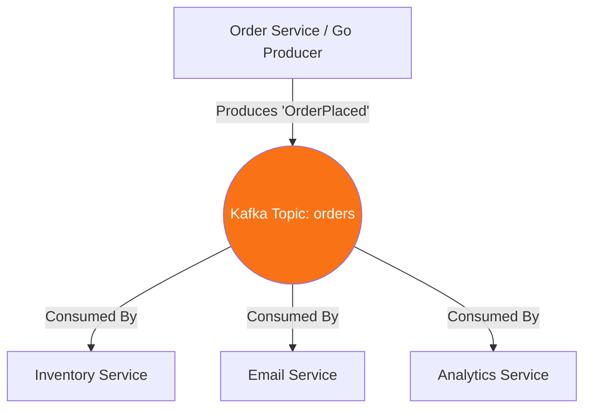

# Apache Kafka & Event Streaming

## 1. Learning Objectives
* **What you'll learn**: The architecture of Apache Kafka (Topics, Partitions, Consumer Groups) and how to build high-throughput producer/consumer systems in Go.
* **Why it matters**: Kafka is the backbone of modern distributed systems, allowing thousands of microservices to communicate asynchronously without coupling or blocking each other.
* **Where it's used**: Activity tracking, real-time analytics, log aggregation, and event-driven microservices at companies like Uber, Netflix, and LinkedIn (where it was created).

---

## 2. Real-world Story
Imagine a massive TV Broadcasting Tower (Kafka). 
The News Anchors (Producers) broadcast breaking news into the air. They don't care who is watching. They just shout the news into a specific channel, like Channel 5 (A Kafka Topic).
Millions of TVs (Consumers) tune into Channel 5. If a TV loses power for an hour, when it turns back on, it can rewind the broadcast and catch up on exactly what it missed, because the TV Tower records everything on tape (Kafka persists data to disk). 

---

## 3. Visual Learning (Execution Flow & Architecture)


---

## 4. Internal Working (Under the Hood)
Kafka is fundamentally an **Append-Only Commit Log** distributed across multiple servers (Brokers).
1. **Topics**: Categories of events (e.g., `user-clicks`).
2. **Partitions**: Topics are sliced into Partitions to allow parallel processing. Partition 0 might live on Server A, Partition 1 on Server B.
3. **Offsets**: Every message gets a sequential ID (Offset). Consumers track which offset they last read, allowing them to safely pause and resume.
4. **Consumer Groups**: If 3 Go instances of `EmailService` join a Consumer Group, Kafka will intelligently divide the partitions among them, guaranteeing a message is only emailed once!

---

## 5. Compiler Behavior
* **Binary Protocols**: Kafka does not use HTTP. It uses a highly optimized, raw TCP binary protocol. Go libraries like `confluent-kafka-go` (a wrapper around the C library `librdkafka`) or `segmentio/kafka-go` (pure Go) interact directly with this binary stream, providing insane throughput.

---

## 6. Memory Management
* **Zero-Copy Architecture**: Kafka achieves its legendary speed using the Linux `sendfile()` syscall. When a Go consumer requests data, the Kafka broker tells the OS to copy bytes directly from the Hard Drive Buffer to the Network Socket Buffer, completely bypassing Application RAM!

---

## 7. Code Examples

### 🔹 Example 1: Simple (Producing)
```go
// Using segmentio/kafka-go
import "github.com/segmentio/kafka-go"

func ProduceEvent() {
    w := &kafka.Writer{
        Addr:     kafka.TCP("localhost:9092"),
        Topic:    "orders",
        Balancer: &kafka.LeastBytes{},
    }
    defer w.Close()

    err := w.WriteMessages(context.Background(),
        kafka.Message{
            Key:   []byte("Order-123"), // Used for Partition Hashing!
            Value: []byte(`{"status": "paid"}`),
        },
    )
}
```

### 🔹 Example 2: Intermediate (Consuming)
```go
func ConsumeEvents() {
    r := kafka.NewReader(kafka.ReaderConfig{
        Brokers:  []string{"localhost:9092"},
        GroupID:  "email-service-group", // Guarantees we don't duplicate work!
        Topic:    "orders",
        MinBytes: 10e3, // 10KB
        MaxBytes: 10e6, // 10MB
    })
    defer r.Close()

    for {
        m, err := r.ReadMessage(context.Background())
        if err != nil { break }
        
        fmt.Printf("Received: %s\n", string(m.Value))
        // Auto-commits the offset so we don't read it again
    }
}
```

### 🔹 Example 3: Advanced (Manual Commits)
```go
// Never auto-commit if your business logic hasn't successfully finished!
// Read the message without committing it.
m, _ := r.FetchMessage(ctx)

err := ProcessPayment(m.Value)
if err == nil {
    // Only commit if the payment succeeded!
    // If we crash here, Kafka will re-deliver the message on boot. (At-Least-Once Delivery)
    r.CommitMessages(ctx, m) 
}
```

### 🔹 Example 4: Production
```go
// Producing Asynchronously for Maximum Throughput
// Wait until 100 messages accumulate, or 10ms passes, before sending the TCP packet!
w := &kafka.Writer{
    BatchSize:  100,
    BatchTimeout: 10 * time.Millisecond,
    Async: true,
}
```

### 🔹 Example 5: Interview
```go
// Q: How does Kafka guarantee ordering?
// A: Kafka ONLY guarantees chronological ordering WITHIN a single Partition! 
// If you must process Order #1 before Order #2, you must ensure both messages 
// have the exact same Key (e.g. UserID). Kafka hashes the Key to assign it to a partition.
```

---

## 8. Production Examples
1. **Decoupling**: The Order Service accepts a checkout, saves to DB, and instantly returns 200 OK to the user. It fires an event to Kafka. The Email, Inventory, and Analytics services consume that event asynchronously. The Order Service doesn't wait for them, making the checkout 10x faster.
2. **Event Sourcing**: Storing the state of the system as an immutable log of events (e.g., Bank Deposits and Withdrawals) rather than a single updated balance.

---

## 9. Performance & Benchmarking
* **Throughput over Latency**: Kafka is designed to move Gigabytes of data per second. It prefers Batching. If you need 1ms latency for a single message, use RabbitMQ or Redis. If you need to move 1,000,000 messages in 1 second, use Kafka.

---

## 10. Best Practices
* ✅ **Do**: Use unique Consumer Group IDs for distinct microservices (e.g., `inventory-group`, `email-group`).
* ❌ **Don't**: Use Kafka as a Database. While it persists to disk, querying it for specific rows is highly inefficient.
* 🏢 **Google / Uber / Netflix Style**: Structure your Kafka payloads using Protobuf or Avro (with a Schema Registry) to guarantee strong typing and backward compatibility across 1,000 different microservices.

---

## 11. Common Mistakes
1. **The Poison Pill**: A malformed JSON message crashes your Go consumer loop. Because you didn't commit the offset, Kafka immediately re-delivers the exact same message on reboot. Your Go app instantly crashes again. (Infinite Crash Loop). You must implement a "Dead Letter Queue" (DLQ) to route bad messages away safely.
2. **Ignoring Keys**: If you send messages with a `nil` Key, Kafka round-robins them across partitions. You completely lose all chronological ordering guarantees for related events.

---

## 12. Debugging
How to troubleshoot Kafka in production:
* **Consumer Lag**: The most critical Kafka metric. If the producer puts 500 messages per second in the topic, but your Go consumer only processes 100 per second, your "Lag" will grow infinitely. You must add more Go instances to the Consumer Group!

---

## 13. Exercises
1. **Easy**: Write a Go script to produce 10 text messages into a Kafka topic.
2. **Medium**: Write a Go consumer that reads them and prints them.
3. **Hard**: Spin up 3 instances of your consumer using the same `GroupID`. Produce 30 messages. Observe how Kafka perfectly divides the 30 messages among the 3 instances (10 each).
4. **Expert**: Implement an At-Least-Once processing loop with manual offset committing.

---

## 14. Quiz
1. **MCQ**: What determines which Partition a message is written to?
   * (A) The Consumer Group (B) The Topic name (C) The hash of the Message Key. *(Answer: C)*
2. **Code Review**: Why should you never process an email inside the Kafka `ReadMessage()` loop without a timeout context? *(If the email server hangs for 60 seconds, the Kafka broker thinks your Go consumer died and triggers a massive "Rebalance" of the entire cluster).*

---

## 15. FAANG Interview Questions
* **Beginner**: Explain Topics, Partitions, and Offsets.
* **Intermediate**: What is the difference between RabbitMQ and Kafka?
* **Senior (Google/Meta)**: Explain "Exactly-Once Semantics" (EOS) in Kafka. How do you prevent a retry network spike from charging a customer's credit card twice?

---

## 16. Mini Project
**The High-Velocity Event Tracker**
* Create a Go Web Server that accepts `POST /clicks` and instantly produces them to Kafka asynchronously.
* Build a separate Go Consumer that reads batches of 100 clicks and writes them to a PostgreSQL database efficiently using bulk inserts.

---

## 17. Enterprise Features & Observability
* **Log Compaction**: Instead of deleting data after 7 days, Kafka can be configured to keep only the *most recent* message for a specific Key. Excellent for restoring the "current state" of a system (like user profiles) directly from Kafka on boot.

---

## 18. Source Code Reading
Walkthrough of `github.com/segmentio/kafka-go`.
* **The Reader Architecture**: Study how `kafka-go` uses a background Goroutine to continuously pre-fetch batches of messages from the network into a local Go Channel buffer, so that when your code calls `ReadMessage()`, it returns in nanoseconds!

---

## 19. Architecture
* **The Outbox Pattern**: Never write to Postgres and Kafka sequentially in a single HTTP request (Dual Write Problem). If Postgres succeeds and Kafka fails, your system is permanently out of sync. Use the Outbox Pattern to guarantee atomic publishing.

---

## 20. Summary & Cheat Sheet
* **Broker**: The Kafka Server.
* **Topic**: The category.
* **Partition**: The unit of scalability.
* **Offset**: The unique ID of a message.
* **Consumer Group**: Allows multiple instances of one service to share the workload safely.
