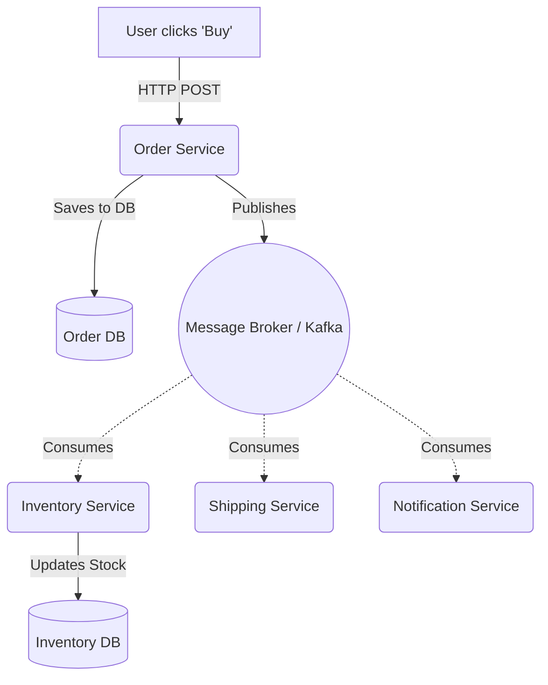

# Event-Driven Architecture (EDA)

## 1. Learning Objectives
* **What you'll learn**: The paradigm shift from synchronous REST APIs to asynchronous Event-Driven Architecture, emphasizing loose coupling and eventual consistency.
* **Why it matters**: Synchronous REST calls chain microservices together. If Service A calls B, and B calls C, and C is offline, the entire chain fails (Cascading Failure). EDA breaks this chain.
* **Where it's used**: E-commerce checkouts, real-time banking, IoT sensor processing, and high-throughput backend systems.

---

## 2. Real-world Story
Imagine ordering food at a busy restaurant. 
**Synchronous (REST)**: You tell the waiter your order. The waiter walks to the kitchen, stands in front of the chef, and stares at them until the food is cooked. The waiter cannot help anyone else.
**Asynchronous (EDA)**: You tell the waiter your order. The waiter pins a ticket to the board (`OrderPlacedEvent`), gives you a receipt, and immediately goes to the next table. The chef looks at the board, cooks the food, and rings a bell (`FoodReadyEvent`). Everyone works independently at maximum speed.

---

## 3. Visual Learning (Execution Flow & Architecture)


---

## 4. Internal Working (Under the Hood)
In EDA, services communicate by emitting **Events** (a record of something that *already happened*).
1. **Producer**: Emits an event (e.g., `UserRegistered`).
2. **Broker**: The central nervous system (Kafka, RabbitMQ) that safely stores and routes the event.
3. **Consumer**: Subscribes to specific events and reacts to them independently.
Because the Producer does not wait for a response, it can achieve sub-millisecond API latency.

---

## 5. Compiler Behavior
* **Schema Evolution**: In Go, you typically serialize Events into JSON or Protobuf. If the Producer adds a new field to the Go struct, older Consumers will ignore the unknown field (forward compatibility). However, if the Producer *removes* a field, consumers might panic! Use Protobuf to mathematically guarantee schema backward/forward compatibility at compile time.

---

## 6. Memory Management
* **Backpressure**: If the Order Service produces 10,000 events/sec, but the Email Service can only send 500 emails/sec, the Broker acts as a massive shock absorber (Buffer). The Go Email Service pulls messages at its own pace without running out of RAM, while the Order Service remains completely unblocked.

---

## 7. Code Examples

### 🔹 Example 1: Simple (The Event Struct)
```go
// Define an Event Payload (Past Tense!)
type OrderPlacedEvent struct {
    EventID   string    `json:"event_id"`
    OrderID   string    `json:"order_id"`
    Amount    float64   `json:"amount"`
    Timestamp time.Time `json:"timestamp"`
}
```

### 🔹 Example 2: Intermediate (The Producer)
```go
func CheckoutHandler(w http.ResponseWriter, r *http.Request) {
    order := CreateOrderInDB()
    
    // Fire and Forget!
    event := OrderPlacedEvent{
        EventID:   uuid.NewString(),
        OrderID:   order.ID,
        Amount:    order.Total,
        Timestamp: time.Now(),
    }
    
    PublishToBroker("orders_topic", event)
    
    // Instantly return 202 Accepted to the user. Fast!
    w.WriteHeader(http.StatusAccepted)
    w.Write([]byte("Order is processing!"))
}
```

### 🔹 Example 3: Advanced (The Consumer)
```go
// Inventory Service Consumer Loop
func ConsumeOrderEvents() {
    for msg := range broker.Subscribe("orders_topic") {
        var event OrderPlacedEvent
        json.Unmarshal(msg.Data, &event)
        
        // React to the event independently
        err := DeductInventory(event.OrderID)
        if err != nil {
            // Handle error (e.g., trigger an OutOfStockEvent!)
        }
        msg.Ack()
    }
}
```

### 🔹 Example 4: Production
```go
// Idempotent Processing
// In distributed systems, Brokers guarantee "At-Least-Once" delivery. 
// This means the Go consumer WILL occasionally receive the EXACT SAME event twice!
func DeductInventory(eventID string) error {
    // 1. Check if we already processed this exact EventID
    if db.EventProcessed(eventID) {
        return nil // Safely ignore the duplicate!
    }
    // 2. Process logic
    // 3. Mark eventID as processed
}
```

### 🔹 Example 5: Interview
```go
// Q: What is the main drawback of Event-Driven Architecture?
// A: Eventual Consistency. Because the Order Service returns 200 OK instantly, 
// the Inventory might not be deducted for another 50ms. If the user hits refresh instantly, 
// they might see stale data. You must design the UI to handle eventual consistency.
```

---

## 8. Production Examples
1. **Choreography vs Orchestration**: In Choreography (pure EDA), there is no central controller. The Order Service fires an event, the Payment Service reacts, then fires a `PaymentSucceeded` event, and the Shipping Service reacts to that. It is highly decoupled but very hard to monitor.
2. **Webhooks**: Stripe and GitHub send HTTP POST Webhooks to your Go server. This is simply Event-Driven Architecture over the public internet!

---

## 9. Performance & Benchmarking
* **Throughput Multiplier**: Replacing 3 sequential REST calls (20ms + 30ms + 50ms = 100ms latency) with 1 Event Publish (1ms latency) allows a single Go pod to handle 100x more concurrent users without exhausting HTTP connection pools.

---

## 10. Best Practices
* ✅ **Do**: Name your events in the past tense (`AccountCreated`, `EmailSent`). Events are undeniable historical facts.
* ❌ **Don't**: Send massive payloads (like a 5MB PDF) inside the event message. Store the PDF in S3, and put the `s3_url` string inside the event message!
* 🏢 **Google / Uber / Netflix Style**: Use CloudEvents (`cloudevents.io`), an open standard for describing event data in a consistent JSON format across all languages and platforms.

---

## 11. Common Mistakes
1. **The Dual Write Problem**: Doing `db.Save(order)` and then `kafka.Publish(event)`. If the database succeeds but the Kafka publish fails (network blip), the rest of the system never knows the order happened! (This is solved by the Outbox Pattern).
2. **Commands vs Events**: Emitting an event called `SendWelcomeEmail`. That is a *Command* (imperative), not an *Event* (historical). The event should be `UserRegistered`, and the Email Service independently decides if it should send an email.

---

## 12. Debugging
How to troubleshoot EDA in production:
* **Correlation IDs**: Because a single user action spawns 5 different asynchronous events across 5 microservices, you must generate a `trace_id` at the API Gateway and include it in EVERY event payload. You can then search your logs for that ID to trace the entire asynchronous workflow.

---

## 13. Exercises
1. **Easy**: Define a Go struct for a `PaymentFailedEvent`.
2. **Medium**: Write a mock Producer function that generates 10 events and pushes them to a Go channel (simulating a broker).
3. **Hard**: Write a mock Consumer function that reads from the channel and implements Idempotency using a `map[string]bool` to ignore duplicate `EventID`s.
4. **Expert**: Implement an API endpoint that receives a request, fires an event, and utilizes Server-Sent Events (SSE) to push a notification back to the client once the asynchronous background processing finishes.

---

## 14. Quiz
1. **MCQ**: What guarantee does an Event Broker like Kafka provide regarding message delivery?
   * (A) Exactly-Once (B) At-Least-Once (C) At-Most-Once. *(Answer: B. Network retries mean duplicates WILL happen. Your code MUST be idempotent).*
2. **System Design Follow-up**: How do you handle an event schema changing from V1 to V2? *(Create a new topic `orders_v2`. Have the producer send to both topics during a transition period until all V1 consumers are upgraded).*

---

## 15. FAANG Interview Questions
* **Beginner**: Explain the difference between Synchronous REST and Asynchronous Events.
* **Intermediate**: What is Backpressure and how does an Event Broker solve it?
* **Senior (Google/Meta)**: Architect a real-time collaborative document editor (like Google Docs). How do you handle event ordering conflicts if User A and User B type at the exact same millisecond? (Hint: Operational Transformation / CRDTs).

---

## 16. Mini Project
**The Decoupled E-Commerce Flow**
* Create 3 Go routines representing the Order, Inventory, and Shipping services.
* Connect them using Go Channels.
* Send an Order event. Verify Inventory receives it, deducts stock, and fires an `InventoryReserved` event.
* Verify Shipping receives `InventoryReserved` and triggers dispatch.

---

## 17. Enterprise Features & Observability
* **Dead Letter Queues (DLQ)**: If a Go consumer hits a database error when processing an event, it shouldn't just drop it. It routes the event to a special DLQ topic. Engineers can inspect the DLQ, fix the database bug, and replay the DLQ events later!

---

## 18. Source Code Reading
Walkthrough of `github.com/cloudevents/sdk-go`.
* **Standardization**: See how the SDK wraps your custom JSON struct into a standardized envelope with strict headers (`specversion`, `type`, `source`), making event routing across AWS/GCP incredibly easy.

---

## 19. Architecture
* **Event Sourcing**: The ultimate form of EDA. Instead of storing the "current state" in the database, you only store the raw Events. The current state is calculated on the fly by reducing the event log. (This is exactly how a Bank Account balance works!).

---

## 20. Summary & Cheat Sheet
* **Paradigm**: Fire and Forget.
* **Pros**: Decoupled, highly scalable, handles burst traffic.
* **Cons**: Eventual Consistency, harder to debug.
* **Golden Rule**: Every Go consumer MUST be Idempotent.
