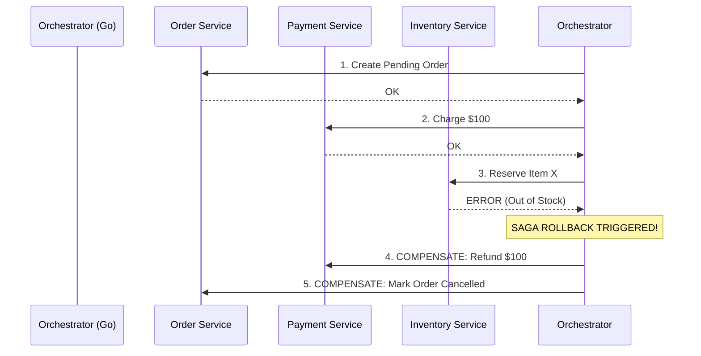

# The Saga Pattern (Distributed Transactions)

## 1. Learning Objectives
* **What you'll learn**: How to maintain data consistency across multiple independent microservices using the Saga Pattern, since traditional ACID database transactions cannot span across network boundaries.
* **Why it matters**: If an e-commerce checkout charges a credit card but fails to reserve the inventory, the customer loses money and gets nothing. You must have a way to roll back the credit card charge!
* **Where it's used**: Microservice architectures dealing with financial ledgers, travel bookings, and e-commerce order fulfillment.

---

## 2. Real-world Story
Imagine planning a vacation. You need a Flight, a Hotel, and a Rental Car.
You cannot book all three in a single atomic database transaction because they are owned by Delta, Hilton, and Hertz.
Instead, you use a **Saga**. You book the Flight (Success). You book the Hotel (Success). You try to book the Car, but they are sold out (Failure). Because the Car failed, you must execute **Compensating Actions**: You call Hilton to cancel the hotel, and you call Delta to cancel the flight, effectively "rolling back" the entire vacation.

---

## 3. Visual Learning (Execution Flow & Architecture)


---

## 4. Internal Working (Under the Hood)
A Saga is a sequence of local database transactions. Each local transaction updates the database and publishes a message or event to trigger the next step.
If a local transaction fails, the Saga executes a series of **Compensating Transactions** that undo the changes made by the preceding local transactions.
There are two ways to coordinate a Saga:
1. **Choreography**: Services publish events, and other services listen and react. (Decentralized, hard to monitor).
2. **Orchestration**: A central Go coordinator service tells the other services exactly what to do. (Centralized, easier to debug).

---

## 5. Compiler Behavior
* **State Machines**: Implementing an Orchestrator in Go often involves building a Finite State Machine (FSM). The Go `switch` statement makes defining state transitions (`PENDING -> PAID -> FAILED -> REFUNDED`) incredibly safe and easy to read.

---

## 6. Memory Management
* **Long-Running Sagas**: A Saga might take 3 days to complete (e.g., waiting for a physical bank transfer). The Go Orchestrator CANNOT keep a Goroutine blocked in RAM for 3 days! The state of the Saga must be saved to a database, and the Go application must be entirely stateless, waking up only when a webhook/event arrives.

---

## 7. Code Examples

### 🔹 Example 1: The Saga State (Orchestrator)
```go
type OrderSaga struct {
    SagaID        string
    OrderID       string
    Status        string // PENDING, PAID, INVENTORY_FAILED, ROLLED_BACK, COMPLETED
    Amount        float64
}
```

### 🔹 Example 2: The Orchestrator Logic
```go
// A highly simplified Orchestrator Flow
func (s *SagaOrchestrator) ExecuteCheckout(saga OrderSaga) {
    // Step 1: Payment
    err := s.paymentClient.Charge(saga.Amount)
    if err != nil {
        s.db.UpdateStatus(saga.SagaID, "PAYMENT_FAILED")
        return // Saga ends safely.
    }
    s.db.UpdateStatus(saga.SagaID, "PAID")

    // Step 2: Inventory
    err = s.inventoryClient.Reserve(saga.OrderID)
    if err != nil {
        // TRIGGER COMPENSATING ACTION!
        s.db.UpdateStatus(saga.SagaID, "INVENTORY_FAILED")
        s.CompensatePayment(saga.Amount)
        return
    }

    s.db.UpdateStatus(saga.SagaID, "COMPLETED")
}
```

### 🔹 Example 3: The Compensating Action
```go
// Undoing the previous successful step!
func (s *SagaOrchestrator) CompensatePayment(amount float64) {
    // In a real system, you don't delete the charge. You issue a Refund!
    err := s.paymentClient.Refund(amount)
    if err != nil {
        // FATAL: The compensation failed! This requires human intervention!
        s.alerting.TriggerPagerDuty("CRITICAL: Saga Compensation Failed!")
    }
    s.db.UpdateStatus(saga.SagaID, "ROLLED_BACK")
}
```

### 🔹 Example 4: Production
```go
// Using Temporal.io (The industry standard for Go Sagas)
// Temporal allows you to write sequential Go code, but it automatically 
// pauses, resumes, and persists the state to a database for you!
err := workflow.ExecuteActivity(ctx, ChargeCreditCard).Get(ctx, nil)
if err != nil {
    // Temporal automatically handles the retry and rollback logic!
}
```

### 🔹 Example 5: Interview
```go
// Q: What happens if a Compensating Action (the rollback) fails?
// A: If the refund API is down, you must keep retrying forever (using Exponential Backoff). 
// If it fails permanently, the system goes into an inconsistent state and alerts human operations to manually fix the database.
```

---

## 8. Production Examples
1. **Uber/Lyft**: Requesting a ride involves matching a driver, authorizing a card, and starting the trip. If the driver cancels, the Saga reverses the flow and refunds the authorization.
2. **Temporal / Cadence**: Companies write Go Orchestrators using `go.temporal.io`. It guarantees that a Saga will execute to completion or roll back, even if the Go server's power cord is ripped out of the wall halfway through.

---

## 9. Performance & Benchmarking
* **Latency Overhead**: Sagas are much slower than a single monolithic database transaction. A Saga might require 4 network hops and 4 separate database commits. Use Sagas ONLY when crossing bounded contexts (microservice boundaries). If you can group the data in one Postgres database, do it!

---

## 10. Best Practices
* ✅ **Do**: Ensure all APIs involved in a Saga are completely Idempotent. The Orchestrator will often retry commands during network failures.
* ❌ **Don't**: Use Sagas for simple, non-critical data. If a "Like" count is slightly out of sync, eventual consistency is fine. Sagas are for money, inventory, and critical state.
* 🏢 **Google / Uber / Netflix Style**: Prefer Orchestration over Choreography. Choreography (events bouncing everywhere) turns into a spiderweb of logic that no single engineer can understand. An Orchestrator puts the entire workflow into one readable Go file.

---

## 11. Common Mistakes
1. **Lack of Isolation**: While a Saga is running, the Order is marked as "Paid", but the Inventory hasn't been checked yet. If the user queries their order, they might see it as successful right before it rolls back! (The "Dirty Read" anomaly in distributed systems). You must use "Semantic Locks" (e.g., status = `PENDING_VERIFICATION`).
2. **Irreversible Actions**: Sending an email saying "Your order is confirmed!" in Step 2, and then rolling back the inventory in Step 3. You cannot un-send an email! Always put irreversible actions as the absolute LAST step of the Saga.

---

## 12. Debugging
How to troubleshoot Sagas in production:
* **State Dashboards**: Your Orchestrator Database must have a UI or API that shows the exact state of every active Saga. If a Saga is stuck in `REFUNDING` for 2 hours, engineers need to know instantly.

---

## 13. Exercises
1. **Easy**: Define a Go struct that represents the state of a `FlightBookingSaga`.
2. **Medium**: Write the sequential logic for a `Flight` and `Hotel` booking. If `Hotel` fails, call the `CancelFlight` compensation function.
3. **Hard**: Implement exponential backoff retries for the `CancelFlight` compensation function in case the network is down.
4. **Expert**: Re-write the Saga using the open-source Temporal.io Go SDK.

---

## 14. Quiz
1. **MCQ**: What is a Compensating Transaction?
   * (A) A database rollback `ROLLBACK;` (B) A new transaction that semantically undoes the effects of a previous transaction (e.g., A refund). *(Answer: B)*
2. **Code Review**: `ChargeCard(); SendShippedEmail(); ReserveStock()`. What is wrong with this Saga order? *(If ReserveStock fails, we roll back the charge, but the user already received an email saying it shipped! Irreversible actions must be last).*

---

## 15. FAANG Interview Questions
* **Beginner**: Why can't we just use standard ACID Database Transactions across microservices?
* **Intermediate**: Contrast Orchestration vs Choreography in the Saga pattern.
* **Senior (Google/Meta)**: Explain the Two-Phase Commit (2PC) protocol. Why is the Saga pattern preferred over 2PC in high-throughput cloud microservices?

---

## 16. Mini Project
**The Orchestrator Engine**
* Build a Go API that coordinates a Checkout.
* Use a local SQLite database to store the Saga State.
* Call a mock `PaymentAPI`. If it succeeds, update state.
* Call a mock `InventoryAPI` that randomly fails 50% of the time.
* If it fails, call a mock `RefundAPI` and update the Saga state to `ROLLED_BACK`.
* Prove via logs that the user was safely refunded every time inventory failed.

---

## 17. Enterprise Features & Observability
* **Timeout Compensations**: What happens if the Payment API never responds at all? The Go Orchestrator must use `context.WithTimeout`. If the context expires, the Orchestrator must assume failure and proactively trigger the compensation logic!

---

## 18. Source Code Reading
Walkthrough of `go.temporal.io/sdk/workflow`.
* **Deterministic Execution**: Study how Temporal intercepts Go's time and networking packages to ensure that if a Saga crashes, it can replay the exact execution history deterministically from the database to restore the Go stack memory perfectly.

---

## 19. Architecture
* **Sagas vs Monoliths**: The complexity of Sagas is the #1 reason why you should avoid splitting a Monolith into Microservices until absolutely necessary. In a monolith, this entire lesson is replaced by one line: `tx.Rollback()`.

---

## 20. Summary & Cheat Sheet
* **Problem**: No distributed ACID transactions.
* **Solution**: A sequence of local transactions.
* **Failure Handling**: Compensating actions (Undo).
* **Golden Rule**: Irreversible actions go last.
