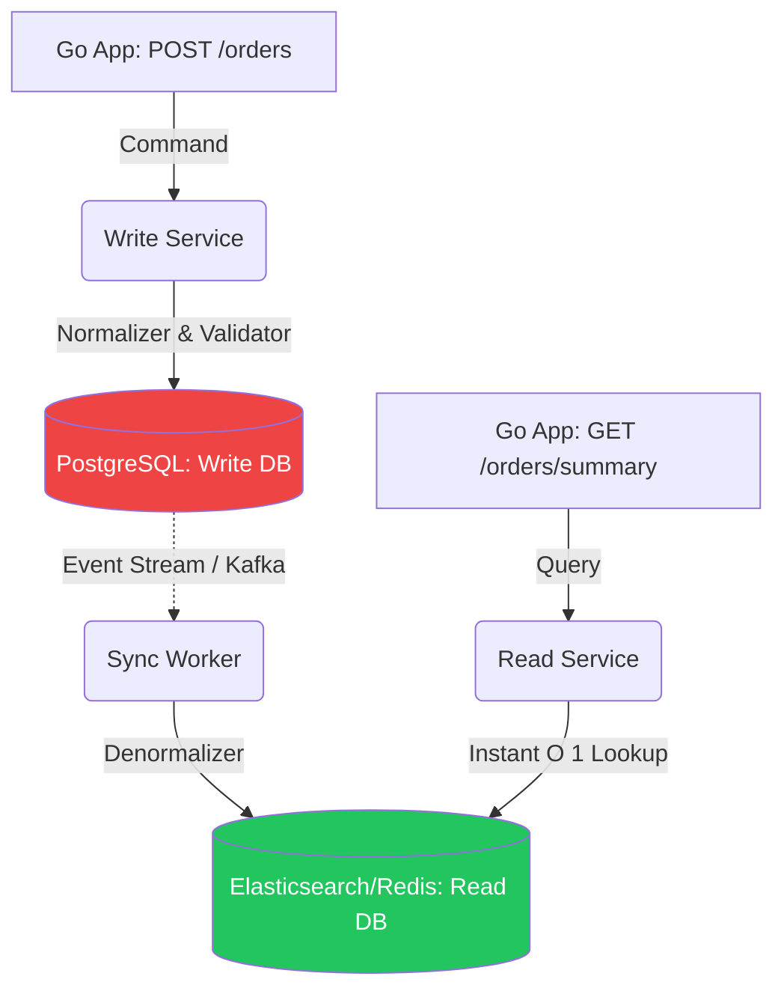

# CQRS (Command Query Responsibility Segregation)

## 1. Learning Objectives
* **What you'll learn**: How to physically split your system's Write models (Commands) from its Read models (Queries) to achieve extreme scalability and optimize database schemas for distinct use cases.
* **Why it matters**: In a traditional CRUD app, the database schema is a compromise. It's not perfectly optimized for complex read queries, nor is it perfectly optimized for fast writes. CQRS allows you to optimize both sides 100%.
* **Where it's used**: Heavy analytics dashboards, complex search engines (Elasticsearch syncing), and enterprise systems with intense read-to-write ratios (99% reads, 1% writes).

---

## 2. Real-world Story
Imagine a traditional restaurant. The kitchen (Write Model) and the dining area (Read Model) use the same small window to pass food. It gets incredibly congested.
CQRS builds a brick wall between them. The Kitchen focuses purely on cooking extremely fast (Commands). When a dish is done, it is placed on a massive buffet table. The customers (Queries) just walk up to the buffet and grab what they want instantly, without ever talking to the chefs. They are totally segregated, allowing the dining room to serve 1,000 people effortlessly.

---

## 3. Visual Learning (Execution Flow & Architecture)


---

## 4. Internal Working (Under the Hood)
CQRS states that every method should either be a **Command** (mutates state, returns void) or a **Query** (returns state, does not mutate).
In advanced CQRS, you use two separate databases:
1. **The Write DB**: Highly normalized (3NF) relational database (Postgres). Designed to enforce strict constraints and ACID transactions instantly.
2. **The Read DB**: Highly denormalized document store (MongoDB, Elasticsearch, or a materialized view). Data is pre-joined and flattened so a `GET` request just fetches a raw JSON blob in 1 millisecond.

---

## 5. Compiler Behavior
* **Strict Type Separation**: In Go, CQRS naturally leads to separate packages. `package command` contains structs like `CreateOrderCmd`, and `package query` contains structs like `OrderSummaryView`. The Go compiler enforces that the Query package cannot accidentally mutate the database because it simply doesn't have the repository functions to do so!

---

## 6. Memory Management
* **Denormalization at Rest**: Because the Read DB stores the data exactly as the UI needs it, the Go Read Service doesn't need to load 5 different structs into RAM and stitch them together (saving massive CPU/Memory). It just queries the JSON and streams it directly to the HTTP response!

---

## 7. Code Examples

### 🔹 Example 1: The Command (Write)
```go
// command/create_user.go
type CreateUserCommand struct {
    Name  string
    Email string
}

func (h *CommandHandler) Handle(ctx context.Context, cmd CreateUserCommand) error {
    // 1. Validate Business Logic
    // 2. Save to highly-normalized Postgres (Write DB)
    err := h.pgRepo.SaveUser(cmd.Name, cmd.Email)
    
    // 3. Emit Event to Kafka (To update the Read DB!)
    h.kafka.Publish("UserCreated", cmd)
    return err
}
```

### 🔹 Example 2: The Projector (Sync Worker)
```go
// worker/projector.go
// Runs in the background, listening to Kafka
func SyncReadDatabase() {
    for event := range kafka.Subscribe("UserCreated") {
        // Transform the data into the exact format the UI needs
        readModel := GenerateDashboardView(event)
        
        // Save to the fast Read DB (Elasticsearch / MongoDB)
        mongoRepo.UpsertReadModel(readModel)
    }
}
```

### 🔹 Example 3: The Query (Read)
```go
// query/get_dashboard.go
func (h *QueryHandler) GetDashboard(ctx context.Context, userID string) (DashboardView, error) {
    // Instantly fetch the pre-computed document! No SQL JOINs required!
    return h.mongoRepo.FindDashboardView(userID)
}
```

### 🔹 Example 4: Production
```go
// CQS (Command Query Separation) without separate databases
// You can use the SAME Postgres database, but separate the Go Logic!
// Write uses GORM (easy mutations). Read uses sqlx/raw SQL (insanely fast reads).
type WriteModel struct { gorm.Model; Name string }
type ReadDTO struct { Name string; TotalOrders int }
```

### 🔹 Example 5: Interview
```go
// Q: What is the biggest downside of splitting into two databases?
// A: Eventual Consistency. The Write DB is updated instantly. The Kafka event takes 50ms 
// to reach the Sync Worker. If the user refreshes the page in 10ms, the Read DB will 
// serve stale data! The UI must be designed to handle this (e.g. optimistic UI updates).
```

---

## 8. Production Examples
1. **Search Engines**: When you add a product to an e-commerce site, it saves to Postgres (Write DB). An event triggers, and the product is formatted and indexed into Elasticsearch (Read DB) so users can perform lightning-fast fuzzy text searches.
2. **Social Media Feeds**: When you tweet, it's a Command. Generating your timeline of 1,000 friends' tweets on the fly is too slow. A background worker pre-computes your timeline and stores it in Redis (Read DB). When you open the app, it's a 1ms Query.

---

## 9. Performance & Benchmarking
* **Asymmetrical Scaling**: If your application is Wikipedia (99.9% reads, 0.1% writes), CQRS allows you to deploy 100 instances of the Go Read Service (connected to Read Replicas), and only 2 instances of the Go Write Service. You save massive infrastructure costs by scaling exactly what is bottlenecked.

---

## 10. Best Practices
* ✅ **Do**: Use CQS (Code separation only) before jumping to full CQRS (Database separation). Start by separating your Go files and structs!
* ❌ **Don't**: Use full CQRS for simple CRUD apps. The complexity of managing Kafka synchronizers and eventual consistency will destroy a small team's productivity.
* 🏢 **Google / Uber / Netflix Style**: Use Debezium (Change Data Capture). Instead of Go publishing a Kafka event, Debezium reads the Postgres WAL directly and publishes to Kafka automatically, guaranteeing the Write DB and Read DB never go out of sync due to a Go network failure.

---

## 11. Common Mistakes
1. **Synchronous Updates**: Making the Go Command Handler write to Postgres, and then immediately wait to write to Elasticsearch in the same HTTP request. This defeats the purpose and ruins latency. The sync MUST be asynchronous.
2. **Reusing Structs**: Using the same Go `type User struct` for both the Write repository and the Read HTTP JSON response. The Read model should be highly specific to the UI view (e.g., `type UserProfileSidebar struct`).

---

## 12. Debugging
How to troubleshoot CQRS in production:
* **The Consistency Delay (Lag)**: If the Read DB is showing stale data, you must check the Kafka Consumer Lag of your Sync Worker. If the worker is backed up, the Read DB falls further and further out of date!

---

## 13. Exercises
1. **Easy**: Refactor a basic Go CRUD controller by splitting it into two files: `commands.go` and `queries.go`.
2. **Medium**: Define a strictly normalized Postgres struct for a Command, and a flattened denormalized struct for a Query.
3. **Hard**: Build a Go worker that simulates syncing. When a `POST` occurs, save to a `map` and push to a channel. The worker reads the channel and updates a second `map` (the Read DB).
4. **Expert**: Implement Change Data Capture (CDC). Use Postgres `LISTEN/NOTIFY` to trigger the Go sync worker automatically when a row is inserted, completely bypassing the Go Command layer.

---

## 14. Quiz
1. **MCQ**: What is the defining characteristic of a Query in CQRS?
   * (A) It returns data and mutates state (B) It returns void (C) It returns data but NEVER mutates state. *(Answer: C)*
2. **System Design Follow-up**: If a user updates their profile picture (Command) and instantly redirects to their profile page (Query), how do you prevent them from seeing their old picture due to eventual consistency? *(The Frontend holds the new picture in local React state (Optimistic UI) or delays the redirect by 100ms).*

---

## 15. FAANG Interview Questions
* **Beginner**: Explain the difference between a Command and a Query.
* **Intermediate**: Why does full CQRS inherently lead to Eventual Consistency?
* **Senior (Google/Meta)**: Architect a CQRS system using Event Sourcing. How do you rebuild the Read Database from scratch if the Elasticsearch cluster is completely destroyed? (Hint: Replay the immutable Event Store from offset 0).

---

## 16. Mini Project
**The Pre-Computed Dashboard**
* Build a Go `WriteService` that accepts `POST /clicks` and saves them to a SQLite database.
* Build a `SyncWorker` Goroutine that counts the clicks in the background and saves the `TotalClicks` integer into a Redis key.
* Build a Go `ReadService` `GET /dashboard` that instantly returns the Redis integer without running `SELECT COUNT(*)` on SQLite.

---

## 17. Enterprise Features & Observability
* **Materialized Views**: If you don't want to manage a separate Elasticsearch/Redis database, you can use PostgreSQL Materialized Views. Postgres acts as its own Sync Worker, periodically refreshing a pre-computed Read table natively!

---

## 18. Source Code Reading
Walkthrough of `github.com/ThreeDotsLabs/watermill`.
* **The Go CQRS Router**: Study how Watermill provides a beautiful CQRS interface in Go, allowing you to define `CommandBus` and `QueryBus` structures that abstract away the underlying Kafka/RabbitMQ infrastructure perfectly.

---

## 19. Architecture
* **Event Sourcing Pair**: CQRS is almost always paired with Event Sourcing. The Write DB simply stores an append-only log of events (`UserCreated`, `NameChanged`). The Sync Worker projects these events into the Read DB. 

---

## 20. Summary & Cheat Sheet
* **Commands**: Mutate state (Write DB).
* **Queries**: Fetch data without side effects (Read DB).
* **Syncing**: Done asynchronously via Events/Kafka.
* **Trade-off**: Massive scalability at the cost of Eventual Consistency.
