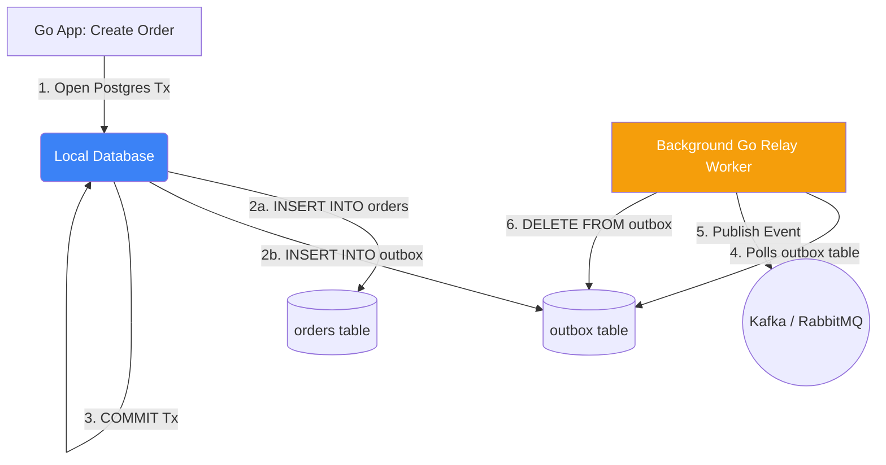

# The Outbox Pattern

## 1. Learning Objectives
* **What you'll learn**: How to solve the "Dual Write Problem" using the Transactional Outbox Pattern to guarantee 100% reliable messaging between a database and a message broker.
* **Why it matters**: If your code writes to Postgres and then publishes to Kafka, a network crash between the two steps will permanently corrupt your system. The Outbox Pattern mathematically prevents this data loss.
* **Where it's used**: Distributed Microservices that rely on Event-Driven Architecture, CQRS, or Sagas.

---

## 2. Real-world Story
Imagine writing a check to pay a bill, and then needing to mail it. 
**The Bug**: You write the check in your ledger (Save to DB), but as you walk to the mailbox, you get hit by a car (Server Crashes). The bill is marked "paid" in your ledger, but the mail (Kafka Event) never sent. You are out of sync.
**The Outbox Pattern**: You buy a mailbox and nail it to the exact same desk as your ledger. You write the check in the ledger AND drop the envelope into the desk mailbox *in one single swift motion*. Later, a dedicated Mailman walks by, grabs the mail from the desk, and delivers it safely to the post office.

---

## 3. Visual Learning (Execution Flow & Architecture)


---

## 4. Internal Working (Under the Hood)
The Outbox Pattern relies entirely on **Local ACID Transactions**.
Instead of your API endpoint sending the message to Kafka, the endpoint creates an `Event` payload and saves it into an `outbox` table inside the *exact same Postgres database* as your business data.
Because they are in the same database, you can wrap them in a standard `BEGIN ... COMMIT` transaction. They both succeed, or they both fail. A separate background process (The Relay) constantly reads the `outbox` table and pushes those events to Kafka asynchronously.

---

## 5. Compiler Behavior
* **Strict Transaction Boundaries**: In Go, you enforce this pattern by passing a `*sql.Tx` object into your Repository layer. The compiler ensures that both the `OrderRepository.Save(tx, order)` and the `OutboxRepository.Save(tx, event)` execute over the exact same physical database connection socket.

---

## 6. Memory Management
* **Batch Polling**: The Background Relay worker should not `SELECT * FROM outbox` if there are 1,000,000 rows, as it will OOM your Go app. It must poll using `LIMIT 100`, process the batch, and loop, keeping Go's memory footprint incredibly small and predictable.

---

## 7. Code Examples

### 🔹 Example 1: The Transaction (Dual Write)
```go
// The Business Logic (Service Layer)
func (s *OrderService) CreateOrder(ctx context.Context, req OrderReq) error {
    // 1. Begin a single local transaction
    tx, _ := s.db.BeginTx(ctx, nil)
    defer tx.Rollback()

    // 2. Save Business Data
    _, err := tx.Exec("INSERT INTO orders (id, amount) VALUES ($1, $2)", req.ID, req.Amount)
    
    // 3. Save Outbox Event in the EXACT SAME TRANSACTION!
    eventJSON := fmt.Sprintf(`{"order_id": "%s", "amount": %f}`, req.ID, req.Amount)
    _, err = tx.Exec("INSERT INTO outbox (aggregate_type, payload) VALUES ('Order', $1)", eventJSON)
    
    // 4. Commit! Both succeed, or neither succeeds. Perfect consistency.
    return tx.Commit()
}
```

### 🔹 Example 2: The Relay Worker (Polling)
```go
// Runs in a background Goroutine
func OutboxRelayWorker() {
    for {
        // Fetch pending events
        rows, _ := db.Query("SELECT id, payload FROM outbox ORDER BY id ASC LIMIT 100")
        
        for rows.Next() {
            var id int
            var payload string
            rows.Scan(&id, &payload)
            
            // Send to Kafka
            err := kafka.Publish("orders_topic", payload)
            if err == nil {
                // Safely delete from Outbox ONLY if Kafka succeeds
                db.Exec("DELETE FROM outbox WHERE id = $1", id)
            }
        }
        time.Sleep(1 * time.Second) // Poll interval
    }
}
```

### 🔹 Example 3: Advanced (Debezium / CDC)
```go
// Instead of writing a Polling Worker in Go (which wastes database CPU),
// use Debezium (Change Data Capture).
// Debezium natively tails the PostgreSQL WAL (Write-Ahead Log) and streams 
// outbox inserts directly into Kafka with zero application overhead!
```

### 🔹 Example 4: Production
```go
// Preventing Double Processing in High Availability
// If you run 5 Go Relay Workers, they might read the exact same outbox row!
// Use Postgres 'FOR UPDATE SKIP LOCKED' to ensure a row is only picked up by ONE worker.
db.Query("SELECT id FROM outbox LIMIT 10 FOR UPDATE SKIP LOCKED")
```

### 🔹 Example 5: Interview
```go
// Q: Can the Outbox pattern result in duplicate messages being sent to Kafka?
// A: Yes! (At-Least-Once Delivery). If the Relay publishes to Kafka, but crashes right before 
// running the DELETE FROM outbox command, it will re-publish the message when it restarts! 
// Therefore, the downstream consumers MUST be idempotent.
```

---

## 8. Production Examples
1. **Financial Systems**: When a bank deducts money from an account, it uses the Outbox pattern to emit the `WithdrawalEvent`. The account balance and the event are physically inseparable on the hard drive.
2. **Microservice Extraction**: When splitting a Monolith, you can use the Outbox pattern in the Monolith to emit events whenever legacy tables are updated, allowing the new Microservices to listen and sync the data safely.

---

## 9. Performance & Benchmarking
* **Polling Overhead**: A naive Go worker querying `SELECT * FROM outbox` every 1 second will waste massive amounts of PostgreSQL CPU, even if the table is empty. This is why enterprise systems prefer Log Tailing (CDC) tools like Debezium, which push data instantly with near-zero database CPU overhead.

---

## 10. Best Practices
* ✅ **Do**: Use `SKIP LOCKED` if implementing a polling worker in Go to allow concurrent workers to drain the outbox table flawlessly.
* ❌ **Don't**: Use a separate database for the Outbox table. It MUST live in the exact same logical database as your business tables, otherwise you cannot use a local ACID transaction!
* 🏢 **Google / Uber / Netflix Style**: Standardize the Outbox table schema across all microservices: `id (uuid), aggregate_type (varchar), event_type (varchar), payload (jsonb), created_at (timestamp)`.

---

## 11. Common Mistakes
1. **The Dual-Write Bug**: Doing `tx.Commit()` and *then* doing `kafka.Publish()`. If the app crashes on line 2, you have a phantom order that the rest of the system never knows about.
2. **Infinite Outbox Growth**: Forgetting to delete or mark the rows as `processed = true`. The outbox table will grow to terabytes in size, destroying database query performance.

---

## 12. Debugging
How to troubleshoot the Outbox Pattern in production:
* **Monitoring the Table Size**: If the number of rows in the `outbox` table starts growing rapidly, it means your Go Relay Worker has crashed, or Kafka is offline. Set a Datadog/Prometheus alert if `COUNT(*) > 1000`.

---

## 13. Exercises
1. **Easy**: Write the SQL script to create a standard `outbox` table.
2. **Medium**: Refactor a Go endpoint to save a User and an Outbox event inside a single `*sql.Tx` transaction.
3. **Hard**: Build the background Relay Worker that polls the table every 2 seconds, prints the payload, and deletes the row.
4. **Expert**: Modify the Relay Worker SQL query to use `FOR UPDATE SKIP LOCKED` and spin up 3 concurrent worker Goroutines to drain a heavy outbox table in parallel.

---

## 14. Quiz
1. **MCQ**: What core database feature makes the Outbox Pattern possible?
   * (A) Replication (B) Local ACID Transactions (C) JSONB Columns. *(Answer: B. It wraps the business save and the outbox save into one atomic commit).*
2. **Code Review**: A developer writes: `db.Exec(businessData); kafka.Publish(event);`. What is this anti-pattern called? *(The Dual-Write Problem. It is fundamentally unsafe in distributed systems).*

---

## 15. FAANG Interview Questions
* **Beginner**: Why is publishing to Kafka directly from an HTTP handler dangerous?
* **Intermediate**: How do you avoid polling the database constantly in an Outbox implementation?
* **Senior (Google/Meta)**: Explain how Change Data Capture (CDC) replaces the polling worker. How does reading the Write-Ahead Log (WAL) guarantee perfect chronological ordering of events?

---

## 16. Mini Project
**The Guaranteed Publisher**
* Build a `POST /checkout` endpoint that writes to a SQLite `orders` and `outbox` table transactionally.
* Write a background Go loop that polls the SQLite `outbox` table every 1 second.
* Have the background loop push the payload into a standard Go Channel, then delete the SQLite row.
* Intentionally crash the app before the polling loop runs. Restart it and verify the event is safely recovered and processed!

---

## 17. Enterprise Features & Observability
* **The Inbox Pattern**: The exact reverse of the Outbox pattern. When a Go consumer receives a Kafka message, it saves the `MessageID` into a local Postgres `inbox` table transactionally alongside its business data. This mathematically guarantees exactly-once processing (Idempotency)!

---

## 18. Source Code Reading
Walkthrough of `github.com/Shopify/sarama` (Kafka Client).
* **Idempotent Producers**: Look at how modern Kafka clients can be configured as Idempotent Producers (`Producer.Idempotent = true`). They assign sequence numbers to messages, so if the Outbox Relay Worker accidentally sends the exact same TCP packet twice, Kafka deduplicates it on the broker!

---

## 19. Architecture
* **Saga Integration**: The Outbox pattern is the mechanical foundation of the Saga Pattern. When an Orchestrator wants to trigger the next step in a Saga, it writes the command to the Outbox table!

---

## 20. Summary & Cheat Sheet
* **Problem**: Network crashes during Dual-Writes.
* **Solution**: Write both to the DB in one Transaction.
* **Relay**: A background worker (or CDC) pushes the data to the broker later.
* **Guarantee**: At-Least-Once Delivery with zero data loss.
