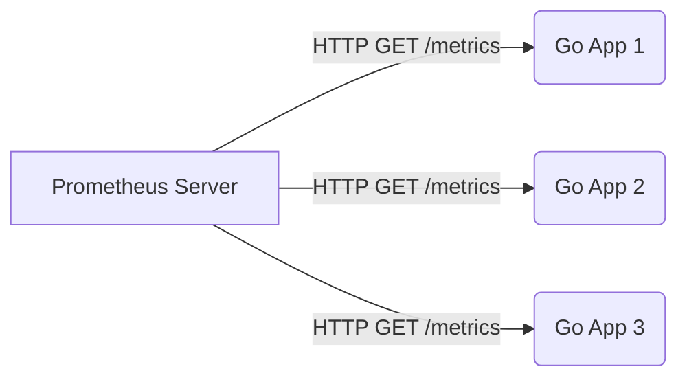

# Prometheus and Go Metrics

Prometheus is the undisputed industry standard for monitoring and alerting in cloud-native environments. 

Unlike traditional monitoring systems that push data to a central server (like StatsD), Prometheus uses a **Pull-Based Architecture**.

## 1. The Pull Architecture

Instead of your Go application constantly opening network connections to send metrics to a server, your Go application simply exposes an HTTP endpoint (usually `/metrics`). 

Every 10 to 15 seconds, the Prometheus server scrapes this endpoint, downloads the current state of your metrics, and stores them in its specialized Time-Series Database (TSDB).


*Why pull?* If your monitoring server goes down, your Go applications don't crash trying to send it data. The metrics just temporarily pile up in memory until Prometheus wakes back up.

## 2. Exposing Metrics in Go

To instrument a Go application, you use the official `github.com/prometheus/client_golang` package.

```go
package main

import (
    "net/http"
    "github.com/prometheus/client_golang/prometheus/promhttp"
)

func main() {
    // Expose the default Prometheus handler
    http.Handle("/metrics", promhttp.Handler())
    
    // Start a dedicated admin server on port 9090
    http.ListenAndServe(":9090", nil)
}
```
If you visit `localhost:9090/metrics` in your browser, you will instantly see dozens of default Go metrics automatically exported for you, such as Garbage Collection pauses (`go_gc_duration_seconds`) and Goroutine counts (`go_goroutines`).

## 3. The Four Metric Types

When building custom metrics, Prometheus defines four fundamental types:

1. **Counter**: A number that only goes UP. (e.g., Total HTTP requests received, total errors).
2. **Gauge**: A number that goes UP and DOWN. (e.g., Current active users, current CPU temperature, memory usage).
3. **Histogram**: Samples observations into configurable buckets. (e.g., Tracking API response times: How many requests took <100ms? How many took <500ms?).
4. **Summary**: Similar to a Histogram, but calculates quantiles (e.g., the 99th percentile) directly on the client side.

```go
// Creating a Custom Counter
var requestsTotal = promauto.NewCounter(prometheus.CounterOpts{
    Name: "myapp_http_requests_total",
    Help: "Total number of HTTP requests processed",
})

func handler(w http.ResponseWriter, r *http.Request) {
    requestsTotal.Inc() // Increment the metric safely!
    w.Write([]byte("Hello"))
}
```

## 4. PromQL (Prometheus Query Language)

Once the data is inside Prometheus, you query it using PromQL. 

For example, to calculate the **Requests Per Second (RPS)** of your application over the last 5 minutes, you use the `rate()` function on your Counter metric:

```promql
rate(myapp_http_requests_total[5m])
```
This query is the foundation for building alerts and Grafana dashboards!
