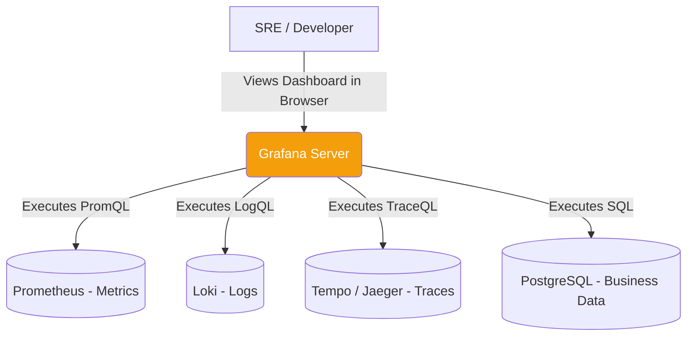

# Grafana & Data Visualization

## 1. Learning Objectives
* **What you'll learn**: How to connect Grafana to data sources (Prometheus, Postgres, Loki) to build dynamic, real-time observability dashboards for Go applications.
* **Why it matters**: Prometheus stores raw numbers. Without a visual layer, engineers cannot quickly digest trends or spot anomalies during a 3 AM outage. Grafana turns raw text data into beautiful, actionable intelligence.
* **Where it's used**: Command centers, DevOps dashboards, and business analytics at nearly every tech company worldwide.

---

## 2. Real-world Story
Imagine driving a Formula 1 car. 
The car has 500 sensors (Prometheus) streaming tire pressure, oil temp, and RPMs. If you force the driver to read a scrolling text spreadsheet of numbers, they will crash instantly.
Grafana is the Steering Wheel Dashboard. It converts those 500 sensors into a few simple, color-coded dials: Green (Good), Yellow (Warning), Red (Engine Failure). The driver instantly knows the health of the car at 200mph.

---

## 3. Visual Learning (Execution Flow & Architecture)


---

## 4. Internal Working (Under the Hood)
Grafana is fundamentally a **Query Engine and Visualization Frontend** (written heavily in Go and React).
Grafana does NOT store data. It is stateless. 
When you load a dashboard, Grafana sends the underlying query (like PromQL) to the external Database. The database does the heavy lifting, returns the JSON payload to Grafana, and Grafana's React frontend renders the SVG/Canvas charts.

---

## 5. Compiler Behavior
* **Go Backend**: The Grafana backend is a massive Go application. It uses Go's incredible concurrency to fan out queries. If your dashboard has 20 panels, Grafana spawns 20 Goroutines to fetch data from Prometheus, Postgres, and Elasticsearch simultaneously, assembling the dashboard in milliseconds!

---

## 6. Memory Management
* **Browser Rendering**: Because Grafana renders the charts in the client's browser using HTML5 Canvas/WebGL, rendering a dashboard with 10,000 data points will consume massive amounts of RAM on the *user's laptop*, not the Grafana server. Always use Prometheus `rate()` and downsampling to send fewer points!

---

## 7. Code Examples

### 🔹 Example 1: The Dashboard JSON Model
```json
// Dashboards in Grafana are literally just JSON files!
// This makes them perfectly version-controllable in Git (Infrastructure as Code).
{
  "title": "Go API Health",
  "panels": [
    {
      "type": "timeseries",
      "title": "API Request Rate",
      "targets": [
        {
          "expr": "sum(rate(http_requests_total[1m])) by (method)",
          "refId": "A"
        }
      ]
    }
  ]
}
```

### 🔹 Example 2: Provisioning Data Sources via YAML
```yaml
# Instead of clicking through the UI, use provisioning to automate setup!
# /etc/grafana/provisioning/datasources/prometheus.yaml
apiVersion: 1
datasources:
  - name: Prometheus
    type: prometheus
    access: proxy
    url: http://prometheus:9090
    isDefault: true
```

### 🔹 Example 3: Dynamic Variables (Templating)
```promql
# You don't want to build 50 dashboards for 50 Go microservices.
# You build ONE dashboard and use a Variable dropdown ($service_name) at the top!
sum(rate(http_requests_total{service="$service_name"}[5m]))
```

### 🔹 Example 4: Production (SQL Queries in Grafana)
```sql
-- Grafana isn't just for Prometheus! You can query Postgres directly to show business metrics!
SELECT
  $__timeGroupAlias(created_at, '1h'),
  count(id) AS "New Users"
FROM users
WHERE $__timeFilter(created_at)
GROUP BY 1
ORDER BY 1
```

### 🔹 Example 5: Interview
```promql
# Q: Why do dashboards look wildly different if you zoom out from 'Last 1 Hour' to 'Last 30 Days'?
# A: Resolution Downsampling. If Grafana tried to render every 15-second data point 
# for 30 days, the browser would crash. It automatically increases the $__interval variable, 
# grouping data into 1-hour or 1-day chunks.
```

---

## 8. Production Examples
1. **The Four Golden Signals Dashboard**: Every Go microservice should have a dashboard showing Latency, Traffic, Errors, and Saturation (CPU/RAM).
2. **Business Dashboards**: Showing the CEO a live graph of "Total Revenue Today" by connecting Grafana directly to the PostgreSQL orders table.

---

## 9. Performance & Benchmarking
* **Query Caching**: If 100 engineers look at a massive dashboard during a Black Friday outage, they will trigger 100 identical heavy queries to Prometheus, crashing Prometheus! Enterprise Grafana implements Query Caching to ensure the database is only hit once every few seconds.

---

## 10. Best Practices
* ✅ **Do**: Use "Dashboard as Code". Store all your Grafana dashboards as JSON files in your Git repository alongside your Go code. Never edit a dashboard in the UI and leave it un-versioned!
* ❌ **Don't**: Put 50 panels on a single dashboard. It creates cognitive overload and freezes the browser. Split them into granular dashboards (e.g., "API Overview", "Database Internals", "Go GC Metrics").
* 🏢 **Google / Uber / Netflix Style**: Utilize **Correlations**. Configure Grafana so that clicking a spike on a Prometheus metrics graph automatically opens an exact, pre-filtered view of Loki Logs from that exact millisecond.

---

## 11. Common Mistakes
1. **Hardcoding Strings**: Writing `service="billing-api"` inside the PromQL query. Use Grafana Variables (`service="$app"`) so the dashboard is infinitely reusable for all your Go apps!
2. **Ignoring Timezones**: If your servers log in UTC, but the developer's laptop is in EST, correlation becomes a nightmare. Always enforce a strict UTC timezone setting at the top of the Grafana dashboard.

---

## 12. Debugging
How to troubleshoot Grafana dashboards:
* **Query Inspector**: If a graph says "No Data", click the Panel Menu -> Inspect -> Query. It will show you the exact raw HTTP request and JSON response Grafana sent to Prometheus, revealing exactly where the query broke.

---

## 13. Exercises
1. **Easy**: Run Grafana locally using Docker (`docker run -p 3000:3000 grafana/grafana`). Log in with admin/admin.
2. **Medium**: Connect it to a running Prometheus or PostgreSQL instance via the UI.
3. **Hard**: Create a new Dashboard. Write a query to graph the rate of a metric. Change the graph type from "Time series" to "Gauge".
4. **Expert**: Create a Dashboard Variable that queries Prometheus for all distinct values of the `method` label, allowing you to dynamically filter the graph by `GET` or `POST`.

---

## 14. Quiz
1. **MCQ**: Where does Grafana store the time-series data for the charts it displays?
   * (A) In its internal SQLite database (B) In Redis (C) Nowhere, Grafana is stateless and fetches data on-the-fly. *(Answer: C)*
2. **System Design Follow-up**: Why is it highly recommended to use the `Grafana Agent` or OpenTelemetry Collector instead of sending data directly to Grafana Cloud? *(Because the Agent buffers data locally. If your internet drops for 5 minutes, the Agent holds the data in RAM/Disk and safely transmits it when the connection is restored, preventing data gaps).*

---

## 15. FAANG Interview Questions
* **Beginner**: What is Grafana used for?
* **Intermediate**: Explain the concept of "Dashboard Provisioning" (Infrastructure as Code).
* **Senior (Google/Meta)**: Architect a multi-tenant Grafana setup for a SaaS product. How do you embed Grafana dashboards into your customer-facing React app, ensuring Customer A mathematically cannot query Customer B's data? (Hint: Grafana Data Source Proxy / Row Level Security).

---

## 16. Mini Project
**The Ultimate Go Dashboard**
* Expose the default Go Runtime metrics from a Go app (`runtime/metrics`).
* Connect Grafana to Prometheus.
* Import Dashboard ID `10826` (The community standard Go metrics dashboard).
* Run a load test against your Go app. Watch the Goroutine count, Heap Memory, and Garbage Collection pauses visually spike in real-time!

---

## 17. Enterprise Features & Observability
* **Grafana Alerting**: You can configure alerts directly inside Grafana visually! If a graph line crosses a red threshold line, Grafana will take a screenshot of the graph and ping it to a Slack channel via a Webhook.

---

## 18. Source Code Reading
Walkthrough of `grafana/grafana` (backend).
* **The Plugin Architecture**: Grafana supports thousands of Data Sources (Datadog, Splunk, ServiceNow). Study the `pkg/plugins` directory. Grafana uses HashiCorp's `go-plugin` library to communicate with custom data source binaries over local gRPC, ensuring a crash in a community plugin doesn't crash the core Grafana Go server!

---

## 19. Architecture
* **The LGTM Stack**: The modern standard for Open Source observability. Loki (Logs), Grafana (Dashboards), Tempo (Traces), Mimir (Metrics). All tightly integrated and native to the Grafana ecosystem.

---

## 20. Summary & Cheat Sheet
* **Role**: The visualization frontend.
* **Storage**: Stateless (Queries external DBs).
* **Power Feature**: Variables (Templating) for reusable dashboards.
* **Best Practice**: Dashboards as JSON Code.
