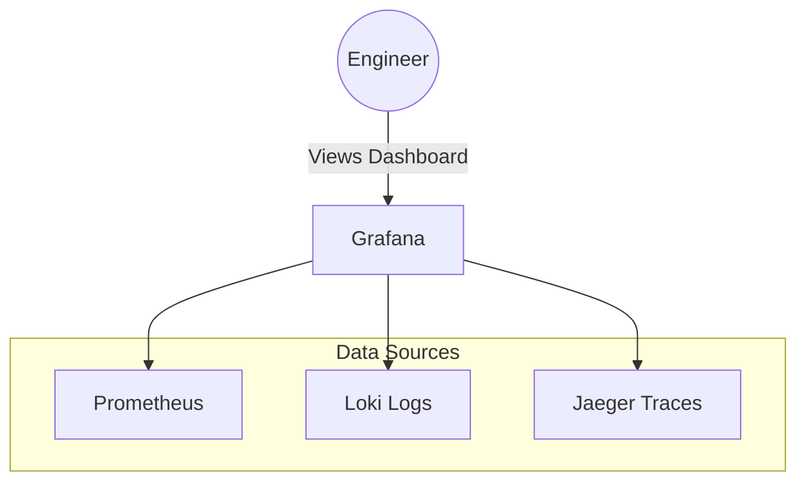

# Grafana Visualization

Prometheus is incredible at storing and querying time-series data, but its built-in user interface is extremely basic. It is designed for querying, not for monitoring.

To actually visualize your system's health, you connect Prometheus to **Grafana**.

## 1. The Visualization Layer

Grafana is an open-source visualization and analytics software. It acts as the "glass pane" for your observability stack.

Grafana does not store any data itself. It simply reaches out to data sources (like Prometheus or Postgres), executes queries, and renders the results into beautiful graphs, gauges, and heatmaps.

## 2. Building Dashboards

A Grafana Dashboard is composed of **Panels**. Each panel is powered by a specific query.

When building a dashboard for a Go web server, the three most important panels you must create are based on the **RED Method**:
1. **Rate**: The number of requests per second (Line Chart).
   * `sum(rate(http_requests_total[1m]))`
2. **Errors**: The rate of 5xx HTTP status codes (Bar Chart).
   * `sum(rate(http_requests_total{status=~"5.."}[1m]))`
3. **Duration**: The 99th percentile response time (Heatmap or Line Chart).
   * `histogram_quantile(0.99, sum(rate(http_request_duration_seconds_bucket[1m])) by (le))`

## 3. Alerts and Routing

Grafana isn't just for looking at screens; it is a powerful alerting engine. 

You can configure Grafana to constantly evaluate your PromQL queries in the background.

* **Alert Rule**: "If the Error Rate is > 5% for 3 consecutive minutes, trigger an alert."

Once triggered, Grafana's **Notification Policies** route the alert to the correct team:
* If it's a critical production outage, route it to **PagerDuty** to wake up the on-call engineer via a phone call.
* If it's a minor warning (like Disk Space at 70%), route it to a **Slack** channel for the team to investigate during normal business hours.

## 4. Provisioning via Code (Dashboard as Code)

In enterprise environments, you never manually click around the Grafana UI to build dashboards. If the Grafana server crashes, your dashboards are gone!

Instead, you export Grafana dashboards as JSON files and store them in your Git repository. Grafana natively supports **Provisioning**, meaning it will automatically read those JSON files on startup and load the dashboards. This allows you to review dashboard changes via Pull Requests!
