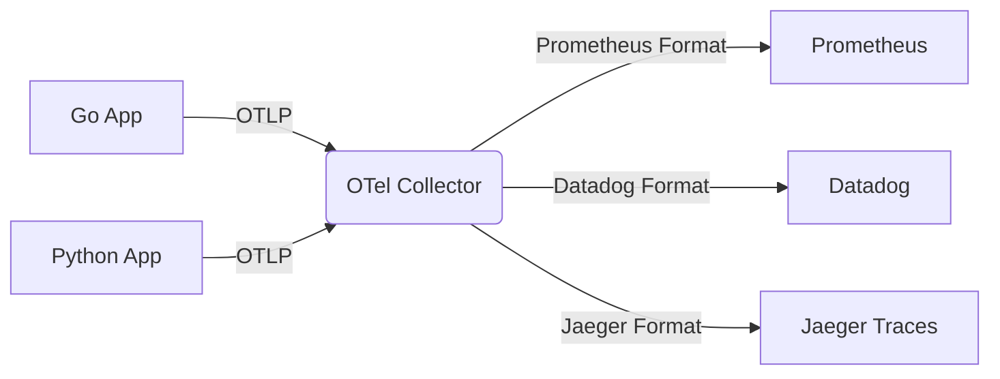

# OpenTelemetry (OTel)

Historically, observability was heavily fragmented. If your company used Datadog, you had to install the Datadog SDK in your Go code. If your company switched to New Relic three years later, you had to rewrite 100,000 lines of Go code to rip out Datadog and install New Relic. 

This created massive **Vendor Lock-in**.

## 1. The Unified Standard

**OpenTelemetry (OTel)** is a Cloud Native Computing Foundation (CNCF) project that solves this. It provides a single, vendor-agnostic standard and SDK for generating Metrics, Logs, and Traces.

You instrument your Go code **once** using the OTel SDK. 

```go
import (
    "go.opentelemetry.io/otel"
    "go.opentelemetry.io/otel/trace"
)

func processOrder(ctx context.Context) {
    // Start a vendor-agnostic trace span
    tracer := otel.Tracer("order-service")
    ctx, span := tracer.Start(ctx, "processOrder")
    defer span.End()
    
    // ... work ...
}
```

## 2. The OTel Collector

If your Go application generates OTel data, where does it send it?

It sends it to the **OTel Collector**, a standalone proxy server that sits in your infrastructure. The Collector has three main components:

1. **Receivers**: Accepts data from your Go apps via OTLP (OpenTelemetry Protocol, usually over gRPC).
2. **Processors**: Cleans the data (e.g., redacting sensitive user passwords or credit cards, batching, adding server IP tags).
3. **Exporters**: Translates the clean OTel data into vendor-specific formats and pushes it out.



## 3. The Power of the Collector

Because the Collector handles the translation, you can switch from Prometheus to Datadog simply by changing 5 lines of YAML configuration in the Collector! **Zero code changes are required in your Go applications!**

Furthermore, the Collector allows you to dual-route data. You can send your Logs to both a cheap, long-term AWS S3 bucket for auditing, and an expensive, short-term ElasticSearch cluster for live debugging, simultaneously.
