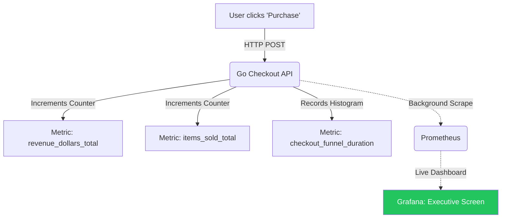

# Custom Business Metrics

## 1. Learning Objectives
* **What you'll learn**: How to transcend basic CPU/RAM metrics and implement Custom Business Metrics in Go to track revenue, user engagement, and product health in real-time.
* **Why it matters**: A server running at 10% CPU looks healthy to a DevOps engineer. But if the "Checkout Success Rate" metric has dropped to 0%, the business is losing millions of dollars. Business metrics bridge the gap between engineering and the CEO.
* **Where it's used**: E-commerce dashboards, SaaS conversion funnels, and game server analytics.

---

## 2. Real-world Story
Imagine running a massive online casino. 
Infrastructure Metrics tell you the servers are online and memory is fine.
Business Metrics tell you that the "Slot Machine Spin Rate" just dropped by 80% because a new UI update broke the "Spin" button on mobile devices. The servers are fine, but revenue is bleeding. By tracking `casino_spins_total`, the product team gets an alert within 30 seconds and rolls back the deployment.

---

## 3. Visual Learning (Execution Flow & Architecture)


---

## 4. Internal Working (Under the Hood)
Business metrics are implemented exactly like infrastructure metrics (using Prometheus Counters and Histograms).
The difference is purely semantic. Instead of measuring `http_requests_total`, you are measuring `orders_processed_total`. 
Because Prometheus is incredibly fast, you can increment these counters directly in your critical business logic paths without fear of slowing down the user's transaction.

---

## 5. Compiler Behavior
* **Atomic Float Addition**: Go's `atomic` package historically struggled with `float64` addition natively (used for tracking Dollars/Revenue). The Prometheus Go Client provides a thread-safe `prometheus.NewCounter` that handles floating-point concurrency flawlessly using CAS (Compare-And-Swap) loops, ensuring you never drop a penny in your revenue metrics due to race conditions.

---

## 6. Memory Management
* **Dimension Labels**: To make business metrics useful, you must use Labels (Dimensions). Tracking `revenue_total` is good. Tracking `revenue_total{tier="enterprise", product="shoes"}` is 10x better. But remember the Cardinality rule: Never use unbounded labels like `user_id` or `order_id`, or you will OOM your Go server.

---

## 7. Code Examples

### 🔹 Example 1: Tracking Revenue (Counter)
```go
import "github.com/prometheus/client_golang/prometheus"

// Use a Counter for Revenue because revenue only goes UP!
var revenueTotal = prometheus.NewCounterVec(
    prometheus.CounterOpts{
        Name: "business_revenue_dollars_total",
        Help: "Total revenue generated in USD.",
    },
    []string{"tier", "product_category"}, // Labels!
)

func init() {
    prometheus.MustRegister(revenueTotal)
}

func ProcessCheckout(order Order) {
    // Increment the counter by the exact float64 dollar amount!
    revenueTotal.WithLabelValues(order.UserTier, order.Category).Add(order.AmountUSD)
}
```

### 🔹 Example 2: Tracking Active Users (Gauge)
```go
// Use a Gauge for Active Carts because they go UP and DOWN!
var activeCarts = prometheus.NewGauge(
    prometheus.GaugeOpts{
        Name: "business_active_shopping_carts_current",
        Help: "Current number of shopping carts with >0 items.",
    },
)

func AddToCart() {
    activeCarts.Inc()
}

func CheckoutOrAbandon() {
    activeCarts.Dec()
}
```

### 🔹 Example 3: Tracking Conversion Funnels (Histogram)
```go
// Track how long it takes a user to complete the checkout flow!
var checkoutDuration = prometheus.NewHistogram(
    prometheus.HistogramOpts{
        Name:    "business_checkout_funnel_duration_seconds",
        Help:    "Time taken from Cart to Payment Success.",
        Buckets: []float64{10, 30, 60, 120, 300}, // 10s up to 5 mins
    },
)

func CompleteCheckout(startTime time.Time) {
    duration := time.Since(startTime).Seconds()
    checkoutDuration.Observe(duration)
}
```

### 🔹 Example 4: Production (Service-Level Indicators - SLIs)
```go
// The most critical business metric: The Error Budget.
// Track exactly how many transactions succeeded vs failed.
var transactionStatus = prometheus.NewCounterVec(
    prometheus.CounterOpts{
        Name: "business_transactions_total",
    },
    []string{"status"}, // "success" or "failed"
)

// In Grafana: success_rate = success / (success + failed)
// If success_rate drops below 99.9%, you halt all new feature deployments!
```

### 🔹 Example 5: Interview
```promql
# Q: How do you calculate Revenue Per Minute in Grafana using PromQL?
# A: rate(business_revenue_dollars_total[1m]) * 60
# You take the per-second rate over a 1-minute window, and multiply by 60 seconds!
```

---

## 8. Production Examples
1. **Inventory Alerts**: The Go app increments a metric `items_sold{item_id="123"}`. Prometheus calculates the rate. If an item sells 500 units in 1 minute, an alert fires to the warehouse team to prepare for a massive shipment.
2. **Feature Flags**: A product manager launches a new UI for the Checkout page behind a feature flag. They look at the `business_transactions_total{ui_version="v2"}` metric in Grafana. If it converts 10% worse than `v1`, they instantly kill the feature flag.

---

## 9. Performance & Benchmarking
* **Async Business Events**: If calculating a business metric requires heavy database joins, do NOT do it synchronously in the HTTP handler. Emit a message to RabbitMQ, and have a background Go worker calculate the metric and expose it to Prometheus asynchronously.

---

## 10. Best Practices
* ✅ **Do**: Prefix your custom metrics (e.g., `goverse_billing_...` or `business_...`) so they group together neatly in Grafana autocomplete drop-downs, separated from standard Go HTTP metrics.
* ❌ **Don't**: Rely on Prometheus for exact accounting or billing. Prometheus is a time-series statistical engine. It WILL drop data if a scrape fails. Use PostgreSQL for real money; use Prometheus for real-time trending and alerting.
* 🏢 **Google / Uber / Netflix Style**: Establish SLOs (Service Level Objectives). The business agrees: "We guarantee 99.9% of video streams will start in under 2 seconds." You configure Prometheus to track `video_start_duration_seconds`. If you violate the SLO, engineering stops product work and focuses 100% on performance tuning.

---

## 11. Common Mistakes
1. **Using Gauges for Rates**: Tracking `orders_per_second` using a Gauge and manually calculating the rate in Go. This is mathematically flawed! Always use a `Counter` for total orders, and let Prometheus calculate the `rate()` on the server side to handle pod crashes perfectly.
2. **Missing the "Failed" Path**: Incrementing the `business_transactions_total` counter only at the very bottom of the successful `if err == nil` block. You MUST also increment a `status="failed"` counter in your error blocks, otherwise your dashboard will just look like traffic dropped, rather than traffic failing!

---

## 12. Debugging
How to troubleshoot Custom Metrics:
* **Curl `/metrics`**: If your Grafana dashboard is empty, `curl http://localhost:8080/metrics | grep business`. If the metric isn't there, you forgot to call `prometheus.MustRegister(myMetric)` in your Go `init()` function!

---

## 13. Exercises
1. **Easy**: Create a Go `CounterVec` called `user_signups_total` with a label `platform` (iOS, Android, Web).
2. **Medium**: Write an HTTP endpoint `/signup?platform=ios` that increments the correct label value.
3. **Hard**: Build a Grafana dashboard with a Pie Chart showing the percentage of signups per platform.
4. **Expert**: Implement an SLO alert in Prometheus. If the rate of `platform="web"` signups drops by 50% compared to the previous hour, trigger an alert.

---

## 14. Quiz
1. **MCQ**: Should you use Prometheus custom metrics to generate the official Monthly Invoice for a customer?
   * (A) Yes, it's very fast. (B) No, Prometheus is not designed for 100% financial accuracy due to scrape intervals and data retention policies. *(Answer: B)*
2. **System Design Follow-up**: How do you track the *total size* of a database table (e.g., Total Registered Users) if it's too heavy to `SELECT COUNT(*)` on every request? *(Write a background Goroutine that runs `SELECT COUNT(*)` exactly once every 5 minutes and updates a `prometheus.Gauge`!)*

---

## 15. FAANG Interview Questions
* **Beginner**: Why are business metrics often more important than CPU/RAM metrics?
* **Intermediate**: What is an SLI, SLO, and SLA?
* **Senior (Google/Meta)**: Architect an observability pipeline that guarantees zero dropped business events for a high-frequency trading platform. Since Prometheus scrapes periodically, how do you capture events that happen in microseconds? (Hint: High-resolution Pushgateways or Event Sourcing).

---

## 16. Mini Project
**The Executive Dashboard**
* Build a Go script that simulates an E-commerce store.
* Every 100ms, it randomly "sells" a Shirt ($20) or Shoes ($50).
* Track this in a `revenue_dollars_total` Counter.
* Hook it up to Grafana.
* Write a PromQL query: `sum(rate(revenue_dollars_total[1m])) * 60` to show the real-time "Revenue Per Minute" in massive green text on the dashboard!

---

## 17. Enterprise Features & Observability
* **Business Intelligence (BI) Integration**: While Grafana is great for real-time alerts, massive historical business analytics (Year-over-Year growth) are usually exported from the PostgreSQL replica into a Data Warehouse (Snowflake / BigQuery) and visualized using Tableau or Looker.

---

## 18. Source Code Reading
Walkthrough of `prometheus/client_golang` (Vector implementation).
* **The Metric Vector**: Study `CounterVec`. When you call `WithLabelValues("ios")`, Go uses a highly optimized hash map (`sync.Map` internally or sharded maps) to instantly find the memory address of the specific "ios" counter and atomically increment it without locking the "android" counter!

---

## 19. Architecture
* **The Pushgateway**: If you have a Go cron job that runs once a day, takes 5 seconds, and shuts down, Prometheus (which scrapes every 15s) will completely miss it! The Go cron job must use the Prometheus SDK to PUSH its metrics to a central `Pushgateway` server before it dies.

---

## 20. Summary & Cheat Sheet
* **Focus**: Revenue, Conversions, Active Users.
* **Tool**: Prometheus Counters (Revenue) and Gauges (Active Carts).
* **SLOs**: Measure Error Budgets over infrastructure.
* **Golden Rule**: Never use Prometheus for exact financial billing.
