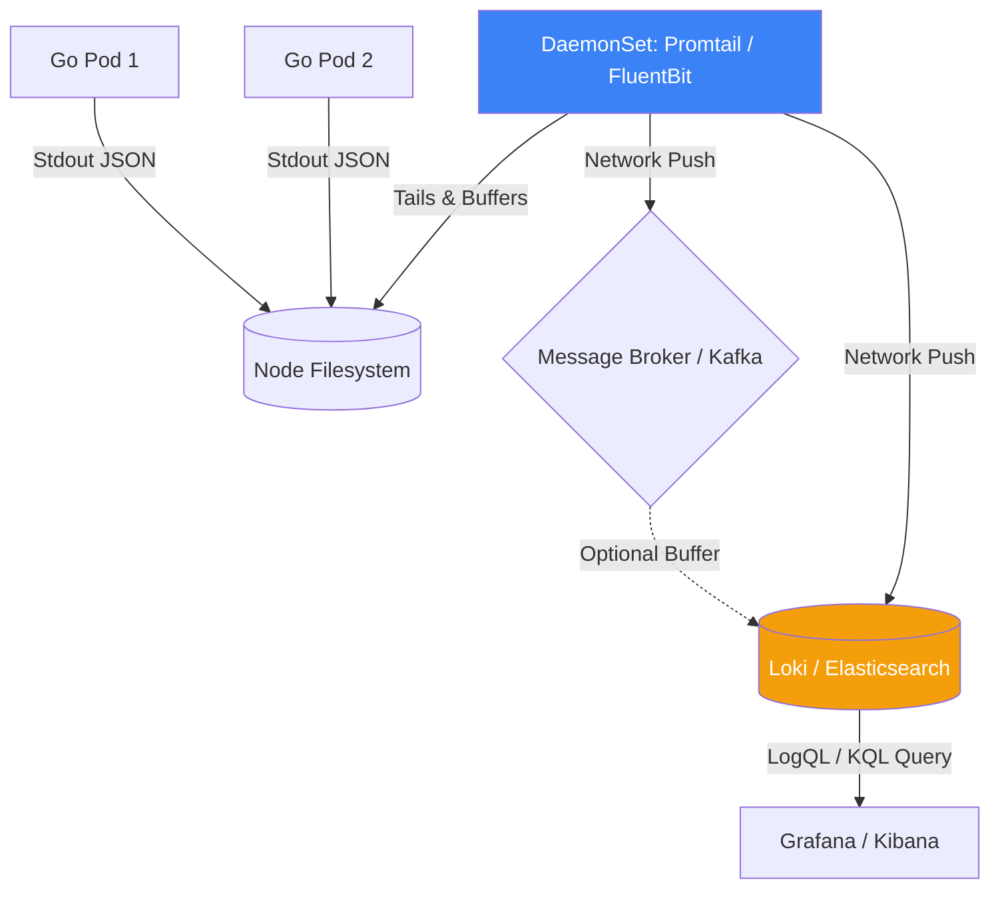

# Log Analysis Pipeline (ELK / Loki)

## 1. Learning Objectives
* **What you'll learn**: How to architect a centralized Log Analysis Pipeline that ships, buffers, parses, and indexes gigabytes of Go JSON logs across a distributed microservice cluster.
* **Why it matters**: If you have 50 Kubernetes Pods, you cannot `kubectl logs` into each one manually to find a bug. You need a massive search engine that aggregates all 50 logs into a single, instantly searchable timeline.
* **Where it's used**: The ELK Stack (Elasticsearch, Logstash, Kibana) or the PLG Stack (Promtail, Loki, Grafana) are mandatory in every enterprise cloud deployment.

---

## 2. Real-world Story
Imagine owning 50 retail stores. 
If there is a security incident at 3 PM, you don't want to drive to all 50 stores, ask the managers for their paper logbooks, and try to piece the story together (Manual SSH logging).
Instead, every store has a live camera feeding into a Central Security Room (Log Aggregator). You sit in one chair, type "3:00 PM", and instantly see the camera feeds from all 50 stores side-by-side on one screen.

---

## 3. Visual Learning (Execution Flow & Architecture)


---

## 4. Internal Working (Under the Hood)
A production Log Pipeline has 3 distinct phases:
1. **The Shipper (Agent)**: A lightweight daemon (FluentBit, Promtail) running on the physical server. It reads the Go `stdout` log files, attaches K8s metadata (like `pod_name="billing-api"`), and ships them over the network.
2. **The Indexer/Store**: The database (Loki/Elasticsearch) that receives the logs. Elasticsearch indexes *every single word* in the log for lightning-fast full-text search. Loki only indexes the *labels* (like Prometheus) and leaves the log text raw, making it 10x cheaper to run.
3. **The Visualizer**: The UI (Grafana/Kibana) used by humans to search the store.

---

## 5. Compiler Behavior
* **Non-Blocking I/O**: Your Go application should NEVER send logs directly to Elasticsearch via an HTTP Client in your code! If Elasticsearch goes offline, your Go HTTP client blocks, and your entire Go API freezes instantly. Always log to standard `os.Stdout`. The Linux kernel handles writing Stdout to disk asynchronously, keeping your Go app insanely fast.

---

## 6. Memory Management
* **The Log Buffer (Kafka)**: In massive companies generating Terabytes of logs per day, Elasticsearch often cannot write data fast enough. You must put Apache Kafka in the middle! FluentBit pushes to Kafka. Kafka holds the logs in RAM/Disk safely. Logstash slowly drains Kafka and inserts into Elasticsearch at a safe speed.

---

## 7. Code Examples

### 🔹 Example 1: The Go Application (JSON generation)
```go
import "log/slog"

func main() {
    // Generate pure JSON. Promtail/FluentBit loves JSON!
    slog.SetDefault(slog.New(slog.NewJSONHandler(os.Stdout, nil)))
    
    slog.Error("Failed to charge card", 
        slog.String("user_id", "42"),
        slog.String("error", "insufficient_funds"),
    )
}
```

### 🔹 Example 2: The Shipper (FluentBit Configuration)
```yaml
# fluent-bit.conf
# Read from the Kubernetes container log files
[INPUT]
    Name              tail
    Path              /var/log/containers/*.log
    Parser            docker
    Tag               kube.*

# Parse the inner JSON generated by Go 'slog'
[FILTER]
    Name              parser
    Match             kube.*
    Key_Name          log
    Parser            json

# Ship it securely to Elasticsearch!
[OUTPUT]
    Name            es
    Match           *
    Host            elasticsearch.default.svc
    Port            9200
    Index           goverse-logs
```

### 🔹 Example 3: Advanced (Loki LogQL)
```logql
# Grafana Loki Query Language (LogQL)
# 1. Find the exact Pod
{app="billing-api", namespace="production"}
  # 2. Parse the slog JSON natively!
  | json
  # 3. Filter where the user_id attribute equals "42"
  | user_id == "42"
  # 4. Filter where the log level is ERROR
  | level == "ERROR"
```

### 🔹 Example 4: Production (Metric Extraction from Logs)
```logql
# In Loki, you can generate Prometheus Metrics DIRECTLY FROM LOGS!
# E.g., Count the number of ERROR logs per minute!
sum by (app) (
  rate({namespace="production"} | json | level="ERROR" [1m])
)
```

### 🔹 Example 5: Interview
```go
// Q: Why is Grafana Loki becoming more popular than Elasticsearch for Kubernetes logging?
// A: Cost. Elasticsearch builds massive inverted indexes for every word in every log, 
// requiring huge amounts of RAM. Loki ONLY indexes the labels (app, namespace). 
// The raw log text is compressed and dumped into cheap AWS S3 buckets. It is vastly cheaper.
```

---

## 8. Production Examples
1. **Security Auditing**: A hacker attempts an SQL injection. They trigger 500 `ERROR` logs containing the word `DROP TABLE`. The SIEM (Security Information and Event Management) pipeline detects this text pattern and instantly blocks their IP address via the firewall.
2. **Support Tickets**: A customer submits a ticket: "My payment failed at 2:15 PM." The support engineer opens Kibana, searches `user_id="customer_email" AND timestamp >= "14:10"`, and instantly sees the exact Go database error stack trace.

---

## 9. Performance & Benchmarking
* **Log Rotation**: If your Go app prints 10GB of logs a day to Stdout, the physical server's hard drive will fill up and crash in 3 days. Kubernetes uses Log Rotation (e.g., keeping only the last 100MB of logs on disk). The Shipper must ingest the logs and push them to the network *before* they are rotated and deleted!

---

## 10. Best Practices
* ✅ **Do**: Ensure your Go logs contain a `trace_id`. The ultimate observability flow is: User complains -> Search Log for UserID -> Find Log Error -> Copy `trace_id` -> Paste into Jaeger -> See the exact 5-microservice network failure!
* ❌ **Don't**: Write multi-line logs natively (like printing a panic stack trace using 15 separate `fmt.Println` calls). Promtail will read them as 15 separate, disconnected logs! Always wrap stack traces into a single JSON field using `slog`.
* 🏢 **Google / Uber / Netflix Style**: Separate your storage tiers. Keep 7 days of logs in "Hot Storage" (Fast, expensive RAM) for instant debugging. Move logs older than 7 days to "Cold Storage" (Slow, cheap S3) for compliance and auditing.

---

## 11. Common Mistakes
1. **Logging the Healthcheck**: If Kubernetes pings your `/health` endpoint every 5 seconds, and you `slog.Info("Healthcheck OK")`, you are generating 17,280 useless logs per day, per Pod. If you have 100 Pods, you generate 1.7 million useless logs a day. You will pay thousands of dollars to Datadog for absolutely zero value. Mute healthcheck logs!
2. **Dynamic Indexing in Elasticsearch**: If you log `slog.Any("user_data", map[string]any{"age": 25})`, and later log `{"age": "twenty-five"}`, Elasticsearch will suffer a Mapping Conflict (Type Error) and permanently drop the log! Ensure your JSON schemas are strict.

---

## 12. Debugging
How to troubleshoot the Log Pipeline:
* **The Missing Logs**: If logs stop appearing in Kibana, check the FluentBit DaemonSet logs (`kubectl logs ds/fluent-bit`). Usually, it means FluentBit lost network connection to Elasticsearch, or Elasticsearch ran out of disk space and went into "Read-Only" mode!

---

## 13. Exercises
1. **Easy**: Run Elasticsearch and Kibana locally using Docker Compose.
2. **Medium**: Write a Go script that generates 100 JSON logs to a file (`app.log`).
3. **Hard**: Configure Filebeat or FluentBit to read `app.log` and push it to the local Elasticsearch instance.
4. **Expert**: Open the Kibana UI, create a Data View, and write a KQL query to filter the exact JSON fields your Go app generated.

---

## 14. Quiz
1. **MCQ**: How should a Go application transmit its logs to Elasticsearch?
   * (A) Using the official Elasticsearch Go HTTP Client. (B) Printing to Stdout and letting an infrastructure Daemon (FluentBit) ship them. (C) Saving them to a Postgres database. *(Answer: B)*
2. **System Design Follow-up**: Why is a DaemonSet the preferred way to run a log shipper in Kubernetes? *(A DaemonSet guarantees that exactly ONE instance of Promtail/FluentBit runs on every physical physical machine (Node). It mounts the `/var/log` directory of the host, allowing it to efficiently read the logs of all 50 Pods on that machine simultaneously, rather than running 50 separate sidecars).*

---

## 15. FAANG Interview Questions
* **Beginner**: Explain the ELK stack.
* **Intermediate**: What is Backpressure in a logging pipeline and how does a Message Queue (Kafka) mitigate it?
* **Senior (Google/Meta)**: Architect a global logging pipeline complying with GDPR. How do you guarantee that logs generated in the EU data center physically never cross into US storage, while still allowing developers a single UI pane of glass to search globally?

---

## 16. Mini Project
**The PLG Stack (Promtail, Loki, Grafana)**
* Use Docker Compose to spin up Loki and Grafana.
* Write a Go app that logs JSON with a random `status: [200, 500]`.
* Spin up Promtail, configured to read the Docker container logs and push to Loki.
* Open Grafana, connect the Loki Data Source, and write a LogQL query to graph the rate of `status="500"` logs visually!

---

## 17. Enterprise Features & Observability
* **Alerting on Logs**: You don't just alert on Metrics! You can configure Loki to fire a PagerDuty alert if it sees the string `"panic: runtime error"` in any Go log across the entire cluster.

---

## 18. Source Code Reading
Walkthrough of `grafana/loki`.
* **The Chunking Engine**: Read the Loki source code (written in Go) to see how it massively compresses text logs. It groups logs with identical labels into "Chunks", compresses them using Snappy/Gzip, and streams them to S3, achieving legendary storage efficiency.

---

## 19. Architecture
* **Log Scrubbing**: Before logs ever leave the secure internal network, the Shipper (FluentBit) can run Lua scripts to Regex match Social Security Numbers and replace them with `XXX-XX-XXXX`.

---

## 20. Summary & Cheat Sheet
* **Shipper**: FluentBit / Promtail (Reads Stdout).
* **Buffer**: Kafka (Handles traffic spikes).
* **Storage**: Elasticsearch (Heavy Indexing) or Loki (Cheap S3).
* **Rule**: Go apps just write to Stdout. Zero networking logic in the app.
