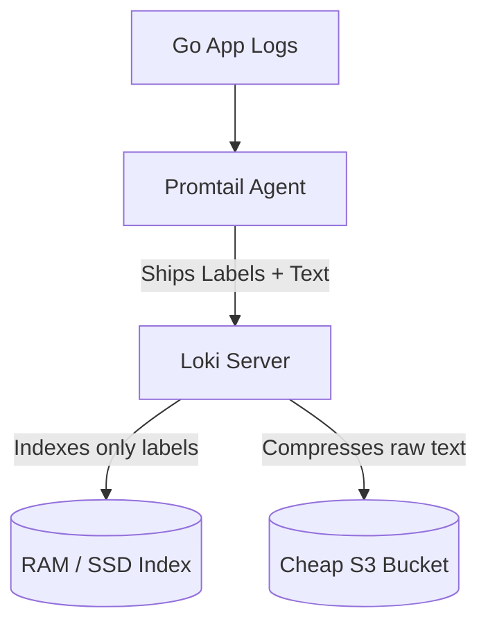

# Log Analysis Pipelines (ELK vs PLG)

Generating structured JSON logs in Go using `log/slog` is only the first step. You need an architecture to ship, store, and query those logs across hundreds of servers.

There are two dominant architectures in the cloud-native ecosystem: The **ELK Stack** and the **PLG Stack**.

## 1. The Heavyweight: ELK Stack

ELK stands for **Elasticsearch, Logstash, and Kibana**. 

1. **Logstash (or Fluentd/Fluent Bit)**: Runs as an agent on every server. It reads the Go application log files, parses the JSON, and ships it over the network.
2. **Elasticsearch**: A massive, highly scalable NoSQL search engine. It completely indexes every single field in your JSON logs, allowing for blazing-fast full-text search.
3. **Kibana**: The visualization UI where you execute queries.

**The Drawback**: Elasticsearch indexes *everything*. This makes it incredibly fast, but astronomically expensive to run. Indexing terabytes of logs requires massive clusters with hundreds of gigabytes of RAM.

## 2. The Cloud-Native Challenger: PLG Stack

PLG stands for **Promtail, Loki, and Grafana** (built by the Grafana team specifically for Kubernetes).

1. **Promtail**: The agent that scrapes the Go log files.
2. **Loki**: The storage engine. 
3. **Grafana**: The UI.

**The Innovation (Loki):**
Unlike Elasticsearch, **Loki does not index the contents of your logs.** 
It only indexes the metadata labels (like `app_name=order-service`, `env=production`). The actual JSON log text is compressed into chunks and dumped directly into ultra-cheap AWS S3 object storage!

When you query Loki (using LogQL), it uses the fast RAM index to find the correct time range and service, downloads the compressed chunks from S3, and aggressively grep-searches the raw text on the fly. 

While queries can be slightly slower than Elasticsearch, the PLG stack is often **10x to 100x cheaper** to operate, making it the preferred choice for modern Go/Kubernetes architectures!
