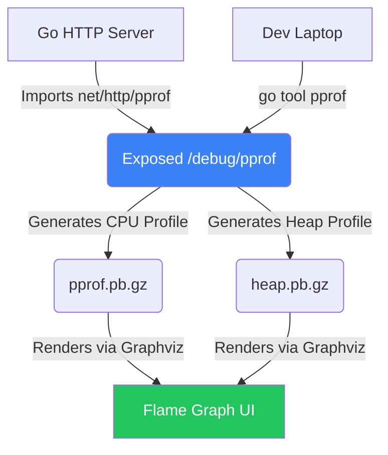

# Profiling with pprof

## 1. Learning Objectives
* **What you'll learn**: How to use Go's built-in profiler (`net/http/pprof`) to instantly diagnose CPU spikes, Memory Leaks, and Goroutine deadlocks in production.
* **Why it matters**: When a production server crashes with an Out Of Memory (OOM) error, guessing is not an engineering strategy. You need a surgical tool that tells you exactly which line of Go code allocated the fatal megabytes.
* **Where it's used**: Standard practice across every enterprise Go deployment (Google, Uber, Cloudflare).

---

## 2. Real-world Story
Imagine trying to figure out why your car is burning too much gas. 
You can guess and change the tires, change the oil, and hope it gets better.
Or, you can plug a diagnostic computer (`pprof`) directly into the engine. It instantly prints out: "Cylinder 3 is misfiring 50% of the time." You immediately know the exact component to fix. `pprof` is the diagnostic computer for your Go applications.

---

## 3. Visual Learning (Execution Flow & Architecture)


---

## 4. Internal Working (Under the Hood)
`pprof` works by **Sampling**.
When you start a CPU profile, the Go runtime pauses the program exactly 100 times per second (100Hz). 
During each micro-pause, it looks at the call stack of every running Goroutine. If it sees `strings.ReplaceAll()` running 90 times out of 100 samples, it mathematically concludes that `strings.ReplaceAll()` is consuming 90% of your CPU.

---

## 5. Compiler Behavior
* **Zero Overhead (Usually)**: Importing the `net/http/pprof` package adds practically 0% overhead to a running Go server. The profiling engine lays dormant until an HTTP request hits `/debug/pprof/profile`. Only then does the 100Hz sampling begin, and it automatically stops after 30 seconds. It is designed to be safely run in production!

---

## 6. Memory Management
* **inuse_space vs alloc_space**: The Heap profile has two modes. `inuse_space` shows exactly what is currently held in RAM (Useful for finding Memory Leaks). `alloc_space` shows everything that was EVER allocated since the server booted, even if the Garbage Collector already deleted it (Useful for optimizing GC pressure and finding useless allocations).

---

## 7. Code Examples

### 🔹 Example 1: Exposing pprof (The easy way)
```go
import (
    "net/http"
    _ "net/http/pprof" // The blank identifier automatically registers the routes!
)

func main() {
    // Start your business logic...
    go startMyApp()
    
    // Start a dedicated admin server purely for pprof!
    // NEVER expose this port to the public internet!
    log.Println(http.ListenAndServe("localhost:6060", nil))
}
```

### 🔹 Example 2: Taking a CPU Profile
```bash
# This command hits your server, waits 30 seconds to gather data, 
# and automatically opens a beautiful web UI in your browser!
go tool pprof -http=:8080 http://localhost:6060/debug/pprof/profile?seconds=30
```

### 🔹 Example 3: Taking a Memory (Heap) Profile
```bash
# Immediately dumps the current memory state and opens the UI
go tool pprof -http=:8080 http://localhost:6060/debug/pprof/heap
```

### 🔹 Example 4: Tracing Goroutine Leaks
```bash
# If you suspect you have 10,000 hanging Goroutines, use this.
# It prints the exact stack trace of EVERY currently alive Goroutine!
curl http://localhost:6060/debug/pprof/goroutine?debug=2
```

### 🔹 Example 5: Interview
```go
// Q: Is it safe to leave `net/http/pprof` imported in a production binary?
// A: Yes, the standard library is designed for this. HOWEVER, you must bind the 
// pprof HTTP server to `localhost` or an internal Admin port. If you expose it to 
// the public internet, hackers can download your source code structure and trigger 
// CPU profiles to DDoS your server!
```

---

## 8. Production Examples
1. **The JSON Bottleneck**: A team noticed their API was slow. They ran `pprof`. The Flame Graph showed that 70% of the CPU was spent entirely inside `json.Unmarshal()`. They swapped the standard library JSON for `github.com/goccy/go-json` and doubled their server throughput instantly.
2. **The Missing Mutex Unlock**: A Go server suddenly stopped responding but CPU was 0%. They fetched the `/debug/pprof/goroutine?debug=2` dump and saw 50,000 Goroutines blocked at `sync.(*Mutex).Lock()`. They found a specific error branch where they forgot to call `Unlock()`.

---

## 9. Performance & Benchmarking
* **Flame Graphs**: The most powerful tool in `pprof`. A Flame Graph visualizes the CPU profile. The X-axis represents time/CPU%. The Y-axis represents the depth of the function calls. If a box is extremely wide, it means that specific function is a massive CPU bottleneck!

---

## 10. Best Practices
* ✅ **Do**: Name your Goroutines! While you can't technically name them in standard Go, using `pprof.Do(ctx, pprof.Labels("worker", "email"), func(ctx context.Context) {...})` allows you to attach labels to Goroutines, making them infinitely easier to identify in a profile dump!
* ❌ **Don't**: Guess what is slow. "I think the database driver is slow." Never optimize without a `pprof` profile proving it. "Premature optimization is the root of all evil."
* 🏢 **Google / Uber / Netflix Style**: Use Continuous Profiling (like Google Cloud Profiler or Datadog). Agents automatically take `pprof` snapshots every 10 minutes and upload them. If a deploy happens on Tuesday, you can overlay Tuesday's profile on Monday's profile and visually see the exact line of code that caused the 5% CPU regression!

---

## 11. Common Mistakes
1. **Misreading alloc_space**: Developers often look at `alloc_space`, see `100GB`, and panic thinking they have a memory leak. `alloc_space` is cumulative over the lifetime of the app! If the server has been running for a month, 100GB is totally normal. Look at `inuse_space` for active leaks.
2. **Using the Default ServeMux**: `import _ "net/http/pprof"` attaches the endpoints to the global `http.DefaultServeMux`. If your main public API also uses `DefaultServeMux`, you just accidentally exposed your profiler to the internet! Always use a custom router (`chi` or `gorilla/mux`) for your public API.

---

## 12. Debugging
How to troubleshoot pprof itself:
* **Missing Graphviz**: If you run `go tool pprof -http=:8080 ...` and get an error about `dot not found`, you need to install the Graphviz OS package (`apt-get install graphviz` or `brew install graphviz`). pprof requires it to draw the SVG flame graphs!

---

## 13. Exercises
1. **Easy**: Import `net/http/pprof`, start an HTTP server on `:6060`, and visit `http://localhost:6060/debug/pprof/` in your browser.
2. **Medium**: Write a function that constantly appends data to a global `[]string` slice (an intentional memory leak). Run the program.
3. **Hard**: Use the terminal `go tool pprof` command to fetch the `heap` profile of your leaking program.
4. **Expert**: Use the `top` command inside the interactive pprof terminal to identify the exact name of the function causing the memory leak!

---

## 14. Quiz
1. **MCQ**: At what frequency does the Go CPU profiler sample the application?
   * (A) 1 Hz (B) 100 Hz (C) 10,000 Hz. *(Answer: B. 100 samples per second is the perfect balance between accuracy and low overhead).*
2. **System Design Follow-up**: How would you build a system to find Memory Leaks in 1,000 Go microservices automatically? *(Write a Go cron job that queries `/debug/pprof/heap` on every pod once an hour, uploads the `pb.gz` file to S3, and compares `inuse_space`. If it grows 5 hours in a row, trigger a Slack alert).*

---

## 15. FAANG Interview Questions
* **Beginner**: How does a Flame Graph work?
* **Intermediate**: Differentiate between `inuse_space` and `alloc_space` in a heap profile.
* **Senior (Google/Meta)**: Explain how you would profile a Go binary that does NOT have an HTTP server running (e.g., a CLI tool). (Hint: Use `runtime/pprof.StartCPUProfile(os.File)` inside the `main()` function).

---

## 16. Mini Project
**The Profiling Detective**
* Write a Go program that sorts a massive array of 10 million integers using Bubble Sort (intentionally slow).
* Run the program and start a 30-second CPU profile using `go tool pprof`.
* Open the Web UI (`-http=:8080`).
* Navigate to the "Flame Graph" tab.
* Take a screenshot proving that the `BubbleSort` function is physically the widest box on the graph!

---

## 17. Enterprise Features & Observability
* **Custom Profiling**: You aren't limited to CPU/Memory! You can create custom profiles. For example, you can create a `pprof` profile that tracks exactly how many times your application successfully connected to the PostgreSQL database!

---

## 18. Source Code Reading
Walkthrough of `runtime/pprof`.
* **The `writeHeapInternal` function**: Study how the Go runtime freezes the world for a fraction of a millisecond to securely dump the garbage collector's internal memory spans into the protobuf format without crashing your app!

---

## 19. Architecture
* **Trace vs Pprof**: `pprof` is for macroscopic overviews (e.g. "JSON is slow"). `go tool trace` is for microscopic timelines (e.g. "Goroutine 4 was blocked for 2ms waiting for Goroutine 9 to release a Mutex").

---

## 20. Summary & Cheat Sheet
* **Tool**: `go tool pprof`
* **CPU**: Sample-based (100Hz).
* **Heap (Memory)**: Tracks `inuse` (leaks) and `alloc` (GC pressure).
* **Goroutine**: Tracks deadlocks and leaks.
* **Golden Rule**: Never optimize without a profile.
