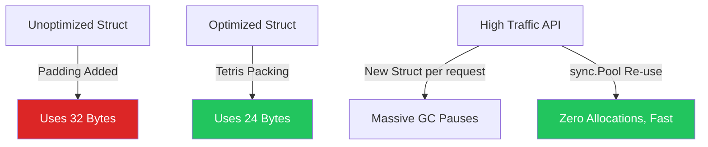

# Memory Optimization (Struct Packing & sync.Pool)

## 1. Learning Objectives
* **What you'll learn**: How to mathematically optimize Go Struct sizes via field alignment, and how to eliminate Garbage Collection overhead by reusing memory with `sync.Pool`.
* **Why it matters**: Cloud providers charge by the Gigabyte. If you load 10 million rows from a database into RAM, a poorly aligned Go struct will use 30% more RAM than a perfectly aligned one. Wasted RAM = Wasted Money.
* **Where it's used**: High-frequency trading, massive in-memory caches, and core infrastructure like Kubernetes and Docker.

---

## 2. Real-world Story
Imagine packing a moving truck. 
If you throw couches, TVs, and lamps in randomly, there will be massive empty gaps between the furniture. The truck is full, but mostly full of air. You have to rent a second truck.
Struct Packing is like playing Tetris. If you carefully place the couch, then fit the TV perfectly underneath it, you eliminate the empty gaps (Padding). You fit 30% more items in the exact same truck.

---

## 3. Visual Learning (Execution Flow & Architecture)


---

## 4. Internal Working (Under the Hood)
Modern CPUs read memory in chunks (usually 8 bytes on a 64-bit architecture), known as **Words**. 
If a boolean (1 byte) is followed by an int64 (8 bytes), the CPU cannot split the int64 across two different memory Words. It must add 7 bytes of invisible "Padding" after the boolean so the int64 aligns perfectly with the start of the next 8-byte Word. This padding is physically wasted RAM!

---

## 5. Compiler Behavior
* **Struct Alignment**: The Go compiler respects the order you wrote the fields in. It will *never* automatically reorder your fields to save memory (doing so would break binary compatibility with C code / CGO). You, the engineer, must write the fields from Largest to Smallest to mathematically eliminate the padding!

---

## 6. Memory Management
* **`sync.Pool`**: When you allocate an object (`buf := make([]byte, 1024)`) inside an HTTP handler, it dies when the handler finishes. The Garbage Collector (GC) has to clean it up. At 10,000 req/sec, the GC will consume 50% of your CPU just cleaning up buffers! `sync.Pool` allows you to save the buffer in a global bucket, and the next HTTP request can borrow it, resulting in 0 new allocations and 0 GC overhead!

---

## 7. Code Examples

### 🔹 Example 1: Struct Packing (The Bad Way)
```go
// 64-bit Architecture
type BadStruct struct {
    IsActive bool   // 1 byte (+7 bytes invisible padding!)
    ID       int64  // 8 bytes
    Age      int32  // 4 bytes (+4 bytes invisible padding!)
}
// Total size: 1+7 + 8 + 4+4 = 24 Bytes!
// You are wasting 11 bytes (45% of the struct) purely on empty air!
```

### 🔹 Example 2: Struct Packing (The Good Way)
```go
// Rule: Order fields from Largest (8 bytes) down to Smallest (1 byte)!
type GoodStruct struct {
    ID       int64  // 8 bytes
    Age      int32  // 4 bytes
    IsActive bool   // 1 byte (+3 bytes padding at the end)
}
// Total size: 8 + 4 + 1+3 = 16 Bytes!
// You just saved 8 bytes per struct.
// If you cache 100 Million of these, you just saved 800 Megabytes of RAM!
```

### 🔹 Example 3: `sync.Pool` (Eliminating Allocations)
```go
import "sync"

// Create a global pool of reusable Byte Buffers
var bufferPool = sync.Pool{
    New: func() interface{} {
        // This is ONLY called if the pool is completely empty!
        buf := make([]byte, 1024) 
        return &buf
    },
}

func ProcessRequest() {
    // 1. Borrow a buffer from the pool (Extremely fast, no allocation!)
    bufPtr := bufferPool.Get().(*[]byte)
    buf := *bufPtr
    
    // 2. Use it (e.g., read from a TCP socket)
    
    // 3. IMPORTANT: Reset the data so the next person doesn't read your dirty bytes!
    for i := range buf { buf[i] = 0 }
    
    // 4. Return it to the pool
    bufferPool.Put(bufPtr)
}
```

### 🔹 Example 4: Production (JSON Marshal Optimization)
```go
// The standard library json.Marshal() allocates memory constantly.
// Using a sync.Pool of bytes.Buffer completely eliminates this!
var jsonBufPool = sync.Pool{
    New: func() any { return new(bytes.Buffer) },
}

func FastJSON(w http.ResponseWriter, data any) {
    buf := jsonBufPool.Get().(*bytes.Buffer)
    buf.Reset() // Clear old data!
    defer jsonBufPool.Put(buf) // Always put it back!
    
    json.NewEncoder(buf).Encode(data)
    w.Write(buf.Bytes())
}
```

### 🔹 Example 5: Interview
```go
// Q: What happens to the items inside `sync.Pool` when the Garbage Collector runs?
// A: The GC clears the pool! `sync.Pool` is NOT a cache. It is a temporary holding pen. 
// If your server goes completely idle, the GC will destroy all the buffers in the pool 
// to return RAM to the Operating System. You cannot rely on items staying in the pool!
```

---

## 8. Production Examples
1. **Fasthttp**: The famous `valyala/fasthttp` library is 10x faster than standard `net/http` primarily because it uses `sync.Pool` for literally everything (Request objects, Response objects, Headers). It achieves Zero-Allocation HTTP routing!
2. **Loggers**: High-performance loggers like `uber-go/zap` use a `sync.Pool` to construct the JSON log string. Instead of allocating a new string for every log, it borrows a `[]byte` from the pool, writes the JSON, flushes to `Stdout`, and returns it.

---

## 9. Performance & Benchmarking
* **Fieldalignment Tool**: You don't have to guess struct sizes! Go provides an official tool: `go install golang.org/x/tools/go/analysis/passes/fieldalignment/cmd/fieldalignment@latest`. Run `fieldalignment ./...` on your project, and it will automatically rewrite your Go structs to the mathematically optimal size!

---

## 10. Best Practices
* ✅ **Do**: Use `sync.Pool` for expensive/frequent allocations (like large `[]byte` slices or heavy structs used in HTTP middleware).
* ❌ **Don't**: Put basic objects (like a single `int` or a 5-byte string) into a `sync.Pool`. The CPU overhead of acquiring the Pool's internal Mutex is actually slower than just letting the GC handle a tiny 5-byte allocation!
* 🏢 **Google / Uber / Netflix Style**: For extreme optimizations, group similar sized fields together. Put all `int64` and pointers (8 bytes) at the top, then `int32` (4 bytes), then `int16`, then `bool`/`uint8` at the very bottom.

---

## 11. Common Mistakes
1. **Forgetting to Reset (`buf.Reset()`)**: If you borrow a buffer from `sync.Pool`, write a 5-character string "Hello", and put it back without clearing it... The next HTTP request borrows the buffer, writes "Hi", and the buffer now contains "Hillo"! This causes horrific, impossible-to-debug data corruption.
2. **False Sharing (CPU Cache Lines)**: If you pad a struct incorrectly, two different CPU cores might try to update two different variables that happen to sit on the exact same 64-byte Cache Line, causing massive CPU hardware contention.

---

## 12. Debugging
How to troubleshoot Memory Allocations:
* **Escape Analysis (`-m`)**: Run `go build -gcflags="-m" main.go`. The compiler will literally print out `main.go:10: buf escapes to heap`. This proves whether your variable was allocated cheaply on the Stack, or heavily on the Heap!

---

## 13. Exercises
1. **Easy**: Write a `BadStruct` and use `unsafe.Sizeof(BadStruct{})` to print its size in bytes.
2. **Medium**: Reorder the fields to create `GoodStruct` and print its size. Marvel at the bytes you saved!
3. **Hard**: Implement a `sync.Pool` for `[]byte` slices.
4. **Expert**: Write a standard `Benchmark` function. Benchmark an HTTP handler that calls `make([]byte, 1024)` vs an HTTP handler that uses `sync.Pool`. Run `go test -bench=. -benchmem` and prove that the pool has `0 allocs/op`!

---

## 14. Quiz
1. **MCQ**: Why does the Go compiler insert invisible padding bytes into structs?
   * (A) For security (B) To align data with CPU memory word boundaries for fast hardware reads (C) To make the garbage collector faster. *(Answer: B)*
2. **System Design Follow-up**: If `sync.Pool` is cleared by the GC, how do you implement a persistent connection pool (like a Database connection pool)? *(You cannot use `sync.Pool`. You must write a custom data structure using buffered Go Channels to securely hold and reuse persistent network sockets!)*

---

## 15. FAANG Interview Questions
* **Beginner**: What is the purpose of `sync.Pool`?
* **Intermediate**: Explain memory alignment and padding. Why doesn't Go just sort the struct fields automatically?
* **Senior (Google/Meta)**: Architect a zero-allocation JSON parser in Go. How do you parse an incoming 10MB JSON HTTP payload without allocating a single byte on the Heap? (Hint: Use `sync.Pool` for the read buffer, and return pointers into the original buffer instead of copying strings).

---

## 16. Mini Project
**The Zero-Alloc Echo Server**
* Build a TCP Server using Go's `net` package.
* When a client connects, read their message and echo it back.
* Version 1: Use `make([]byte, 4096)` inside the connection loop. Benchmark it with `wrk`.
* Version 2: Create a `sync.Pool`. Borrow the 4096-byte slice, use it, clear it, and put it back. Benchmark it again. Watch the CPU usage drop by 40%!

---

## 17. Enterprise Features & Observability
* **Allocation Metrics**: In Grafana, the metric you must watch is `go_memstats_alloc_bytes_total`. If the derivative (`rate()`) of this metric is insanely high (e.g., allocating 1GB per second), your Garbage Collector will work overtime, and your API latency will spike randomly (GC Pauses).

---

## 18. Source Code Reading
Walkthrough of `sync/pool.go`.
* **Victim Caching**: Study the brilliant engineering inside `sync.Pool`. When the GC runs, it doesn't instantly delete the pool! It moves the items into a `victim` cache. If you request an item during the next cycle, it can rescue the item from the victim cache before it is permanently destroyed!

---

## 19. Architecture
* **Memory Arenas**: (Experimental in Go 1.20+). Instead of pooling individual objects, `arena.NewArena()` allows you to allocate thousands of objects in a single continuous block of RAM, and instantly free the entire block at once, completely bypassing the Garbage Collector entirely!

---

## 20. Summary & Cheat Sheet
* **Struct Packing**: Order fields Largest (8B) to Smallest (1B).
* **Alignment Tool**: `fieldalignment ./...`
* **sync.Pool**: Reuses objects to eliminate GC overhead.
* **Danger**: ALWAYS reset pool objects before putting them back!
