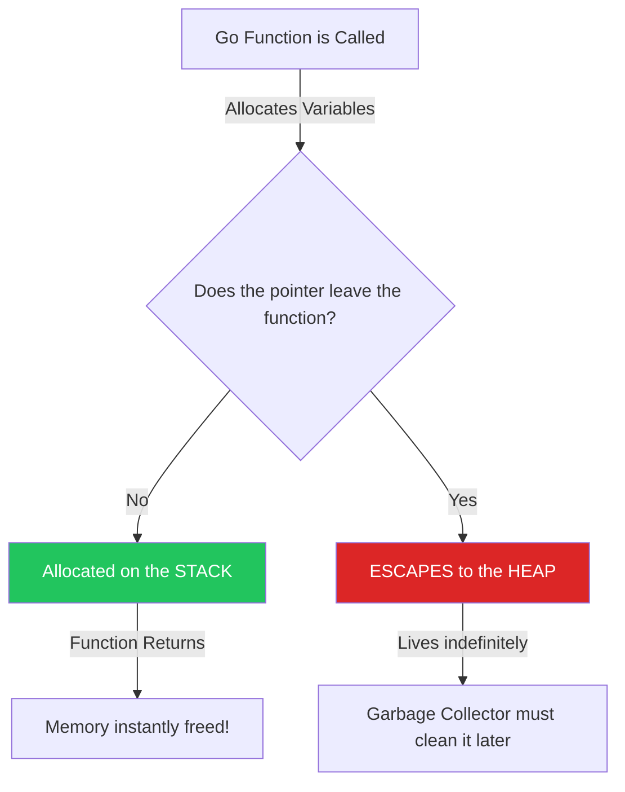

# Escape Analysis & The Stack

## 1. Learning Objectives
* **What you'll learn**: How to drastically improve Go performance by understanding the difference between Stack and Heap memory, and how the Go Compiler's "Escape Analysis" decides where your variables live.
* **Why it matters**: Stack memory allocation is virtually free (1 CPU instruction) and has zero Garbage Collection (GC) overhead. Heap allocation is expensive and causes GC pauses. Keeping variables on the Stack is the secret to sub-millisecond API latency.
* **Where it's used**: Ultra-low latency systems, database drivers, and game engines.

---

## 2. Real-world Story
Imagine working in a kitchen (The Function).
You need a cutting board (A Variable). 
If you grab a cutting board from your personal station (The **Stack**), you use it, and the moment your shift ends, you wipe it clean. It costs nothing, and nobody else has to manage it.
If you order a massive custom cutting board from the warehouse (The **Heap**), it takes time to deliver, and when you're done, you have to call the Janitor (The **Garbage Collector**) to haul it away. 
You want to keep as much at your personal station as possible!

---

## 3. Visual Learning (Execution Flow & Architecture)


---

## 4. Internal Working (Under the Hood)
Every Goroutine has its own private **Stack** (starting at 2KB). As a function executes, it pushes variables onto the stack. When the function returns, the stack pointer simply moves down, instantly invalidating the memory. It is insanely fast.
The **Heap** is a global pool of memory shared across all Goroutines. Allocating here requires finding free space (locks/mutexes) and requires the Garbage Collector to periodically scan it to see if anyone is still using it.

---

## 5. Compiler Behavior
* **Escape Analysis**: During compilation, the Go compiler analyzes your code. If you create a variable inside `func A()`, but you return a *pointer* to that variable back to `main()`, the variable cannot live on the Stack for `func A()` (because the stack is destroyed when `A` returns). The compiler says: *"This variable ESCAPES!"* and moves it to the Heap.

---

## 6. Memory Management
* **Interfaces always Escape**: One of the most common causes of accidental heap allocations in Go is the `interface{}` type. If you pass an integer `5` into `fmt.Println(5)`, the compiler must wrap that integer into an `interface{}` to satisfy the function signature. This dynamic wrapping forces the integer to escape to the Heap!

---

## 7. Code Examples

### 🔹 Example 1: Staying on the Stack (Fast)
```go
func CalculateSum(a, b int) int {
    // 'result' is created here.
    // We return the VALUE (a copy). 
    // We do NOT return a pointer.
    result := a + b
    
    // The compiler proves 'result' never leaves this function.
    // It is allocated on the Stack. Zero GC overhead!
    return result 
}
```

### 🔹 Example 2: Escaping to the Heap (Slow)
```go
func CreateUser() *User {
    // We create a User struct.
    u := User{Name: "Alice"}
    
    // We are returning a POINTER to 'u'.
    // When CreateUser() finishes, its Stack is destroyed.
    // Therefore, 'u' MUST survive the destruction of the Stack!
    // The Compiler forces 'u' to ESCAPE TO THE HEAP.
    return &u 
}
```

### 🔹 Example 3: The `interface{}` Trap
```go
func LogData(data interface{}) {
    // ...
}

func main() {
    x := 42
    // Even though 'x' never leaves main(), passing it into an 
    // interface{} parameter forces 'x' to escape to the heap!
    LogData(x) 
}
```

### 🔹 Example 4: Slices and Maps
```go
func Process() {
    // If the compiler knows the size at compile time, it STAYS on the Stack!
    smallSlice := make([]int, 100) 
    
    // If the size is dynamic (a variable), the compiler doesn't know 
    // if it will fit on the Stack. It ESCAPES to the Heap!
    n := 100
    dynamicSlice := make([]int, n) 
}
```

### 🔹 Example 5: Interview
```go
// Q: Is it always better to pass large structs by pointer (*Struct) to save memory?
// A: NO! This is a massive myth in Go. Passing by pointer often forces the struct 
// to Escape to the Heap. The CPU cost of the Garbage Collector cleaning up the Heap 
// is usually MUCH WORSE than the cost of just copying a 100-byte struct on the Stack! 
// Only use pointers if you need to mutate the original struct.
```

---

## 8. Production Examples
1. **High-Performance JSON**: Standard `encoding/json` heavily uses `interface{}` and reflection, causing massive Heap escapes. High-performance libraries like `easyjson` generate static Go code to read JSON directly into structs, keeping everything on the Stack and bypassing the GC!
2. **Standard Library `bytes.Buffer`**: When writing highly optimized networking code, engineers often pass `[]byte` by value rather than by pointer to strictly control escape boundaries.

---

## 9. Performance & Benchmarking
* **The `-m` Flag**: You don't have to guess! Run `go build -gcflags="-m"`.
  Output: `main.go:12: &u escapes to heap`.
  Run `-gcflags="-m -m"` for extremely detailed output explaining exactly *why* the compiler decided it had to escape!

---

## 10. Best Practices
* ✅ **Do**: Pass structs by value (copy) by default. Only pass by pointer (`*`) if the struct is massively huge (e.g., 1 Megabyte) or if you explicitly need to mutate the original object.
* ❌ **Don't**: Return pointers to local variables blindly. If you write a factory function `NewConfig() Config`, return the struct value! Let the caller decide if they want to take a pointer to it!
* 🏢 **Google / Uber / Netflix Style**: Use `go test -bench=. -benchmem`. If a hot-path function reports `1 allocs/op`, engineers will refactor the function signatures until it reports `0 allocs/op`, guaranteeing it runs entirely on the Stack.

---

## 11. Common Mistakes
1. **The `fmt.Sprintf` Trap**: Using `fmt.Sprintf("%d", 42)` inside a tight loop. `Sprintf` takes `...interface{}`. Every single iteration forces the integer onto the Heap. Use `strconv.Itoa(42)` instead, which stays on the Stack!
2. **Accidental Global Variables**: If you assign a local variable to a global variable (e.g., `globalMap["user"] = &u`), the compiler instantly flags it as Escaping to the Heap because global variables outlive the function execution.

---

## 12. Debugging
How to troubleshoot Escape Analysis:
* **The Profiler (`alloc_space`)**: If you run `go tool pprof` and look at the `alloc_space` graph, you will see exactly which functions are dumping the most data onto the Heap. Focus your `-m` analysis exclusively on those hot paths.

---

## 13. Exercises
1. **Easy**: Write a function that returns a pointer to a local `int`. Run `go build -gcflags="-m"` and find the line that says it escapes to the heap.
2. **Medium**: Rewrite the function to return the `int` by value. Run the compiler flag again and verify the escape message disappears!
3. **Hard**: Create an array `[10]int` vs a slice `[]int{...}`. Pass both to a function. Analyze which one escapes.
4. **Expert**: Write a benchmark comparing the speed of returning a `struct{ A, B, C int }` by value vs returning it by pointer. Prove that returning by value is actually faster!

---

## 14. Quiz
1. **MCQ**: Why is Stack memory allocation faster than Heap memory allocation?
   * (A) The Stack uses L1 CPU Cache. (B) The Stack requires only a single CPU instruction (moving a pointer) and has no Garbage Collection. (C) The Heap is encrypted. *(Answer: B)*
2. **Code Review**: `func GetName() string { s := "Alice"; return s }`. Does `"Alice"` escape to the heap? *(No! Strings are immutable. Go simply copies the string header (a pointer and a length) on the Stack. It is incredibly efficient).*

---

## 15. FAANG Interview Questions
* **Beginner**: What is Escape Analysis?
* **Intermediate**: Why does passing data to `interface{}` cause a Heap allocation?
* **Senior (Google/Meta)**: Explain how Go's Goroutine Stack management differs from C++. If a Goroutine starts with a 2KB stack, what happens mechanically if the function calls get so deep that it needs 4KB of stack space? (Hint: Continuous Stacks, copying the entire stack to a new memory block).

---

## 16. Mini Project
**The Zero-Alloc Formatter**
* Write a function that concatenates 5 strings.
* Version 1: Use `fmt.Sprintf("%s%s...", a,b...)`.
* Version 2: Use `strings.Builder`.
* Run `go test -benchmem`.
* Study the results: `fmt.Sprintf` will have multiple allocations (escapes). `strings.Builder` will have exactly 1 allocation (if you pre-allocate the capacity!).

---

## 17. Enterprise Features & Observability
* **Allocation Budgets**: In enterprise CI/CD pipelines, teams use custom linters to enforce "Zero Allocation" rules on critical network decoding packages. If a junior dev merges code that causes a Heap allocation in the hot path, the CI build instantly fails.

---

## 18. Source Code Reading
Walkthrough of the Go Compiler (`src/cmd/compile/internal/escape`).
* **The AST Graph**: Study how the Go compiler builds a directed graph of your Abstract Syntax Tree. It traces the flow of pointers mathematically. If a pointer path connects a local variable to a return statement or a global variable, the edge is colored "Escapes".

---

## 19. Architecture
* **Value Semantics**: The philosophy of Go is heavily biased toward "Value Semantics" (copying data) rather than "Pointer Semantics" (sharing data). Copying small structs on the Stack is not only faster for the GC, but it perfectly prevents Data Race conditions!

---

## 20. Summary & Cheat Sheet
* **Stack**: Fast, temporary, zero GC.
* **Heap**: Slow, permanent, heavy GC.
* **Escape Analysis**: Compiler decides where variables go.
* **Command**: `go build -gcflags="-m"`
* **Mythbuster**: Passing by pointer is NOT always faster!
