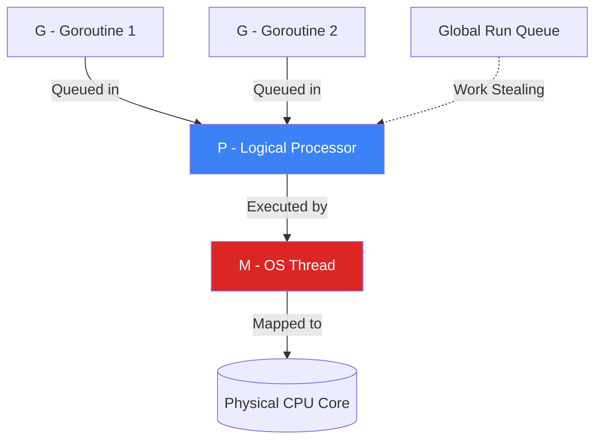

# The Go Scheduler (M:N Model)

## 1. Learning Objectives
* **What you'll learn**: The internal mechanics of the Go Scheduler (M:N threading), OS Threads vs Goroutines, and Work Stealing algorithms.
* **Why it matters**: Understanding the scheduler allows you to write highly concurrent code that achieves maximum CPU utilization without suffering from thread contention or starvation.
* **Where it's used**: Building high-throughput API Gateways, real-time WebSockets, and massively parallel data processing pipelines.

---

## 2. Real-world Story
Imagine a restaurant kitchen with 4 Chefs (CPU Cores). 
You have 100,000 orders to cook (Goroutines).
If a Chef had to walk to the warehouse to get ingredients for every order (An OS Thread making a blocking system call), the Chef would spend 90% of their time walking and 10% cooking.
Instead, the Go Scheduler acts as a brilliant Kitchen Manager. When Order A requires ingredients from the warehouse, the Manager instantly swaps Order B onto the Chef's cutting board. The Chef never stops cooking. The CPUs run at 100% efficiency.

---

## 3. Visual Learning (Execution Flow & Architecture)


---

## 4. Internal Working (Under the Hood)
The Go Scheduler uses the **G-P-M Model**:
* **G (Goroutine)**: The actual function you want to run. It has its own tiny 2KB stack and program counter.
* **M (Machine)**: An actual OS Thread managed by the Linux Kernel. It is heavy (takes 1MB of RAM) and slow to context switch.
* **P (Processor)**: A Logical Processor. By default, Go creates one `P` for every physical CPU core you have (`GOMAXPROCS`).
The Scheduler multiplexes thousands of `G`s onto a handful of `M`s, orchestrated by the `P`s. This is called the M:N Threading Model!

---

## 5. Compiler Behavior
* **Preemption**: In older versions of Go, if a Goroutine entered an infinite `for {}` loop without making any function calls, it would hijack the OS Thread forever, and the scheduler could never remove it. In Go 1.14+, the compiler inserts asynchronous preemption signals. The runtime fires a UNIX signal (`SIGURG`) at the OS Thread, forcing it to pause the greedy Goroutine and let others run!

---

## 6. Memory Management
* **Context Switching Overhead**: Switching between two OS Threads requires the CPU to flush its registers and cross the user/kernel space boundary (~1000 nanoseconds). Switching between two Goroutines is purely done in Go's user space (just updating 3 memory pointers). It takes ~200 nanoseconds. This mathematical advantage is why Go scales vastly better than Java/C++ Thread Pools.

---

## 7. Code Examples

### 🔹 Example 1: The GOMAXPROCS Illusion
```go
import "runtime"

func main() {
    // Force Go to only use exactly 1 Physical CPU Core!
    runtime.GOMAXPROCS(1)
    
    // Launch 10,000 Goroutines
    for i := 0; i < 10000; i++ {
        go func() {
            time.Sleep(1 * time.Second)
        }()
    }
    
    // Even though we only have 1 OS Thread running, 
    // Go manages all 10,000 concurrent sleeps perfectly!
    time.Sleep(2 * time.Second) 
}
```

### 🔹 Example 2: Blocking Syscalls (Network I/O)
```go
func FetchData() {
    // When you make an HTTP request, the OS Thread BLOCKs waiting for the network.
    resp, _ := http.Get("https://google.com")
    
    // THE MAGIC: The Go Scheduler detects the block! 
    // It detaches the OS Thread (M) from the Logical Processor (P).
    // It instantly spins up a NEW OS Thread for P so the remaining 
    // Goroutines in P's queue can continue executing!
}
```

### 🔹 Example 3: Advanced (Work Stealing)
```go
// Imagine you have 4 CPU Cores (P1, P2, P3, P4).
// P1's local queue is empty. P1 is bored.
// Instead of going to sleep, P1 looks at P2's local queue.
// P1 STEALS half of P2's pending Goroutines and executes them!
// This guarantees perfect load balancing across all CPU cores.
```

### 🔹 Example 4: Production (runtime.Gosched)
```go
func NumberCrunching(ch chan int) {
    for i := 0; i < 1000000000; i++ {
        // Heavy math...
        
        // If you have an insanely tight, heavy loop that doesn't make any 
        // network or function calls, you can manually yield the CPU politely:
        if i % 10000 == 0 {
            runtime.Gosched() // "I'm pausing to let other Goroutines run!"
        }
    }
}
```

### 🔹 Example 5: Interview
```go
// Q: Does a Goroutine map 1-to-1 to an OS Thread?
// A: No! Go uses M:N threading. 100,000 Goroutines (M) are multiplexed 
// onto maybe 4 OS Threads (N). This allows extreme concurrency with minimal OS RAM.
```

---

## 8. Production Examples
1. **Network Proxies**: When a Go API Gateway handles 10,000 idle WebSockets, it does not use 10,000 OS Threads (which would require 10GB of RAM). It uses 10,000 Goroutines (requiring only 20MB of RAM). The network Poller (epoll/kqueue) handles the waiting efficiently.
2. **Batch Processing**: A data pipeline spawns 100 Goroutines to resize images. Because `GOMAXPROCS` defaults to the number of CPU cores, the Go Scheduler seamlessly distributes the 100 image resizes exactly evenly across all 16 cores of the AWS EC2 instance.

---

## 9. Performance & Benchmarking
* **Lock Contention**: If 10 Goroutines try to lock the same `sync.Mutex`, 9 of them will fail. The Go Scheduler intercepts this failure. Instead of spinning the OS Thread and burning CPU, the Scheduler puts the 9 Goroutines to sleep and wakes them up only when the Mutex is unlocked.

---

## 10. Best Practices
* ✅ **Do**: Let the Scheduler do its job. Do not try to micro-manage Goroutines with massive `sync.Cond` or complex thread-locking manually unless absolutely necessary.
* ❌ **Don't**: Call C code via `CGO` excessively in hot paths. When a Goroutine calls C code, it completely blinds the Go Scheduler. The Scheduler cannot preempt a C function, leading to massive performance degradation if the C function blocks!
* 🏢 **Google / Uber / Netflix Style**: Use `go tool trace` to visually debug the scheduler! It generates an incredible UI timeline showing exactly what Goroutines were running on which OS Threads at every microsecond.

---

## 11. Common Mistakes
1. **Limiting GOMAXPROCS**: Setting `runtime.GOMAXPROCS(1)` because you think your code isn't thread-safe. This destroys your server's performance. Fix the data races using Mutexes, and let Go use all available CPU cores!
2. **CPU Starvation in Go 1.13**: In older Go versions, tight loops without function calls (`for { i++ }`) could starve other Goroutines because preemption was cooperative. Always upgrade to the latest Go version to benefit from Asynchronous Preemption!

---

## 12. Debugging
How to troubleshoot Scheduler issues:
* **The `GODEBUG` Variable**: Run your program with `GODEBUG=schedtrace=1000 ./myapp`. Every 1000 milliseconds, the Go runtime will print a debug line to the console showing exactly how many OS threads are alive, and how many Goroutines are currently waiting in the queues!

---

## 13. Exercises
1. **Easy**: Print the number of logical CPUs available to your program using `runtime.NumCPU()`.
2. **Medium**: Write a program that spawns 10 Goroutines doing heavy math (e.g., finding primes). Run it, open your Task Manager / Activity Monitor, and verify it uses 100% of ALL your CPU cores!
3. **Hard**: Set `runtime.GOMAXPROCS(1)` in the same program. Run it again. Verify in Task Manager that it now uses exactly 1 CPU core (approx 12% on an 8-core machine).
4. **Expert**: Run the program with `go tool trace`. Open the generated trace file in the browser and visually identify the Work Stealing mechanism across the `P` tracks.

---

## 14. Quiz
1. **MCQ**: What is the role of `P` (Logical Processor) in the Go Scheduler?
   * (A) It executes the code directly. (B) It acts as a local queue holding Goroutines, attaching to an OS Thread to execute them. (C) It handles Garbage Collection. *(Answer: B)*
2. **System Design Follow-up**: Why does the Go Scheduler use "Local Queues" for each `P` instead of one massive "Global Queue"? *(To avoid Mutex contention! If 16 CPU cores had to lock a Global Queue every time they needed a new Goroutine, the lock overhead would destroy performance. Local Queues allow lock-free fetching!)*

---

## 15. FAANG Interview Questions
* **Beginner**: Differentiate between Concurrency and Parallelism.
* **Intermediate**: Explain the M:N Threading model and why it is superior to 1:1 (Java/C++).
* **Senior (Google/Meta)**: Architect a real-time trading engine. If a Goroutine makes a blocking `syscall` to write to disk, explain the exact mechanical steps the Go Scheduler takes to ensure the physical CPU core does not sit idle. (Hint: Handoff and the Netpoller).

---

## 16. Mini Project
**The Scheduler Visualizer**
* Write a Go program with 4 Goroutines that run `time.Sleep(100ms)` in a loop.
* Import `os/trace`.
* Start a trace: `trace.Start(os.Create("trace.out"))`.
* Let the program run for 2 seconds.
* Run `go tool trace trace.out` in your terminal.
* Browse the interactive UI and take a screenshot of the `Goroutines` timeline proving that they were magically swapped on and off the CPU cores!

---

## 17. Enterprise Features & Observability
* **Kubernetes CPU Limits**: If you deploy a Go app to Kubernetes with a CPU limit of `0.5` (Half a core), `runtime.NumCPU()` will still report `16` (the physical node's cores)! Go will aggressively spawn 16 OS threads, causing Kubernetes to aggressively throttle your app! You MUST use the `go.uber.org/automaxprocs` package in enterprise deployments to mathematically align the Go Scheduler with Linux cgroup limits!

---

## 18. Source Code Reading
Walkthrough of `runtime/proc.go`.
* **The `findrunnable()` function**: This is the heart of the Go Scheduler! Read the source code to see the exact order of operations: First, check the Local Queue. Second, check the Global Queue. Third, check the Network Poller. Fourth, STEAL from another Processor!

---

## 19. Architecture
* **The Netpoller**: Go doesn't just block threads for network calls. It uses the OS's native asynchronous APIs (`epoll` on Linux, `kqueue` on macOS). The Goroutine parks itself, and the Netpoller wakes it up the exact nanosecond the network packet arrives, allowing 1 OS Thread to manage 10,000 network connections.

---

## 20. Summary & Cheat Sheet
* **Model**: M:N (Goroutines multiplexed onto OS Threads).
* **G-P-M**: Goroutine, Logical Processor, OS Thread.
* **Work Stealing**: Idle CPUs steal work from busy CPUs.
* **Syscalls**: Blocking network calls do NOT block the CPU core.
