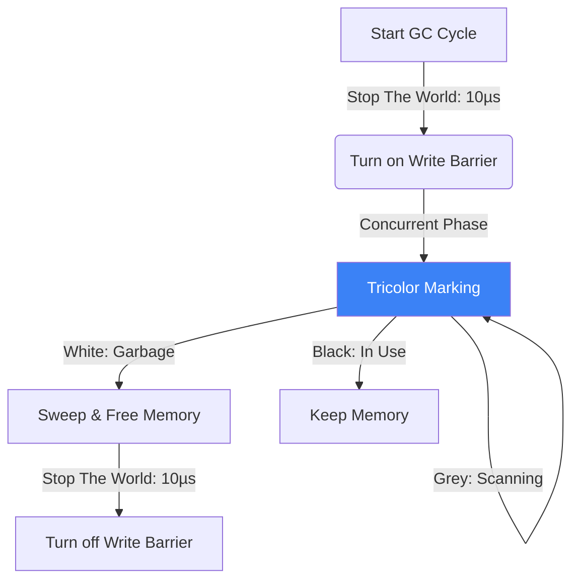

# The Garbage Collector (GC)

## 1. Learning Objectives
* **What you'll learn**: The internal algorithms of the Go Garbage Collector (Concurrent Mark-and-Sweep, Tricolor Algorithm) and how to tune `GOGC` to drastically reduce latency spikes.
* **Why it matters**: In high-performance systems (like trading APIs), a 50ms Garbage Collection pause can result in a lost trade. Understanding how the GC works allows you to eliminate these pauses entirely.
* **Where it's used**: Every single Go application automatically relies on this system to manage memory safely without manual C-style `malloc/free`.

---

## 2. Real-world Story
Imagine a massive library where people are constantly reading books and leaving them on tables.
In older languages (Java/C#), the Librarian shouts "STOP THE WORLD!". Everyone freezes. The Librarian walks through the entire library, picks up the abandoned books, and then says "Okay, continue." This is a massive interruption.
Go's Librarian is a **Concurrent Worker**. While you are actively reading, the Librarian walks quietly behind you, scanning the tables and putting away books without ever telling you to stop. The library never halts.

---

## 3. Visual Learning (Execution Flow & Architecture)


---

## 4. Internal Working (Under the Hood)
Go uses a **Non-Generational, Concurrent, Tri-Color Mark-and-Sweep** collector.
1. **White**: Objects that are garbage (to be deleted).
2. **Grey**: Objects that are alive, but we haven't checked the things they point to yet.
3. **Black**: Objects that are alive, and we have safely checked everything they point to.
The GC starts with everything White. It looks at your global variables and stack variables, colors them Grey, and traces the pointers until everything alive is Black. Whatever remains White is deleted!

---

## 5. Compiler Behavior
* **The Write Barrier**: Because the Go GC runs *concurrently* alongside your application, what happens if your application modifies a pointer while the GC is scanning? Disaster! To prevent this, the compiler inserts a "Write Barrier"—a tiny snippet of code that safely notifies the GC whenever a pointer is mutated during a collection cycle.

---

## 6. Memory Management
* **Sub-Millisecond Pauses**: The Go GC is optimized exclusively for **Low Latency**. It only has two tiny "Stop The World" (STW) pauses to turn the Write Barrier on and off. These pauses typically take `< 0.1 milliseconds`. In contrast, Java prioritizes high throughput but can suffer from 100ms+ STW pauses!

---

## 7. Code Examples

### 🔹 Example 1: Triggering GC Pressure
```go
// Creating massive amounts of short-lived objects forces the GC to run constantly!
func HeavyAllocation() {
    for i := 0; i < 1000000; i++ {
        // This slice escapes to the heap.
        // It becomes Garbage the moment the loop iteration ends!
        data := make([]byte, 1024) 
        _ = data
    }
}
```

### 🔹 Example 2: Tuning GOGC (The Magic Variable)
```go
import "runtime/debug"

func main() {
    // Default GOGC is 100. (Run GC when heap grows by 100%).
    // If you set it to 200, the GC runs half as often, 
    // using more RAM but saving massive amounts of CPU time!
    debug.SetGCPercent(200)
    
    // ...
}
```

### 🔹 Example 3: Advanced (Memory Arenas / Disabling GC)
```go
// For absolute extreme real-time systems, you can completely turn OFF the GC!
func TradingSystem() {
    debug.SetGCPercent(-1) // GC is disabled!
    
    // You MUST absolutely guarantee you don't leak memory, 
    // or your server will OOM crash rapidly.
}
```

### 🔹 Example 4: Production (Manual GC Triggers)
```go
func CacheFlush() {
    // We just deleted 5 Gigabytes of data from our internal cache map.
    cache.Clear()
    
    // We can politely suggest the runtime clean up the memory NOW 
    // while the server traffic is low, rather than waiting for the automatic trigger!
    runtime.GC() 
}
```

### 🔹 Example 5: Interview
```go
// Q: Why doesn't Go use a Generational GC like Java (Young vs Old generation)?
// A: Because Go's compiler does Escape Analysis! Go allocates short-lived objects 
// on the Stack, which is automatically freed. Java allocates everything on the Heap, 
// forcing Java to build complex "Young" generations to clean them up. Go doesn't need to!
```

---

## 8. Production Examples
1. **Twitch.tv**: Twitch wrote an incredibly famous engineering blog post. Their Go API was suffering from 400ms GC pauses in Go 1.4. By upgrading to Go 1.5+ (which introduced the concurrent GC), their latency dropped to sub-1ms instantly, saving their microservice architecture.
2. **Discord**: Discord famously migrated a single high-throughput service from Go to Rust because the Go GC was scanning 100 million active WebSocket keys every 2 minutes, burning massive CPU. (Note: In Go 1.20+, they could have used `Memory Arenas` to solve this without leaving Go!).

---

## 9. Performance & Benchmarking
* **GC CPU Cost**: By design, the Go Garbage Collector will utilize up to **25% of your total CPU cores** to perform the concurrent Mark-and-Sweep. If you have a 4-core machine, the GC will aggressively hijack 1 entire core just to clean up memory. Minimizing allocations is critical to reclaiming that CPU power!

---

## 10. Best Practices
* ✅ **Do**: Use `sync.Pool` to reuse objects. The best way to optimize the Garbage Collector is to not create garbage in the first place!
* ❌ **Don't**: Store massive caches (millions of entries) in standard Go `map[string]struct`. The GC has to aggressively scan every single pointer in that map! Use pointer-free caches (like `map[int]int` or bigcache libraries) because the GC skips scanning maps that contain zero pointers!
* 🏢 **Google / Uber / Netflix Style**: Use `GOMEMLIMIT` (Introduced in Go 1.19). You can tell Go: "Keep memory usage under 2GB." Go will aggressively tune the GC on-the-fly to respect that limit, preventing Kubernetes OOMKilled crashes completely!

---

## 11. Common Mistakes
1. **Memory Leaks via Slices**: `a := massiveSlice[:5]`. Even though `a` only shows 5 elements, it holds a hidden pointer to the backing array of the massive slice. The GC cannot delete the massive array because `a` is keeping it alive! Always copy the 5 elements to a new slice if you want to free the massive one.
2. **Goroutine Leaks**: The GC will NEVER delete an active Goroutine. If a Goroutine is permanently blocked on a channel waiting for data that will never arrive, the Goroutine (and all variables inside its stack) leak forever.

---

## 12. Debugging
How to troubleshoot the Garbage Collector:
* **GC Trace**: Run your program with `GODEBUG=gctrace=1 ./myapp`. Every time the GC runs, it will print a highly detailed diagnostic line: `gc 1 @0.01s 0%: 0.01+1.2+0.03 ms clock, 4 MB -> 4 MB -> 2 MB`. It shows exactly how long the STW pauses took, and how much RAM was freed!

---

## 13. Exercises
1. **Easy**: Write a program with an infinite loop that creates massive arrays.
2. **Medium**: Run the program with `GODEBUG=gctrace=1` and watch the terminal flood with GC statistics.
3. **Hard**: Modify the code to set `debug.SetGCPercent(500)`. Run it again. Notice how the frequency of the GC runs drops drastically, but the memory threshold grows significantly!
4. **Expert**: Use `go tool trace` to capture a trace. Open the UI and look at the blue `GC` bar on the timeline to visually confirm that the GC takes exactly 25% of the CPU cores during the marking phase.

---

## 14. Quiz
1. **MCQ**: What is the primary design goal of the Go Garbage Collector?
   * (A) Minimal RAM usage. (B) Maximum application throughput. (C) Ultra-low latency (sub-millisecond STW pauses). *(Answer: C. Go sacrifices some RAM and CPU throughput to guarantee your API never hangs for 100ms).*
2. **System Design Follow-up**: How do you safely manage an in-memory cache of 100 Million items in Go without destroying the GC? *(Use a library like `FreeCache` or `BigCache`, which serializes the objects into a massive `[]byte` slice and manages the offsets manually. Since a `[]byte` contains exactly zero pointers, the GC scans it in 0.0001 seconds!)*

---

## 15. FAANG Interview Questions
* **Beginner**: Explain the Tri-Color Mark and Sweep algorithm intuitively.
* **Intermediate**: What is a "Stop The World" pause and why does Go need two of them per cycle?
* **Senior (Google/Meta)**: Explain the mechanical purpose of the "Write Barrier". Give an exact scenario of how the Tricolor algorithm would delete a perfectly active object if the Write Barrier did not exist.

---

## 16. Mini Project
**The GOGC Tuner**
* Build an HTTP server that returns a 1MB JSON payload.
* Use `wrk -c 100 -d 10s` to load test it. Note the Requests Per Second.
* Add `debug.SetGCPercent(-1)` to disable the GC. Load test it again. The RPS will skyrocket, but the RAM will climb until it crashes.
* Find the perfect balance. Set `GOMEMLIMIT=1GB` and run it again to see Go magically manage the memory perfectly!

---

## 17. Enterprise Features & Observability
* **Prometheus Metrics**: In production, you must monitor `go_gc_duration_seconds` (A Histogram of pause times). If the 99th percentile jumps above 2 milliseconds, you have a severe allocation problem in a recent deployment that needs immediate optimization.

---

## 18. Source Code Reading
Walkthrough of `runtime/mgc.go`.
* **The Pacer**: Study the `Pacer` algorithm. The Go GC uses advanced calculus (PID controllers) to predict exactly how fast your application is allocating memory, allowing it to mathematically calculate the exact perfect millisecond to start the next GC cycle to prevent you from running out of RAM!

---

## 19. Architecture
* **CGO and the GC**: When your Go code crosses the boundary into C code (using `CGO`), the Go Garbage Collector has absolutely zero visibility into the memory allocated by C (`malloc`). You must manually `C.free()` that memory, or you will suffer catastrophic memory leaks that pprof cannot see!

---

## 20. Summary & Cheat Sheet
* **Algorithm**: Concurrent Tri-color Mark-and-Sweep.
* **Goal**: Ultra-low latency (< 1ms STW pauses).
* **Cost**: Consumes up to 25% CPU during marking.
* **Tuning**: `GOGC` (frequency) and `GOMEMLIMIT` (hard cap).
* **Hack**: Pointer-free maps bypass GC scanning!
