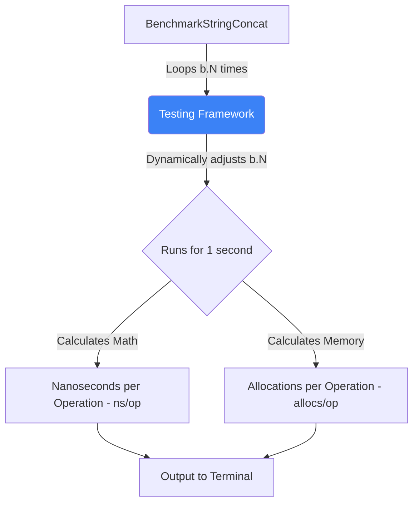

# Benchmarking & Optimization (testing framework)

## 1. Learning Objectives
* **What you'll learn**: How to scientifically measure Go code performance using the standard library `testing` package, preventing "guessing" when optimizing algorithms.
* **Why it matters**: Software engineering is science. If you rewrite a function to be "faster", but you don't have benchmark data proving the exact nanosecond and allocation improvements, you are just guessing.
* **Where it's used**: CI/CD pipelines at FAANG companies, where merging a PR that degrades critical path performance by >5% is automatically blocked.

---

## 2. Real-world Story
Imagine two mechanics arguing over which engine oil makes a car faster. 
Mechanic A says "Synthetic feels faster." Mechanic B says "Standard is better."
A Professional Engineer puts the car on a Dyno machine, runs it at 5,000 RPM for 10 minutes, and mathematically proves that Synthetic oil generated exactly 4.2 more horsepower.
Go Benchmarks are the Dyno machine for your code. Stop arguing on GitHub, and start benchmarking!

---

## 3. Visual Learning (Execution Flow & Architecture)


---

## 4. Internal Working (Under the Hood)
When you run a Benchmark, Go does NOT just run the function once.
It runs it in a `for i := 0; i < b.N; i++` loop. 
The Go testing framework dynamically calculates `b.N`. It starts by running the function 1 time. Then 100 times. Then 10,000 times. It keeps increasing `b.N` until the test runs for exactly 1 full second. This provides a massive statistical sample size, averaging out OS jitter and CPU spikes to give you an incredibly accurate nanosecond measurement!

---

## 5. Compiler Behavior
* **Compiler Optimizations (Inlining & Dead Code Elimination)**: Benchmarking is dangerous if done wrong! If your benchmarked function calculates `result := 42`, but you never actually *use* `result`, the Go compiler will realize the function does nothing and completely delete the code during compilation (Dead Code Elimination). Your benchmark will show `0.0001 ns/op`, making you think you wrote the fastest code in the world!

---

## 6. Memory Management
* **`-benchmem`**: Speed isn't everything. A function that runs in 100ns but allocates 5MB of Heap memory is far worse for a server than a function that takes 500ns but allocates 0 bytes. Always run benchmarks with memory tracking enabled to see the hidden GC pressure!

---

## 7. Code Examples

### 🔹 Example 1: The Standard Benchmark
```go
// Must be in a _test.go file!
import "testing"
import "strings"

// Must start with the word 'Benchmark' and take *testing.B
func BenchmarkStringConcat(b *testing.B) {
    // b.N is dynamically injected by the framework
    for i := 0; i < b.N; i++ {
        // The code we want to measure:
        _ = "Hello" + " " + "World"
    }
}
```

### 🔹 Example 2: Comparing Implementations
```go
// Is strings.Builder actually faster? Let's prove it!
func BenchmarkStringBuilder(b *testing.B) {
    for i := 0; i < b.N; i++ {
        var builder strings.Builder
        builder.WriteString("Hello")
        builder.WriteString(" ")
        builder.WriteString("World")
        _ = builder.String()
    }
}
// Run: go test -bench=. -benchmem
// Result: Builder might actually be SLOWER for tiny strings due to struct overhead!
```

### 🔹 Example 3: Advanced (Resetting the Timer)
```go
func BenchmarkDatabaseQuery(b *testing.B) {
    // Setup Phase: Connect to the DB (Takes 2 seconds)
    db := connectToDB()
    
    // We DO NOT want the 2-second setup to ruin our benchmark math!
    b.ResetTimer() 
    
    for i := 0; i < b.N; i++ {
        db.Query("SELECT * FROM users")
    }
}
```

### 🔹 Example 4: Production (Benchmarking Concurrency)
```go
// How does this function perform when 100 Goroutines hit it simultaneously?
func BenchmarkParallelCache(b *testing.B) {
    cache := NewThreadSafeCache()
    
    b.RunParallel(func(pb *testing.PB) {
        // This loop runs concurrently across all CPU cores!
        for pb.Next() {
            cache.Get("key")
        }
    })
}
```

### 🔹 Example 5: Interview
```go
// Q: How do you prevent the Go compiler from optimizing away your benchmark?
// A: Declare a global variable, and assign the result of your function to it! 
// The compiler cannot guarantee the global variable won't be used by another file, 
// so it is forced to execute the code.
var GlobalResult string
func BenchmarkSafe(b *testing.B) {
    var temp string
    for i := 0; i < b.N; i++ { temp = "Hello" + "World" }
    GlobalResult = temp // Prevents Dead Code Elimination!
}
```

---

## 8. Production Examples
1. **Regression Testing**: Using the `benchstat` tool. You run `go test -bench=. > old.txt`. You rewrite the algorithm, and run `go test -bench=. > new.txt`. You run `benchstat old.txt new.txt` and it mathematically proves the P-Value variance and shows exactly "+15% speed, -5% allocations".
2. **Standard Library**: The Go core team heavily benchmarks every PR. When they rewrote `sort.Slice` to use `pdqsort` (Pattern-Defeating Quicksort) in Go 1.19, they provided pages of benchmark outputs proving it was 10x faster for partially sorted arrays.

---

## 9. Performance & Benchmarking
* **Reading the Output**:
  `BenchmarkConcat-8   100000000   15.4 ns/op   0 B/op   0 allocs/op`
  * `8`: Number of CPU cores used.
  * `100000000`: `b.N` (It looped 100 million times).
  * `15.4 ns/op`: Took 15.4 nanoseconds per loop.
  * `0 B/op`: Allocated zero bytes on the Heap.

---

## 10. Best Practices
* ✅ **Do**: Close all background apps (Chrome, Slack, Spotify) when running benchmarks on your laptop! OS background noise will ruin your nanosecond measurements.
* ❌ **Don't**: Benchmark I/O bound tasks (like sleeping, or hitting external APIs over the internet). Benchmarking network latency is pointless. Benchmark CPU-bound and Memory-bound algorithms.
* 🏢 **Google / Uber / Netflix Style**: Run benchmarks on dedicated, isolated CI bare-metal servers with CPU frequency scaling disabled (P-states disabled) to guarantee mathematically consistent results across years of development.

---

## 11. Common Mistakes
1. **Including Setup in the Loop**: Putting `data := make([]int, 1000)` *inside* the `b.N` loop when you only wanted to test the `Sort()` function. You are now benchmarking the memory allocator, not the sorting algorithm! Move the setup outside the loop.
2. **Benchmarking with `go run`**: Benchmarks must be run using `go test -bench=.`. Never write a `time.Now()` wrapper in your `main()` function to measure speed. It lacks the statistical loop stabilization of the testing framework.

---

## 12. Debugging
How to troubleshoot Benchmarks:
* **High Variance**: If you run the benchmark 5 times and the `ns/op` jumps from 100 to 500 to 50, your machine is heavily loaded, or you have extreme Garbage Collection interference. Run with `-benchtime=3s` to force a longer sample size to smooth out the spikes.

---

## 13. Exercises
1. **Easy**: Write a function that calculates the Fibonacci sequence recursively.
2. **Medium**: Create a `_test.go` file and write a Benchmark for it. Run `go test -bench=.`.
3. **Hard**: Write an iterative (for-loop) version of the Fibonacci sequence. Benchmark it. Compare the `ns/op` to prove mathematically that iteration is faster than recursion.
4. **Expert**: Download `golang.org/x/perf/cmd/benchstat`. Save the output of the recursive benchmark to a file, and the iterative to another. Use `benchstat` to compare them!

---

## 14. Quiz
1. **MCQ**: What does the `-benchmem` flag do?
   * (A) Allocates more RAM to the test. (B) Prints the number of Heap allocations and bytes allocated per operation. (C) Disables the Garbage Collector. *(Answer: B)*
2. **System Design Follow-up**: Why does the benchmark output show `allocs/op`? Why is that important for system design? *(Because Heap allocations trigger the Garbage Collector. A function with 0 allocs will not impact API latency at scale, while a function with 10 allocs will eventually trigger a STW GC pause).*

---

## 15. FAANG Interview Questions
* **Beginner**: How do you write a benchmark in Go?
* **Intermediate**: What is `b.ResetTimer()` and when should you use it?
* **Senior (Google/Meta)**: Explain the mechanical pitfalls of CPU Cache Lines (False Sharing) when using `b.RunParallel`. How do you structure memory to ensure concurrent benchmarks scale linearly across 64 cores?

---

## 16. Mini Project
**The JSON Duel**
* Create a massive Go struct with 20 fields.
* Benchmark standard `encoding/json.Marshal`.
* Download the popular `github.com/goccy/go-json` library.
* Benchmark `goccy_json.Marshal`.
* Run `go test -bench=. -benchmem`. Prove that the third-party library is vastly faster and uses fewer allocations!

---

## 17. Enterprise Features & Observability
* **Profiling a Benchmark**: You can attach `pprof` directly to a benchmark! Run `go test -bench=. -cpuprofile=cpu.out`. You don't need to spin up an HTTP server. The benchmark will generate the CPU flame graph file instantly, allowing you to optimize the exact bottleneck!

---

## 18. Source Code Reading
Walkthrough of `testing/benchmark.go`.
* **The Auto-Scaler**: Read the `launch()` and `run1()` functions inside the standard library. Observe how beautifully Go calculates the dynamic `b.N` limit by multiplying by 1.2x and 1.5x sequences until the time boundary is mathematically satisfied.

---

## 19. Architecture
* **Micro vs Macro Benchmarks**: Go `testing.B` is for Micro-benchmarks (sorting algorithms, hash functions). For Macro-benchmarks (Testing if an entire Microservice can handle 10,000 req/sec), use external tools like `wrk`, `hey`, or `k6` to test the full HTTP stack.

---

## 20. Summary & Cheat Sheet
* **Command**: `go test -bench=. -benchmem`
* **Format**: `func BenchmarkX(b *testing.B)`
* **Loop**: Must use `for i := 0; i < b.N; i++`
* **Danger**: Prevent Dead Code Elimination with global vars.
* **Pro-tip**: Use `b.ResetTimer()` after heavy setup logic.
