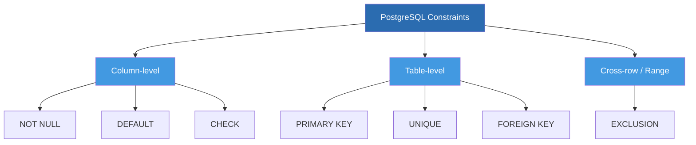
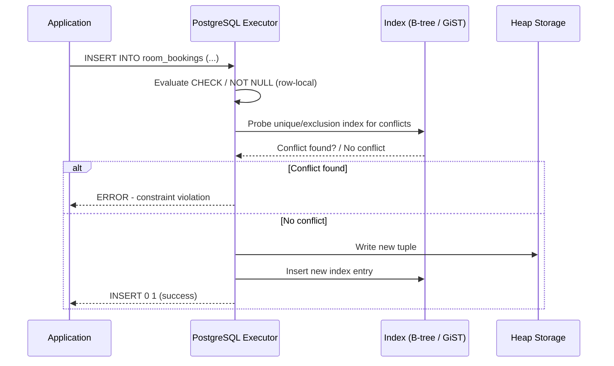

# Level 3 — Constraints

*(Based on official PostgreSQL documentation, current stable series: PostgreSQL 18.)*

## 1. Learning Objectives

* **What you'll learn**: Every constraint type PostgreSQL supports — `PRIMARY KEY`, `FOREIGN KEY`, `UNIQUE`, `NOT NULL`, `CHECK`, `DEFAULT`, and the more advanced `EXCLUSION` constraint — how each is enforced internally, and when to reach for which one.
* **Why it matters**: Constraints are how you push data integrity rules *into the database itself* instead of trusting every application, script, and future developer to re-implement them correctly. A constraint violated is a bug caught at write-time, in one place, forever — versus a data-quality bug discovered months later in production, scattered across every code path that touches the table.

---

## 2. Topics Covered

* PRIMARY KEY
* FOREIGN KEY
* UNIQUE
* NOT NULL
* CHECK
* DEFAULT
* EXCLUSION Constraint

---

## 3. Constraint Landscape — Overview Diagram



Every constraint in Postgres falls into one of three enforcement scopes:
* **Column-level** — evaluated against a single value in a single row (`NOT NULL`, `DEFAULT`, most `CHECK`s).
* **Table-level** — evaluated against other rows in the same table (`PRIMARY KEY`, `UNIQUE`) or another table (`FOREIGN KEY`).
* **Cross-row/range** — evaluated using operator-based overlap logic across rows, backed by an index (`EXCLUSION`).

---

## 4. Deep Dive: Each Constraint Type

### 4.1 PRIMARY KEY

A `PRIMARY KEY` is Postgres's shorthand for `UNIQUE + NOT NULL`, plus it designates the column(s) as *the* canonical row identifier, which other tables reference via `FOREIGN KEY`.

```sql
CREATE TABLE accounts (
    id SERIAL PRIMARY KEY,
    email VARCHAR(255) UNIQUE NOT NULL
);
```
Internally, `PRIMARY KEY` automatically creates a unique B-tree index on the column(s) — this is the index that both enforces uniqueness *and* makes lookups by ID fast. A table can have only one `PRIMARY KEY` (composite across multiple columns if needed), but unlimited `UNIQUE` constraints.

### 4.2 FOREIGN KEY

Enforces that a value in one table must exist in another table's referenced column (almost always its primary key).

```sql
CREATE TABLE orders (
    id BIGSERIAL PRIMARY KEY,
    account_id INT NOT NULL REFERENCES accounts(id) ON DELETE CASCADE,
    total NUMERIC NOT NULL
);
```

`ON DELETE` / `ON UPDATE` actions:

| Action | Behavior when the referenced row is deleted/updated |
|---|---|
| `NO ACTION` (default) | Raise an error if any referencing rows exist (checked at end of statement) |
| `RESTRICT` | Raise an error if any referencing rows exist (checked immediately) |
| `CASCADE` | Automatically delete/update the referencing rows too |
| `SET NULL` | Set the referencing column to `NULL` |
| `SET DEFAULT` | Set the referencing column to its `DEFAULT` value |

**Important production detail**: Postgres does **not** automatically create an index on the referencing (`account_id`) side of a foreign key — only the referenced side (the primary key) is indexed automatically. If you don't add `CREATE INDEX ON orders(account_id);` yourself, every cascading delete/update and every join in that direction does a sequential scan.

### 4.3 UNIQUE

Guarantees no two rows share the same value(s) in the given column(s), but (unlike `PRIMARY KEY`) allows multiple `NULL`s, since `NULL` is never considered equal to another `NULL` in standard SQL comparison semantics.

```sql
ALTER TABLE accounts ADD CONSTRAINT uq_email UNIQUE (email);

-- Composite unique constraint
ALTER TABLE room_assignments ADD CONSTRAINT uq_room_date UNIQUE (room_id, assigned_date);
```
Like `PRIMARY KEY`, `UNIQUE` is enforced via an automatically-created B-tree index.

### 4.4 NOT NULL

The simplest constraint: rejects any `INSERT`/`UPDATE` that would leave the column `NULL`.

```sql
ALTER TABLE accounts ALTER COLUMN email SET NOT NULL;
```
Adding `NOT NULL` to an existing column with live data requires Postgres to scan the whole table to verify no `NULL`s exist (a full table lock in older Postgres versions; since PG12, if there's already a valid `CHECK (col IS NOT NULL)` constraint, the scan can be skipped).

### 4.5 CHECK

An arbitrary boolean expression evaluated on every insert/update; the row is rejected if the expression evaluates to `FALSE` (a `NULL` result is treated as passing, matching standard SQL semantics).

```sql
ALTER TABLE accounts ADD CONSTRAINT chk_balance_nonneg CHECK (balance >= 0);

ALTER TABLE bookings ADD CONSTRAINT chk_valid_dates
  CHECK (check_out > check_in);
```
`CHECK` constraints can reference multiple columns of the *same row*, but cannot reference other rows or other tables — for cross-row logic, you need `EXCLUSION` (below) or a trigger.

### 4.6 DEFAULT

Not technically a constraint on its own (it doesn't reject anything), but it's grouped with constraints because it works alongside `NOT NULL`/`CHECK` to guarantee a column always has a sensible value even when the application omits it.

```sql
ALTER TABLE accounts ALTER COLUMN status SET DEFAULT 'active';
ALTER TABLE accounts ALTER COLUMN created_at SET DEFAULT now();
```
Since PostgreSQL 11, adding a column with a **constant** `DEFAULT` is metadata-only (instant, no table rewrite); a `DEFAULT` using a volatile function like `now()` or `gen_random_uuid()` is also fast for new columns because it's evaluated per-row at write time, not backfilled at `ALTER` time.

### 4.7 EXCLUSION Constraint

Generalizes `UNIQUE` from "no two rows can be *equal*" to "no two rows can *satisfy this operator*" — most famously used to prevent overlapping ranges (e.g., double-booking a hotel room, overlapping reservation periods, overlapping validity windows).

```sql
CREATE EXTENSION IF NOT EXISTS btree_gist;

CREATE TABLE room_bookings (
    room_id INT,
    booking_period TSTZRANGE,
    EXCLUDE USING GIST (
        room_id WITH =,
        booking_period WITH &&
    )
);
```
This says: "no two rows may have the same `room_id` **and** an overlapping (`&&`) `booking_period`." It's backed by a **GiST** (or GIN, in some cases) index, and requires the `btree_gist` extension so a plain equality operator (`=`) can be combined with a range operator (`&&`) in the same index.

---

## 5. Comparison Tables

### 5.1 Constraint Type Comparison

| Constraint | Enforces | Allows multiple NULLs? | Backing index? | Cross-row? | Cross-table? |
|---|---|---|---|---|---|
| `PRIMARY KEY` | Uniqueness + non-null | No (NOT NULL implied) | Yes (auto B-tree) | Yes (uniqueness) | No |
| `FOREIGN KEY` | Referential integrity | N/A | No (not automatic on referencing side) | Yes | Yes |
| `UNIQUE` | Uniqueness | Yes | Yes (auto B-tree) | Yes (uniqueness) | No |
| `NOT NULL` | Non-null value | No | No | No | No |
| `CHECK` | Arbitrary row-level condition | Depends on expression | No | No (same row only) | No |
| `DEFAULT` | Fallback value (not a true constraint) | N/A | No | No | No |
| `EXCLUSION` | Arbitrary cross-row operator condition | Depends | Yes (GiST/GIN) | Yes (generalized) | No |

### 5.2 "Where We Use What, and Why"

| Business Requirement | Constraint to Use | Why |
|---|---|---|
| Every account needs a stable unique ID | `PRIMARY KEY` | Guarantees uniqueness + non-null, and is the natural target for `FOREIGN KEY`s from other tables |
| Every order must belong to a real, existing account | `FOREIGN KEY` | Prevents orphaned orders referencing an account that doesn't exist |
| No two users can register with the same email | `UNIQUE` | Doesn't need the "identifier for other tables" role of a primary key, just uniqueness |
| A `name` field must always be provided | `NOT NULL` | Simplest possible rule — no `NULL` handling needed downstream in the app |
| An account balance must never go negative | `CHECK` | Business rule expressible as a boolean expression on a single row |
| New rows should default to today's date/an empty status without the app specifying it | `DEFAULT` | Removes repetitive boilerplate from every `INSERT` statement in the app |
| No two bookings for the same room can overlap in time | `EXCLUSION` | The only constraint type that expresses "overlap," not just "equality" |

### 5.3 Locking Behavior When Adding a Constraint

| Operation | Typical Lock Level | Table Rewrite? | Notes |
|---|---|---|---|
| `ADD PRIMARY KEY` (new) | `ACCESS EXCLUSIVE` | Yes (builds index) | Blocks reads/writes while building; use `CREATE UNIQUE INDEX CONCURRENTLY` + `ADD CONSTRAINT ... USING INDEX` to avoid this on live tables |
| `ADD FOREIGN KEY` | `SHARE ROW EXCLUSIVE` | No | Still scans the referencing table once to validate existing rows unless added `NOT VALID` |
| `ADD UNIQUE` (new) | `ACCESS EXCLUSIVE` | Yes (builds index) | Same concurrent-index workaround as `PRIMARY KEY` |
| `ADD NOT NULL` | `ACCESS EXCLUSIVE` | No (metadata + scan) | Full-table scan to verify no `NULL`s exists unless a matching valid `CHECK` already covers it |
| `ADD CHECK` | `ACCESS EXCLUSIVE` | No | Can be added `NOT VALID` then validated later with a lighter lock |
| `ADD DEFAULT` (constant) | `ACCESS EXCLUSIVE` (brief) | No (metadata-only, PG11+) | Nearly instant regardless of table size |
| `ADD EXCLUSION` | `ACCESS EXCLUSIVE` | Yes (builds GiST/GIN index) | Same cost profile as adding a new index |

---

## 6. Production Usage Scenarios (Real-World Examples)

### Scenario: PRIMARY KEY
**Context**: You're building a highly concurrent order-processing system where every order must be uniquely and immediately addressable by downstream services (payment, fulfillment, notifications).
**The Problem**: Without an enforced unique identifier, concurrent inserts from multiple application servers could produce duplicate order references, causing downstream services to overwrite or double-process the wrong order.
**The PostgreSQL Solution**: Declare `id BIGSERIAL PRIMARY KEY` (or a `UUID PRIMARY KEY DEFAULT gen_random_uuid()` for multi-service ID generation) so the database itself guarantees uniqueness at the storage layer, backed by an automatically-maintained B-tree index that also makes every downstream lookup by ID fast.

### Scenario: FOREIGN KEY
**Context**: A high-throughput checkout service inserts thousands of `order_items` per minute, each referencing a `product_id`.
**The Problem**: Without referential integrity enforced by the database, a race condition (or an application bug) between "delete a discontinued product" and "insert an order for that product" can leave `order_items` pointing at products that no longer exist, corrupting reporting and fulfillment.
**The PostgreSQL Solution**: A `FOREIGN KEY REFERENCES products(id) ON DELETE RESTRICT` guarantees the database itself rejects the delete (or the insert) rather than the two operations racing — the integrity guarantee is enforced independent of which application server or thread is involved, and independent of any application-level bug.

### Scenario: UNIQUE
**Context**: A multi-tenant SaaS platform lets each tenant define their own set of usernames, and usernames must be unique *within* a tenant but can repeat across tenants.
**The Problem**: A single global `UNIQUE` constraint on `username` would incorrectly block Tenant B from using a username already taken by Tenant A, even though they're unrelated organizations.
**The PostgreSQL Solution**: A **composite** `UNIQUE (tenant_id, username)` constraint enforces uniqueness scoped correctly to each tenant, all inside the database, without any application-level "check first" logic that would be race-prone under concurrent signups.

### Scenario: NOT NULL
**Context**: A billing pipeline computes invoices from an `amount` column, and a single missing amount can silently produce a $0 invoice line that goes unnoticed for weeks.
**The Problem**: Application-level validation (e.g., a web form requiring the field) can be bypassed by a direct API call, a bulk import script, or a future developer who forgets to replicate the same validation logic.
**The PostgreSQL Solution**: `amount NUMERIC NOT NULL` makes it structurally impossible for a row to exist without a value, regardless of which code path inserted it — the guarantee lives in exactly one place instead of being re-implemented (and potentially forgotten) in every insertion path.

### Scenario: CHECK
**Context**: An e-commerce platform must never let an account's `balance` (in a store-credit system) go negative, even under highly concurrent simultaneous spending.
**The Problem**: Application-level checks ("is balance >= amount before deducting?") suffer from race conditions under concurrency — two simultaneous deductions can both pass the check before either commits, together driving the balance negative.
**The PostgreSQL Solution**: `CHECK (balance >= 0)` is enforced by the database at commit time for every single transaction, regardless of how many concurrent transactions are in flight — combined with row-level locking (`SELECT ... FOR UPDATE`) for the read-then-deduct logic, it becomes structurally impossible for the balance to go negative no matter the concurrency level.

### Scenario: DEFAULT
**Context**: Every new row inserted into an audit_log table across dozens of microservices needs a consistent `created_at` timestamp and `status = 'new'`, and you can't guarantee every service's code sets these explicitly.
**The Problem**: Relying on each service to explicitly set `created_at = now()` and `status = 'new'` in every insert statement means any service that forgets produces inconsistent or missing data, and a bug in one service's clock handling could introduce subtly wrong timestamps.
**The PostgreSQL Solution**: `created_at TIMESTAMPTZ DEFAULT now()` and `status TEXT DEFAULT 'new'` push this responsibility into the database itself — every insert, from every service, in every language, gets the same consistent behavior for free, with the timestamp generated by the database server's own clock rather than each service's potentially-skewed clock.

### Scenario: EXCLUSION Constraint
**Context**: A hotel booking platform must guarantee, under any level of concurrent booking traffic, that the same room is never double-booked for overlapping date ranges.
**The Problem**: A naive "check for overlapping bookings, then insert if none found" application-level check has the exact same race condition as the balance example above — two concurrent booking requests for overlapping dates can both pass the check before either commits.
**The PostgreSQL Solution**: An `EXCLUDE USING GIST (room_id WITH =, booking_period WITH &&)` constraint makes it structurally impossible at the database level for two overlapping bookings to coexist for the same room — the database itself rejects the second `INSERT` at commit time, with no explicit locking code needed in the application at all.

---

## 7. Code & Query Implementation

### 🔹 Basic Implementation
```sql
-- Basic Constraints
CREATE TABLE accounts (
    id SERIAL PRIMARY KEY,
    email VARCHAR(255) UNIQUE NOT NULL,
    balance NUMERIC CHECK (balance >= 0)
);
```

### 🔹 Advanced / Optimized Implementation
```sql
-- Exclusion Constraint: Prevent double-booking a hotel room in the same time range
CREATE EXTENSION IF NOT EXISTS btree_gist;

CREATE TABLE room_bookings (
    room_id INT,
    booking_period TSTZRANGE,
    EXCLUDE USING GIST (
        room_id WITH =,
        booking_period WITH &&
    )
);

-- Adding a constraint to a LIVE, large table without locking it for validation:
-- Step 1: add the constraint as NOT VALID (instant, only checks future writes)
ALTER TABLE orders
  ADD CONSTRAINT fk_orders_account
  FOREIGN KEY (account_id) REFERENCES accounts(id) NOT VALID;

-- Step 2: validate existing rows separately, with a lighter lock
ALTER TABLE orders VALIDATE CONSTRAINT fk_orders_account;

-- Building a unique index CONCURRENTLY, then attaching it as a constraint,
-- to avoid ACCESS EXCLUSIVE locking a huge live table
CREATE UNIQUE INDEX CONCURRENTLY uq_accounts_email_idx ON accounts(email);
ALTER TABLE accounts ADD CONSTRAINT uq_accounts_email UNIQUE USING INDEX uq_accounts_email_idx;

-- Always index the referencing side of a foreign key yourself
CREATE INDEX idx_orders_account_id ON orders(account_id);
```

---

## 8. Constraint Enforcement Flow (Diagram)



Row-local constraints (`NOT NULL`, `CHECK`, `DEFAULT`) are evaluated first and are cheap — pure in-memory expression evaluation against the incoming row. Index-backed constraints (`PRIMARY KEY`, `UNIQUE`, `EXCLUSION`) require an index probe *before* the write is allowed to proceed, which is why they're more expensive and why an unindexed `FOREIGN KEY` check (a sequential scan on the referencing side) is comparatively very costly.

---

## 9. Internals & Under the Hood

**How the engine processes this (Parser → Planner → Executor)**
* Constraints are attached to a table's catalog entry (`pg_constraint`) and are checked by the **Executor**, not the Planner — the Planner doesn't choose whether to enforce a constraint, it's unconditional.
* For `CHECK`/`NOT NULL`, enforcement happens inline during tuple formation, before the write is even attempted — cheapest possible check.
* For `UNIQUE`/`PRIMARY KEY`/`EXCLUSION`, enforcement requires probing the backing index for a conflicting entry. This happens **after** the new tuple is provisionally inserted into the heap in most cases, which is why Postgres uses a special uniqueness-checking mechanism at the index level (deferred-checkable) rather than checking purely beforehand — this also underlies how `DEFERRABLE` constraints work (checked at end-of-transaction instead of immediately, useful for swapping unique values between two rows in one transaction).
* For `FOREIGN KEY`, the Executor issues an internal query against the referenced table (using its primary key index) as part of the same transaction — this is why an unindexed referencing column doesn't matter for the FK check itself (the referenced side is always indexed via its PK), but *does* matter for `ON DELETE`/`ON UPDATE CASCADE`, which must find all referencing rows to cascade against.

**Storage impact: WAL, Heap, and TOAST**
* Every constraint-backed index (`PRIMARY KEY`, `UNIQUE`, `EXCLUSION`) generates its own WAL records on every insert/update, in addition to the heap tuple's WAL records — more constraints means more WAL volume per write.
* `NOT VALID` foreign keys and check constraints skip the initial validation scan's WAL/lock cost, deferring it to an explicit `VALIDATE CONSTRAINT` step you control the timing of.
* `CHECK` constraints referencing large `text`/`jsonb` values may force TOAST detoasting during evaluation, adding I/O cost to every write on a table with large out-of-line values.

---

## 10. Performance & Benchmarking

**`EXPLAIN ANALYZE` impacts**
```sql
EXPLAIN ANALYZE
INSERT INTO room_bookings (room_id, booking_period)
VALUES (12, '[2026-08-01 14:00, 2026-08-03 11:00)');
```
* For constraint-backed inserts, watch for the (often hidden) index-probe cost — an `EXCLUDE USING GIST` on a huge `room_bookings` table with a poorly-maintained GiST index can turn a "simple insert" into a slow operation; `VACUUM`/`REINDEX` on GiST indexes matters just as much as on B-tree.
* An `INSERT` into a table with an unindexed `FOREIGN KEY` referencing column shows its true cost during a **cascading delete** on the parent, not the insert itself — always test `EXPLAIN ANALYZE DELETE FROM accounts WHERE id = X;` on a parent table to see whether the child-table scan is sequential.

### Performance Improvement Tips

| Tip | Why It Helps |
|---|---|
| Always manually index the referencing column of a `FOREIGN KEY` | Postgres does not do this automatically; without it, cascading deletes/updates and joins in that direction are sequential scans |
| Add new constraints on large live tables as `NOT VALID`, then `VALIDATE CONSTRAINT` separately | Splits an `ACCESS EXCLUSIVE`-locked validation scan into a controllable, lower-impact step |
| Build unique indexes with `CREATE INDEX CONCURRENTLY` before attaching as a constraint | Avoids locking the table for the entire index build on a live system |
| Prefer a single composite `UNIQUE`/`EXCLUSION` constraint over multiple overlapping ones | Fewer indexes to maintain on every write; less WAL volume per insert/update |
| Keep `CHECK` expressions cheap (avoid subqueries — not allowed anyway — and expensive functions) | `CHECK` runs on every single row write; an expensive expression multiplies across your whole write throughput |
| Periodically `VACUUM`/monitor bloat on GiST indexes backing `EXCLUSION` constraints | GiST indexes can bloat under heavy churn just like B-tree, degrading exclusion-check performance over time |
| Use `DEFERRABLE INITIALLY DEFERRED` only when genuinely needed (e.g., swapping unique keys) | Deferred constraints delay error detection to `COMMIT` time, which can make debugging harder if used indiscriminately |

**Memory vs. disk trade-offs**
* Every additional constraint-backed index competes for `shared_buffers` cache space — a table with `PRIMARY KEY` + 3 `UNIQUE` constraints + an `EXCLUSION` constraint has 5 indexes' worth of hot pages competing to stay cached, versus 1 for a table with only a primary key.
* GiST indexes (used by `EXCLUSION`) are generally larger and costlier to maintain than B-tree indexes for equivalent row counts, so exclusion constraints should be reserved for genuine overlap/range-conflict problems, not used as a general-purpose uniqueness mechanism.

---

## 11. Best Practices & Common Mistakes

* ✅ **Do**: Manually create an index on every `FOREIGN KEY`'s referencing column — this is not automatic.
* ✅ **Do**: Add constraints to large, live tables using the `NOT VALID` → `VALIDATE CONSTRAINT` pattern to avoid long lock waits.
* ✅ **Do**: Reach for `EXCLUSION` constraints for any "no overlapping X" business rule instead of hand-rolled application-level overlap checks.
* ❌ **Don't**: Ignore index overhead or transaction locking — every `UNIQUE`/`PRIMARY KEY`/`EXCLUSION` constraint is an index that must be updated (and probed) on every write, and adding one to a huge live table can take an `ACCESS EXCLUSIVE` lock if done the naive way.
* ❌ **Don't**: Rely on application-level "check then insert" logic for any uniqueness or overlap rule that matters under concurrency — it is inherently race-prone; the database-level constraint is the only fully safe guarantee.
* ⚠️ **Common Mistake**: N+1 queries caused indirectly by missing FK indexes — an ORM lazy-loading related rows one at a time turns into a sequential scan per parent row when the child table's FK column isn't indexed.
* ⚠️ **Common Mistake**: Forgetting that `UNIQUE` allows multiple `NULL`s — a `UNIQUE` constraint on an "optional" column (e.g., `external_id`) will happily allow unlimited rows with `NULL` `external_id`, which surprises developers expecting SQL-Server-style single-NULL semantics.
* ⚠️ **Common Mistake**: Adding a brand-new `PRIMARY KEY`/`UNIQUE` constraint directly with `ALTER TABLE ... ADD CONSTRAINT` on a huge live table, not realizing it takes an `ACCESS EXCLUSIVE` lock to build the backing index — use the `CREATE INDEX CONCURRENTLY` + attach pattern instead.

---

## 12. Interview Questions

1. **Beginner**: Explain the difference between `PRIMARY KEY` and `UNIQUE` to a junior dev, including how each treats `NULL` values.
2. **Beginner**: What does `ON DELETE CASCADE` do on a foreign key, and what's a scenario where you'd use `SET NULL` instead?
3. **Intermediate**: How would you optimize a schema where cascading deletes on a parent table are slow, and what specifically would you check with `EXPLAIN ANALYZE`?
4. **Intermediate**: Why doesn't Postgres automatically index the referencing side of a `FOREIGN KEY`, and what's the practical impact of forgetting to add one yourself?
5. **Intermediate**: Describe how you would add a `NOT NULL` constraint to a column on a 200-million-row live table without a long outage.
6. **Expert**: Explain what an `EXCLUSION` constraint is doing at the index level (GiST) that a `UNIQUE` B-tree constraint fundamentally cannot express, and why `btree_gist` is required to combine an equality column with a range operator.
7. **Expert**: Describe the low-level locking and memory behavior of adding a new `UNIQUE`/`PRIMARY KEY` constraint on a large, high-concurrency table — contrast the default `ALTER TABLE ADD CONSTRAINT` path with the `CREATE INDEX CONCURRENTLY` + `ADD CONSTRAINT ... USING INDEX` path in terms of lock level, duration, and impact on concurrent writers.
8. **Expert**: Walk through exactly what happens, transaction-by-transaction, when two concurrent transactions attempt to insert overlapping bookings for the same room under an `EXCLUDE USING GIST` constraint — which transaction wins, when does the loser find out, and how does this compare to the same race under a naive application-level "check then insert" pattern.

---

*Primary sources: PostgreSQL Official Documentation (postgresql.org/docs) — chapters on Constraints, Data Definition, Indexes (B-tree, GiST, GIN), and the `btree_gist` contrib module.*