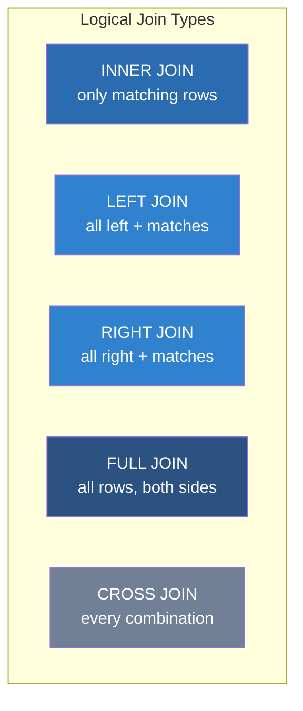
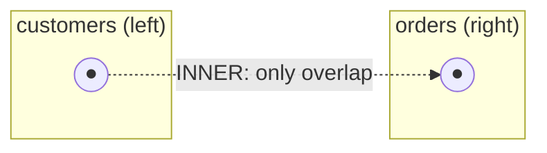
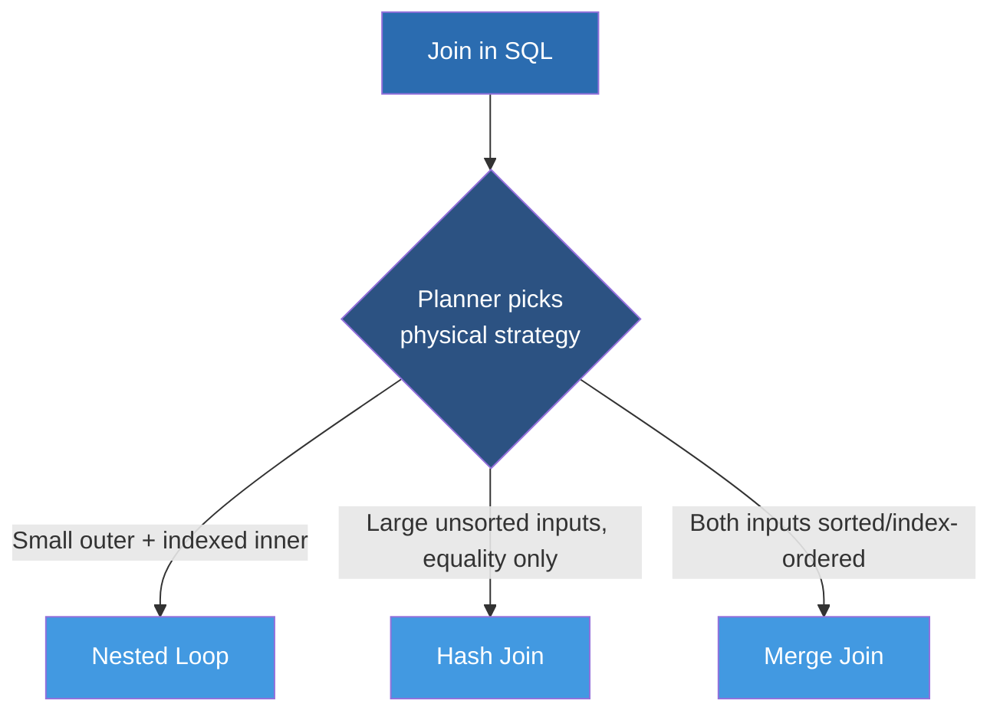

# Level 5 — Joins

*(Based on official PostgreSQL documentation, current stable series: PostgreSQL 18.)*

## 1. Learning Objectives

* **What you'll learn**: Every join type PostgreSQL supports — `INNER`, `LEFT`, `RIGHT`, `FULL`, `CROSS`, `SELF`, `NATURAL`, and `LATERAL` — what each one logically produces, and (just as important) which *physical* join algorithm (nested loop, hash join, merge join) the planner picks to execute it.
* **Why it matters**: Joins are where query correctness and query performance most often diverge — a join that's logically correct can still be catastrophically slow if the planner is forced into the wrong physical strategy (usually due to a missing index or bad statistics). Understanding both the logical join type *and* the physical execution strategy is what separates "the query returns the right rows" from "the query returns the right rows in 3ms instead of 30 seconds."

---

## 2. Topics Covered

* INNER JOIN
* LEFT JOIN
* RIGHT JOIN
* FULL JOIN
* CROSS JOIN
* SELF JOIN
* NATURAL JOIN
* LATERAL JOIN

---

## 3. Join Types — Venn Diagram Overview





**Set-logic summary (using `customers` as left, `orders` as right, joined on `customers.id = orders.customer_id`):**

| Join Type | Rows Returned |
|---|---|
| `INNER JOIN` | Only customers that have at least one order, paired with each matching order |
| `LEFT JOIN` | Every customer, even those with zero orders (order columns are `NULL` for them) |
| `RIGHT JOIN` | Every order, even ones referencing a customer that's since been deleted, if the FK allows it (order columns are `NULL`-padded on the customer side only if not matched) |
| `FULL JOIN` | Every customer AND every order — matched where possible, `NULL`-padded on whichever side has no match |
| `CROSS JOIN` | Every customer paired with every order — the full Cartesian product, no `ON` condition at all |

---

## 4. Deep Dive: Each Join Type

### 4.1 INNER JOIN

```sql
SELECT users.name, orders.total
FROM users
INNER JOIN orders ON users.id = orders.user_id;
```
Returns only rows where the join condition matches on **both** sides. This is the default join type — writing `FROM a JOIN b ON ...` without a qualifier means `INNER JOIN`.

### 4.2 LEFT JOIN (LEFT OUTER JOIN)

```sql
SELECT c.name, o.total
FROM customers c
LEFT JOIN orders o ON o.customer_id = c.id;
```
Returns every row from the left table, with `NULL`s filling in the right side's columns where there's no match. The most common join in reporting queries — "show me all customers, including ones who haven't ordered yet."

### 4.3 RIGHT JOIN (RIGHT OUTER JOIN)

```sql
SELECT c.name, o.total
FROM customers c
RIGHT JOIN orders o ON o.customer_id = c.id;
```
The mirror image of `LEFT JOIN` — returns every row from the right table. In practice, most teams standardize on always writing `LEFT JOIN` and simply swapping table order, since `RIGHT JOIN` is logically redundant with a re-ordered `LEFT JOIN` and mixing both styles in a codebase makes queries harder to scan quickly.

### 4.4 FULL JOIN (FULL OUTER JOIN)

```sql
SELECT c.name, o.total
FROM customers c
FULL JOIN orders o ON o.customer_id = c.id;
```
Returns every row from **both** tables, matched where possible and `NULL`-padded on whichever side lacks a match. Common in reconciliation/diffing use cases — e.g., "show me every mismatch between system A's and system B's records."

### 4.5 CROSS JOIN

```sql
SELECT sizes.size, colors.color
FROM sizes
CROSS JOIN colors;
```
No `ON` condition — produces the full Cartesian product (every row from the left paired with every row from the right). Legitimate use cases are narrow: generating combinations (e.g., all size × color product variant combinations), or generating a date-series calendar table cross-joined against dimensions.

### 4.6 SELF JOIN

```sql
-- Find employees and their managers, both stored in the same 'employees' table
SELECT e.name AS employee, m.name AS manager
FROM employees e
LEFT JOIN employees m ON e.manager_id = m.id;
```
Not a distinct SQL keyword — it's simply a regular join where a table is joined against itself, using table aliases to distinguish the two "roles" the same table plays (e.g., employee vs. manager, both being rows in the same `employees` table).

### 4.7 NATURAL JOIN

```sql
-- Automatically joins on all identically-named columns in both tables
SELECT * FROM orders NATURAL JOIN customers;
```
Automatically joins on every column that shares the same name in both tables, without an explicit `ON` clause. **Generally discouraged in production code**: if either table later gains a new column that happens to share a name with a column in the other table (e.g., both tables get an unrelated `updated_at` column), the join condition silently changes — a landmine for future schema evolution. Explicit `JOIN ... ON` (or `USING (column)` when you deliberately want name-based joining on a *specific* column) is the safer, more maintainable choice.

### 4.8 LATERAL JOIN

```sql
-- Get the Top 3 most recent purchases FOR EACH customer
SELECT c.name, recent_purchases.*
FROM customers c
CROSS JOIN LATERAL (
    SELECT total, created_at
    FROM orders o
    WHERE o.customer_id = c.id
    ORDER BY created_at DESC
    LIMIT 3
) AS recent_purchases;
```
`LATERAL` allows a subquery on the right side of a join to **reference columns from tables on the left side** — something an ordinary subquery cannot do. This is what makes "top N per group" queries possible in a single SQL statement: without `LATERAL`, there's no way to say "for each customer row, run this correlated subquery with a `LIMIT`."

---

## 5. Comparison Tables

### 5.1 Logical Join Type Comparison

| Join Type | Keeps unmatched left rows? | Keeps unmatched right rows? | Requires `ON`/`USING`? | Typical Use Case |
|---|---|---|---|---|
| `INNER JOIN` | No | No | Yes | "Only rows that exist in both tables" |
| `LEFT JOIN` | Yes | No | Yes | "All of table A, with related data if it exists" |
| `RIGHT JOIN` | No | Yes | Yes | Rare in practice — equivalent to a reordered `LEFT JOIN` |
| `FULL JOIN` | Yes | Yes | Yes | Reconciliation/diffing between two datasets |
| `CROSS JOIN` | N/A (all rows always kept) | N/A | No | Generating combinations, calendar/dimension tables |
| `SELF JOIN` | Depends on inner/left/etc. used | Depends | Yes | Hierarchical data (manager/employee), comparing rows within the same table |
| `NATURAL JOIN` | Depends on inner/left/etc. used | Depends | No (implicit, by matching column names) | Rare in production — implicit and schema-fragile |
| `LATERAL JOIN` | Depends on `CROSS`/`LEFT` used | N/A | Yes | Top-N-per-group, and any subquery needing to reference the outer row |

### 5.2 Physical Join Algorithms (What the Planner Actually Runs)

Regardless of which *logical* join type you write, PostgreSQL's planner picks one of three *physical* algorithms to execute it:

| Algorithm | How It Works | Best When | Complexity |
|---|---|---|---|
| **Nested Loop** | For each row in the outer table, scan (or index-probe) the inner table for matches | Small outer table, or a good index exists on the inner table's join column | O(N × M) worst case, O(N × log M) with an index |
| **Hash Join** | Builds an in-memory hash table from the smaller input, then probes it once per row of the larger input | Large, unsorted inputs with no useful index; equality join conditions only | O(N + M), but memory-bound by `work_mem` |
| **Merge Join** | Both inputs are sorted (or already arrive sorted from an index) on the join key, then merged in one linear pass | Both inputs already sorted (e.g., via an index) on the join column | O(N + M) given pre-sorted input, plus sort cost otherwise |



You never write "use a hash join" in SQL — the planner decides based on table sizes, available indexes, and estimated selectivity from `pg_statistic`. This is exactly why `EXPLAIN ANALYZE` matters so much for join-heavy queries: the *logical* join type is under your control, but the *physical* strategy (and therefore most of the performance) is under the planner's control, informed by your indexes and up-to-date statistics.

---

## 6. Production Usage Scenarios (Real-World Examples)

### Scenario: INNER JOIN
**Context**: An analytics service computes total revenue per product, joining `order_items` to `products`, across a table with hundreds of millions of rows.
**The Problem**: Naively joining without supporting indexes forces the planner into an expensive Hash Join that must build a full in-memory hash table from one side, or worse, a Nested Loop with a sequential inner scan repeated for every outer row.
**The PostgreSQL Solution**: Index the foreign key column (`order_items(product_id)`) so the planner can choose an efficient Nested Loop with an index probe, or a Merge Join if both sides can be scanned in sorted order — verified with `EXPLAIN ANALYZE` to confirm the chosen physical strategy matches expectations at production data volume.

### Scenario: LEFT JOIN
**Context**: A customer success dashboard needs to show *every* customer, including brand-new ones who haven't placed an order yet, alongside their order count.
**The Problem**: An `INNER JOIN` would silently drop every customer with zero orders from the report — exactly the customers the success team most needs to see (they're the churn/onboarding risk).
**The PostgreSQL Solution**: `LEFT JOIN orders o ON o.customer_id = c.id` combined with `COUNT(o.id)` (which correctly counts zero for unmatched rows, unlike `COUNT(*)`) keeps every customer in the result set, with `NULL`/zero order data for those without orders.

### Scenario: RIGHT JOIN
**Context**: A data migration verification script needs to confirm every row in a legacy `orders` table has a corresponding row in the new `customers` table after a migration.
**The Problem**: Team members write both `LEFT JOIN` and `RIGHT JOIN` inconsistently across different scripts, making it harder to quickly tell, at a glance, which table is the "must keep every row" side of any given query.
**The PostgreSQL Solution**: The team adopts a convention of always using `LEFT JOIN` (reordering tables in the `FROM` clause as needed) instead of ever writing `RIGHT JOIN`, since the two are logically interchangeable — this is itself the "production solution": standardizing for readability, not a performance difference (the planner treats them identically once parsed).

### Scenario: FULL JOIN
**Context**: A finance team needs to reconcile transactions recorded in an internal ledger table against transactions reported by a third-party payment processor, to find discrepancies in either direction.
**The Problem**: Neither an `INNER JOIN` (which hides all discrepancies) nor a one-sided `LEFT`/`RIGHT JOIN` (which only shows discrepancies in one direction) is sufficient — the team needs to see transactions present in the ledger but missing from the processor's report, *and* transactions in the processor's report missing from the ledger, in one pass.
**The PostgreSQL Solution**: `FULL JOIN` on the transaction reference ID, with a `WHERE ledger.id IS NULL OR processor.id IS NULL` filter afterward, surfaces exactly the mismatches in both directions in a single query, which is the core mechanism behind the team's daily reconciliation job.

### Scenario: CROSS JOIN
**Context**: An inventory system needs to pre-generate every valid size × color combination row for a new product line before actual stock is entered.
**The Problem**: Manually inserting every combination by hand doesn't scale as the number of sizes and colors grows, and is error-prone (easy to miss a combination).
**The PostgreSQL Solution**: `SELECT s.size, c.color FROM sizes s CROSS JOIN colors c WHERE s.product_line_id = c.product_line_id` generates the complete combination set programmatically in one query — a deliberate, well-scoped use of the Cartesian product rather than an accidental one (accidental cross joins, from a forgotten `ON` clause, are a classic production incident).

### Scenario: SELF JOIN
**Context**: An org chart feature needs to show each employee alongside their direct manager's name, where both are rows in the same `employees` table.
**The Problem**: Without a way to treat the same table as two logically distinct roles in one query, the application would need to fetch employees and managers in two separate round trips and stitch them together in application code.
**The PostgreSQL Solution**: A self join (`employees e LEFT JOIN employees m ON e.manager_id = m.id`) resolves the entire hierarchy relationship in a single query and single round trip, with `LEFT JOIN` (rather than `INNER`) ensuring the CEO (who has no manager) still appears in the results.

### Scenario: NATURAL JOIN
**Context**: A junior engineer on the team used `NATURAL JOIN` in a report query for convenience, since both tables happened to share an `id` and `updated_at` column.
**The Problem**: Months later, an unrelated migration added an `updated_at` column to one of the tables for audit purposes — `NATURAL JOIN` silently began joining on `updated_at` in addition to the intended key, corrupting the report's results with no error or warning.
**The PostgreSQL Solution**: The team's code-review standard now explicitly forbids `NATURAL JOIN` in production code, requiring explicit `JOIN ... ON` (or `USING` for a single deliberately-shared key) so join conditions are stable and visible in the query text regardless of future, unrelated schema changes.

### Scenario: LATERAL JOIN
**Context**: A customer-facing "recent activity" feed needs each customer's 3 most recent purchases, for thousands of customers on one dashboard page.
**The Problem**: The naive application-level approach queries "get top 3 orders" once per customer in a loop — a textbook N+1 query problem that becomes untenable as the customer list grows past a few dozen.
**The PostgreSQL Solution**: A single query using `CROSS JOIN LATERAL (SELECT ... ORDER BY created_at DESC LIMIT 3)` lets the database compute the correlated "top 3 per customer" result set entirely inside one query and one round trip, backed by an index on `orders(customer_id, created_at DESC)` so each per-customer lookup inside the lateral subquery is an efficient index scan rather than a per-customer sequential scan.

---

## 7. Code & Query Implementation

### 🔹 Basic Implementation
```sql
-- Standard Inner Join
SELECT users.name, orders.total
FROM users
INNER JOIN orders ON users.id = orders.user_id;

-- LEFT JOIN: include customers with zero orders
SELECT c.name, COUNT(o.id) AS order_count
FROM customers c
LEFT JOIN orders o ON o.customer_id = c.id
GROUP BY c.name;

-- SELF JOIN: employees and their managers
SELECT e.name AS employee, m.name AS manager
FROM employees e
LEFT JOIN employees m ON e.manager_id = m.id;
```

### 🔹 Advanced / Optimized Implementation
```sql
-- LATERAL JOIN: Get the Top 3 most recent purchases FOR EACH customer
SELECT c.name, recent_purchases.*
FROM customers c
CROSS JOIN LATERAL (
    SELECT total, created_at
    FROM orders o
    WHERE o.customer_id = c.id
    ORDER BY created_at DESC
    LIMIT 3
) AS recent_purchases;

-- FULL JOIN reconciliation: find mismatches in either direction
SELECT
    l.txn_id AS ledger_txn,
    p.txn_id AS processor_txn
FROM ledger l
FULL JOIN processor_report p ON l.txn_id = p.txn_id
WHERE l.txn_id IS NULL OR p.txn_id IS NULL;

-- Supporting index for the LATERAL join above
CREATE INDEX idx_orders_customer_created
  ON orders (customer_id, created_at DESC);
```

---

## 8. Internals & Under the Hood

**How PostgreSQL engine processes this (Parser → Planner → Executor)**
* The **Parser** turns each `JOIN` into a node in the parse tree representing the logical relationship (inner/left/right/full/cross), preserving the `ON`/`USING` condition.
* The **Planner** is where the real work happens for joins: it estimates the number of rows each table/filter will produce (from `pg_statistic`, refreshed by `ANALYZE`), evaluates multiple possible **join orders** (especially for 3+ table joins — this is combinatorial and why very large multi-way joins can hit `join_collapse_limit`/`from_collapse_limit` search-space controls), and picks a physical algorithm (Nested Loop, Hash Join, or Merge Join) for each join based on the cheapest estimated total cost.
* The **Executor** runs the chosen physical plan bottom-up. For `LATERAL`, the executor literally re-evaluates the lateral subquery once per outer row, passing the outer row's values in as parameters each time — this is why a supporting index on the lateral subquery's filter/order columns matters so much: without one, "once per outer row" becomes "one sequential scan per outer row," which is the exact N+1 problem `LATERAL` was meant to solve, just moved inside the database instead of eliminated.

**Storage impact: WAL, Heap, and TOAST**
* Joins are a read-path operation and generate no WAL on their own (WAL only applies to writes) — but a `Hash Join`'s hash table, if it exceeds `work_mem`, spills batches to temporary files on disk (visible as `temp_files`/`temp_bytes` in `pg_stat_database` and in `EXPLAIN (ANALYZE, BUFFERS)` output), which is a real disk I/O cost even though it isn't WAL.
* Wide `text`/`jsonb` columns pulled through a join (especially in the `SELECT` list of a large multi-table join) may require TOAST detoasting once per matched row — selecting only the columns you actually need, rather than `SELECT *` across a join, reduces this cost meaningfully at scale.

---

## 9. Performance & Benchmarking

**`EXPLAIN ANALYZE` impacts**
```sql
EXPLAIN ANALYZE
SELECT c.name, o.total
FROM customers c
JOIN orders o ON o.customer_id = c.id
WHERE o.placed_at >= '2026-01-01';
```
* Check which physical algorithm was chosen (`Nested Loop`, `Hash Join`, `Merge Join`) and whether the *estimated* row counts (`rows=`) are close to the *actual* row counts (`actual ... rows=`) — a large mismatch between estimated and actual is the single most common reason the planner picks a bad physical strategy, and usually means stale statistics (run `ANALYZE`) or an overly complex predicate the planner can't estimate well.
* For `LATERAL` joins specifically, confirm the inner subquery shows up as an `Index Scan` (using a supporting composite index), not a `Seq Scan` repeated once per outer row.

### Performance Improvement Tips

| Tip | Why It Helps |
|---|---|
| Index every foreign key column used in a join condition | Enables Nested Loop with an index probe instead of a full scan of the inner table per outer row |
| Run `ANALYZE` after large data loads before relying on join performance | The planner's join-order and algorithm choice depends entirely on accurate row-count/selectivity statistics |
| Avoid `SELECT *` across multi-table joins | Reduces TOAST detoasting cost and the amount of data shuffled through hash/merge join buffers |
| Add a composite index matching a `LATERAL` subquery's filter + order columns | Turns "one sequential scan per outer row" into "one index scan per outer row" — the difference between `LATERAL` being fast and being an accidental N+1 in disguise |
| Prefer explicit `JOIN ... ON`/`USING` over `NATURAL JOIN` | Keeps join conditions stable and visible in the query text, immune to future unrelated schema changes |
| For reconciliation-style `FULL JOIN`s, filter early where possible (e.g., a date range) before the full join | Full joins over unfiltered large tables are among the most expensive join patterns; narrowing both sides first reduces the join's input size dramatically |
| Watch `work_mem` for Hash Join-heavy workloads | A Hash Join whose build side doesn't fit in `work_mem` spills to disk in batches — visible as `temp_bytes` in `EXPLAIN (ANALYZE, BUFFERS)` — which is much slower than an in-memory hash |

**Memory vs. disk trade-offs**
* A Hash Join trades memory (`work_mem`) for speed by building the smaller side's hash table in memory; when the build side doesn't fit, Postgres uses a batched, disk-spilling hybrid hash join algorithm — still correct, but with real disk I/O overhead per batch.
* A Merge Join avoids extra memory for a hash table entirely, but requires both inputs sorted — either via a supporting index (free) or an explicit `Sort` node (which itself needs `work_mem`, and spills to disk under the same conditions as an `ORDER BY` sort from Level 4).
* A Nested Loop with an index-scanned inner side uses very little memory per row but performs many small, potentially-random index lookups — excellent when the outer side is small, poor when the outer side is large and the inner lookups aren't well-cached.

---

## 10. Best Practices & Common Mistakes

* ✅ **Do**: Follow standard PostgreSQL conventions — index foreign key join columns, prefer explicit `JOIN ... ON` over `NATURAL JOIN`, and standardize on `LEFT JOIN` over `RIGHT JOIN` for team readability.
* ❌ **Don't**: Ignore index overhead or transaction locking — an unindexed join column doesn't just slow down `SELECT`s, it also slows down any `DELETE`/`UPDATE` cascade logic that depends on the same relationship.
* ⚠️ **Common Mistake**: N+1 queries — fetching a parent row, then looping in application code to fetch each related child row individually, instead of a single `JOIN` or `LATERAL` query; missing indexes on the relevant foreign keys make each of the N queries slow on top of there being N of them in the first place.
* ⚠️ **Common Mistake**: An accidental `CROSS JOIN` from a forgotten `ON`/`WHERE` condition — two tables of even moderate size (10,000 × 10,000) silently produce 100 million rows, which can take down a production database or an application server trying to materialize the result.
* ⚠️ **Common Mistake**: Using `COUNT(*)` instead of `COUNT(column)` after a `LEFT JOIN` when trying to count matched rows only — `COUNT(*)` counts the `NULL`-padded row itself (as 1), while `COUNT(o.id)` correctly counts 0 for unmatched left rows.

---

## 11. Interview Questions

1. **Beginner**: Explain the difference between `INNER JOIN` and `LEFT JOIN` to a junior dev, with an example of when each is the right choice.
2. **Beginner**: What does `CROSS JOIN` do, and what's a legitimate production use case for it versus an accidental, buggy one?
3. **Intermediate**: How would you optimize a slow multi-table join query, and what specifically would you check in `EXPLAIN ANALYZE` output?
4. **Intermediate**: Why is `NATURAL JOIN` generally discouraged in production code, and what would you use instead?
5. **Intermediate**: What problem does `LATERAL JOIN` solve that a regular subquery in the `FROM` clause cannot, and what's a concrete example?
6. **Expert**: Describe the three physical join algorithms PostgreSQL's planner can choose (Nested Loop, Hash Join, Merge Join) — under what conditions does the planner favor each, and what statistics does it rely on to decide?
7. **Expert**: Explain what happens when a Hash Join's build-side hash table doesn't fit in `work_mem` — how does PostgreSQL's batched hybrid hash join algorithm handle this, and what does that look like in `EXPLAIN (ANALYZE, BUFFERS)` output?
8. **Expert**: Describe the low-level execution behavior of a `LATERAL` join in a high-concurrency environment — specifically, how the executor re-evaluates the lateral subquery per outer row, why a supporting index on the subquery's filter/order columns is critical to avoid it degrading into a per-row sequential scan, and how this compares to the cost profile of an equivalent N+1 application-level query pattern.

---

*Primary sources: PostgreSQL Official Documentation (postgresql.org/docs) — chapters on Queries (Joins between Tables), the `SELECT` reference page (`LATERAL` subqueries), and Query Planning (join order and physical join strategies).*