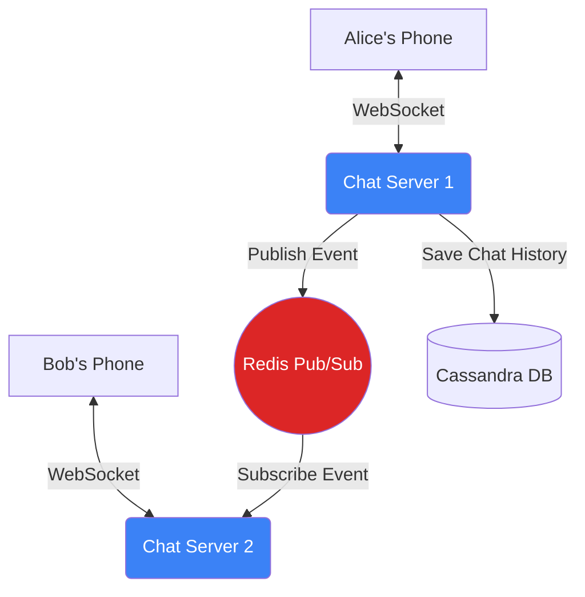

# System Design: Chat System (WhatsApp / Discord)

## 1. Learning Objectives
* **What you'll learn**: How to architect a real-time, low-latency messaging system handling millions of concurrent users using WebSockets, Message Brokers, and Go's concurrency model.
* **Why it matters**: Stateful systems (like WebSockets) break traditional load balancing and deployment rules. Mastering chat design proves you understand stateful scaling, TCP connections, and distributed pub/sub.
* **Where it's used**: WhatsApp, Discord, Slack, Twitch chat, and live customer support widgets.

---

## 2. Real-world Story
Imagine a massive telephone exchange in the 1920s. 
If Alice wants to talk to Bob, the operator literally plugs a physical wire connecting Alice's line directly to Bob's line. This is a **WebSocket**.
But what if Bob is offline? The operator writes Alice's message on a sticky note and puts it in Bob's mailbox (A Database). When Bob connects the next day, the operator hands him the sticky note. 

---

## 3. Visual Learning (Execution Flow & Architecture)


---

## 4. Internal Working (Under the Hood)
Traditional REST APIs are **Stateless** (Client asks, Server answers, Connection closes).
Chat systems are **Stateful**. The client opens a TCP WebSocket connection and keeps it open for hours. 
The Go server must hold this TCP connection in RAM. When a message arrives for the user, the server actively *pushes* the data down the open socket. No polling required!

---

## 5. Compiler Behavior
* **Goroutine per Connection**: In Node.js, holding 1 million WebSockets in an Event Loop causes massive latency spikes. In Go, you spawn a dedicated Goroutine for every single connected user (`go readPump()`, `go writePump()`). A sleeping Goroutine consumes only ~2KB of RAM. Go can comfortably hold 1,000,000 concurrent WebSockets on a single modern server!

---

## 6. Memory Management
* **Channel Leaks**: If Bob disconnects his phone (loses Wi-Fi), but the Go server doesn't detect it, the Go server will try to push a message into Bob's channel. If the channel blocks, the Goroutine hangs forever (Goroutine Leak), eventually crashing the server with an Out Of Memory (OOM) error. You MUST use strict `select` statements with timeouts when writing to client channels.

---

## 7. Code Examples

### 🔹 Example 1: The WebSocket Upgrade
```go
import "github.com/gorilla/websocket"

var upgrader = websocket.Upgrader{
    CheckOrigin: func(r *http.Request) bool { return true },
}

func ChatHandler(w http.ResponseWriter, r *http.Request) {
    // Upgrades the HTTP GET request to a persistent TCP WebSocket!
    conn, err := upgrader.Upgrade(w, r, nil)
    if err != nil { return }
    
    // Spawn Goroutines to handle this specific user's I/O
    go readMessages(conn)
}
```

### 🔹 Example 2: Inter-Server Routing (Pub/Sub)
```go
// What if Alice is on Chat Server 1, and Bob is on Chat Server 2?
// Server 1 cannot write to Bob's socket! It must use Redis Pub/Sub.

func AliceSendsMessage(msg string) {
    // 1. Save to Database for persistence
    db.Save(msg)
    
    // 2. Publish to Redis channel "user:bob"
    redisClient.Publish(ctx, "channel:bob", msg)
}

// On Server 2 (Where Bob is connected)
func ListenForBob() {
    pubsub := redisClient.Subscribe(ctx, "channel:bob")
    for msg := range pubsub.Channel() {
        // Push the message down Bob's open WebSocket!
        bobsWebSocket.WriteMessage(websocket.TextMessage, []byte(msg.Payload))
    }
}
```

### 🔹 Example 3: Advanced (Heartbeats)
```go
// Detecting dead Wi-Fi connections
func readPump(conn *websocket.Conn) {
    conn.SetReadDeadline(time.Now().Add(60 * time.Second))
    
    // The Client must send a "PING" every 30 seconds.
    // If they do, we extend the deadline. If not, the read fails and we close the socket!
    conn.SetPingHandler(func(string) error {
        conn.SetReadDeadline(time.Now().Add(60 * time.Second))
        return nil
    })
    
    // ... read loop
}
```

### 🔹 Example 4: Production (Presence Service)
```go
// How do you show the "Online" Green Dot next to Bob's name?
// When Bob connects, we set a Redis key with a 60-second TTL.
redisClient.Set(ctx, "presence:bob", "online", 60*time.Second)

// A background Goroutine refreshes this TTL every 30 seconds.
// If Bob crashes, the TTL expires, and the Green Dot disappears globally!
```

### 🔹 Example 5: Interview
```go
// Q: Why is a traditional SQL database bad for 1-to-1 Chat History?
// A: Chat is a massive, append-only, time-series data set. There are no complex JOINs. 
// Billions of messages are sent daily. A NoSQL wide-column store like Cassandra is 
// vastly superior for extreme write-throughput and sequential reads.
```

---

## 8. Production Examples
1. **Discord**: Discord uses Elixir/Erlang for its massive WebSocket gateway (handling 10M+ concurrent users) and Go for its backend microservices, heavily leveraging ScyllaDB (C++ Cassandra rewrite) to store trillions of messages.
2. **Push Notifications**: If Bob is completely offline (no WebSocket), the Go server detects this and sends the payload to Apple Push Notification Service (APNS) or Firebase (FCM) to wake up Bob's locked phone.

---

## 9. Performance & Benchmarking
* **The Thundering Herd**: When a popular Twitch Streamer goes offline, 100,000 users all disconnect and try to reconnect to a different server simultaneously. This massive spike in TLS handshakes will melt the CPU of your API Gateway. You must implement a "Jitter" in your frontend reconnection logic (wait random 1-10 seconds before reconnecting).

---

## 10. Best Practices
* ✅ **Do**: Use a globally distributed ID generator (like Snowflake ID or Go's `sonyflake`). You cannot use Database Auto-Increment for chat messages at 100,000 Writes/Sec!
* ❌ **Don't**: Send the entire message history payload over the WebSocket when the user connects. WebSockets are for real-time events. The client should fetch the historical chat history via a standard HTTP REST API, and only use WebSockets for new incoming messages.
* 🏢 **Google / Uber / Netflix Style**: Separate the architecture into two distinct layers. The **Gateway Layer** (dumb servers that just hold 1M WebSockets and do nothing else) and the **Logic Layer** (Standard Go HTTP APIs that actually process the text, check for profanity, and save to DB).

---

## 11. Common Mistakes
1. **Unbounded Buffers**: Creating a Go channel `make(chan Message, 1000)` for a user. If the user is on 3G internet, they can't download messages fast enough. The channel fills up, blocks the server, and wastes RAM. If a user is too slow, proactively disconnect them!
2. **Sticky Sessions**: Configuring your Load Balancer to route Bob to Server 1 every time. This is dangerous for scaling. WebSockets naturally remain sticky because the TCP connection is persistent. Just use standard Round-Robin load balancing for the initial handshake.

---

## 12. Debugging
How to troubleshoot Chat Systems:
* **TCP Connection Limits**: The Linux OS places a hard limit on open files (Sockets are files). If your Go server crashes at exactly 65,535 connected users, you forgot to increase the `ulimit -n` and `sysctl fs.file-max` on the Linux host!

---

## 13. Exercises
1. **Easy**: Write a Go HTTP server that accepts a WebSocket connection and echoes the message back to the client.
2. **Medium**: Implement a `Hub` struct in Go that holds a `map[*websocket.Conn]bool`. When any user sends a message, iterate over the map and broadcast the message to all connected users (A Chat Room).
3. **Hard**: Add Redis Pub/Sub to your Hub so that you can run TWO instances of your Go app, and users on Server 1 can chat with users on Server 2.
4. **Expert**: Implement the Heartbeat (Ping/Pong) mechanism to aggressively close dead connections and free up RAM.

---

## 14. Quiz
1. **MCQ**: What data structure is best for storing 1-to-1 chat history?
   * (A) PostgreSQL Relational Tables (B) NoSQL Wide-Column (Cassandra) (C) Redis In-Memory. *(Answer: B. Redis is too expensive to store 10 years of history in RAM. Postgres struggles with billions of inserts).*
2. **System Design Follow-up**: How do you implement "Message Read Receipts" (The double blue checkmarks in WhatsApp)? *(When Bob reads the message, his client sends a `ReadEvent(MsgID)` over his WebSocket. The server routes this event via Pub/Sub to Alice's WebSocket. Alice's UI updates the checkmark to blue).*

---

## 15. FAANG Interview Questions
* **Beginner**: Explain the difference between HTTP Long-Polling and WebSockets.
* **Intermediate**: How do you guarantee the chronological order of messages in a distributed chat room if they are processed by different servers? (Hint: Snowflake IDs containing timestamps).
* **Senior (Google/Meta)**: Architect WhatsApp's End-to-End Encryption (E2EE). If the Go server cannot read the messages to scan for profanity, how is the payload routed? (Hint: The Signal Protocol. The Go server just routes encrypted binary blobs).

---

## 16. Mini Project
**The Distributed Terminal Chat**
* Build a Go CLI chat client.
* Build a Go WebSocket server using `gorilla/websocket`.
* Run 3 instances of the server locally.
* Use Redis Pub/Sub to link them.
* Open 3 different terminal windows, connect them to different ports, and verify they can seamlessly chat with each other!

---

## 17. Enterprise Features & Observability
* **Message Delivery Semantics**: Enterprise systems require "Exactly-Once" semantics. When Bob opens his app, he sends a `SyncRequest(LastMsgID)`. The Go server fetches all messages > `LastMsgID` from Cassandra and pushes them. This guarantees Bob never misses a message, even if his phone was off for a week.

---

## 18. Source Code Reading
Walkthrough of `github.com/gorilla/websocket/examples/chat`.
* **The Hub Pattern**: The official Gorilla examples demonstrate the industry-standard Go pattern for Chat: A central `Hub` struct running in a `select` loop that safely multiplexes concurrent `register`, `unregister`, and `broadcast` channels without requiring a single `sync.Mutex`.

---

## 19. Architecture
* **Stateful Deployments**: You cannot do a standard K8s "Rolling Update" on a WebSocket server! If you kill Server A, you instantly drop 500,000 TCP connections, DDOSing Server B when they all reconnect. You must drain connections slowly over hours, or gracefully migrate state.

---

## 20. Summary & Cheat Sheet
* **Protocol**: WebSockets (Persistent TCP).
* **Routing**: Redis Pub/Sub (for Inter-Server communication).
* **Storage**: Cassandra (Append-only time series).
* **Go Edge**: 1 Goroutine per client makes I/O management incredibly simple compared to Node.js.
