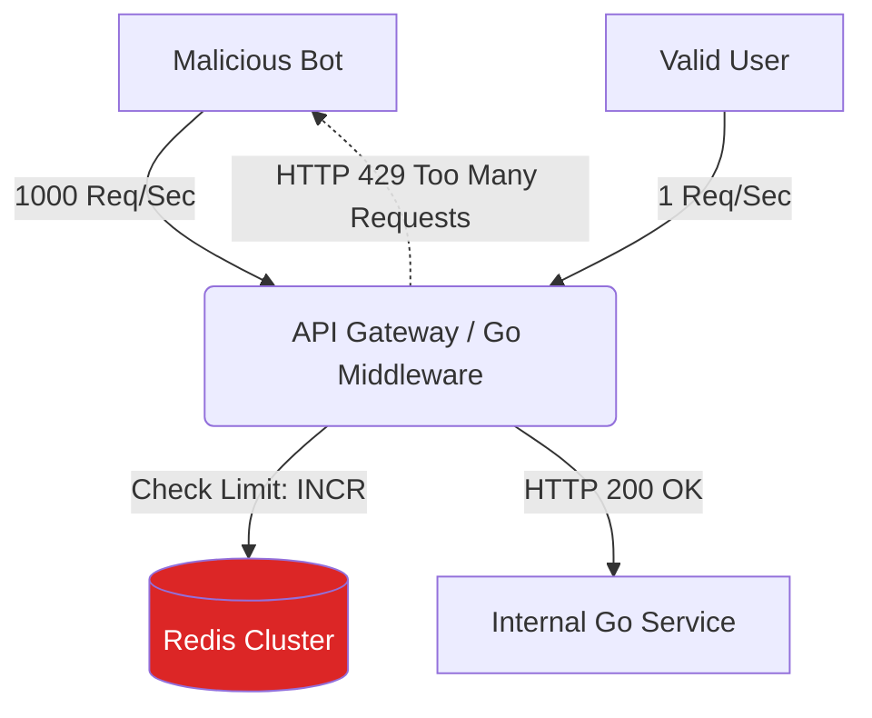

# System Design: Rate Limiter

## 1. Learning Objectives
* **What you'll learn**: How to design a distributed Rate Limiter to protect Go APIs from DDoS attacks and brute-force scraping using Redis and Token Bucket algorithms.
* **Why it matters**: A single malicious script can send 100,000 requests per second to your database, bankrupting your cloud budget and crashing the server. You MUST drop bad traffic at the edge.
* **Where it's used**: API Gateways (Kong, Nginx), Stripe (billing limits), Twitter (tweet limits), and GitHub API limits.

---

## 2. Real-world Story
Imagine a popular nightclub with a strict bouncer. 
The club can only hold 100 people (The Database). If 5,000 people rush the door at once, people will get crushed. 
The Bouncer (Rate Limiter) stands at the door with a bucket of tickets. He is given 10 new tickets every minute. If you want to enter, you must take a ticket. If the bucket is empty, he says "HTTP 429: Too Many Requests, come back later." The club inside remains perfectly peaceful and functional.

---

## 3. Visual Learning (Execution Flow & Architecture)


---

## 4. Internal Working (Under the Hood)
There are 4 main algorithms for Rate Limiting:
1. **Fixed Window**: Counters reset exactly at 12:00, 12:01. (Flaw: Spikes at the boundaries).
2. **Sliding Window Log**: Stores exactly when every request happened. (Flaw: Uses massive amounts of RAM).
3. **Sliding Window Counter**: A mathematical hybrid of 1 and 2.
4. **Token Bucket**: The industry standard (used by Amazon/Stripe). You get a bucket of X tokens. It refills at a rate of Y tokens per second. Every request costs 1 token.

---

## 5. Compiler Behavior
* **Mutex Contention**: If you implement an in-memory Rate Limiter in Go using a `map[string]int` (mapping IP addresses to request counts), you MUST use a `sync.RWMutex`. If 50,000 Goroutines try to lock the exact same Mutex for a single IP address, your Go server will suffer massive lock contention and CPU thrashing!

---

## 6. Memory Management
* **Distributed State**: An in-memory Go limiter only protects ONE server. If you have 10 Go servers behind a Load Balancer, a hacker can hit all 10 servers, bypassing your local limit by 10x! You MUST use a centralized, extremely fast datastore (Redis) so all 10 Go servers share the exact same global token bucket.

---

## 7. Code Examples

### 🔹 Example 1: Local Rate Limiting (golang.org/x/time/rate)
```go
import "golang.org/x/time/rate"

// Creates a Token Bucket that refills 1 token per second, holding a max of 5 tokens.
var limiter = rate.NewLimiter(1, 5)

func APIHandler(w http.ResponseWriter, r *http.Request) {
    // Attempt to take 1 token from the bucket
    if !limiter.Allow() {
        http.Error(w, "429 Too Many Requests", http.StatusTooManyRequests)
        return
    }
    
    w.Write([]byte("Success!"))
}
```

### 🔹 Example 2: Distributed Fixed Window (Redis INCR)
```go
func RedisRateLimit(ip string) bool {
    // Creates a key like: "rate_limit:192.168.1.1:1689345600" (Unix Minute)
    minuteKey := fmt.Sprintf("rate_limit:%s:%d", ip, time.Now().Unix()/60)
    
    // Atomically increment the counter in Redis
    count, _ := redisClient.Incr(ctx, minuteKey).Result()
    
    if count == 1 {
        // If it's the first request of the minute, set a 60s expiration!
        redisClient.Expire(ctx, minuteKey, 60*time.Second)
    }
    
    // Limit to 100 requests per minute
    return count <= 100
}
```

### 🔹 Example 3: Advanced (Redis EVAL / Lua Scripts)
```go
// Using 2 separate Redis commands (INCR then EXPIRE) is NOT ATOMIC!
// A race condition could cause the key to never expire (Memory Leak).
// You must push a Lua script to Redis to execute both steps perfectly atomically!
var luaScript = redis.NewScript(`
    local count = redis.call("INCR", KEYS[1])
    if count == 1 then
        redis.call("EXPIRE", KEYS[1], ARGV[1])
    end
    return count
`)

// Go executes the script purely on the Redis server in 1 network hop!
count, _ := luaScript.Run(ctx, redisClient, []string{minuteKey}, 60).Int()
```

### 🔹 Example 4: Production (HTTP Headers)
```go
// Always tell the client WHY they were rejected, and WHEN they can retry!
func Reject(w http.ResponseWriter) {
    w.Header().Set("X-RateLimit-Limit", "100")
    w.Header().Set("X-RateLimit-Remaining", "0")
    w.Header().Set("X-RateLimit-Reset", "1689345660") // Unix timestamp to retry
    w.WriteHeader(http.StatusTooManyRequests)
}
```

### 🔹 Example 5: Interview
```go
// Q: What happens to your Go API if the Redis cluster completely crashes?
// A: "Fail Open" vs "Fail Closed". For Rate Limiting, you should Fail Open. 
// If Redis times out, log the error, bypass the rate limiter, and allow the request. 
// It is better to risk higher load than to block 100% of legitimate traffic!
```

---

## 8. Production Examples
1. **Tiered Billing**: Stripe limits free users to 10 requests/sec, and Enterprise users to 100 requests/sec. The Go API extracts the `API_KEY`, fetches the user's Tier from a local cache, and dynamically applies different Redis Token Bucket configurations based on the Tier.
2. **Login Brute-Force**: You must place a strict Rate Limit on `POST /login` (e.g., 5 attempts per minute per IP) to mathematically prevent hackers from guessing passwords using massive botnets.

---

## 9. Performance & Benchmarking
* **Latency Overhead**: Because every single HTTP request requires a Redis network call, Rate Limiting adds ~1ms of latency to your API. To minimize this, ensure the Redis cluster is in the exact same VPC/Subnet as your Go servers!

---

## 10. Best Practices
* ✅ **Do**: Use a fast memory store like Redis or Memcached. Never use PostgreSQL for rate limiting; the write locks will destroy the database.
* ❌ **Don't**: Rate limit purely by IP address for authenticated APIs. 100 real users sitting in a Starbucks share the exact same public IP! Limit by `API_KEY` or `User_ID` when possible.
* 🏢 **Google / Uber / Netflix Style**: Rate limit at the very edge of the network (The API Gateway or Load Balancer). Do not put Rate Limiting logic deep inside your microservices. Drop bad traffic before it even reaches your Go code!

---

## 11. Common Mistakes
1. **Clock Skew**: If using the Fixed Window algorithm based on `time.Now().Unix()`, and your 10 Go servers have slightly different internal clocks (NTP drift), they will generate different Redis keys for the same minute, bypassing the limit.
2. **The Boundary Spike**: In a Fixed Window, a user is allowed 100 requests per minute. They send 100 requests at 12:00:59. The clock rolls over to 12:01:00. They send 100 more requests. They just sent 200 requests in 2 seconds! This is why Token Buckets are superior.

---

## 12. Debugging
How to troubleshoot Rate Limiters:
* **Datadog / Prometheus**: You MUST emit a metric `rate_limit_rejected_total`! If a legitimate marketing campaign goes viral, you will see a massive spike in 429s. You must be able to visually see this and dynamically increase the limit in real-time.

---

## 13. Exercises
1. **Easy**: Write a Go middleware using `golang.org/x/time/rate` to limit an endpoint to 2 req/sec.
2. **Medium**: Test it manually using a web browser. Refresh the page rapidly and watch it return HTTP 429.
3. **Hard**: Spin up Redis via Docker. Implement the Fixed Window counter using Go and `go-redis`.
4. **Expert**: Implement the Redis Lua Script to ensure perfect atomicity. Use `wrk` to benchmark the endpoint with 1,000 concurrent connections.

---

## 14. Quiz
1. **MCQ**: Which rate limiting algorithm allows requests at a mathematically smooth, constant rate?
   * (A) Fixed Window (B) Leaky Bucket (C) Sliding Window Log. *(Answer: B. Leaky Bucket acts like a queue, processing requests exactly at 1 req/sec regardless of burst sizes).*
2. **System Design Follow-up**: How do you prevent a malicious botnet (using 10,000 different IPs) from bypassing your IP-based rate limiter? *(You can't. You must use a WAF (Web Application Firewall) like Cloudflare, which analyzes behavioral patterns, user-agents, and dynamically issues CAPTCHAs).*

---

## 15. FAANG Interview Questions
* **Beginner**: Explain HTTP Status 429.
* **Intermediate**: Contrast the Fixed Window algorithm with the Token Bucket algorithm.
* **Senior (Google/Meta)**: Architect a global Rate Limiter. If a user makes 5 requests in New York, and instantly makes 5 requests in Tokyo, how do you enforce a global limit of 10 without introducing 200ms cross-continent database replication latency? (Hint: Eventual consistency / Local Buckets).

---

## 16. Mini Project
**The Bulletproof Gateway**
* Build a Go API Gateway.
* Expose `GET /slow-data` which takes 1 second to run.
* Wrap it in a Redis Rate Limiter middleware (Max 5 per minute).
* Write a script that hits the API 10 times in 1 second.
* Validate that exactly 5 requests succeed (taking 1s each) and 5 requests fail instantly (taking 1ms each) with `429 Too Many Requests`.

---

## 17. Enterprise Features & Observability
* **Shadow Mode**: Before enforcing a new strict Rate Limit on production users, you deploy it in "Shadow Mode". It calculates if the user *would* have been blocked, and merely logs the event `shadow_block=true` without actually blocking them. This proves your math is safe before enabling it.

---

## 18. Source Code Reading
Walkthrough of `golang.org/x/time/rate`.
* **Locking Efficiency**: Study how the official Go standard library implements the Token Bucket. It uses a `sync.Mutex`, but only holds the lock for a few nanoseconds to do basic arithmetic (calculating time deltas), making it insanely fast for local limits.

---

## 19. Architecture
* **Envoy / Kong**: Instead of writing this in Go, modern architectures use Envoy or Kong API Gateways. You just write a YAML file: `rate_limits: 100/min`, and the Gateway (written in C++ / OpenResty) handles the massive Redis synchronization automatically!

---

## 20. Summary & Cheat Sheet
* **Goal**: Drop excessive traffic at the edge.
* **Storage**: Redis (Distributed) or In-Memory (Local).
* **Algorithm**: Token Bucket (Smooths bursts).
* **Response**: HTTP 429 with `Retry-After` headers.
* **Resiliency**: Fail Open if Redis crashes.
