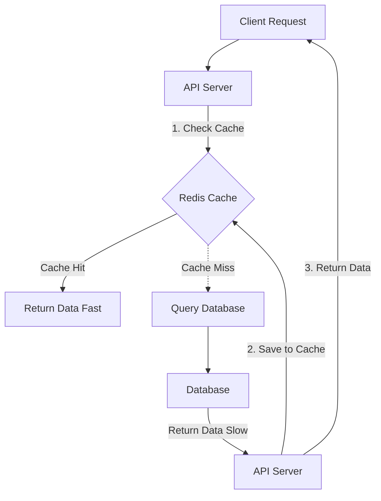

# Distributed Caching: Speeding Up the Web

## 1️⃣ Learning Objectives
* **What you'll learn**: Master the architectures of Memcached and Redis, cache invalidation strategies, and handling the Thundering Herd problem.
* **Why it matters**: Reading from a database takes milliseconds (~10ms). Reading from an in-memory cache takes microseconds (~0.1ms). Caching is the primary weapon for surviving massive traffic spikes.
* **Where it's used**: Session storage, real-time leaderboards, rate limiting, and saving expensive database queries.

---

## 2️⃣ Real-world Story
Imagine a library (Database) where it takes the librarian 10 minutes to walk into the archives, find a specific book, and bring it to you. 
If 50 people ask for the newest Harry Potter book on launch day, the librarian will walk to the archives 50 times. 

A **Cache** is a small display table right next to the front door. The librarian puts the 5 most popular books on that table. When a user walks in and asks for Harry Potter, they instantly grab it from the table. The librarian's workload drops by 90%, and the users get their books instantly!

---

## 3️⃣ Visual Learning (Execution Flow & Architecture)


---

## 4️⃣ Internal Working (Under the Hood)
* **In-Memory Store**: Caches store data entirely in RAM. They bypass the slow disk I/O (Hard Drives/SSDs) that traditional databases like PostgreSQL rely on.
* **Redis**: A single-threaded event loop architecture written in C. Because it never context-switches threads, it completely avoids locks and race conditions internally, allowing it to process 100,000+ operations per second per CPU core.

---

## 5️⃣ Caching Strategies (Cache Writing)
1. **Cache-Aside (Lazy Loading)**: The application checks the cache. If missing, it queries the DB, saves it to the cache, and returns it. Best for read-heavy workloads.
2. **Write-Through**: The application writes data to the Cache AND the DB simultaneously. Slower writes, but guarantees the cache is never stale.
3. **Write-Behind (Write-Back)**: The application writes data ONLY to the cache and instantly returns to the user. An asynchronous worker syncs the cache to the DB later. Insanely fast, but risks data loss if the cache server crashes before syncing.

---

## 6️⃣ Cache Eviction Policies
When RAM gets full, the cache must delete old data to make room for new data.
* **LRU (Least Recently Used)**: Evicts the item that hasn't been requested in the longest time. (Industry standard).
* **LFU (Least Frequently Used)**: Evicts the item that has the lowest total access count.
* **TTL (Time To Live)**: Every item is given a countdown timer (e.g., 60 seconds). When time expires, it auto-deletes.

---

## 7️⃣ Code Examples

### 🔹 Example 1: Cache-Aside Pattern in Go
```go
import "github.com/go-redis/redis/v8"

func GetUserProfile(ctx context.Context, id string) string {
    // 1. Check Redis
    val, err := rdb.Get(ctx, "user:"+id).Result()
    if err == nil {
        return val // Cache HIT!
    }

    // 2. Cache Miss! Query Postgres
    user := queryDatabase(id)

    // 3. Save to Redis with a 5-minute TTL
    rdb.Set(ctx, "user:"+id, user, 5*time.Minute)

    return user
}
```

### 🔹 Example 2: Distributed Rate Limiting
Redis atomic `INCR` prevents race conditions across 50 API Gateways.
```go
func RateLimit(ip string) bool {
    key := "rate:" + ip
    count, _ := rdb.Incr(ctx, key).Result()
    
    if count == 1 {
        rdb.Expire(ctx, key, time.Minute) // Set window to 1 minute
    }
    
    return count <= 100 // Allow 100 requests per minute
}
```

---

## 8️⃣ Production Examples
1. **Twitter Timeline**: Pre-computing and caching the timelines of famous users (like Justin Bieber) in Redis because millions of people read it per second, but he only writes a tweet once a week.
2. **E-commerce Shopping Carts**: Storing active shopping carts in Redis. If the user doesn't checkout in 3 days, the TTL expires and the cart deletes itself automatically.

---

## 9️⃣ Performance & Benchmarking
* **Latency**: Redis operations take `~0.5ms` over the network.
* **Serialization Overhead**: In Go, converting a Struct to JSON (to save in Redis) takes CPU time. For extreme performance, systems use Protobuf or MessagePack instead of JSON before saving to Redis.

---

## 🔟 Best Practices
* ✅ **Do**: Always set a TTL on cached data. Without a TTL, your cache will eventually fill up with stale data and run out of RAM.
* ❌ **Don't**: Cache volatile data that changes every millisecond (like a live stock ticker). Caching is for Read-Heavy, Write-Infrequent data.
* 🏢 **Memcached vs Redis**: Use Memcached if you just want a dumb, simple string cache. Use Redis if you need advanced data structures (Lists, Sets, Sorted Sets for Leaderboards).

---

## 11️⃣ Common Mistakes
1. **The Thundering Herd (Cache Stampede)**: If a highly popular key (e.g., "SuperBowl_Score") expires, 10,000 requests will hit the cache, see a miss, and ALL 10,000 requests will instantly query the database simultaneously, crashing the database.
   * *Fix*: Implement a Distributed Lock. When the cache misses, the first request acquires a lock, queries the DB, and repopulates the cache. The other 9,999 requests wait for the lock and then read from the newly populated cache!

---

## 12️⃣ Debugging
* **Cache Penetration**: Hackers repeatedly requesting data that does NOT exist (e.g., UserID = -999). It misses the cache, hits the DB, misses the DB, and crashes the DB. 
  * *Fix*: Cache the negative result! Store `user:-999 = "null"` in Redis for 60 seconds.

---

## 13️⃣ Exercises
1. **Easy**: Run a Redis docker container and use the `redis-cli` to `SET` and `GET` a key.
2. **Medium**: Implement a Go function that caches a SQL query result using the `go-redis` library.
3. **Hard**: Implement a Mutex Lock around a Cache-Miss to prevent the Thundering Herd problem.

---

## 14️⃣ Quiz
1. **MCQ**: What is the most dangerous consequence of the Write-Behind caching strategy?
   - A) It is too slow.
   - B) Data loss if the cache server crashes before the data is persisted to the database.
   - C) It causes too many Cache Misses.
*(Answer: B)*

---

## 15️⃣ FAANG Interview Questions
* **Beginner**: Why is Redis so much faster than PostgreSQL?
* **Intermediate**: Explain Cache Stampede and how to solve it.
* **Senior (Amazon/Meta)**: Design a highly available, globally distributed caching layer for Instagram's feed. How do you handle cache invalidation when a user deletes a photo, ensuring the European cache and the US cache sync properly?

---

## 16️⃣ Mini Project
**Real-Time Leaderboard**
Build a gaming leaderboard using Redis **Sorted Sets** (`ZADD`, `ZREVRANGE`). 
Create a Go API where users can submit their game score. Create another endpoint that instantly returns the Global Top 10 players. Prove that this endpoint responds in under 5 milliseconds even with 1 million players in the system!

---

## 17️⃣ Enterprise Features & Observability
* **Redis Cluster**: Sharding data across multiple Redis nodes. Keys are hashed, and `Node A` stores keys 1-1000, while `Node B` stores keys 1001-2000.
* **Metrics**: Monitor `Cache Hit Ratio`. If your ratio is under 80%, your cache is largely useless, and you are sizing it wrong or caching the wrong data.

---

## 18️⃣ Architecture
Caching should be completely transparent to the Domain layer. 
In Clean Architecture, create a `CachedUserRepository` that implements the `UserRepository` interface. It checks Redis, and if it fails, delegates to the `PostgresUserRepository`. The Service layer has no idea a cache even exists!

---

## 19️⃣ Summary & Cheat Sheet
* **LRU**: Delete oldest unused data.
* **Cache-Aside**: App manages cache.
* **Cache Stampede**: Protect DB misses with locks.
* **Cache Penetration**: Cache the "null" results of bad queries!
