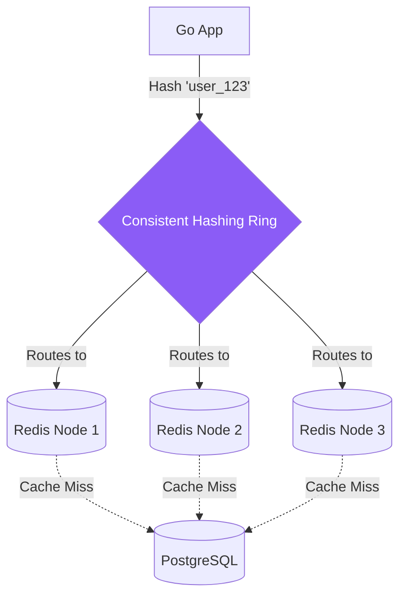

# System Design: Distributed Cache

## 1. Learning Objectives
* **What you'll learn**: How to design a massive Distributed Cache architecture, focusing on Consistent Hashing, Cache Invalidation strategies, and mitigating the Thundering Herd problem in Go.
* **Why it matters**: At hyper-scale, a single Redis server (max 100GB RAM) cannot hold all your data. You must split the data across 50 Redis servers. If a server crashes, you must gracefully re-route traffic without destroying the database.
* **Where it's used**: Memcached clusters at Facebook, Redis clusters at Twitter, and CDN architectures worldwide.

---

## 2. Real-world Story
Imagine a library with 1 million books, but only 1 Librarian (The Database). The Librarian is exhausted.
You hire 10 Assistants (The Cache Servers) to stand in front of the Librarian. 
If an Assistant gets sick and goes home, what happens to the books they were holding? Do you have to re-assign all 1 million books to the remaining 9 Assistants? That would take hours! 
**Consistent Hashing** ensures that if 1 Assistant leaves, only 10% of the books are moved, keeping the library running smoothly.

---

## 3. Visual Learning (Execution Flow & Architecture)


---

## 4. Internal Working (Under the Hood)
A Distributed Cache relies on **Partitioning / Sharding**.
If you have 3 Redis nodes, you can use simple modulo hashing: `hash(key) % 3`.
If Node 3 crashes, you now have 2 nodes. The formula becomes `hash(key) % 2`.
Because the denominator changed, the hash result for *every single key* changes! 99% of your cache becomes invalid instantly, causing a massive Cache Miss spike that crashes Postgres.
**Consistent Hashing** places nodes on a mathematical circle (0 to 360 degrees). When a node crashes, only the keys immediately adjacent to it are re-mapped. 66% of the cache remains perfectly valid!

---

## 5. Compiler Behavior
* **String Hashing**: To route a key to a node, Go applications typically use fast, non-cryptographic hash functions like `MurmurHash3` or `xxHash`. These are insanely fast compared to `crypto/sha256`, taking only nanoseconds of CPU time to route a request.

---

## 6. Memory Management
* **Singleflight**: The most critical Go package for caching is `golang.org/x/sync/singleflight`. If a celebrity tweets and 100,000 users request their profile, and it is NOT in the cache, all 100,000 Goroutines will hit Postgres at the exact same millisecond. `singleflight` guarantees that 99,999 Goroutines block and wait, while exactly ONE Goroutine hits Postgres, saving the database!

---

## 7. Code Examples

### 🔹 Example 1: The Cache Stampede Solution (Singleflight)
```go
import "golang.org/x/sync/singleflight"

var requestGroup singleflight.Group

func GetUserProfile(userID string) (Profile, error) {
    // 1. Check Redis Cache
    if profile := getFromCache(userID); profile != nil { return profile, nil }

    // 2. Cache Miss! Protect the Database!
    // The key ensures concurrent requests for "user_123" all share the same DB call.
    v, err, _ := requestGroup.Do(userID, func() (interface{}, error) {
        log.Println("Hitting the Database! (This should only print ONCE!)")
        
        profile := db.FetchProfile(userID)
        saveToCache(userID, profile)
        return profile, nil
    })
    
    if err != nil { return nil, err }
    return v.(Profile), nil
}
```

### 🔹 Example 2: Implementing Consistent Hashing
```go
import "github.com/stathat/consistent"

func InitHashRing() *consistent.Consistent {
    // A Go library that implements the mathematical hash ring
    ring := consistent.New()
    ring.Add("redis-node-1:6379")
    ring.Add("redis-node-2:6379")
    ring.Add("redis-node-3:6379")
    return ring
}

func GetNodeForKey(ring *consistent.Consistent, key string) string {
    // O(log N) lookup to find which server holds the data!
    node, _ := ring.Get(key)
    return node
}
```

### 🔹 Example 3: Advanced (Read-Through Cache)
```go
// Instead of the Application managing the DB, 
// the Cache itself fetches the data if it's missing!
// (Usually implemented in caching proxies like Varnish or Nginx)
```

### 🔹 Example 4: Production (Cache Invalidation)
```go
// The hardest problem in computer science.
func UpdateUserProfile(user User) {
    // 1. Update the Source of Truth
    db.Save(user)
    
    // 2. Delete the Cache immediately! (Cache-Aside pattern)
    // Next read will trigger a Cache Miss and fetch the fresh data.
    redisClient.Del(ctx, "user_"+user.ID)
}
```

### 🔹 Example 5: Interview
```go
// Q: Why do we Delete the cache on update, instead of Updating it?
// A: Concurrency bugs! If Server A and Server B update the DB simultaneously, 
// due to network latency, the DB might finish A then B. But the Cache might 
// finish B then A. The cache is now permanently holding Stale data! 
// Deleting the cache is mathematically safer.
```

---

## 8. Production Examples
1. **Facebook's Memcached Architecture**: Facebook built `McRouter`, a massive C++ routing tier that sits between the web servers and a pool of thousands of Memcached servers, managing Consistent Hashing entirely transparently to the application.
2. **CDNs (Content Delivery Networks)**: Cloudflare is just a massive global Distributed Cache for static assets (Images, HTML), preventing requests from crossing the ocean to hit your Go server.

---

## 9. Performance & Benchmarking
* **Hot Keys**: Even with Consistent Hashing, if Justin Bieber's profile is stored entirely on Node 3, and 1 million people request it, Node 3 will melt while Nodes 1 and 2 sit idle at 0% CPU! You must detect "Hot Keys" and randomly replicate them across multiple nodes (e.g., `user_bieber_1`, `user_bieber_2`).

---

## 10. Best Practices
* ✅ **Do**: Always set a Time-To-Live (TTL) on every single cache key. This is your ultimate safety net against bugs that leave stale data in the cache permanently.
* ❌ **Don't**: Use a Local In-Memory Cache (like Go's `map`) for data that changes frequently across multiple servers. If Server A updates the DB, Server B has no idea, and Server B will continue serving stale local data to users.
* 🏢 **Google / Uber / Netflix Style**: Use Redis Cluster or Memcached. They handle the complex gossip protocols, leader election, and slot sharding internally so your Go application just points to a cluster endpoint and acts dumb.

---

## 11. Common Mistakes
1. **The Cache Penetration Attack**: A hacker queries `GET /users/fake_id_1`, `fake_id_2`. The cache misses, hits Postgres, Postgres finds nothing, and returns nil. The cache DOES NOT store nil. So the next request for `fake_id_1` hits Postgres again! The hacker can DDOS Postgres. Always cache "Not Found" (nil) results with a short TTL!
2. **Massive Payload Serialization**: Fetching a 10MB JSON string from Redis, unmarshaling it into a Go struct, picking 1 field, and throwing the rest away. This will OOM the Go server. Use Redis Hashes (`HGET`) to fetch exactly the field you need.

---

## 12. Debugging
How to troubleshoot Caches:
* **Hit Rate Drops**: A healthy cache should have a 95%+ Hit Rate. If Grafana shows the Hit Rate plummeted to 50%, it usually means the DB was updated in bulk, triggering a massive wave of Cache Invalidations (Deletions).

---

## 13. Exercises
1. **Easy**: Write a simple in-memory cache in Go using a `map[string]string` and a `sync.RWMutex`.
2. **Medium**: Add a background Goroutine that periodically scans the map and deletes keys that have exceeded their TTL.
3. **Hard**: Use the `stathat/consistent` package to simulate routing 1,000 keys to 3 nodes. Print the distribution.
4. **Expert**: Remove 1 node from the ring and print the distribution again to prove that only ~33% of the keys were remapped!

---

## 14. Quiz
1. **MCQ**: What is the primary purpose of Consistent Hashing?
   * (A) To encrypt keys safely (B) To minimize the number of keys re-mapped when a server is added or removed (C) To compress memory. *(Answer: B)*
2. **System Design Follow-up**: How do you prevent a Distributed Cache from running out of RAM? *(You configure an Eviction Policy like LRU (Least Recently Used) or LFU (Least Frequently Used). When RAM hits 100%, it deletes the oldest/least popular data to make room).*

---

## 15. FAANG Interview Questions
* **Beginner**: Explain the difference between Memcached and Redis.
* **Intermediate**: What is the Cache Stampede (Thundering Herd) problem?
* **Senior (Google/Meta)**: Architect a global caching layer for a Write-Heavy system (like tracking video views in real-time). How do you handle cache invalidation globally without overwhelming the primary database? (Hint: Write-Behind Caching / Event Sourcing).

---

## 16. Mini Project
**The Resilient Profile Service**
* Spin up PostgreSQL and Redis.
* Write a Go HTTP API `GET /profile/{id}`.
* Implement the Cache-Aside pattern.
* Wrap the Database call in `singleflight.Group`.
* Run a load test using `hey -c 1000 -n 10000 http://localhost:8080/profile/1`.
* Add a log inside the database fetching block. Prove that the log ONLY prints exactly 1 time, despite 10,000 concurrent requests!

---

## 17. Enterprise Features & Observability
* **Virtual Nodes**: In Consistent Hashing, 3 physical nodes might be distributed unevenly on the ring. Enterprise systems use "Virtual Nodes" (mapping 1 physical server to 100 random points on the ring) to mathematically guarantee perfect statistical distribution of data!

---

## 18. Source Code Reading
Walkthrough of `golang.org/x/sync/singleflight`.
* **The WaitGroup Matrix**: Study how `singleflight` elegantly uses a simple `sync.Mutex` to lock a map of keys, and a `sync.WaitGroup` to block all subsequent Goroutines until the very first Goroutine finishes its DB call!

---

## 19. Architecture
* **Two-Tier Caching**: For extreme performance, companies use a tiny L1 Cache (Local Go Memory, 5 second TTL) to absorb 90% of reads instantly, and a massive L2 Cache (Distributed Redis) to absorb the remaining reads. Only 1% of reads ever reach the Database!

---

## 20. Summary & Cheat Sheet
* **Problem**: Standard modulo hashing breaks when nodes crash.
* **Solution**: Consistent Hashing (The Ring).
* **Danger**: Cache Stampedes (Use Go `singleflight`).
* **Danger**: Cache Penetration (Cache the `nil` results!).
* **Golden Rule**: There are only two hard things in Computer Science: cache invalidation and naming things.
