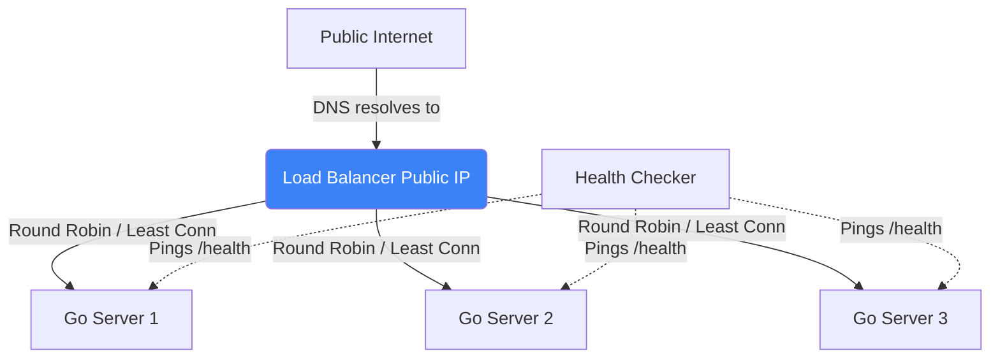

# System Design: Load Balancers

## 1. Learning Objectives
* **What you'll learn**: The difference between Layer 4 (TCP) and Layer 7 (HTTP) Load Balancers, routing algorithms, and how to scale Go backend servers horizontally.
* **Why it matters**: A single Go server can handle maybe 50,000 requests per second. If you get 1 million req/sec, you need 20 servers. How do users know which of the 20 servers to talk to? The Load Balancer acts as the traffic cop.
* **Where it's used**: AWS ALB, Nginx, HAProxy, and Kubernetes Ingress.

---

## 2. Real-world Story
Imagine a massive supermarket. 
If there is only 1 cashier (Server), the line goes out the door.
You open 10 checkout lanes (10 Servers). But customers don't know which lane is fastest, so they all crowd into Lane 1.
You hire a Line Manager (The Load Balancer) to stand at the front. The manager looks at the lines and tells the next customer: "Go to Lane 4, it's empty." The manager perfectly balances the workload across all cashiers.

---

## 3. Visual Learning (Execution Flow & Architecture)


---

## 4. Internal Working (Under the Hood)
1. **Layer 4 (Transport)**: Operates at the TCP/UDP level. It does not look at the HTTP payload. It just sees packets going to Port 80, and blindly forwards them to a server based on IP. (Incredibly fast, CPU efficient).
2. **Layer 7 (Application)**: Operates at the HTTP level. It unencrypts the SSL certificate, reads the URL path (e.g., `/images` vs `/api`), and routes traffic to different specialized servers based on the actual JSON/Headers! (Slower, requires CPU decryption).

---

## 5. Compiler Behavior
* **Reverse Proxies in Go**: Go is famously excellent at building Load Balancers because the standard library contains `httputil.ReverseProxy`. Because Go manages Goroutines so efficiently, you can write a highly concurrent L7 Load Balancer in 50 lines of pure Go code that rivals Nginx in throughput!

---

## 6. Memory Management
* **SSL Termination**: Encrypting and decrypting HTTPS traffic uses massive amounts of CPU math (RSA/Elliptic Curves). Instead of wasting your Go backend's CPU on cryptography, the Load Balancer performs "SSL Termination". It decrypts the traffic, and sends plain, unencrypted HTTP over the secure internal VPC network to your Go apps!

---

## 7. Code Examples

### 🔹 Example 1: A Simple Go Load Balancer (Round Robin)
```go
import "net/http/httputil"

// A list of our backend Go servers
var backends = []string{
    "http://10.0.0.1:8080",
    "http://10.0.0.2:8080",
}
var current int = 0

func LoadBalancerHandler(w http.ResponseWriter, r *http.Request) {
    // 1. Pick a server (Round Robin)
    targetURL, _ := url.Parse(backends[current])
    current = (current + 1) % len(backends) // 0, 1, 0, 1...
    
    // 2. Proxy the request!
    proxy := httputil.NewSingleHostReverseProxy(targetURL)
    proxy.ServeHTTP(w, r)
}
```

### 🔹 Example 2: Layer 7 Routing (Path Based)
```go
// Routing based on the HTTP Path
func Layer7Router(w http.ResponseWriter, r *http.Request) {
    var targetURL *url.URL
    
    if strings.HasPrefix(r.URL.Path, "/billing") {
        targetURL, _ = url.Parse("http://billing-cluster:8080")
    } else {
        targetURL, _ = url.Parse("http://main-cluster:8080")
    }
    
    httputil.NewSingleHostReverseProxy(targetURL).ServeHTTP(w, r)
}
```

### 🔹 Example 3: Advanced (Active Health Checks)
```go
// A background Goroutine that constantly pings the backends.
// If a backend returns 500, we remove it from the 'backends' array!
func HealthCheckLoop() {
    for {
        for i, url := range backends {
            resp, err := http.Get(url + "/health")
            if err != nil || resp.StatusCode != 200 {
                MarkServerAsDead(i)
            }
        }
        time.Sleep(5 * time.Second)
    }
}
```

### 🔹 Example 4: Production (Sticky Sessions via Cookies)
```go
// Some legacy stateful apps require a user to ALWAYS hit Server 1.
// The LB injects a Cookie on the first request. 
// On the next request, the LB reads the Cookie and routes them back to Server 1.
// (Avoid this pattern if possible! APIs should be stateless).
```

### 🔹 Example 5: Interview
```go
// Q: What happens if the Load Balancer itself crashes? Isn't it a Single Point of Failure?
// A: Yes! You must run multiple Load Balancers (Active-Passive or Active-Active) 
// using DNS Load Balancing (Route53) or IP Anycast to distribute traffic across the Load Balancers themselves!
```

---

## 8. Production Examples
1. **AWS Application Load Balancer (ALB)**: A managed L7 load balancer. It reads the HTTP headers and automatically routes traffic to different Kubernetes Node Ports or AWS Lambda functions.
2. **AWS Network Load Balancer (NLB)**: A managed L4 load balancer. Capable of handling millions of requests per second at ultra-low latency because it operates entirely at the TCP network packet layer.

---

## 9. Performance & Benchmarking
* **Least Connections Algorithm**: Round Robin is dumb. If Server 1 is processing a huge 5-second report, and Server 2 is idle, Round Robin will blindly send the next request to Server 1! "Least Connections" is smarter: the LB counts how many active TCP sockets each server has, and sends the new request to the most idle server.

---

## 10. Best Practices
* ✅ **Do**: Use an API Gateway (like Kong or AWS API Gateway) if you need complex L7 logic (Auth, Rate Limiting, JWT validation). Use an L4 Load Balancer for pure performance routing.
* ❌ **Don't**: Store user uploaded files (like profile pictures) on the local disk of a Go server. If the Load Balancer routes the user's next request to Server 2, the image will be 404 Missing! Store files centrally in S3.
* 🏢 **Google / Uber / Netflix Style**: Use **Envoy Proxy**. It is the industry standard open-source C++ edge proxy designed for microservices, providing advanced features like gRPC routing, retries, and Circuit Breaking natively.

---

## 11. Common Mistakes
1. **The `X-Forwarded-For` Bug**: When a Load Balancer proxies a request to your Go app, the Go app sees the *Load Balancer's IP address*, not the actual User's IP! The LB must inject the `X-Forwarded-For: <User IP>` HTTP header. If your Go app relies on IP rate limiting, it must parse this header!
2. **Draining Connections**: Shutting down a Go server immediately during a deployment. The LB will send traffic to a dead server for 5 seconds until the Health Check fails. You must configure Connection Draining: The LB stops sending *new* traffic to the server, but allows existing requests to finish before killing it.

---

## 12. Debugging
How to troubleshoot Load Balancers:
* **HTTP 502 Bad Gateway**: This usually means the Load Balancer is healthy, but your Go backend is either crashed, or timing out. The LB waited for the Go app, gave up, and returned 502 to the user.

---

## 13. Exercises
1. **Easy**: Run two Go HTTP servers on `localhost:8081` and `localhost:8082`.
2. **Medium**: Write a third Go app on `localhost:8080` that uses `httputil.ReverseProxy` to round-robin requests between them.
3. **Hard**: Modify the two backend servers to print their port when hit. Use `curl` to verify the round-robin alternation.
4. **Expert**: Add a `/health` endpoint to the backends. Implement a background Goroutine in the Load Balancer that stops routing to a backend if you `Ctrl+C` kill it!

---

## 14. Quiz
1. **MCQ**: Which OSI layer does a Load Balancer that routes traffic based on the URL path `/images` operate on?
   * (A) Layer 3 (Network) (B) Layer 4 (Transport) (C) Layer 7 (Application). *(Answer: C)*
2. **System Design Follow-up**: How does DNS Load Balancing (e.g., Round Robin DNS) differ from a dedicated hardware/software Load Balancer? *(DNS just returns a random IP address from a list to the browser. It is very slow to update (DNS caching) and has zero knowledge if the backend server is actually healthy or crashed!)*

---

## 15. FAANG Interview Questions
* **Beginner**: Explain the difference between Horizontal and Vertical scaling.
* **Intermediate**: What is SSL Termination and why is it performed at the Load Balancer?
* **Senior (Google/Meta)**: Explain IP Anycast. How does Cloudflare route a user in Tokyo and a user in New York to the exact same IP address (`1.1.1.1`), but physically connect them to two different hardware data centers? (Hint: BGP Routing protocols).

---

## 16. Mini Project
**The Smart Proxy**
* Write a Go Reverse Proxy.
* Configure it to read a custom HTTP Header: `X-Beta-Tester: true`.
* If the header exists, route the request to `Backend_V2`.
* If it doesn't, route to `Backend_V1`.
* You have just implemented L7 Canary Deployments!

---

## 17. Enterprise Features & Observability
* **Global Server Load Balancing (GSLB)**: If an entire AWS US-East region goes offline, a GSLB (usually powered by smart DNS like Route53) detects the regional failure and automatically routes all US traffic to the EU region servers.

---

## 18. Source Code Reading
Walkthrough of `net/http/httputil`.
* **The Director Function**: Study how `ReverseProxy` allows you to inject a `Director` function. This function gives you the ability to aggressively mutate the HTTP request (adding Headers, changing the URL) right before it is forwarded to the backend!

---

## 19. Architecture
* **Hardware vs Software**: 10 years ago, companies bought physical $50,000 F5 Big-IP hardware appliances to do load balancing. Today, it is almost entirely software-defined using Nginx, HAProxy, and cloud-native SDN (Software Defined Networking).

---

## 20. Summary & Cheat Sheet
* **Layer 4**: Fast, blind TCP routing.
* **Layer 7**: Smart, HTTP path/header routing.
* **SSL Termination**: Decrypt at the edge.
* **Health Checks**: Never route to a dead node.
* **Go Package**: `httputil.ReverseProxy`.
