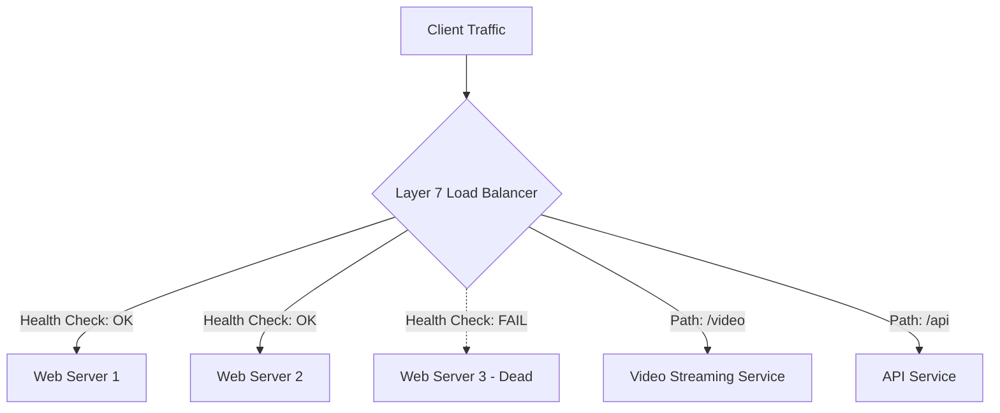

# Load Balancers: The Gatekeepers of Scalability

## 1️⃣ Learning Objectives
* **What you'll learn**: Master the core mechanics of Load Balancing (L4 vs L7), routing algorithms, health checks, and fault tolerance.
* **Why it matters**: A single server will inevitably fail or buckle under high traffic. Load Balancers are the mandatory first step for scaling any production system from 10,000 to 1,000,000 requests per second.
* **Where it's used**: API Gateways, Microservice meshes, Database read replicas, and Global DNS routing.

---

## 2️⃣ Real-world Story
Imagine a wildly popular DMV office with a single person at the front desk. The line stretches out the door, people are angry, and if that employee needs a bathroom break, the entire DMV stops functioning. (This is a Single Point of Failure).

Now, imagine the DMV hires 10 front-desk employees, and places a **Dispatcher** at the front door. The dispatcher looks at the line and says: *"Desk 1 is busy, go to Desk 2. Desk 3 is on break, skip them. You have a commercial license issue? Go to the specialized Desk 5."*

The Dispatcher is the **Load Balancer**. It evenly distributes traffic, detects dead servers, and routes specific requests to specialized servers.

---

## 3️⃣ Visual Learning (Execution Flow & Architecture)


---

## 4️⃣ Internal Working (Under the Hood)
How does a software load balancer (like HAProxy or NGINX) actually work?
* **Layer 4 (Transport)**: Operates at the TCP/UDP level. It merely looks at the IP and Port, and blindly forwards the packets using NAT (Network Address Translation). It's insanely fast (millions of RPS) but "dumb."
* **Layer 7 (Application)**: Operates at the HTTP level. It terminates the SSL connection, reads the HTTP headers, inspects the URL path, and makes intelligent routing decisions. It requires more CPU.

---

## 5️⃣ Routing Algorithms
1. **Round Robin**: Distributes requests sequentially (Server 1, 2, 3, 1, 2, 3). Best for servers with identical hardware and predictable request times.
2. **Least Connections**: Sends traffic to the server with the fewest active TCP connections. Best for long-lived connections like WebSockets or heavy DB queries.
3. **IP Hash**: Hashes the client's IP address. Guarantees the same user always hits the same server. Useful for stateful in-memory sessions (though stateless is preferred).
4. **Weighted Round Robin**: If Server A has 64 cores and Server B has 16 cores, assign Server A a weight of 4, so it gets 4x the traffic.

---

## 6️⃣ Infrastructure & Redundancy
* **Active-Passive**: Two load balancers exist. LB1 handles all traffic. If LB1 dies, Heartbeat (Keepalived/VRRP) detects the failure, and LB2 instantly takes over the Virtual IP.
* **Active-Active**: Both load balancers handle traffic simultaneously. DNS Round Robin points to both.

---

## 7️⃣ Code Examples

### 🔹 Example 1: Simple (Round Robin in Go)
```go
type RoundRobin struct {
    servers []string
    current uint32
}

func (rr *RoundRobin) Next() string {
    index := atomic.AddUint32(&rr.current, 1) % uint32(len(rr.servers))
    return rr.servers[index]
}
```

### 🔹 Example 2: Intermediate (Reverse Proxy)
Using Go's built-in `httputil.ReverseProxy` to forward traffic.
```go
func balanceHandler(w http.ResponseWriter, r *http.Request) {
    targetURL, _ := url.Parse(roundRobin.Next())
    proxy := httputil.NewSingleHostReverseProxy(targetURL)
    proxy.ServeHTTP(w, r)
}
```

### 🔹 Example 3: Advanced (Active Health Checks)
```go
func healthCheck(server *Server) {
    for {
        resp, err := http.Get(server.URL + "/healthz")
        if err != nil || resp.StatusCode != 200 {
            server.SetDead(true)
        } else {
            server.SetDead(false)
        }
        time.Sleep(5 * time.Second)
    }
}
```

---

## 8️⃣ Production Examples
1. **AWS ALB (Application Load Balancer)**: Used globally for Layer 7 HTTP/HTTPS traffic.
2. **AWS NLB (Network Load Balancer)**: Used for massive-throughput Layer 4 TCP/UDP traffic (like multiplayer gaming).
3. **Envoy / Istio**: Used as "Sidecar" load balancers for internal Microservice-to-Microservice communication within Kubernetes.

---

## 9️⃣ Performance & Benchmarking
* **Reverse Proxy Overhead**: A basic Go reverse proxy introduces ~1-2ms of latency.
* **Connection Pooling**: A production load balancer MUST maintain a pool of persistent `keep-alive` TCP connections to the backend servers to avoid the expensive TCP 3-way handshake on every request!

---

## 🔟 Best Practices
* ✅ **Do**: Use Layer 7 for APIs so you can route by URL path and terminate SSL.
* ✅ **Do**: Ensure your backend servers are **Stateless**! If a server dies, the load balancer should seamlessly route the user to another server without them losing their login session.
* ❌ **Don't**: Rely purely on Round Robin if your requests have vastly different execution times (e.g., video processing vs fetching a username). Use Least Connections.

---

## 11️⃣ Common Mistakes
1. **Missing Health Checks**: Sending traffic to a server that crashed 5 minutes ago because the load balancer doesn't actively ping it.
2. **Thundering Herd**: When a dead server comes back online, the load balancer instantly floods it with thousands of queued requests, immediately killing it again.
   * *Fix*: Implement a "Slow Start" algorithm.

---

## 12️⃣ Debugging
How to troubleshoot Load Balancers in production:
* **X-Forwarded-For Header**: When an LB proxies a request, the backend server sees the LB's IP, not the user's! The LB must inject the `X-Forwarded-For` HTTP header containing the user's real IP.
* **502 Bad Gateway**: The Load Balancer successfully received the request, but the backend server is either dead or rejecting the connection.
* **504 Gateway Timeout**: The backend server is alive, but taking too long to respond.

---

## 13️⃣ Exercises
1. **Easy**: Configure an NGINX docker container to load balance between two simple Go web servers.
2. **Medium**: Extend the Go Round Robin code example to support Server Weights.
3. **Hard**: Build a Go reverse proxy that dynamically adds/removes backend servers from its pool when they fail/pass health checks.

---

## 14️⃣ Quiz
1. **MCQ**: Which load balancing algorithm is best for WebSockets?
   - A) Round Robin
   - B) Random
   - C) Least Connections
*(Answer: C. Because WebSockets stay open for a long time, Round Robin would eventually stack all active users on one machine).*

---

## 15️⃣ FAANG Interview Questions
* **Beginner**: What is the difference between Layer 4 and Layer 7 load balancing?
* **Intermediate**: How do you handle Session State (like a shopping cart) if the load balancer keeps sending the user to different servers?
* **Senior (Google/Meta)**: Design a Global Server Load Balancing (GSLB) system using DNS and Anycast IP routing to direct users to the geographically closest data center. How do you handle cache invalidation during a failover?

---

## 16️⃣ Mini Project
**Build a Layer 7 Load Balancer in Go**
Create a CLI tool in Go that takes a config file of backend URLs.
* Implement a Least Connections routing algorithm using atomic counters.
* Implement a background goroutine that pings `/health` every 3 seconds.
* Expose prometheus metrics for `requests_routed_total` and `backend_latency_ms`.

---

## 17️⃣ Enterprise Features & Observability
* **SSL Termination**: The Load Balancer holds the SSL Certificates and decrypts the HTTPS traffic. It sends plain HTTP to the internal servers, drastically reducing CPU load on the backend.
* **Access Logs**: The LB is the single best place to generate access logs for all incoming traffic.

---

## 18️⃣ Source Code Reading
Read the Go standard library `net/http/httputil/reverseproxy.go`.
* Observe the `ServeHTTP` method. Notice how it creates an `outreq` (outbound request), copies all headers, and uses a `Transport` to perform the actual network call to the backend.

---

## 19️⃣ Architecture
Load Balancers sit at multiple tiers in Clean Architecture:
1. **External (Edge)**: Between the internet and your API Gateway.
2. **Internal**: Between your API Gateway and your internal gRPC Microservices.
3. **Database**: Between your Services and your Postgres Read Replicas (e.g., PgBouncer).

---

## 20️⃣ Summary & Cheat Sheet
* **Layer 4**: Fast, blind IP/Port routing.
* **Layer 7**: Smart, HTTP/Path based routing.
* **Algorithms**: Round Robin (even traffic), Least Conn (long connections), IP Hash (sticky sessions).
* **High Availability**: Always run at least TWO load balancers in Active-Passive mode to prevent a Single Point of Failure.
