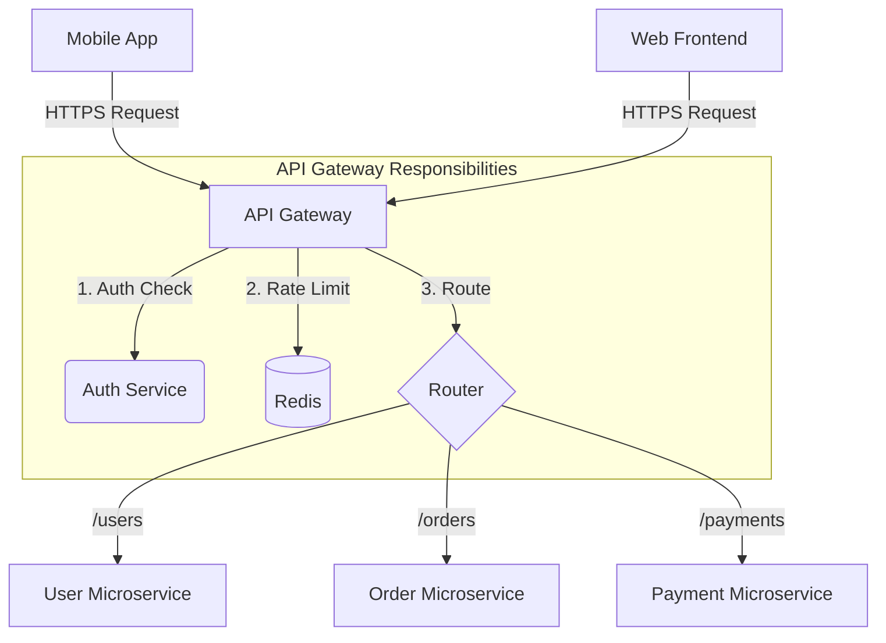

# API Gateways: The Front Door to Microservices

## 1️⃣ Learning Objectives
* **What you'll learn**: Master the role of an API Gateway, including request routing, rate limiting, authentication offloading, and backend aggregation.
* **Why it matters**: In a microservice architecture, clients shouldn't need to know the IP addresses of 50 different microservices. The API Gateway acts as the unified, secure entry point.
* **Where it's used**: Netflix's Zuul, Amazon API Gateway, Kong, and bespoke Go-based proxies routing traffic to backend clusters.

---

## 2️⃣ Real-world Story
Imagine walking into a massive hotel. You don't walk straight into the kitchen to order food, then walk to the basement to ask for a towel, and then walk to the security room to verify your ID. 

You go to the **Front Desk (API Gateway)**. 
The receptionist checks your ID (Authentication), checks if you have exceeded your room tab (Rate Limiting), and then radios the kitchen or housekeeping on your behalf (Routing). The Front Desk hides the chaotic, complex interior of the hotel from the guest.

---

## 3️⃣ Visual Learning (Execution Flow & Architecture)


---

## 4️⃣ Internal Working (Under the Hood)
An API Gateway is fundamentally an advanced **Reverse Proxy**. 
When a request arrives, the gateway:
1. Parses the HTTP Headers and URL Path.
2. Executes a chain of **Middleware** (Auth, Rate Limiting, Logging).
3. Opens a new outbound TCP connection (or uses a connection pool) to the internal microservice.
4. Streams the microservice's response back to the client.

---

## 5️⃣ Common Gateway Patterns
1. **BFF (Backend for Frontend)**: Instead of one massive API Gateway for everything, you create a specific Gateway for the Mobile App, and a different Gateway for the Web Dashboard. They can format the data specifically for that client.
2. **API Composition / Aggregation**: The Gateway receives a single request for `/profile`. It makes three internal concurrent requests to `UserService`, `BillingService`, and `HistoryService`, merges the JSON, and sends one unified response to the client.

---

## 6️⃣ Infrastructure & Scaling
* **Statelessness**: The API Gateway MUST be completely stateless. It should hold no session data in memory. This allows you to auto-scale from 2 Gateways to 200 Gateways instantaneously during a traffic spike.
* **Redis Dependency**: To perform distributed rate limiting across 200 Gateway nodes, they must all read/write counters to a centralized fast cache like Redis.

---

## 7️⃣ Code Examples

### 🔹 Example 1: Simple Reverse Proxy (Go)
```go
func main() {
    // A basic API Gateway routing to a user service
    userServiceURL, _ := url.Parse("http://internal-user-service:8081")
    proxy := httputil.NewSingleHostReverseProxy(userServiceURL)
    
    http.Handle("/users/", proxy)
    log.Fatal(http.ListenAndServe(":8080", nil))
}
```

### 🔹 Example 2: Intermediate (Authentication Offloading)
```go
func AuthMiddleware(next http.Handler) http.Handler {
    return http.HandlerFunc(func(w http.ResponseWriter, r *http.Request) {
        token := r.Header.Get("Authorization")
        // The Gateway verifies the JWT locally without hitting the database!
        claims, err := verifyJWT(token)
        if err != nil {
            http.Error(w, "Unauthorized", 401)
            return
        }
        
        // Inject the UserID into the headers for internal microservices to read
        r.Header.Set("X-User-ID", claims.UserID)
        next.ServeHTTP(w, r)
    })
}
```

### 🔹 Example 3: Advanced (API Aggregation)
```go
func ProfileHandler(w http.ResponseWriter, r *http.Request) {
    var wg sync.WaitGroup
    var user User
    var orders []Order
    
    // Concurrently fetch from internal microservices
    wg.Add(2)
    go func() { defer wg.Done(); user = fetchInternalUser(id) }()
    go func() { defer wg.Done(); orders = fetchInternalOrders(id) }()
    wg.Wait()
    
    // Merge and return
    json.NewEncoder(w).Encode(map[string]any{"user": user, "orders": orders})
}
```

---

## 8️⃣ Production Examples
1. **Kong Gateway**: An immensely popular open-source API Gateway built on NGINX and Lua.
2. **KrakenD**: A high-performance API Gateway written purely in Go, specifically designed for massive scale API aggregation.
3. **AWS API Gateway**: Fully managed, serverless gateway that routes HTTP requests directly to AWS Lambda functions.

---

## 9️⃣ Performance & Benchmarking
* **The Connection Pool Bottleneck**: If your API Gateway creates a brand new TCP connection for every internal microservice call, it will exhaust its ephemeral ports and crash (Socket Exhaustion).
* **Fix**: In Go, you MUST configure the `http.Transport.MaxIdleConnsPerHost` to keep hundreds of connections alive and pooled!

---

## 🔟 Best Practices
* ✅ **Do**: Use the API Gateway for Cross-Cutting Concerns (Auth, Logging, Rate Limiting, SSL Termination).
* ❌ **Don't**: Put heavy business logic inside the API Gateway. It should not calculate taxes or generate PDFs. It is a router, not a business engine!
* 🏢 **Netflix Style**: Netflix pioneered the BFF (Backend for Frontend) pattern, recognizing that a Smart TV app needs vastly different payload shapes than an iPhone app.

---

## 11️⃣ Common Mistakes
1. **Single Point of Failure**: If your API Gateway goes down, your entire microservice fleet is instantly unreachable. Gateways must be deployed in highly available clusters behind a Layer 4 Load Balancer.
2. **Timeouts**: If a backend microservice hangs, the API Gateway will hang waiting for it. The Gateway will quickly run out of memory. The Gateway MUST enforce strict read/write timeouts on all outgoing requests.

---

## 12️⃣ Debugging
* **Correlation IDs**: When the API Gateway receives a request, it generates a unique UUID (e.g., `X-Request-ID`). It passes this header to ALL backend microservices. If an error occurs deep in the stack, you can search Kibana/Datadog for that single ID and see the entire trace.

---

## 13️⃣ Exercises
1. **Easy**: Write a Go middleware that logs the HTTP Method, Path, and execution time of every request passing through the Gateway.
2. **Medium**: Implement a Token Bucket Rate Limiter middleware in Go using a map and a `sync.Mutex`.
3. **Hard**: Write an Aggregation endpoint that calls two slow external APIs concurrently (using goroutines), aborting immediately if either takes longer than 2 seconds using `context.WithTimeout`.

---

## 14️⃣ Quiz
1. **MCQ**: What is the primary benefit of Authentication Offloading at the API Gateway?
   - A) It makes the database run faster.
   - B) It prevents unauthenticated traffic from ever reaching internal microservices, saving internal compute resources.
   - C) It encrypts the payload.
*(Answer: B!)*

---

## 15️⃣ FAANG Interview Questions
* **Beginner**: Why not just expose all microservices directly to the internet?
* **Intermediate**: How do you rate limit requests across 50 API Gateway nodes?
  * *Answer*: Use Redis. A Lua script evaluates and decrements the rate limit counter atomically.
* **Senior (Uber/Amazon)**: You are tasked with migrating a massive monolith to microservices with zero downtime. How do you use the API Gateway (Strangler Fig Pattern) to accomplish this?

---

## 16️⃣ Mini Project
**Build a Go API Gateway with Rate Limiting**
1. Create a Reverse Proxy in Go that routes `/api/v1/auth` to localhost:8081 and `/api/v1/billing` to localhost:8082.
2. Implement a Rate Limiting middleware that allows a maximum of 5 requests per second per IP address.
3. If a user exceeds the limit, return a `429 Too Many Requests` status instantly without forwarding the request.

---

## 17️⃣ Enterprise Features & Observability
* **Circuit Breakers**: If the Billing Microservice crashes, the API Gateway shouldn't keep sending traffic to it. It should "trip" the circuit breaker, instantly returning `503 Service Unavailable` for billing routes, giving the billing service time to recover without being hammered by traffic.

---

## 18️⃣ Source Code Reading
* Review the Netflix OSS project **Zuul** (or Go's **KrakenD** open source repo). Notice how the middleware chains are dynamically constructed based on a YAML configuration file rather than hardcoded logic.

---

## 19️⃣ Architecture
The API Gateway sits at the absolute edge of your architecture. It is the protective shield for the internal network (VPC). Internal microservices should NOT have public IP addresses; they should only accept traffic originating from the Gateway's internal IP.

---

## 20️⃣ Summary & Cheat Sheet
* **Role**: Router, Aggregator, Authenticator, Rate Limiter, Shield.
* **BFF**: Backend For Frontend (Custom gateways for mobile vs web).
* **Correlation ID**: Generate at the gateway, pass everywhere.
* **Circuit Breaker**: Stop hammering dead internal services.
