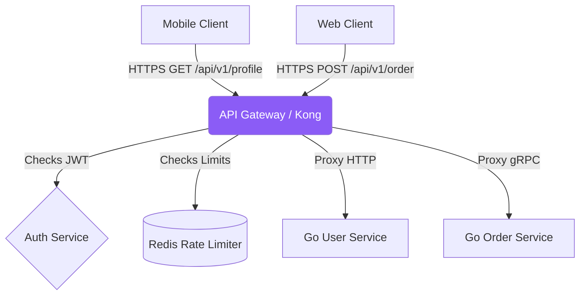

# System Design: API Gateway

## 1. Learning Objectives
* **What you'll learn**: How to design an API Gateway that acts as the single entry point for a microservice architecture, handling authentication, routing, rate limiting, and aggregation.
* **Why it matters**: Without a Gateway, an iPhone app has to memorize the IP addresses of 50 different microservices, manage 50 SSL certificates, and implement JWT validation 50 times. The Gateway centralizes all complexity.
* **Where it's used**: Kong, KrakenD (written in Go), AWS API Gateway, and Netflix Zuul.

---

## 2. Real-world Story
Imagine a massive corporate office building. 
If there is no receptionist, a delivery driver has to wander the halls knocking on 50 different doors to find the right person, bypassing security completely.
The API Gateway is the Front Desk Receptionist. You hand the package to them. They check your ID (Authentication). They check if you are allowed in the building (Authorization). If you are verified, they take the package and route it to the exact correct desk via the internal mailroom.

---

## 3. Visual Learning (Execution Flow & Architecture)


---

## 4. Internal Working (Under the Hood)
An API Gateway is a specialized Layer 7 Load Balancer that performs complex business logic before proxying the request:
1. **SSL Termination**: Decrypts the public HTTPS traffic.
2. **AuthN / AuthZ**: Validates the JWT Signature.
3. **Routing**: Maps public URLs (`/users`) to internal DNS names (`http://user-svc:8080`).
4. **Rate Limiting**: Stops DDoS attacks.
5. **Aggregation**: Firing 3 internal requests concurrently and stitching the JSON together for the frontend.

---

## 5. Compiler Behavior
* **Goroutine Fan-Out**: When the API Gateway needs to perform Aggregation, Go is mathematically superior to Node.js or Python. Go spawns 3 Goroutines, fires 3 HTTP requests to internal microservices simultaneously, waits via `sync.WaitGroup`, and returns the merged JSON in milliseconds, fully utilizing multi-core CPUs.

---

## 6. Memory Management
* **Reverse Proxy Streaming**: If the Gateway proxies a 1GB video file download, it MUST NOT buffer the 1GB into a Go `[]byte` slice (OOM Crash). The Gateway must use `io.Copy()` to stream the TCP packets directly from the internal network socket to the external client socket using a tiny 32KB buffer.

---

## 7. Code Examples

### 🔹 Example 1: The Gateway Router
```go
import "net/http/httputil"

func GatewayRouter(w http.ResponseWriter, r *http.Request) {
    var target string
    
    // Path-based routing
    if strings.HasPrefix(r.URL.Path, "/api/v1/users") {
        target = "http://internal-user-service"
    } else if strings.HasPrefix(r.URL.Path, "/api/v1/orders") {
        target = "http://internal-order-service"
    } else {
        http.Error(w, "Service Not Found", 404)
        return
    }
    
    url, _ := url.Parse(target)
    httputil.NewSingleHostReverseProxy(url).ServeHTTP(w, r)
}
```

### 🔹 Example 2: Authentication Middleware
```go
// Centralizing Auth! The internal microservices NEVER validate JWTs!
func AuthMiddleware(next http.Handler) http.Handler {
    return http.HandlerFunc(func(w http.ResponseWriter, r *http.Request) {
        token := r.Header.Get("Authorization")
        
        userID, err := ValidateJWT(token)
        if err != nil {
            http.Error(w, "Unauthorized", 401)
            return
        }
        
        // Inject the trusted UserID as a Header for the internal services!
        r.Header.Set("X-User-ID", userID)
        next.ServeHTTP(w, r)
    })
}
```

### 🔹 Example 3: Advanced (Data Aggregation)
```go
// Fetching User Profile AND Recent Orders concurrently!
func AggregationHandler(w http.ResponseWriter, r *http.Request) {
    userID := r.Header.Get("X-User-ID")
    
    var wg sync.WaitGroup
    var user User
    var orders []Order
    
    wg.Add(2)
    go func() { defer wg.Done(); user = FetchUser(userID) }()
    go func() { defer wg.Done(); orders = FetchOrders(userID) }()
    wg.Wait()
    
    // Stitch JSON together for the Mobile App
    json.NewEncoder(w).Encode(map[string]any{"user": user, "orders": orders})
}
```

### 🔹 Example 4: Production (Circuit Breaking)
```go
// If the internal Order service crashes, DO NOT freeze the Gateway!
// Use a Circuit Breaker (e.g. sony/gobreaker).
result, err := cb.Execute(func() (interface{}, error) {
    return http.Get("http://internal-order-service")
})

if err != nil {
    // Return a graceful fallback instead of hanging forever!
    w.Write([]byte(`{"error": "Orders temporarily unavailable"}`))
}
```

### 🔹 Example 5: Interview
```go
// Q: Why not just use NGINX instead of a Go API Gateway?
// A: NGINX is fantastic for routing. But if you need complex JSON Aggregation, 
// custom Auth logic mapping to a legacy DB, or dynamic protocol translation 
// (HTTP to gRPC), writing that in NGINX Lua scripts is agonizing. Go is much better.
```

---

## 8. Production Examples
1. **Backend For Frontend (BFF)**: Instead of one massive API Gateway, you build one Gateway for the iOS App, and a separate Gateway for the Web Dashboard. They aggregate JSON differently based on the exact screen size of the client!
2. **Protocol Translation**: The public internet speaks JSON REST. The Gateway receives JSON, translates it into Protobuf binary, and speaks hyper-fast gRPC to the internal microservices.

---

## 9. Performance & Benchmarking
* **Connection Pooling**: The Gateway makes 10,000 requests per second to the internal microservices. If it opens a new TCP connection every time, the TCP Handshake latency will destroy performance. You MUST tune the Go `http.Transport` to configure `MaxIdleConnsPerHost = 1000` to keep the internal TCP sockets permanently open and warm!

---

## 10. Best Practices
* ✅ **Do**: Generate a unique `X-Request-ID` (UUID) at the Gateway and pass it to every internal microservice. This is the only way to trace a distributed log in Elasticsearch.
* ❌ **Don't**: Put Business Logic (like calculating taxes) inside the API Gateway. The Gateway should only do routing, auth, and aggregation. Business logic belongs in the microservices.
* 🏢 **Google / Uber / Netflix Style**: Use **KrakenD**. It is an ultra-high performance open-source API Gateway written entirely in Go. It handles aggregation, filtering, and rate-limiting using just a declarative JSON configuration file!

---

## 11. Common Mistakes
1. **The Single Point of Failure**: If your API Gateway crashes, your entire company is offline. You must run at least 3 instances of your Gateway behind an AWS Application Load Balancer.
2. **Missing Timeouts**: If a backend service hangs, the Gateway Goroutine blocks forever. Eventually, you hit the 1,000,000 open socket limit and the Gateway crashes. EVERY outbound request from the Gateway MUST have a strict `context.WithTimeout(ctx, 2*time.Second)`.

---

## 12. Debugging
How to troubleshoot API Gateways:
* **The 504 Gateway Timeout**: This error means the Gateway is healthy, but the internal microservice took longer than the strict Context Timeout to respond. Check the logs of the internal microservice for database slow queries!

---

## 13. Exercises
1. **Easy**: Write an `AuthMiddleware` in Go that checks for a static token `Bearer 123` and rejects anything else with 401.
2. **Medium**: Use `httputil.ReverseProxy` to route authorized traffic to a mock backend server on port 9090.
3. **Hard**: Implement a Context Timeout in the Reverse Proxy transport to abort the request if the backend takes > 1 second.
4. **Expert**: Build an Aggregation endpoint using Goroutines and Channels to fetch data from two mock services concurrently and return merged JSON.

---

## 14. Quiz
1. **MCQ**: What is the pattern called where you build a specific API Gateway tailored exactly to the needs of the mobile app?
   * (A) Sidecar (B) Backend For Frontend (BFF) (C) Strangler Fig. *(Answer: B)*
2. **System Design Follow-up**: Why is validating JWTs at the Gateway vastly superior to validating them in the Microservices? *(It prevents duplicated code across 50 services, saves internal CPU, and guarantees unauthenticated traffic is dropped at the edge of the network before it can consume internal resources).*

---

## 15. FAANG Interview Questions
* **Beginner**: What are the main responsibilities of an API Gateway?
* **Intermediate**: Explain the Circuit Breaker pattern.
* **Senior (Google/Meta)**: Architect an API Gateway for a global platform. How do you handle dynamic route configuration updates across 100 Gateway nodes worldwide without requiring a binary restart or dropping active HTTP connections? (Hint: Control Plane / Data Plane separation with xDS protocol).

---

## 16. Mini Project
**The Go BFF Aggregator**
* Build `UserService` (returns `{name: "Alice"}`).
* Build `OrderService` (returns `[{id: 1, item: "Shoes"}]`).
* Build `GatewayService`.
* Expose `GET /dashboard`.
* Make the Gateway hit both services concurrently using a `sync.WaitGroup` and return `{name: "Alice", orders: [...]}`.
* Add a 2-second sleep to `OrderService`. Watch the Gateway handle the timeout gracefully!

---

## 17. Enterprise Features & Observability
* **Request Shadowing**: When deploying a massive rewrite of the `BillingService`, the Gateway can securely duplicate (shadow) 10% of live traffic to the new V2 service, discard the response, and compare the logs to prove V2 works without impacting real users!

---

## 18. Source Code Reading
Walkthrough of `github.com/luraproject/lura` (KrakenD core).
* **Pipe Architecture**: Study how this famous Go Gateway connects Middlewares using a functional Pipeline pattern, heavily utilizing `context.Context` to pass variables between the Auth, Rate Limit, and Proxy phases.

---

## 19. Architecture
* **Service Mesh vs API Gateway**: A Gateway handles North-South traffic (Public Internet -> Internal Network). A Service Mesh (Istio / Linkerd) handles East-West traffic (Internal Service -> Internal Service). They solve different problems!

---

## 20. Summary & Cheat Sheet
* **Role**: The single entry point for clients.
* **Features**: Auth, Rate Limiting, Aggregation.
* **Go Power**: Goroutine concurrency for fast aggregation.
* **Safety**: Mandatory Timeouts and Circuit Breakers.
