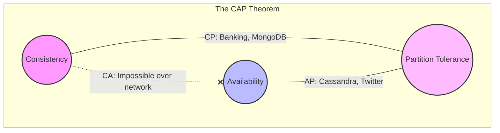

# Introduction to System Design

---

# Table of Contents

* Introduction
* Learning Objectives
* Prerequisites
* Why This Topic Exists
* The Shift in Mindset
* Core Concepts: The CAP Theorem
* Architecture Diagram
* Real-World Analogy
* How to Prepare for Interviews
* The Interview Framework
* Interview Questions
* Quiz
* Exercises
* Summary
* Key Takeaways
* Further Reading
* Next Chapter

---

# Introduction

Welcome to System Design. If you have completed the Go Concurrency curriculum, you know how to write hyper-optimized, thread-safe code that runs perfectly on a single computer. But what happens when a single computer is no longer enough? What happens when you have millions of users, petabytes of data, and your single powerful server catches on fire?

System Design is the architectural process of defining the components, modules, interfaces, and data for a system to satisfy specified requirements. It is the art of scaling software across thousands of computers while pretending it's just one seamless application.

---

# Learning Objectives

After completing this chapter you will be able to:

* Understand the fundamental goal of system design.
* Recognize the shift in mindset required to move from coding to architecture.
* Define and explain the CAP Theorem.
* Understand the tradeoffs inherent in all distributed systems.

---

# Prerequisites

Before reading this chapter you should have:

* A solid understanding of backend programming (e.g., HTTP, JSON, basic database queries).
* A basic understanding of what a server and a database are.

---

# Why This Topic Exists

As a Junior or Mid-level engineer, you are typically handed a Jira ticket: *"Add an endpoint to update the user's email."* You write the Go code, query the database, write a unit test, and merge it.

As a Senior engineer, you are handed a vague problem: *"We need a global chat system that can handle 10 million concurrent connections with less than 50ms latency."* 

There is no framework or programming language that solves this out of the box. You cannot solve this by just "writing better code." You must solve it by designing a distributed architecture consisting of load balancers, WebSockets, caching layers, message queues, and partitioned databases. That is why System Design exists.

---

# The Shift in Mindset

When transitioning to system design, you must embrace a new reality:

1. **Everything Fails**: Networks partition, hard drives crash, and servers lose power. Your system must be designed to expect failure and recover automatically.
2. **There are No Right Answers**: In system design, there are only trade-offs. You will constantly weigh Latency vs. Throughput, Consistency vs. Availability, and Cost vs. Performance.
3. **Hardware is Cheap, Engineers are Expensive**: Sometimes the best architectural decision is to buy a bigger server rather than spending 6 months engineering a complex microservice architecture.

---

# Core Concepts: The CAP Theorem

The fundamental law of distributed systems is the **CAP Theorem** (or Brewer's Theorem). It states that a distributed data store can only guarantee two out of the following three properties simultaneously:

1. **Consistency (C)**: Every read receives the most recent write or an error. If a user updates their password, any subsequent read by any node must return the new password.
2. **Availability (A)**: Every request receives a (non-error) response, without the guarantee that it contains the most recent write. Even if some servers fail, the system stays up.
3. **Partition Tolerance (P)**: The system continues to operate despite an arbitrary number of messages being dropped (or delayed) by the network between nodes.

### The Reality of CAP
In distributed systems spanning multiple physical machines, network partitions (P) are inevitable. Wires get cut; routers crash. Because you **must** support Partition Tolerance (P), the true choice in System Design is choosing between **Consistency (CP)** or **Availability (AP)** when the network fails.

* **CP System (Consistency + Partition Tolerance)**: If a network link goes down, the system will return an error (sacrificing Availability) rather than returning stale data. Example: A banking ledger. You cannot allow someone to see a stale account balance.
* **AP System (Availability + Partition Tolerance)**: If a network link goes down, the system will return the data it has, even if it might be slightly out of date (sacrificing Consistency). Example: A social media feed. It's okay if you don't see a friend's like on a post for a few seconds, as long as the app doesn't crash.

---

# Architecture Diagram

---

# Real-World Analogy

### The Restaurant Franchise (CAP Theorem)
Imagine you own a franchise of two restaurants: one in New York and one in Los Angeles. You want a unified global menu.

* **Partition Tolerance (P)**: The phone line between the two restaurants gets cut. They cannot talk to each other.
* **Consistency (C)**: A manager updates the price of a burger to $10 in NY. If someone in LA asks for the price, they must be told $10. But since the phone line is cut, the LA restaurant doesn't know the new price. To be *Consistent*, the LA restaurant must refuse to answer (sacrifice Availability) until the phone line is restored.
* **Availability (A)**: The LA restaurant decides to stay open. When asked for the price, they say $8 (the old price). They remained *Available*, but sacrificed *Consistency*.

---

# How to Prepare for Interviews

System Design interviews are notoriously open-ended. The interviewer isn't looking for a "correct" answer; they are evaluating your ability to communicate, gather requirements, weigh trade-offs, and structure your thoughts. 

**Top Tips for Preparation:**
1. **Never jump straight to the design**: If asked to "Design Twitter," do not immediately draw a database. Spend the first 5 minutes asking clarifying questions.
2. **Drive the conversation**: You should be doing 80% of the talking. Treat the interviewer as a coworker you are brainstorming with, not an examiner.
3. **Know your numbers**: Memorize rough latency numbers (L1 cache vs RAM vs SSD vs Network). Be comfortable with rough back-of-the-envelope estimations (e.g., 1 million requests/day = ~12 requests/second).
4. **Be honest about trade-offs**: If you choose MongoDB over PostgreSQL, explicitly state *why*, and acknowledge the downsides of your choice (e.g., lack of ACID transactions).

---

# The Interview Framework

When you walk into a System Design interview, always follow this 5-step framework:

1. **Requirements Gathering (5 mins)**: Define Functional requirements (what the system does) and Non-Functional requirements (latency, throughput, availability).
2. **Estimation (5 mins)**: Calculate expected traffic, storage needs, and bandwidth.
3. **High-Level Design (10 mins)**: Draw the core components (Client -> Load Balancer -> Web Server -> Database).
4. **Deep Dive (15 mins)**: Zoom into the most complex part of the system (e.g., the news feed generation algorithm, or the database sharding strategy).
5. **Bottlenecks & Trade-offs (5 mins)**: Identify single points of failure and explain how you would fix them if traffic 100x'd.

---

# Interview Questions

## Beginner
**Q**: What is the CAP theorem?
*Answer*: The CAP theorem states that a distributed system can only guarantee two out of three properties: Consistency, Availability, and Partition Tolerance. Because network partitions (P) are unavoidable, you must choose between Consistency (CP) and Availability (AP).

## Intermediate
**Q**: If you are designing a banking system, would you prioritize Availability or Consistency?
*Answer*: Consistency. If a network partition occurs, it is better to deny a transaction (sacrificing Availability) than to allow an overdraft or show an incorrect balance (sacrificing Consistency).

## Advanced
**Q**: Explain a scenario where eventual consistency is perfectly acceptable.
*Answer*: A YouTube video view count. If a video goes viral and 100,000 people watch it simultaneously, it is not critical that every user sees the exact same view count at the exact same millisecond. The system can prioritize Availability and high throughput, allowing the view count to eventually become consistent across all servers.

---

# Quiz

## Multiple Choice Questions
**1. Which of the following is an example of a Non-Functional Requirement?**
A) The system must allow users to upload photos.
B) The system must send an email after registration.
C) The system must have 99.99% uptime and < 200ms latency.
*Answer*: C

## True or False
**If you are asked to design Uber, you should immediately start drawing the database schema on the whiteboard.**
*Answer*: False. You must start by asking clarifying questions to define the scope and requirements of the system before designing anything.

---

# Exercises

## Beginner
Write down three clarifying questions you would ask an interviewer if they said: "Design a URL shortener like bit.ly." (Think about read/write ratio, link expiration, and custom aliases).

## Intermediate
Calculate the storage requirements for a service that receives 10,000 new images per second, where the average image size is 2MB. How much storage is required for 1 year?

---

# Summary

System Design is the macro-level engineering of software. It requires zooming out from functions and structs, and looking at servers, networks, and databases as the building blocks. Your primary job as an architect is to understand the requirements of the product and make the correct trade-offs—choosing when to prioritize perfect consistency, and when to prioritize high availability.

---

# Key Takeaways

* ✔ System Design is about scaling beyond a single machine.
* ✔ Everything fails in a distributed system; design for resilience.
* ✔ There are no perfect architectures, only trade-offs.
* ✔ The CAP theorem forces you to choose between Consistency and Availability during network failures.

---

# Further Reading
* [An Illustrated Proof of the CAP Theorem](https://mwhittaker.github.io/consistency_in_distributed_systems/2_cap_theorem.html)

---

# Next Chapter
➡️ **Next:** `02-Scalability.md`
