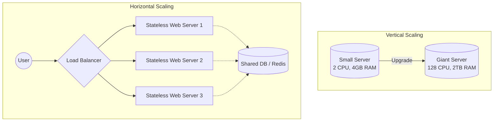

# Scalability: Vertical vs. Horizontal

---

# Table of Contents

* Introduction
* Learning Objectives
* Prerequisites
* Why This Topic Exists
* Vertical Scaling (Scaling Up)
* Horizontal Scaling (Scaling Out)
* The Secret to Scaling Out: Statelessness
* Architecture Diagram
* Real-World Analogy
* Interview Questions
* Quiz
* Exercises
* Summary
* Key Takeaways
* Further Reading
* Next Chapter

---

# Introduction

When an application receives more traffic than its current hardware can handle, it becomes slow, drops requests, or crashes entirely. **Scalability** is the ability of a system to handle a growing amount of work by adding resources. 

In system design, there are two primary ways to add these resources: **Scaling Up** (Vertical) and **Scaling Out** (Horizontal). Understanding when and how to use each is the foundational building block of any distributed architecture.

---

# Learning Objectives

After completing this chapter you will be able to:

* Define Vertical and Horizontal scaling.
* Identify the pros and cons of both approaches.
* Understand the critical importance of **Statelessness** when scaling out.
* Confidently explain which scaling method to use during a system design interview.

---

# Prerequisites

Before reading this chapter you should know:

* System Design Goals & CAP Theorem (`01-Introduction.md`)

---

# Why This Topic Exists

At a startup, you often begin with a single web server and a single database. If your app goes viral, the server's CPU hits 100% and the application dies. As an engineer, your immediate task is to keep the site online. If you choose the wrong scaling strategy, you might spend weeks rewriting your codebase for a complex microservices architecture when a simple server upgrade would have solved the problem instantly. 

Knowing the boundaries of scalability prevents over-engineering and saves companies money.

---

# Vertical Scaling (Scaling Up)

Vertical scaling means adding more power (CPU, RAM, faster Storage) to your existing server. 

### Pros
* **Simplicity**: You do not need to change a single line of your Go code. 
* **Less Administrative Overhead**: You are still managing only one server, which makes deployments, monitoring, and logging incredibly simple.
* **No Network Latency**: Because all processes run on the same machine, there is zero network overhead between internal components.

### Cons
* **Hard Hardware Limits**: There is a physical limit to how much RAM and CPU you can put into a single machine. Once you buy the biggest AWS EC2 instance, you cannot scale vertically anymore.
* **Single Point of Failure (SPOF)**: If the server's hardware fails, or if it needs to reboot for a security patch, your entire website goes offline.
* **Diminishing Returns**: Doubling the processing power of an already massive server costs exponentially more than buying a second, smaller server.

---

# Horizontal Scaling (Scaling Out)

Horizontal scaling means adding more servers to your pool of resources and distributing the traffic among them using a Load Balancer.

### Pros
* **Infinite Scalability**: If you need more power, you simply boot up another server. You can scale from 1 server to 10,000 servers.
* **High Availability / Fault Tolerance**: If one server catches fire, the Load Balancer simply stops sending traffic to it and routes requests to the healthy servers. The user never notices a disruption.
* **Cost Efficiency**: You can use cheaper, commodity hardware (smaller servers) and scale them up and down dynamically based on traffic (e.g., auto-scaling groups).

### Cons
* **High Complexity**: You now have a distributed system. Deploying code to 100 servers, aggregating their logs, and monitoring their health requires a DevOps infrastructure.
* **Data Consistency**: If Server A saves a user's uploaded image to its local hard drive, Server B won't be able to find it. Data must be centralized.
* **Requires Statelessness**: Your application code must be fundamentally designed to run horizontally.

---

# The Secret to Scaling Out: Statelessness

You cannot simply put a Load Balancer in front of your Go app and expect it to work if your app is **Stateful**.

**The Problem (Stateful):**
Imagine your web server stores user login sessions in local memory (RAM). 
1. Alice logs in. The Load Balancer sends her request to **Server 1**. Server 1 saves `Alice: Logged In` in its memory.
2. Alice clicks "View Profile". The Load Balancer routes her second request to **Server 2** (to balance the load).
3. **Server 2** checks its local memory, sees no record of Alice, and redirects her back to the login page! 

**The Solution (Stateless):**
To scale horizontally, the web tier must be **Stateless**. A stateless server retains no user-specific data between requests. 
Instead of saving the session in local RAM, **Server 1** saves the session to a shared, centralized data store like **Redis**. When Alice's next request hits **Server 2**, Server 2 queries Redis, verifies she is logged in, and serves the profile page.

---

# Architecture Diagram

---

# Real-World Analogy

### The Grocery Store Checkout

* **Vertical Scaling**: You have one cashier. To speed up the line, you replace them with the fastest, most experienced cashier in the world. They process items at lightning speed, but eventually, the line gets too long because one person can only scan so fast.
* **Horizontal Scaling**: You open 5 more checkout lanes with average-speed cashiers. The total throughput of the store is massively increased, but you now need a system (a line manager / Load Balancer) to direct customers to the open lanes.

---

# Interview Questions

## Beginner
**Q**: What is a Single Point of Failure (SPOF)?
*Answer*: A part of a system that, if it fails, will stop the entire system from working. A single, vertically scaled server is a SPOF.

## Intermediate
**Q**: If vertical scaling has a hard physical limit, why would anyone ever choose it over horizontal scaling?
*Answer*: Vertical scaling requires zero architectural changes and zero network overhead. If a company can solve their immediate performance bottleneck by simply paying AWS $500/month for a larger server, it is vastly cheaper than spending 6 months of engineering time ($100,000+) rewriting a monolith into a horizontally scaled, stateless architecture. 

## Advanced
**Q**: Can you horizontally scale a relational database like PostgreSQL?
*Answer*: Yes, but it is incredibly difficult compared to scaling a web server. While you can easily add "Read Replicas" to scale out read-heavy traffic, scaling *writes* requires **Sharding** (partitioning the data across multiple database servers), which introduces massive application-level complexity for joins and transactions.

---

# Quiz

## Multiple Choice Questions
**1. Which of the following is required for a web server tier to be safely scaled horizontally behind a round-robin load balancer?**
A) It must use a NoSQL database.
B) It must be entirely stateless.
C) It must run inside a Docker container.
*Answer*: B

## True or False
**Vertical scaling provides high availability and fault tolerance.**
*Answer*: False. Vertical scaling inherently relies on a single machine. If that machine fails, the system goes offline.

---

# Exercises

## Beginner
Identify two features in a standard web application (e.g., an e-commerce site) that are naturally "stateful" and would need to be moved to a shared datastore before horizontal scaling.

## Intermediate
Calculate the cost tradeoff: A company's server is maxing out its 32GB of RAM. Upgrading to a 64GB RAM instance costs an extra $200/month. The engineering team estimates it will take 100 hours (at $100/hr) to refactor the stateful monolith to be stateless for horizontal scaling. How many months of vertical scaling pays for the refactoring?

---

# Summary

When designing a system from scratch, the golden rule is to build the web tier to be stateless from day one. This allows you to effortlessly scale out horizontally when traffic spikes, ensuring high availability and fault tolerance. However, never underestimate the power of vertical scaling for databases or legacy systems as a rapid, low-complexity solution to immediate performance bottlenecks.

---

# Key Takeaways

* ✔ Vertical Scaling = Bigger Server. Horizontal Scaling = More Servers.
* ✔ Vertical scaling is easy but has hard limits and creates a SPOF.
* ✔ Horizontal scaling provides infinite limits and high availability but requires complex infrastructure.
* ✔ Web servers must be **Stateless** to scale horizontally.

---

# Further Reading
* [The Twelve-Factor App: Processes (Statelessness)](https://12factor.net/processes)

---

# Next Chapter
➡️ **Next:** `03-Network-Protocols.md`
