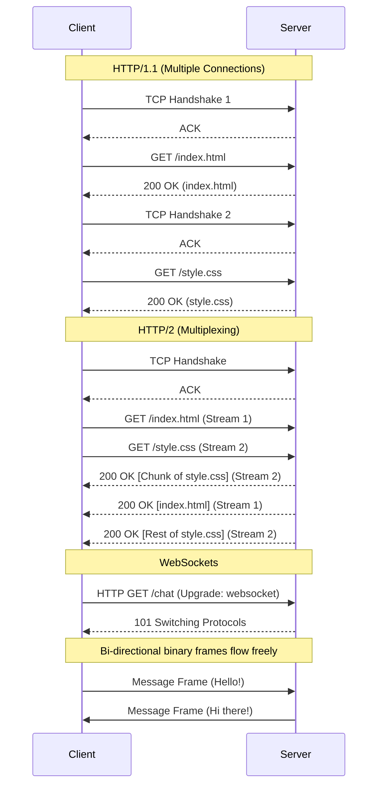

# Network Protocols: HTTP/2, WebSockets, and the OSI Model

---

# Table of Contents

* Introduction
* Learning Objectives
* Prerequisites
* Why This Topic Exists
* The OSI Model (A Pragmatic View)
* HTTP/1.1 vs HTTP/2
* WebSockets
* Code Examples & Good Principles
* Architecture Diagram
* Real-World Analogy
* Interview Questions
* Quiz
* Exercises
* Summary
* Key Takeaways
* Further Reading
* Next Chapter

---

# Introduction

When designing large-scale systems, the way services communicate over the network is just as important as the logic running inside them. The internet runs on standardized protocols. Understanding how these protocols work under the hood allows you to choose the right communication pattern for your application, whether it's fetching static assets, streaming video, or powering a real-time multiplayer game.

---

# Learning Objectives

After completing this chapter you will be able to:

* Understand the relevant layers of the OSI model for backend engineering.
* Explain the critical performance differences between HTTP/1.1 and HTTP/2.
* Identify when to use RESTful HTTP versus real-time WebSockets.
* Write robust network code in Go using industry best practices.

---

# Prerequisites

Before reading this chapter you should know:

* Basic understanding of IP addresses and ports.
* Scalability concepts (`02-Scalability.md`).

---

# Why This Topic Exists

A common mistake made by junior developers is treating every API request identically. If you build a real-time chat application using standard HTTP polling, you will overwhelm your servers with connection overhead and drain the battery of mobile clients. Conversely, if you try to use WebSockets for simple, cacheable blog posts, you introduce unnecessary stateful complexity to your backend. Knowing your network protocols is the key to building efficient, fast, and stable systems.

---

# The OSI Model (A Pragmatic View)

The Open Systems Interconnection (OSI) model conceptualizes how data travels over a network in 7 layers. For modern system design, you primarily need to care about three:

* **Layer 3 (Network)**: Routing packets across the internet (IP).
* **Layer 4 (Transport)**: Ensuring data gets to the right port on a machine.
  * **TCP**: Reliable, ordered, but slower (requires a 3-way handshake). Used for HTTP, DB queries.
  * **UDP**: Unreliable, unordered, but blazingly fast. Used for VoIP, video streaming, gaming.
* **Layer 7 (Application)**: How applications interpret the data (HTTP, WebSockets, gRPC, SMTP).

---

# HTTP/1.1 vs HTTP/2

HTTP is the backbone of the web. It operates at Layer 7 over TCP (Layer 4). 

### HTTP/1.1 (The Old Standard)
* **Text-based**: Easy to read and debug, but less efficient to parse.
* **Head-of-Line Blocking**: In HTTP/1.1, if a client requests 5 images, they are often downloaded sequentially. If Image 1 is huge and gets stuck, Images 2-5 are blocked waiting in line.
* **Connection Heavy**: Browsers have to open multiple TCP connections (typically 6 per domain) to fetch assets in parallel, increasing latency due to multiple TCP handshakes.

### HTTP/2 (The Modern Standard)
* **Binary Framing**: Data is split into smaller binary frames, making it highly efficient for machines to parse.
* **Multiplexing**: Solves Head-of-Line blocking. Multiple requests and responses can be interleaved simultaneously over a **single** TCP connection.
* **Header Compression (HPACK)**: Reduces the overhead of sending the same headers (like Cookies or User-Agents) repeatedly.
* **Server Push**: The server can preemptively send resources (like CSS or JS) to the client before the client even asks for them.

---

# WebSockets

HTTP is inherently **unidirectional** and **request-response** based. The client must initiate the request, and the server replies. The server cannot independently reach out to the client.

**WebSockets** provide a **full-duplex, bidirectional** communication channel over a single, long-lived TCP connection. 

* **The Handshake**: A WebSocket connection begins as a standard HTTP request with an `Upgrade: websocket` header. If the server agrees, the connection is kept alive.
* **Low Overhead**: Unlike HTTP polling (where headers are sent with every single request), WebSocket frames have minimal overhead (just a few bytes), making them perfect for high-frequency data.
* **Use Cases**: Chat applications (WhatsApp, Discord), real-time financial trading tickers, collaborative editing (Google Docs).

---

# Code Examples & Good Principles

Writing effective network code in Go requires defensive programming. Never trust the network to be reliable or fast.

### 1. HTTP Server with Timeouts (Good Principle)

**Bad Practice**: Using the default `http.ListenAndServe()` without timeouts. A slow client (or a malicious Slowloris attack) can hold a connection open forever, eventually exhausting your server's file descriptors.

**Good Practice**: Always configure `ReadTimeout`, `WriteTimeout`, and `IdleTimeout`.

```go
package main

import (
	"fmt"
	"log"
	"net/http"
	"time"
)

func helloHandler(w http.ResponseWriter, r *http.Request) {
	fmt.Fprintln(w, "Hello, secure and robust world!")
}

func main() {
	mux := http.NewServeMux()
	mux.HandleFunc("/", helloHandler)

	// Principle: Always enforce timeouts to prevent resource exhaustion.
	server := &http.Server{
		Addr:         ":8080",
		Handler:      mux,
		ReadTimeout:  5 * time.Second,  // Max time to read request from client
		WriteTimeout: 10 * time.Second, // Max time to write response to client
		IdleTimeout:  120 * time.Second, // Max time for connections using TCP Keep-Alive
	}

	log.Println("Starting robust HTTP server on :8080")
	log.Fatal(server.ListenAndServe())
}
```

### 2. HTTP Client with Context (Good Principle)

**Bad Practice**: Making external API calls without a cancellation mechanism. If the external API hangs, your Go goroutine hangs.

**Good Practice**: Use `context.WithTimeout` for every outbound request.

```go
package main

import (
	"context"
	"fmt"
	"io"
	"log"
	"net/http"
	"time"
)

func fetchExternalData() error {
	// Principle: Never make external network calls without a bounded context.
	ctx, cancel := context.WithTimeout(context.Background(), 3*time.Second)
	defer cancel() // Ensure resources are cleaned up

	req, err := http.NewRequestWithContext(ctx, http.MethodGet, "https://api.github.com", nil)
	if err != nil {
		return err
	}

	client := &http.Client{} // You can also configure a custom Transport here
	resp, err := client.Do(req)
	if err != nil {
		return fmt.Errorf("request failed: %w", err)
	}
	defer resp.Body.Close()

	body, _ := io.ReadAll(resp.Body)
	fmt.Printf("Received %d bytes\n", len(body))
	return nil
}

func main() {
	if err := fetchExternalData(); err != nil {
		log.Fatal(err)
	}
}
```

---

# Architecture Diagram



---

# Real-World Analogy

* **UDP**: Shouting into a crowd. You don't know if the specific person heard you, but it's very fast.
* **TCP / HTTP/1.1**: Sending a registered letter via the post office. You get a receipt that it was delivered, but you have to fill out forms and wait for the postman every single time.
* **HTTP/2**: Ordering from a catalog, but the company packs multiple items into one giant box, mixing the parts of different items together to save space, and sends it via one truck.
* **WebSockets**: A direct telephone call. Once the call is connected, both parties can talk and listen simultaneously without having to redial.

---

# Interview Questions

## Beginner
**Q**: What is the difference between TCP and UDP?
*Answer*: TCP is connection-oriented, reliable, and guarantees order. UDP is connectionless, faster, but does not guarantee delivery or order.

## Intermediate
**Q**: How does HTTP/2 solve Head-of-Line blocking at the application layer?
*Answer*: Through multiplexing. HTTP/2 breaks requests and responses into smaller frames and interleaves them over a single TCP connection. If one large resource is slow to generate, smaller resources can still be transmitted via other frames concurrently. 

## Advanced
**Q**: If WebSockets are so efficient, why don't we use them for everything instead of REST/HTTP?
*Answer*: WebSockets maintain a persistent, stateful connection on the server. Millions of idle WebSocket connections require significant memory (RAM) and file descriptors. Furthermore, WebSockets bypass standard HTTP infrastructure like caching proxies (CDNs) and make load balancing significantly more complex (requiring sticky sessions or a pub/sub backplane). Use HTTP for cacheable, request-response data.

---

# Quiz

## Multiple Choice Questions
**1. Which OSI Layer is responsible for routing data across the internet via IP addresses?**
A) Layer 7 (Application)
B) Layer 4 (Transport)
C) Layer 3 (Network)
*Answer*: C

## True or False
**HTTP/2 requires multiple TCP connections to fetch multiple assets in parallel.**
*Answer*: False. HTTP/2 uses multiplexing to fetch multiple assets concurrently over a single TCP connection.

---

# Exercises

## Beginner
Modify the provided "HTTP Server with Timeouts" code to add a `ReadHeaderTimeout` specifically targeting Slowloris attacks.

## Intermediate
Write a simple Go script using the `gorilla/websocket` package to establish a WebSocket server that echoes back any message it receives. Use `context` to gracefully shut down the server when an interrupt signal is received.

---

# Summary

Choosing the right network protocol is a critical architectural decision. Rely on HTTP/REST (especially HTTP/2 or HTTP/3) for the vast majority of your APIs due to its simplicity, cacheability, and massive ecosystem of tooling. Reserve WebSockets for scenarios that genuinely require low-latency, bidirectional, real-time communication. And regardless of the protocol, always code defensively: enforce timeouts, use context for cancellation, and never trust the network.

---

# Key Takeaways

* ✔ HTTP/2 uses multiplexing over a single TCP connection, eliminating head-of-line blocking.
* ✔ WebSockets are for full-duplex, real-time communication (chat, gaming).
* ✔ Never write a Go HTTP server or client without explicit timeouts.
* ✔ Always bind outbound network requests to a `context.Context`.

---

# Further Reading
* [High Performance Browser Networking by Ilya Grigorik](https://hpbn.co/)
* [Go `net/http` documentation](https://pkg.go.dev/net/http)

---

# Next Chapter
➡️ **Next:** `04-API-Design.md`
