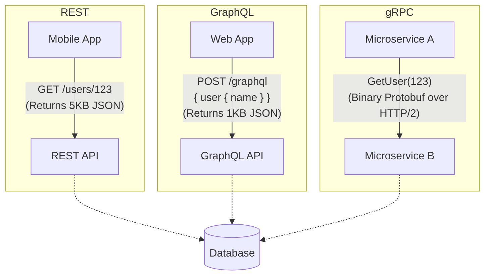

# API Design: REST vs. gRPC vs. GraphQL

---

# Table of Contents

* Introduction
* Learning Objectives
* Prerequisites
* Why This Topic Exists
* REST (Representational State Transfer)
* gRPC (gRPC Remote Procedure Call)
* GraphQL
* Code Examples & Good Principles
* Architecture Diagram
* Real-World Analogy
* Interview Questions
* Quiz
* Exercises
* Summary
* Key Takeaways
* Further Reading
* Next Chapter

---

# Introduction

When building microservices or exposing your backend to client applications (web, mobile), you need a structured way for them to communicate. This structured communication boundary is your **API** (Application Programming Interface). 

In modern system design, there are three heavyweight contenders for API design: **REST**, **gRPC**, and **GraphQL**. Each has distinct trade-offs regarding performance, flexibility, and developer experience. Choosing the wrong API paradigm can lead to tightly coupled services, massive network payloads, or extreme developer frustration.

---

# Learning Objectives

After completing this chapter you will be able to:

* Articulate the core principles of REST, gRPC, and GraphQL.
* Understand when to use which API paradigm based on system requirements.
* Grasp the concepts of over-fetching and under-fetching.
* Explain why gRPC is the industry standard for internal microservice-to-microservice communication.

---

# Prerequisites

Before reading this chapter you should know:

* HTTP and Network Protocols (`03-Network-Protocols.md`).

---

# Why This Topic Exists

A classic system design interview mistake is defaulting to REST for *everything*. If you are designing an internal, high-throughput microservice architecture (like Uber's dispatch system) and you propose using JSON-over-HTTP/1.1 (REST), the interviewer will flag your solution as inefficient. Conversely, if you propose gRPC for a public-facing API consumed by external developers in Python, JavaScript, and Ruby, you are introducing massive overhead and friction. 

Knowing the strengths and weaknesses of these API patterns is crucial for architectural decision-making.

---

# REST (Representational State Transfer)

REST is the undisputed king of public APIs. It leverages standard HTTP methods (`GET`, `POST`, `PUT`, `DELETE`) to perform CRUD operations on "Resources" (URLs).

### Pros
* **Ubiquity**: Every language and framework speaks REST natively.
* **Cacheability**: Because it uses standard HTTP methods, responses can be easily cached at the network layer (e.g., using CDNs).
* **Statelessness**: True REST is stateless, making it easy to scale horizontally.

### Cons
* **Over-fetching**: A client requests `/api/users/123` just to get the user's name, but the server returns a massive JSON payload with the user's entire history, addresses, and metadata.
* **Under-fetching**: A client needs a user's name, their recent posts, and their followers. In a strict REST architecture, this might require three separate API calls (`/users/123`, `/users/123/posts`, `/users/123/followers`).
* **Text-based Payload**: Typically uses JSON, which is heavier to parse and transmit than binary formats.

---

# gRPC (gRPC Remote Procedure Call)

Developed by Google, gRPC is designed for massive performance. Instead of asking for a resource, a client executes a function on a remote server as if it were a local function. It uses **Protocol Buffers (Protobuf)** as its interface definition language and binary serialization format, and it runs exclusively over **HTTP/2**.

### Pros
* **Blazing Fast**: Protobuf serializes into a tightly packed binary format, which is much smaller and faster to parse than JSON.
* **Strongly Typed**: The API contract is strictly defined in a `.proto` file. Both client and server code are auto-generated from this file, ensuring type safety.
* **Streaming**: Because it runs on HTTP/2, gRPC natively supports client streaming, server streaming, and bi-directional streaming.

### Cons
* **Poor Browser Support**: Browsers cannot native speak raw HTTP/2 frames in the way gRPC requires, necessitating a translation proxy (like gRPC-Web) for frontend clients.
* **Human Readability**: You cannot simply `curl` a gRPC endpoint and read the binary output. It requires special tooling to debug.

---

# GraphQL

Developed by Facebook, GraphQL was built to solve the over-fetching and under-fetching problems of REST, specifically for mobile and frontend clients. Instead of multiple endpoints, a GraphQL API typically has a single endpoint (`/graphql`). The client sends a query specifying *exactly* the fields it wants, and the server returns exactly that.

### Pros
* **No Over/Under-fetching**: The client dictates the shape of the response.
* **Rapid Frontend Development**: Frontend teams do not have to wait for backend teams to build custom REST endpoints for new UI views.

### Cons
* **Complex Caching**: Because everything goes through a single `POST /graphql` endpoint, you cannot use standard HTTP caching mechanisms (like CDNs) easily.
* **Performance Pitfalls (N+1 Problem)**: A naive GraphQL implementation can easily cause a single nested query to trigger hundreds of database queries (the N+1 problem) if not carefully batched (e.g., using DataLoaders).

---

# Code Examples & Good Principles

### 1. REST API Design Principles in Go
**Good Practice**: Use appropriate HTTP status codes and standard URL structures (nouns, not verbs). 

```go
package main

import (
	"encoding/json"
	"net/http"
)

type User struct {
	ID   string `json:"id"`
	Name string `json:"name"`
}

// Principle: URLs should be nouns (/users), not verbs (/getUsers).
// Principle: Use HTTP methods to define the action (GET for reading, POST for creating).
func userHandler(w http.ResponseWriter, r *http.Request) {
	switch r.Method {
	case http.MethodGet:
		// Simulated fetching
		user := User{ID: "123", Name: "Gopher"}
		w.Header().Set("Content-Type", "application/json")
		// Principle: Return 200 OK for successful GET
		w.WriteHeader(http.StatusOK) 
		json.NewEncoder(w).Encode(user)
	case http.MethodPost:
		// Principle: Return 201 Created for successful creation
		w.WriteHeader(http.StatusCreated) 
		w.Write([]byte(`{"message": "user created"}`))
	default:
		// Principle: Return 405 Method Not Allowed
		http.Error(w, "Method not allowed", http.StatusMethodNotAllowed)
	}
}
```

### 2. gRPC Protobuf Definition (The Contract)
**Good Practice**: Always define your API contracts strongly before writing code, especially for internal microservices.

```protobuf
syntax = "proto3";
package users;
option go_package = "/userspb";

// The Request payload
message GetUserRequest {
    string user_id = 1;
}

// The Response payload
message GetUserResponse {
    string id = 1;
    string name = 2;
}

// The Service Definition (The "Procedure")
service UserService {
    rpc GetUser (GetUserRequest) returns (GetUserResponse);
}
```

---

# Architecture Diagram



---

# Real-World Analogy

* **REST**: Ordering off a fixed menu at a restaurant. If you order the "Burger Meal" (the resource), you get the burger, fries, and a drink, even if you only wanted the burger (Over-fetching).
* **GraphQL**: A custom salad bar. You give the server a precise list: "I want lettuce, 3 tomatoes, and ranch." You get exactly that, nothing more, nothing less.
* **gRPC**: A professional kitchen where the chefs communicate via rapid, highly efficient shorthand signals (binary). It's incredibly fast and coordinated, but a regular customer (a web browser) wouldn't understand what they are saying.

---

# Interview Questions

## Beginner
**Q**: What does it mean for a REST API to be "Stateless"?
*Answer*: It means the server does not store any client context or session data between requests. Every single request from the client must contain all the information necessary for the server to understand and process it.

## Intermediate
**Q**: If you are designing the communication layer between 50 internal microservices written in Go and Java, which API pattern would you choose and why?
*Answer*: gRPC. Internal microservices require low latency and high throughput. gRPC's binary Protobuf serialization over HTTP/2 is vastly more efficient than parsing JSON over HTTP/1.1. Furthermore, the strongly-typed `.proto` contracts ensure safe, backward-compatible communication between different languages.

## Advanced
**Q**: Explain the N+1 query problem in the context of GraphQL.
*Answer*: In GraphQL, queries can be deeply nested (e.g., fetching a list of 100 posts, and for each post, fetching its author). If the backend is naive, it will execute 1 query to get the 100 posts, and then execute 100 separate database queries to get the author for each post (1 + N queries). This destroys performance. It is mitigated using techniques like DataLoaders, which batch and cache the author queries into a single `SELECT * FROM authors WHERE id IN (...)`.

---

# Quiz

## Multiple Choice Questions
**1. Which protocol does gRPC strictly require to function?**
A) HTTP/1.1
B) WebSockets
C) HTTP/2
*Answer*: C

## True or False
**GraphQL completely eliminates the need for a backend database.**
*Answer*: False. GraphQL is merely an API query language and runtime for fulfilling those queries. It still requires a data layer (like PostgreSQL or MongoDB) behind it to actually store and retrieve data.

---

# Exercises

## Beginner
Look at a public API you use (like Twitter, GitHub, or Reddit). Identify an endpoint where you experience "Over-fetching" (receiving massive amounts of data you don't actually need for a simple task).

## Intermediate
Write a `.proto` file defining a gRPC service for a simple `Calculator` that has an `Add` RPC. The `Add` RPC should take two integers as input and return their sum.

---

# Summary

There is no "best" API design; there is only the right tool for the job. 
* Use **REST** for public-facing, generic APIs that need to be universally understood and easily cached.
* Use **GraphQL** when your frontend application is highly dynamic and you need to optimize data fetching over constrained mobile networks.
* Use **gRPC** for internal microservice-to-microservice communication where raw performance, strict typing, and low latency are non-negotiable.

---

# Key Takeaways

* ✔ REST uses URLs as nouns and HTTP methods as verbs.
* ✔ GraphQL solves over-fetching and under-fetching but makes caching difficult.
* ✔ gRPC uses binary Protobufs over HTTP/2, making it lightning-fast but harder to debug via standard browser tools.
* ✔ The N+1 problem is a massive risk when implementing GraphQL.

---

# Further Reading
* [gRPC Official Documentation](https://grpc.io/docs/)
* [GraphQL Official Documentation](https://graphql.org/learn/)
* [REST API Design Rulebook](https://www.oreilly.com/library/view/rest-api-design/9781449317904/)

---

# Next Chapter
➡️ **Next:** `05-Load-Balancers.md`
