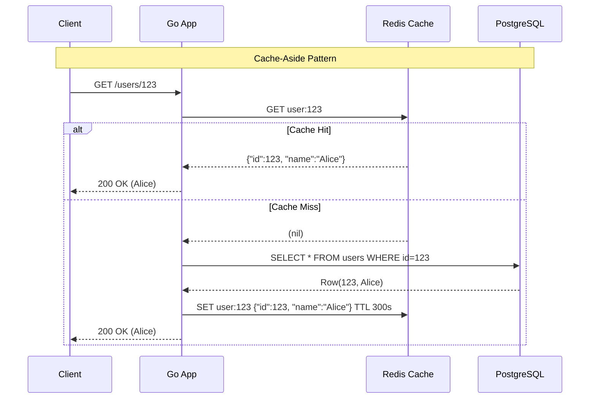

# Caching: Redis, Memcached, Cache-Aside, Write-Through

---

# Table of Contents

* Introduction
* Learning Objectives
* Prerequisites
* Why This Topic Exists
* What is Caching?
* Common Caching Strategies
* Eviction Policies
* Redis vs Memcached
* Code Examples & Good Principles
* Architecture Diagram
* Real-World Analogy
* Interview Questions
* Quiz
* Exercises
* Summary
* Key Takeaways
* Further Reading
* Next Chapter

---

# Introduction

Databases are the source of truth for your application, but they are relatively slow. Reading from a hard drive (even an SSD) and performing complex SQL joins takes tens or hundreds of milliseconds. If you have millions of users requesting the same data (like a viral tweet or a product catalog), hitting the database for every single request will cause it to crash.

**Caching** solves this by temporarily storing frequently accessed data in ultra-fast, in-memory data stores. A memory read takes microseconds—orders of magnitude faster than a database read.

---

# Learning Objectives

After completing this chapter you will be able to:

* Explain the role of caching in reducing database load and improving API latency.
* Implement the **Cache-Aside** and **Write-Through** patterns.
* Understand eviction policies like LRU (Least Recently Used) and TTL (Time To Live).
* Articulate the differences between Redis and Memcached.
* Mitigate the "Cache Stampede" (Thundering Herd) problem in Go.

---

# Prerequisites

Before reading this chapter you should know:

* Horizontal Scaling (`02-Scalability.md`).
* L7 Load Balancing (`05-Load-Balancers.md`).

---

# Why This Topic Exists

Caching is the ultimate "cheat code" for system performance, but it introduces the hardest problem in computer science: **Cache Invalidation** (keeping the cache and the database in sync). 

During a system design interview, if you propose throwing Redis at a problem without explaining *how* the data gets there and *when* it expires, you will fail. Furthermore, naïve caching code can lead to race conditions where stale data is served to users indefinitely.

---

# What is Caching?

A cache is a temporary storage area that stores the result of an expensive operation so that subsequent requests can be served much faster. 

While caching can happen at the browser level, the CDN level, or the CPU level, in backend system design, we are usually referring to a **Distributed In-Memory Cache** (a separate cluster of servers dedicated solely to holding data in RAM).

---

# Common Caching Strategies

How do we decide when to put data into the cache and when to update it?

### 1. Cache-Aside (Lazy Loading)
This is the most common pattern.
* **Read**: The application first checks the cache. If data is found (**Cache Hit**), return it. If not found (**Cache Miss**), query the database, save the result in the cache, and then return it.
* **Pros**: Only data that is actually requested gets cached. If a node fails, it's not fatal (just results in DB hits until the cache repopulates).
* **Cons**: The very first time data is requested, the user experiences latency (Cache Miss penalty).

### 2. Write-Through
* **Write**: When the application needs to save data, it writes it to the cache and the database *at the exact same time* (in a single transaction).
* **Pros**: The cache is always perfectly up-to-date. No stale data. 
* **Cons**: Every write operation is slightly slower because it has to write to two places. Most data written might never be read, wasting precious RAM.

### 3. Write-Behind (Write-Back)
* **Write**: The application writes the data *only* to the cache and immediately returns a success to the user. An asynchronous background process later flushes the cache data into the database.
* **Pros**: Blazing fast write speeds. Ideal for highly write-intensive systems (like logging or tracking likes on a video).
* **Cons**: Extreme risk of data loss. If the cache server crashes before flushing to the DB, the data is gone forever.

---

# Eviction Policies

RAM is expensive. You cannot cache everything. When the cache is full, how does it decide what to delete?

* **LRU (Least Recently Used)**: Discards the items that haven't been requested in the longest amount of time. (The industry standard).
* **LFU (Least Frequently Used)**: Discards items that are requested the fewest number of times overall.
* **TTL (Time To Live)**: Not strictly eviction, but an expiration mechanism. You assign a stopwatch to data (e.g., `expire in 60 seconds`). When time runs out, the data deletes itself.

---

# Redis vs Memcached

* **Memcached**: The older, simpler choice. It is a pure, multi-threaded, in-memory key-value store. It stores simple strings.
* **Redis**: The modern standard. It is single-threaded but supports advanced data structures (Lists, Sets, Hashes, Geospatial indexes). It can also persist data to disk and act as a message broker (Pub/Sub). Choose Redis for almost all modern applications.

---

# Code Examples & Good Principles

### The Cache-Aside Pattern in Go (Good Principle)

**Bad Practice**: Storing complex Go structs in Redis without a standard serialization format, or forgetting to set a TTL, leading to a cache that never empties and eventually crashes (OOM - Out of Memory).

**Good Practice**: Always serialize data to JSON (or Protobuf), and **always set a TTL** to ensure stale data eventually naturally rotates out, acting as a failsafe against invalidation bugs.

```go
package main

import (
	"context"
	"database/sql"
	"encoding/json"
	"fmt"
	"log"
	"time"

	"github.com/go-redis/redis/v8"
	_ "github.com/lib/pq"
)

var (
	rdb *redis.Client
	db  *sql.DB
)

type User struct {
	ID   int    `json:"id"`
	Name string `json:"name"`
}

// Principle: Cache-Aside pattern with mandatory TTL
func GetUser(ctx context.Context, userID int) (*User, error) {
	cacheKey := fmt.Sprintf("user:%d", userID)

	// 1. Check Cache
	cachedData, err := rdb.Get(ctx, cacheKey).Result()
	if err == nil {
		// Cache Hit
		log.Println("Cache Hit!")
		var user User
		json.Unmarshal([]byte(cachedData), &user)
		return &user, nil
	} else if err != redis.Nil {
		// Redis error (network issue), fail open and fall through to DB
		log.Printf("Redis error: %v, falling back to DB", err)
	}

	// 2. Cache Miss: Query Database
	log.Println("Cache Miss! Querying DB...")
	var user User
	err = db.QueryRowContext(ctx, "SELECT id, name FROM users WHERE id = $1", userID).Scan(&user.ID, &user.Name)
	if err != nil {
		if err == sql.ErrNoRows {
			return nil, fmt.Errorf("user not found")
		}
		return nil, err
	}

	// 3. Populate Cache
	jsonData, _ := json.Marshal(user)
	// Principle: Always set a TTL (e.g., 5 minutes) to prevent infinite stale data
	err = rdb.Set(ctx, cacheKey, jsonData, 5*time.Minute).Err()
	if err != nil {
		log.Printf("Failed to update cache: %v", err)
		// We log the error but don't fail the request, the user still gets their data
	}

	return &user, nil
}
```

---

# Architecture Diagram



---

# Real-World Analogy

Imagine studying for an exam in a library.
* **The Database**: The library archives in the basement. It holds all human knowledge, but it takes 15 minutes to go down the stairs, find a book, and bring it back up.
* **The Cache**: Your desk. 
* **Cache-Aside**: You get a question. You look at your desk (Cache). If the answer isn't there, you walk to the basement (Database), get the book, and leave it on your desk for next time.
* **LRU Eviction**: Your desk is full. You need a new book from the basement, so you return the book on your desk that you haven't opened in the longest time to make space.

---

# Interview Questions

## Beginner
**Q**: What does a TTL do in Redis?
*Answer*: TTL stands for Time-To-Live. It is an expiration timer attached to a key. Once the timer reaches zero, Redis automatically deletes the key. It acts as a safety net to ensure stale data is eventually refreshed.

## Intermediate
**Q**: If you are using the Cache-Aside pattern and your Redis cluster completely crashes, what happens to your application?
*Answer*: The application will experience a 100% cache miss rate. Every single request will fall through to the database. If the database cannot handle the sudden spike in read traffic, the database will crash, taking down the entire system. This is a common cascading failure.

## Advanced
**Q**: What is a "Cache Stampede" (Thundering Herd) and how do you prevent it in Go?
*Answer*: A Cache Stampede occurs when a highly popular, expensive-to-compute key (like a celebrity's profile) expires via TTL. Suddenly, 10,000 concurrent requests all experience a cache miss at the exact same millisecond. All 10,000 requests query the database simultaneously, instantly crashing it. 
In Go, this is prevented using `golang.org/x/sync/singleflight`. `singleflight` ensures that if 10,000 goroutines ask for the exact same key at the same time, only *one* goroutine actually executes the database query. The other 9,999 block and wait for the first one to finish, and then all 10,000 share the single result.

---

# Quiz

## Multiple Choice Questions
**1. Which caching strategy is best if you want blazing fast writes but are willing to risk data loss if the cache crashes?**
A) Cache-Aside
B) Write-Through
C) Write-Behind
*Answer*: C

## True or False
**Memcached supports complex data structures like Hashes and Sorted Sets.**
*Answer*: False. Memcached only supports simple strings. Redis supports advanced data structures.

---

# Exercises

## Beginner
Look up the Redis documentation for the `INCR` command. Why is this specific command incredibly useful for implementing API Rate Limiters?

## Intermediate
Modify the Go code example above to implement `singleflight`. You will need to import `golang.org/x/sync/singleflight` and wrap the database query so that concurrent requests for the *same* `userID` do not overwhelm the DB on a cache miss.

---

# Summary

Caching is mandatory for scalability, but it introduces state and complexity. The Cache-Aside pattern combined with a sensible TTL and an LRU eviction policy covers 90% of use cases. However, always be vigilant about the edge cases: failing gracefully when Redis goes down, and protecting your database from Cache Stampedes using concurrency controls like Go's `singleflight`.

---

# Key Takeaways

* ✔ Memory is faster than disk. Caching saves your database from read-heavy workloads.
* ✔ Cache-Aside is the industry standard for read-heavy apps.
* ✔ Always set a TTL to prevent infinite stale data.
* ✔ Beware the Cache Stampede; use `singleflight` in Go to protect your DB.

---

# Further Reading
* [Redis Official Documentation](https://redis.io/docs/)
* [Go `singleflight` Package](https://pkg.go.dev/golang.org/x/sync/singleflight)

---

# Next Chapter
➡️ **Next:** `07-Databases.md`
