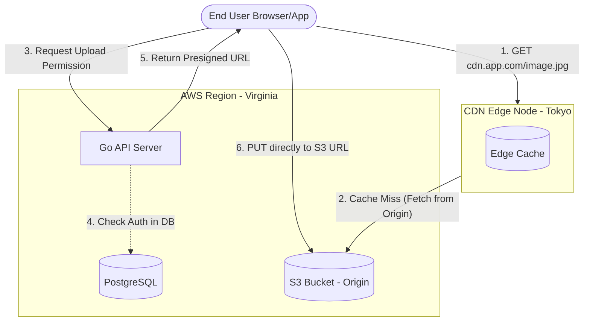

# Storage & CDNs: Object Storage and Content Delivery Networks

---

# Table of Contents

* Introduction
* Learning Objectives
* Prerequisites
* Why This Topic Exists
* Block vs. File vs. Object Storage
* Blob Storage (Amazon S3)
* Content Delivery Networks (CDNs)
* Code Examples & Good Principles
* Architecture Diagram
* Real-World Analogy
* Interview Questions
* Quiz
* Exercises
* Summary
* Key Takeaways
* Further Reading
* Next Chapter

---

# Introduction

While databases like PostgreSQL or MongoDB are excellent for structured and semi-structured data, they are incredibly inefficient for storing large binary files like images, videos, and backups. In modern system design, separating the application logic, structured data, and large static assets is critical for scalability. 

Object Storage (Blob Storage) and Content Delivery Networks (CDNs) work hand-in-hand to store massive amounts of unstructured data and deliver it to users across the globe with minimal latency.

---

# Learning Objectives

After completing this chapter you will be able to:

* Differentiate between Block, File, and Object storage.
* Understand the architecture and use cases of Object Storage (like Amazon S3).
* Explain how a Content Delivery Network (CDN) works (Push vs. Pull models).
* Integrate Go applications with Object Storage securely using presigned URLs.
* Design a scalable media-heavy application.

---

# Prerequisites

Before reading this chapter you should know:

* Databases (`07-Databases.md`)
* Network Protocols (`03-Network-Protocols.md`)

---

# Why This Topic Exists

If you are designing YouTube, Instagram, or Netflix, the vast majority of the data transferred is unstructured media. If you try to serve millions of profile pictures directly from your primary API servers or relational database, your servers will quickly run out of memory, disk I/O, and network bandwidth. Understanding how to offload storage to scalable Blob services and how to cache it at the edge using CDNs is a mandatory skill for any senior engineer.

---

# Block vs. File vs. Object Storage

Before diving into S3, it's important to understand the three primary paradigms of storage in the cloud.

### 1. Block Storage (e.g., AWS EBS)
* **How it works**: Data is broken into raw, fixed-sized blocks. The OS pieces them together to form a file system.
* **Characteristics**: Extremely fast, low latency. Can be attached to only one virtual machine at a time.
* **Use Case**: Boot drives for VMs, backing storage for high-performance databases (PostgreSQL, MongoDB).

### 2. File Storage (e.g., AWS EFS, NFS)
* **How it works**: Data is organized into a hierarchical structure of files and folders (directories). 
* **Characteristics**: Can be attached to multiple VMs simultaneously over a network.
* **Use Case**: Shared home directories, internal corporate document sharing, legacy applications expecting a traditional file system.

### 3. Object Storage (e.g., AWS S3, Google Cloud Storage)
* **How it works**: Data is stored as individual discrete "objects" (Blobs - Binary Large Objects) in a flat namespace (Buckets). Each object has the data itself, a variable amount of metadata, and a globally unique identifier (URL).
* **Characteristics**: Infinitely scalable, accessed via HTTP/REST APIs, cheaper than Block storage, but has higher latency.
* **Use Case**: User uploads (images, videos), static website hosting, backups, big data data lakes.

---

# Blob Storage (Amazon S3)

Amazon Simple Storage Service (S3) is the industry standard for Object Storage. 

* **Buckets**: The top-level container (like a root folder). Bucket names must be globally unique across all of AWS.
* **Objects**: The actual files (up to 5TB per object).
* **Keys**: The unique identifier for an object within a bucket (e.g., `users/123/profile.png`).
* **Durability vs. Availability**: S3 is designed for 99.999999999% (11 9's) of durability (your file won't be lost) but only 99.99% availability (the API might occasionally fail to respond). 

### Security Principle: Presigned URLs
You should **never** proxy large file uploads or downloads through your Go API servers. This wastes your expensive server bandwidth and CPU.
Instead, the client asks your Go API for permission to upload. Your Go API generates a short-lived **Presigned URL** directly to S3. The client then uploads the massive file directly to S3, bypassing your servers completely.

---

# Content Delivery Networks (CDNs)

Even if S3 is highly scalable, serving an image from a bucket in Virginia to a user in Tokyo will result in high latency due to the physical distance and network hops. 

A CDN (like Cloudflare, AWS CloudFront, or Akamai) solves this by placing thousands of caching servers (Edge Nodes or Points of Presence - PoPs) all over the world, physically close to end-users.

### How a Pull CDN Works (Cache-Aside)
1. **User requests an image** (e.g., `cdn.example.com/logo.png`).
2. **DNS routes to the nearest Edge Node** (e.g., a server in Tokyo).
3. **Cache Miss**: The Edge Node doesn't have the image. It requests the image from the **Origin Server** (your S3 bucket in Virginia).
4. **Cache & Serve**: The Edge Node receives the image, caches it on its local disk for a specified TTL (Time to Live), and serves it to the Tokyo user.
5. **Cache Hit**: The next user in Tokyo requesting the same image gets it instantly from the Edge Node.

---

# Code Examples & Good Principles

### Go API Generating a Presigned URL for AWS S3

```go
package main

import (
	"context"
	"fmt"
	"log"
	"time"

	"github.com/aws/aws-sdk-go-v2/aws"
	"github.com/aws/aws-sdk-go-v2/config"
	"github.com/aws/aws-sdk-go-v2/service/s3"
)

func generatePresignedUploadURL(bucketName, objectKey string) (string, error) {
	// 1. Load AWS config (credentials are usually picked up from env vars)
	cfg, err := config.LoadDefaultConfig(context.TODO(), config.WithRegion("us-east-1"))
	if err != nil {
		return "", err
	}

	// 2. Create S3 client and Presign Client
	client := s3.NewFromConfig(cfg)
	presignClient := s3.NewPresignClient(client)

	// 3. Create the PutObject request parameters
	request, err := presignClient.PresignPutObject(context.TODO(), &s3.PutObjectInput{
		Bucket: aws.String(bucketName),
		Key:    aws.String(objectKey),
	}, func(opts *s3.PresignOptions) {
		opts.Expires = 15 * time.Minute // Principle: Short-lived access
	})

	if err != nil {
		return "", err
	}

	// 4. Return the URL. The frontend will do an HTTP PUT to this URL directly.
	return request.URL, nil
}

func main() {
	url, err := generatePresignedUploadURL("my-app-uploads", "users/42/avatar.jpg")
	if err != nil {
		log.Fatalf("Failed: %v", err)
	}
	fmt.Printf("Send a PUT request to this URL to upload directly to S3:\n%s\n", url)
}
```

---

# Architecture Diagram



---

# Real-World Analogy

* **Block Storage**: Giving a carpenter raw planks of wood. They can build whatever they want (fast, flexible), but they have to assemble it.
* **File Storage**: A traditional filing cabinet. Everyone in the office knows how to open a drawer, find a folder, and take a document.
* **Object Storage**: A massive warehouse where you hand a box to a clerk, and they give you a receipt with a barcode (URL). You don't know where they put it, but if you give them the barcode later, they fetch the exact box.
* **CDN**: Having smaller branch offices of that warehouse in every city. If a popular item is requested, the branch office keeps a copy locally so they don't have to drive to the main warehouse every time.

---

# Interview Questions

## Beginner
**Q**: When should you store images in a relational database like PostgreSQL?
*Answer*: Rarely to never. Databases are optimized for structured queries, not serving large binary files. Storing images in a DB causes massive bloat, slows down backups, and increases costs. Use Object Storage (S3) and store only the URL in the database.

## Intermediate
**Q**: What happens if an image is updated in S3, but the CDN is still serving the old cached version?
*Answer*: This is a classic cache invalidation problem. You can solve it by:
1. Issuing an "Invalidation Request" to the CDN API to purge that specific URL (can be slow and expensive).
2. (Better) Use **Cache Busting / Versioning**. Whenever the image changes, upload it with a new name (e.g., `avatar_v2.jpg`) and update the DB record. The CDN sees a new URL, treats it as a cache miss, and fetches the fresh image instantly.

## Advanced
**Q**: Describe how to design a system that allows users to upload 50GB 4K videos reliably over spotty mobile networks.
*Answer*: You cannot use a standard single HTTP PUT request for 50GB; it will inevitably fail mid-way. 
1. Use **Multipart Uploads**: The Go API generates multiple presigned URLs for different "parts" (e.g., 500MB chunks) of the file.
2. The client uploads the parts in parallel directly to S3. If one part fails, only that part is retried.
3. Once all parts are uploaded, the client notifies the Go API, which tells S3 to assemble the parts into the final 50GB object.

---

# Quiz

## Multiple Choice Questions
**1. Which storage type is best for hosting static website assets (HTML, CSS, JS, Images)?**
A) Block Storage (EBS)
B) File Storage (EFS)
C) Object Storage (S3)
*Answer*: C

## True or False
**It is a best practice to route all user video uploads through your Go API servers so you can validate the file type before sending it to S3.**
*Answer*: False. Proxying large files through your API servers creates a massive bottleneck. Use Presigned URLs to allow direct uploads to S3, and validate the file asynchronously later (or enforce constraints in the S3 upload policy).

---

# Exercises

## Beginner
Write a Go script that uploads a local file to S3 using the official AWS SDK `s3.PutObject` method (the backend approach).

## Intermediate
Implement an HTTP handler in Go that requires authentication (a mock token) and, if valid, returns a JSON response containing an S3 Presigned URL for uploading a profile picture.

---

# Summary

Effectively managing large assets is crucial for system scalability. Object storage provides virtually infinite, cheap storage for unstructured data. CDNs push that data to the geographical edges of the internet, ensuring lightning-fast load times for users worldwide. Always leverage Presigned URLs to keep your application servers focused on business logic, not shuffling bytes.

---

# Key Takeaways

* ✔ Object Storage (S3) is the standard for unstructured data like media and backups.
* ✔ CDNs reduce latency by caching S3 assets at edge nodes physically close to users.
* ✔ Never proxy large file uploads/downloads through your API servers.
* ✔ Use Presigned URLs to grant clients direct, secure, and temporary access to S3.
* ✔ Cache busting (versioning URLs) is the preferred method for CDN cache invalidation.

---

# Further Reading
* [AWS S3 Documentation: Presigned URLs](https://docs.aws.amazon.com/AmazonS3/latest/userguide/using-presigned-url.html)
* [Cloudflare: What is a CDN?](https://www.cloudflare.com/learning/cdn/what-is-a-cdn/)

---

# Next Chapter
➡️ **Next:** `10-Microservices.md`
