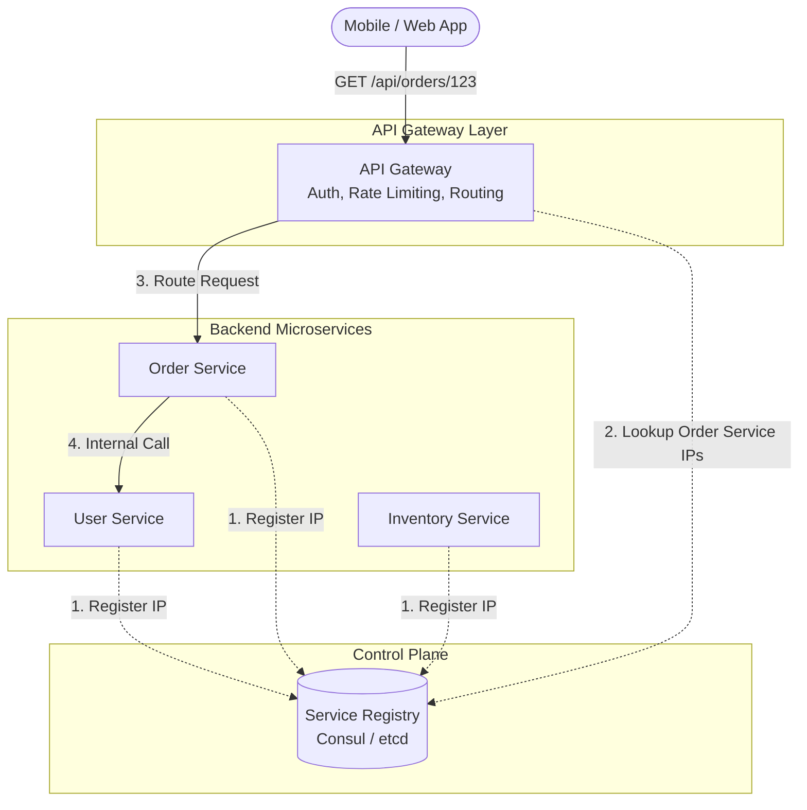

# Microservices: Decomposition, Service Discovery, and API Gateways

---

# Table of Contents

* Introduction
* Learning Objectives
* Prerequisites
* Why This Topic Exists
* Monolith vs. Microservices
* Microservice Decomposition Strategies
* Service Discovery
* API Gateways
* Code Examples & Good Principles
* Architecture Diagram
* Real-World Analogy
* Interview Questions
* Quiz
* Exercises
* Summary
* Key Takeaways
* Further Reading
* Next Chapter

---

# Introduction

As applications grow in size, a monolithic architecture often becomes a bottleneck. The codebase becomes too large for a single team to understand, deployments become risky and slow, and scaling specific features independently becomes impossible. 

Microservices solve these problems by breaking down a large application into smaller, loosely coupled, independently deployable services. However, this decomposition introduces new complexities, primarily around how these services find each other (Service Discovery) and how external clients interact with them (API Gateways).

---

# Learning Objectives

After completing this chapter you will be able to:

* Explain the trade-offs between Monolithic and Microservice architectures.
* Understand decomposition strategies (by business capability, by subdomain).
* Explain the role of Service Discovery (Client-side vs. Server-side).
* Implement an API Gateway pattern.
* Design a resilient microservice ecosystem.

---

# Prerequisites

Before reading this chapter you should know:

* API Design (`04-API-Design.md`)
* Load Balancers (`05-Load-Balancers.md`)
* Message Queues (`08-Message-Queues.md`)

---

# Why This Topic Exists

When building massive platforms like Netflix or Amazon, hundreds of teams are deploying code thousands of times a day. You cannot do this in a single Git repository compiling into a single binary. Microservices allow organizational scaling alongside technical scaling. However, if you don't understand how to properly decompose domains or route traffic, you will end up building a "Distributed Monolith"—which has all the downsides of both architectures and the benefits of neither.

---

# Monolith vs. Microservices

### Monolithic Architecture
* **What it is**: All business logic (users, orders, billing, inventory) is compiled into a single application and runs as a single process.
* **Pros**: Simple to develop initially, simple to test, simple to deploy, easy debugging.
* **Cons**: As it grows, IDEs get slow, startup times increase, any bug can crash the entire system. Scaling requires scaling the entire app, even if only one module (e.g., reporting) is CPU-heavy.

### Microservices Architecture
* **What it is**: The application is split into multiple independent services (User Service, Order Service, etc.). Each service has its own database.
* **Pros**: Independent deployments, independent scaling, technology diversity (e.g., Go for high-performance networking, Python for ML), fault isolation.
* **Cons**: High operational complexity, distributed transactions are difficult, network latency, difficult to debug across service boundaries.

---

# Microservice Decomposition Strategies

How do you decide what becomes a microservice?

1. **Decompose by Business Capability**: Align services with business departments. E.g., an Order Management service, a Customer Service, an Inventory Service.
2. **Decompose by Subdomain (Domain-Driven Design - DDD)**: Identify the "Bounded Contexts" within your domain. A Bounded Context is a conceptual boundary where a specific model is valid. E.g., The "Product" model in the Inventory context only cares about stock levels, while the "Product" model in the E-commerce context cares about images and descriptions.

**The Golden Rule**: A microservice should own its data. If two services are constantly querying each other's databases directly, you have not drawn the boundaries correctly.

---

# Service Discovery

In a cloud environment (like Kubernetes), instances of microservices are constantly starting, stopping, and changing IP addresses. If Service A needs to call Service B, how does it know Service B's IP address?

### The Service Registry
A Service Registry (like Consul, etcd, or Kubernetes DNS) acts as a phonebook for your services.

1. **Registration**: When an instance of Service B boots up, it registers its IP address with the Service Registry.
2. **Discovery**: 
   * **Client-Side Discovery**: Service A asks the Registry for Service B's IPs, picks one (load balancing client-side), and makes the call.
   * **Server-Side Discovery**: Service A makes a call to a Load Balancer/Router, which queries the Registry and forwards the request to Service B. (This is how Kubernetes Services work).

---

# API Gateways

If your backend is split into 20 microservices, having the mobile app or web frontend call 20 different URLs (auth.app.com, orders.app.com, inventory.app.com) is a nightmare. It creates chatty clients, exposes internal architecture, and forces the client to handle aggregation.

**The API Gateway** (e.g., Kong, Envoy, AWS API Gateway) sits between external clients and your internal microservices.

### Responsibilities of an API Gateway:
1. **Request Routing (Reverse Proxy)**: Route `/api/users/*` to the User Service, and `/api/orders/*` to the Order Service.
2. **API Composition / Aggregation**: The Gateway can receive one request from the client, make three internal calls to different microservices in parallel, stitch the JSON together, and return a single unified response.
3. **Cross-Cutting Concerns**: 
   * Authentication & Authorization (checking JWTs).
   * SSL Termination.
   * Rate Limiting.
   * Request Logging.

---

# Code Examples & Good Principles

### Principle: API Gateway Routing Configuration
In modern architectures, you rarely write an API Gateway from scratch in Go. Instead, you use a configuration-driven proxy like Nginx, Envoy, or Traefik. However, if you were to build a simple Gateway in Go, it might look like this:

```go
package main

import (
	"log"
	"net/http"
	"net/http/httputil"
	"net/url"
)

// A simple API Gateway routing requests to different microservices
func main() {
	// 1. Define the upstream microservices
	userServiceURL, _ := url.Parse("http://localhost:8081") // Imagine this is found via Service Discovery
	orderServiceURL, _ := url.Parse("http://localhost:8082")

	// 2. Create reverse proxies
	userProxy := httputil.NewSingleHostReverseProxy(userServiceURL)
	orderProxy := httputil.NewSingleHostReverseProxy(orderServiceURL)

	// 3. Define the routing logic (The Gateway)
	mux := http.NewServeMux()
	
	mux.HandleFunc("/api/users/", func(w http.ResponseWriter, r *http.Request) {
		// Principle: Perform Auth Check here at the gateway level
		// if !isValidToken(r) { http.Error(...); return }
		
		log.Printf("Routing to User Service: %s", r.URL.Path)
		userProxy.ServeHTTP(w, r)
	})

	mux.HandleFunc("/api/orders/", func(w http.ResponseWriter, r *http.Request) {
		log.Printf("Routing to Order Service: %s", r.URL.Path)
		orderProxy.ServeHTTP(w, r)
	})

	log.Println("API Gateway listening on :8080...")
	log.Fatal(http.ListenAndServe(":8080", mux))
}
```

---

# Architecture Diagram



---

# Real-World Analogy

* **Monolith**: A single master craftsman who builds a whole car by himself in his garage. He knows how everything fits together, but he can only build one car at a time, and if he gets sick, production stops.
* **Microservices**: A massive auto factory. One team builds engines, another builds doors, another builds electronics. They work independently. 
* **Service Discovery**: The factory directory. The door team needs screws, so they check the directory to find out which warehouse the screw team is currently operating out of.
* **API Gateway**: The car dealership. The customer doesn't go to the factory floor and try to assemble the car from the different teams. The customer goes to the dealership (Gateway), asks for a car, and the dealership handles coordinating with the factory to deliver the finished product.

---

# Interview Questions

## Beginner
**Q**: What is the primary benefit of microservices?
*Answer*: The primary benefit is organizational scalability (allowing many teams to work independently) and the ability to independently scale and deploy different parts of a system.

## Intermediate
**Q**: What is the "Backend for Frontend" (BFF) pattern?
*Answer*: It is a variation of the API Gateway pattern. Instead of one massive API Gateway for all clients, you create a specific gateway tailored to each client type (e.g., one API Gateway for the Mobile App, one for the Web App). This prevents the gateway from becoming a bloated monolith itself.

## Advanced
**Q**: How do you handle a transaction that spans multiple microservices (e.g., an Order Service needs to reserve stock in the Inventory Service and charge the Billing Service)?
*Answer*: You cannot use traditional ACID database transactions across microservices. Instead, you must use the **Saga Pattern**. A Saga is a sequence of local transactions. If one step fails (e.g., billing fails), the Saga executes "compensating transactions" (e.g., un-reserving the stock) to undo the previous steps. This provides eventual consistency.

---

# Quiz

## Multiple Choice Questions
**1. Which component is responsible for keeping track of the dynamic IP addresses of running microservices?**
A) API Gateway
B) Service Registry
C) Message Queue
*Answer*: B

## True or False
**When migrating a monolith to microservices, the first step should be to split the application logic into multiple services while keeping the same single shared database.**
*Answer*: False. A shared database creates tight coupling. If multiple services rely on the exact same database schema, you haven't actually decoupled them; you've just created a distributed monolith. Each microservice must own its own data.

---

# Exercises

## Beginner
Write down three reasons why you might choose to build a monolith instead of microservices for a new startup.

## Intermediate
Research the "Strangler Fig Pattern". Write a short paragraph explaining how you would use it to migrate a legacy monolithic Go API to a modern microservices architecture using an API Gateway.

---

# Summary

Microservices allow engineering teams to scale gracefully, but they shift complexity from the codebase into the network. Navigating this network requires robust Service Discovery so services can find each other, and powerful API Gateways to shield clients from internal architectural complexities.

---

# Key Takeaways

* ✔ Microservices solve organizational and deployment scaling, but introduce network and data consistency challenges.
* ✔ A true microservice owns its own database and data schema.
* ✔ Service Discovery (like Consul or Kubernetes DNS) maps service names to dynamic IP addresses.
* ✔ API Gateways act as the single entry point for clients, handling routing, auth, and composition.

---

# Further Reading
* [Microservices.io - Microservice Architecture](https://microservices.io/patterns/microservices.html)
* [Building Microservices by Sam Newman](https://samnewman.io/books/building_microservices/)

---

# Next Chapter
➡️ **Next:** `11-Rate-Limiting.md`
