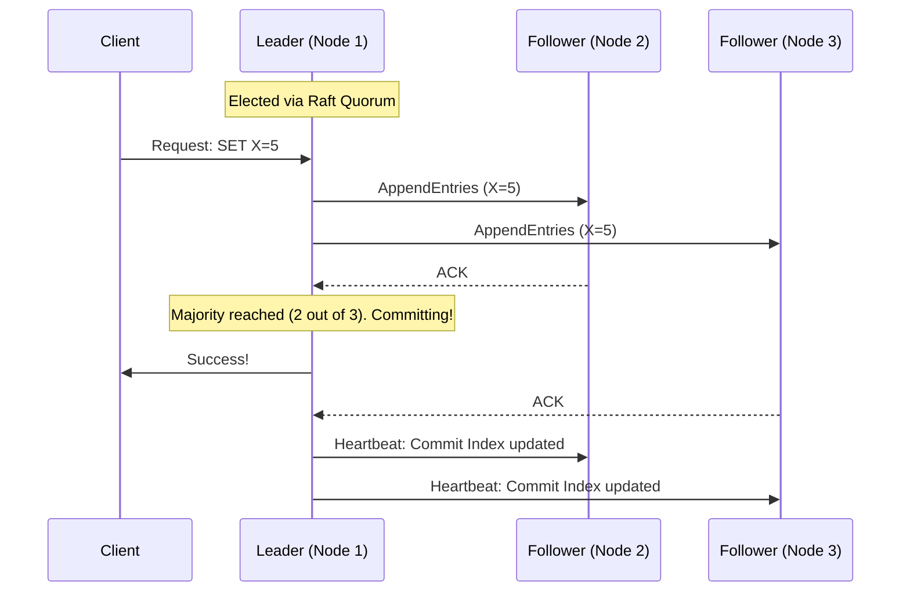

# Consensus Algorithms: Raft, Paxos, and the Core of Distributed Systems

---

# Table of Contents

* Introduction
* Learning Objectives
* Prerequisites
* Why This Topic Exists
* The Split-Brain Problem
* Paxos vs. Raft
* How Raft Works (Leader Election & Log Replication)
* Real-World Usage (etcd & ZooKeeper)
* Code Examples & Good Principles
* Architecture Diagram
* Real-World Analogy
* Interview Questions
* Quiz
* Exercises
* Summary
* Key Takeaways
* Further Reading
* Next Chapter

---

# Introduction

In a distributed system, you cannot rely on a single server to make critical decisions. If that server dies, the system halts. Therefore, multiple servers must work together to agree on the state of the system (e.g., "Who holds the lock for this database row?" or "Which IP address belongs to the primary database?"). 

Getting multiple independent servers over an unreliable network to agree on a single source of truth is incredibly difficult. This is the problem solved by Consensus Algorithms.

---

# Learning Objectives

After completing this chapter you will be able to:

* Explain the "Split-Brain" problem in distributed systems.
* Understand the conceptual differences between Paxos and Raft.
* Explain the two primary mechanisms of Raft: Leader Election and Log Replication.
* Understand the role of strongly consistent key-value stores like etcd and ZooKeeper in modern architectures (like Kubernetes).

---

# Prerequisites

Before reading this chapter you should know:

* Microservices & Service Discovery (`10-Microservices.md`)
* Databases & Replication (`07-Databases.md`)

---

# Why This Topic Exists

If you use Kubernetes, Kafka, or highly available database clusters, you are relying on consensus. Kubernetes uses `etcd` (which uses Raft) to store its cluster state. Kafka historically used `ZooKeeper` (which uses ZAB, a Paxos variant) to elect controller nodes. Understanding consensus is what separates developers who just use cloud tools from architects who understand how the cloud actually works under the hood.

---

# The Split-Brain Problem

Imagine a database cluster with a Master node (handling Writes) and a Slave node (handling Reads). 
1. The network cable connecting the Master and the Slave is cut (a network partition).
2. The Slave thinks, "The Master is dead. I must promote myself to Master to keep the system running."
3. The original Master thinks, "I'm fine, but the Slave is unreachable."

Now you have **two** Master nodes accepting writes independently. When the network is restored, the databases have conflicting, irreconcilable data. This is called **Split-Brain**.

Consensus algorithms solve this by requiring a **Quorum** (a strict majority, i.e., `(N/2) + 1`). In a 3-node cluster, 2 nodes must agree. If the network partitions, only the side of the partition that contains 2 nodes can elect a leader and accept writes. The isolated node pauses, preventing Split-Brain.

---

# Paxos vs. Raft

### Paxos (1989)
* Developed by Leslie Lamport. It is mathematically proven to be correct and is the foundational algorithm of distributed consensus.
* **The Problem**: It is notoriously difficult to understand, and even harder to implement in the real world. Many systems implemented "variants" of Paxos that weren't mathematically proven.

### Raft (2013)
* Developed specifically to be understandable while providing the exact same safety guarantees as Paxos. 
* It decomposes the consensus problem into three distinct pieces: Leader Election, Log Replication, and Safety.
* Today, Raft is the industry standard for new distributed systems (etcd, HashiCorp Consul, CockroachDB).

---

# How Raft Works

Raft nodes exist in one of three states: **Follower**, **Candidate**, or **Leader**.

### 1. Leader Election
1. Every node starts as a **Follower** with a randomized countdown timer (e.g., 150ms - 300ms).
2. If a Follower hears nothing from a Leader before its timer expires, it becomes a **Candidate**.
3. The Candidate votes for itself and asks the other nodes for their votes.
4. If the Candidate receives a majority of votes, it becomes the **Leader** and immediately starts sending "Heartbeats" to reset the other nodes' timers.

### 2. Log Replication (Accepting Writes)
Once a Leader is elected, all writes must go through it.
1. Client sends a command (e.g., `SET X = 5`) to the Leader.
2. The Leader appends the command to its local log (uncommitted).
3. The Leader sends the command to all Followers.
4. Once a **majority** of Followers acknowledge they have written it to their logs, the Leader **commits** the change to its state machine and replies "Success" to the client.

---

# Real-World Usage (etcd & ZooKeeper)

You rarely implement Raft yourself. Instead, you run an infrastructure component that provides a strongly consistent API for your microservices to use.

* **etcd (Go / Raft)**: A distributed, reliable key-value store. It is the brain of Kubernetes, storing the state of all Pods, Secrets, and ConfigMaps.
* **Apache ZooKeeper (Java / ZAB)**: Used for distributed locking, configuration management, and leader election. Famously used by Hadoop and Kafka.
* **HashiCorp Consul (Go / Raft)**: Used heavily for Service Discovery and dynamic configuration.

---

# Code Examples & Good Principles

### Principle: Distributed Locking using etcd (Conceptual Go Example)

If you have 10 microservices, and you need to ensure that only ONE service runs a specific daily billing job, you use a distributed lock backed by consensus.

```go
package main

import (
	"context"
	"log"
	"time"

	clientv3 "go.etcd.io/etcd/client/v3"
	"go.etcd.io/etcd/client/v3/concurrency"
)

func main() {
	// 1. Connect to the etcd cluster (which handles Raft under the hood)
	cli, err := clientv3.New(clientv3.Config{
		Endpoints:   []string{"localhost:2379"},
		DialTimeout: 5 * time.Second,
	})
	if err != nil {
		log.Fatal(err)
	}
	defer cli.Close()

	// 2. Create a session (ties the lock to the health of this specific client)
	s, err := concurrency.NewSession(cli, concurrency.WithTTL(10))
	if err != nil {
		log.Fatal(err)
	}
	defer s.Close()

	// 3. Create a Mutex (Distributed Lock)
	m := concurrency.NewMutex(s, "/my-distributed-locks/billing-job")

	log.Println("Attempting to acquire lock...")
	
	// 4. Lock! If another service holds the lock, this will block until they release it (or crash)
	if err := m.Lock(context.TODO()); err != nil {
		log.Fatal(err)
	}
	
	log.Println("Lock acquired! Running critical billing job...")
	
	// Simulate doing work
	time.Sleep(5 * time.Second)

	// 5. Release the lock for others
	if err := m.Unlock(context.TODO()); err != nil {
		log.Fatal(err)
	}
	log.Println("Lock released.")
}
```

---

# Architecture Diagram



---

# Real-World Analogy

* **The Split-Brain**: A corporate board with an even number of members (4). The CEO is fired. Two members want Alice, two want Bob. The company is paralyzed.
* **The Quorum (Raft)**: To prevent ties, boards always have an odd number of members (5). If 3 vote for Alice, she wins, regardless of what the other 2 think or if they are even in the room.
* **Leader Election**: A classroom without a teacher. Everyone sets a random timer in their head. The first person whose timer rings stands up and says, "I'll be the leader!" Since their timer went off first, the others agree. The leader then shouts "I'm here" every 5 seconds. If the leader goes to the bathroom and stops shouting, someone else's timer will eventually go off, and a new leader is elected.

---

# Interview Questions

## Beginner
**Q**: Why do consensus clusters (like etcd or ZooKeeper) always require an odd number of nodes (3, 5, or 7)?
*Answer*: To establish a strict majority (Quorum) and prevent ties (Split-Brain) during a network partition. If you have 4 nodes, a partition could split them into 2 and 2, neither of which has a majority (3).

## Intermediate
**Q**: If you have a 5-node Raft cluster, how many nodes can fail simultaneously without the system halting?
*Answer*: Two. A 5-node cluster requires a quorum of 3 nodes (`(N/2) + 1`) to elect a leader and accept writes. As long as 3 nodes are healthy and can communicate, the system stays online.

## Advanced
**Q**: What is the difference between Eventual Consistency and Strong Consistency (Linearizability)?
*Answer*: Eventual Consistency (like Cassandra or DNS) means if you write a value, a read immediately following the write might return old data, but *eventually*, all nodes will sync. Strong Consistency (like etcd/Raft) guarantees that once a write is acknowledged as successful, any subsequent read from any node will return that new value.

---

# Quiz

## Multiple Choice Questions
**1. In the Raft consensus algorithm, what prevents multiple Followers from becoming Candidates at the exact same time?**
A) Strict IP address ordering.
B) Randomized timeout timers.
C) A pre-configured configuration file.
*Answer*: B. Randomized timers ensure one node almost always transitions to Candidate and requests votes before the others.

## True or False
**Raft clusters should be scaled up to dozens of nodes (e.g., 50 nodes) to increase write throughput.**
*Answer*: False. Adding nodes to a Raft cluster actually *decreases* write throughput, because every write must be replicated to and acknowledged by a majority of those 50 nodes over the network. Consensus clusters are kept small (usually 3 or 5 nodes) to minimize latency.

---

# Exercises

## Beginner
Read the interactive visualizer at [thesecretlivesofdata.com/raft/](http://thesecretlivesofdata.com/raft/). It is the best 5-minute explanation of Raft on the internet.

## Intermediate
Run a local `etcd` instance using Docker. Use the `etcdctl` command-line tool to put a key and get a key. 

---

# Summary

Consensus algorithms are the heavy machinery that keeps modern cloud infrastructure running predictably in unpredictable network environments. While Paxos proved it was mathematically possible, Raft made it accessible to engineers. By requiring a Quorum (majority vote), systems like `etcd` avoid the deadly Split-Brain scenario, providing a single source of truth for distributed locks, configuration, and service state.

---

# Key Takeaways

* ✔ Consensus is required to agree on a single source of truth in a distributed system.
* ✔ Split-Brain occurs when a network partition causes multiple nodes to assume they are the Master.
* ✔ Quorum (majority vote) prevents Split-Brain. Clusters must have an odd number of nodes.
* ✔ Raft simplifies consensus into Leader Election and Log Replication.
* ✔ Never store heavy application data (like user records) in a consensus store like etcd; use it for critical metadata, configuration, and locks.

---

# Further Reading
* [The Secret Lives of Data (Raft Visualization)](http://thesecretlivesofdata.com/raft/)
* [In Search of an Understandable Consensus Algorithm (Original Raft Paper)](https://raft.github.io/raft.pdf)

---

# Next Chapter
➡️ **Next:** `13-Resiliency.md`
