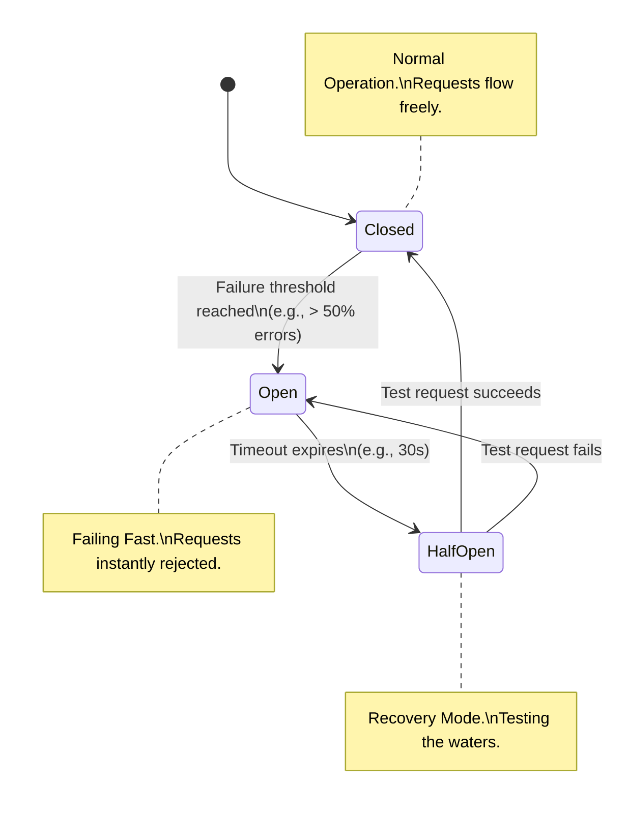

# Resiliency: Circuit Breakers, Bulkheads, and Retries

---

# Table of Contents

* Introduction
* Learning Objectives
* Prerequisites
* Why This Topic Exists
* Retries & Exponential Backoff
* The Circuit Breaker Pattern
* The Bulkhead Pattern
* Code Examples & Good Principles
* Architecture Diagram
* Real-World Analogy
* Interview Questions
* Quiz
* Exercises
* Summary
* Key Takeaways
* Further Reading
* Next Chapter

---

# Introduction

In distributed systems, failure is not a possibility; it is an absolute certainty. Networks drop packets, databases lock up, downstream APIs suffer outages, and servers crash. 

If your microservice crashes every time a downstream dependency fails, you have built a fragile system. Resiliency engineering is the practice of designing systems that embrace failure, degrade gracefully, and recover automatically without bringing down the entire platform.

---

# Learning Objectives

After completing this chapter you will be able to:

* Understand why naive retry logic can cause self-inflicted Distributed Denial of Service (DDoS) attacks.
* Implement Retries with Exponential Backoff and Jitter.
* Explain and implement the Circuit Breaker pattern.
* Explain the Bulkhead pattern for fault isolation.

---

# Prerequisites

Before reading this chapter you should know:

* Microservices (`10-Microservices.md`)
* Rate Limiting (`11-Rate-Limiting.md`)

---

# Why This Topic Exists

Imagine an E-commerce system where the Checkout Service calls a third-party Fraud Detection API. If the Fraud API goes down, and your Checkout Service hangs for 30 seconds waiting for a response, all of your server's threads will eventually get stuck waiting. Your entire Checkout Service will crash, preventing all sales. Mastering resiliency patterns ensures that a failure in the Fraud API simply degrades the experience (e.g., bypassing fraud checks temporarily or failing fast with a polite error message) instead of destroying your revenue stream.

---

# Retries & Exponential Backoff

When a network request fails (e.g., a timeout or an HTTP 503 Service Unavailable), the simplest solution is to try again. The failure might have been a momentary network blip.

### The Danger of Naive Retries
If 10,000 clients experience a timeout and all instantly retry, they will hit the struggling server with a massive synchronized wave of 10,000 new requests, likely killing it permanently. This is known as a **Retry Storm**.

### The Solution: Exponential Backoff & Jitter
* **Exponential Backoff**: Instead of retrying immediately, wait 1 second. If it fails again, wait 2 seconds. Then 4 seconds, then 8 seconds. This gives the struggling server time to recover.
* **Jitter**: Add randomness to the backoff time. Instead of exactly 4 seconds, wait `4 seconds + random(0, 1000ms)`. This desynchronizes the retries, preventing "thundering herds".

---

# The Circuit Breaker Pattern

Retries are great for transient (temporary) failures. But if the downstream database is completely offline, retrying 5 times for every user request is a massive waste of CPU and network resources.

The **Circuit Breaker** pattern (inspired by electrical engineering) solves this by failing fast.

* **Closed State (Normal)**: Requests flow freely to the downstream service. The circuit breaker monitors for failures.
* **Open State (Failed)**: If the failure rate exceeds a threshold (e.g., 50% failures in the last 10 seconds), the circuit "trips" open. **All subsequent requests immediately return an error without even attempting to call the downstream service.** This prevents resource exhaustion and gives the downstream service breathing room.
* **Half-Open State (Testing)**: After a timeout (e.g., 30 seconds), the circuit allows a single test request through. If it succeeds, the circuit closes (normal). If it fails, the circuit opens again.

---

# The Bulkhead Pattern

In a ship, the hull is divided into watertight compartments (bulkheads). If the hull is breached, water fills only one compartment, preventing the whole ship from sinking.

In software, if your single Go server has a connection pool of 100 threads, and you have two endpoints:
* `/api/fast` (takes 10ms)
* `/api/slow` (calls a broken 3rd party API, hangs for 30 seconds)

If malicious users spam `/api/slow`, all 100 threads will get stuck waiting for the 3rd party API. `/api/fast` will become completely unresponsive.

**The Solution**: Create Bulkheads. Allocate a maximum of 20 threads for `/api/slow`, and reserve the other 80 for everything else. If `/api/slow` fails, it only exhausts its own small compartment.

---

# Code Examples & Good Principles

### Principle: Implementing a Circuit Breaker in Go

We will use the popular `sony/gobreaker` library.

```go
package main

import (
	"errors"
	"fmt"
	"io"
	"net/http"
	"time"

	"github.com/sony/gobreaker"
)

var cb *gobreaker.CircuitBreaker

func init() {
	// Configure the Circuit Breaker
	settings := gobreaker.Settings{
		Name:        "HTTP GET",
		MaxRequests: 1,                // Allow 1 request in half-open state
		Interval:    5 * time.Second,  // Clear counts every 5 seconds
		Timeout:     10 * time.Second, // Wait 10s in Open state before testing again
		ReadyToTrip: func(counts gobreaker.Counts) bool {
			// Principle: Trip the circuit if more than 3 consecutive failures occur
			return counts.ConsecutiveFailures >= 3
		},
		OnStateChange: func(name string, from gobreaker.State, to gobreaker.State) {
			fmt.Printf("Circuit Breaker State Changed: %s -> %s\n", from, to)
		},
	}
	cb = gobreaker.NewCircuitBreaker(settings)
}

// simulateFlakyService makes an HTTP call wrapped in the Circuit Breaker
func callFlakyService() ([]byte, error) {
	// cb.Execute wraps our function. If the circuit is Open, it returns an error immediately.
	body, err := cb.Execute(func() (interface{}, error) {
		// Attempt the actual network call
		resp, err := http.Get("http://localhost:9999/flaky-endpoint") // Assume this is offline
		if err != nil {
			return nil, err
		}
		defer resp.Body.Close()
		
		if resp.StatusCode >= 500 {
			return nil, errors.New("server error")
		}
		
		return io.ReadAll(resp.Body)
	})

	if err != nil {
		return nil, err
	}
	return body.([]byte), nil
}

func main() {
	// Simulate rapid traffic hitting our service
	for i := 1; i <= 6; i++ {
		fmt.Printf("Request %d: ", i)
		_, err := callFlakyService()
		if err != nil {
			fmt.Println("Failed:", err)
		} else {
			fmt.Println("Success!")
		}
		time.Sleep(1 * time.Second)
	}
}
```

---

# Architecture Diagram



---

# Real-World Analogy

* **Retries & Backoff**: Calling a friend who didn't pick up. Instead of redialing immediately over and over (which is annoying), you wait 5 minutes, then 15 minutes, then an hour.
* **Circuit Breaker**: The electrical breaker box in your house. If you plug in a faulty heater that draws too much power, the breaker "trips" (opens), instantly cutting off power to that room to prevent a house fire. You have to wait, fix the heater, and flip the breaker back to see if it holds.
* **Bulkhead**: Submarine compartments. If a torpedo hits the front of the submarine, they seal the heavy metal doors. That compartment floods, but the rest of the submarine remains dry and floats.

---

# Interview Questions

## Beginner
**Q**: Why is it dangerous to implement a standard 3-loop retry mechanism without backoff in a microservice?
*Answer*: If a downstream service is struggling under heavy load, instantly retrying will multiply the traffic (Retry Storm), effectively causing a self-inflicted Denial of Service attack that will crush the struggling service completely.

## Intermediate
**Q**: What is the purpose of adding "Jitter" to an Exponential Backoff algorithm?
*Answer*: Jitter introduces randomness. If a load balancer drops 1,000 connections simultaneously, and all 1,000 clients use the exact same backoff (e.g., 2 seconds), they will all hit the server again at the exact same millisecond. Jitter spreads out the retries, smoothing the load.

## Advanced
**Q**: In a massive distributed system (like Netflix), where would you implement Circuit Breakers and Bulkheads?
*Answer*: At the RPC/HTTP client level. Netflix famously open-sourced `Hystrix` (and later used `Resilience4j`), which wraps every outbound network call from a microservice in a Circuit Breaker and allocates specific thread pools (Bulkheads) to specific downstream dependencies. Modern architectures often push this logic down into the Service Mesh layer (e.g., Istio/Envoy) so the application code doesn't have to manage it.

---

# Quiz

## Multiple Choice Questions
**1. When a Circuit Breaker is in the "Open" state, what happens to new incoming requests?**
A) They are queued in memory until the circuit closes.
B) They are allowed through slowly (rate-limited).
C) They are instantly rejected with an error.
*Answer*: C. Failing fast prevents resource exhaustion.

## True or False
**The Bulkhead pattern is designed to automatically heal and restart crashed downstream services.**
*Answer*: False. The Bulkhead pattern simply isolates failures. It prevents a failure in one component (or connection pool) from cascading and exhausting the resources of the entire application.

---

# Exercises

## Beginner
Using the Go `math/rand` and `time` packages, write a simple function that calculates an exponential backoff duration for a given attempt number (1, 2, 3), and adds a random jitter of up to 500ms.

## Intermediate
Modify the Circuit Breaker Go example. Add a "Fallback" mechanism. If `callFlakyService` returns an error (because the circuit is open), catch the error in `main()` and return a hardcoded cached response (e.g., `{"status": "degraded_mode"}`) instead of failing completely. 

---

# Summary

Resiliency is about accepting that hardware and networks will fail, and building software that survives anyway. Retries with Jitter handle transient network blips gracefully. Circuit Breakers protect struggling dependencies by failing fast. Bulkheads ensure that when a fire inevitably starts in one part of your application, the blast radius is contained.

---

# Key Takeaways

* ✔ Never use immediate retries; always use Exponential Backoff and Jitter to prevent Retry Storms.
* ✔ Circuit Breakers fail fast to prevent resource exhaustion and allow downstream services time to recover.
* ✔ Bulkheads isolate connection pools and threads so a slow dependency doesn't lock up the entire server.
* ✔ Graceful degradation (fallbacks) is preferable to displaying a complete system error to the user.

---

# Further Reading
* [Microsoft Azure Architecture: Circuit Breaker Pattern](https://learn.microsoft.com/en-us/azure/architecture/patterns/circuit-breaker)
* [AWS Architecture Blog: Exponential Backoff and Jitter](https://aws.amazon.com/blogs/architecture/exponential-backoff-and-jitter/)

---

# Next Chapter
➡️ **Next:** `14-Design-URL-Shortener.md`
