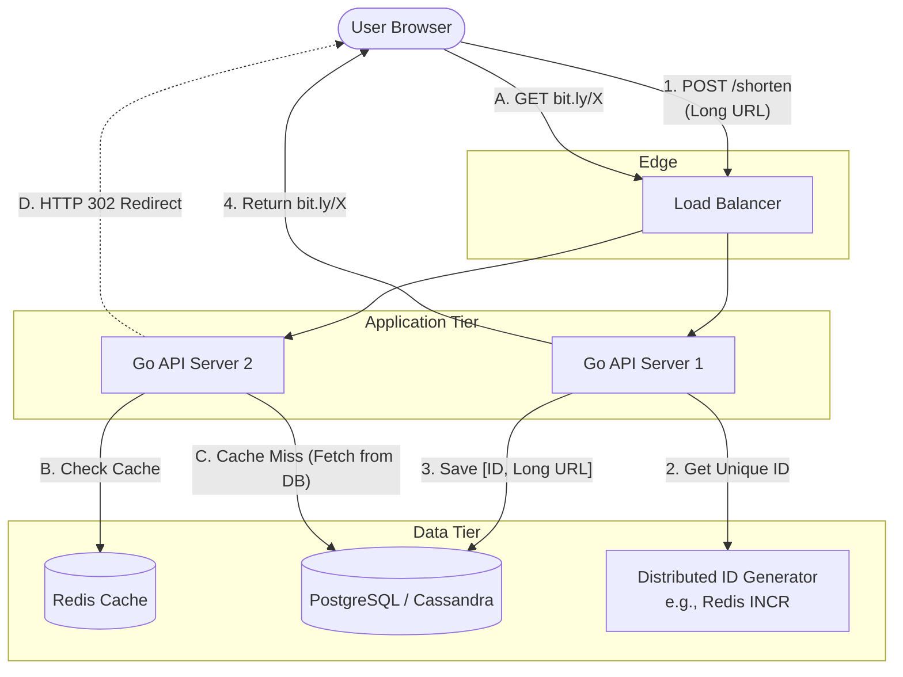

# System Design Interview: Design a URL Shortener (e.g., Bit.ly)

---

# Table of Contents

* Introduction
* Learning Objectives
* Prerequisites
* System Requirements
* Back-of-the-Envelope Estimation
* High-Level Design
* Deep Dive: The Shortening Algorithm (Base62)
* Deep Dive: Database and Caching
* Code Examples & Good Principles
* Architecture Diagram
* Real-World Analogy
* Interview Questions
* Quiz
* Exercises
* Summary
* Key Takeaways
* Further Reading
* Next Chapter

---

# Introduction

Designing a URL Shortener is the "Hello World" of System Design interviews. It is simple enough to understand quickly, but deep enough to explore critical concepts like hashing, database indexing, caching, and horizontal scaling. Services like Bit.ly or TinyURL take a long, unwieldy URL and generate a short, easy-to-share alias. When users visit the alias, they are redirected to the original long URL.

---

# Learning Objectives

After completing this chapter you will be able to:

* Define functional and non-functional requirements for a system design interview.
* Perform Back-of-the-Envelope capacity planning.
* Design a Base62 encoding algorithm for generating short URLs.
* Select appropriate databases and caching strategies for read-heavy workloads.

---

# Prerequisites

Before reading this chapter you should know:

* Databases (`07-Databases.md`)
* Caching (`06-Caching.md`)
* Load Balancers (`05-Load-Balancers.md`)

---

# System Requirements

In any interview, always clarify the requirements before designing anything.

### Functional Requirements
1. Given a long URL, the service should generate a short, unique alias (e.g., `bit.ly/3x8aL`).
2. When a user clicks the short link, they must be redirected to the original long URL.
3. Links expire after a standard duration (e.g., 5 years) unless specified otherwise.
4. Highly available (system cannot go down, or links will break globally).

### Non-Functional Requirements
1. **Read-Heavy Workload**: There are significantly more link clicks (reads) than link creations (writes). Assume a 100:1 read-to-write ratio.
2. **Low Latency**: The redirection must happen in milliseconds.
3. **URL Generation must be unique**: Collisions are unacceptable (one short link routing to two different long links).

---

# Back-of-the-Envelope Estimation

Let's assume the scale of a popular service:
* **Writes**: 100 million new URLs generated per month.
* **Reads**: 10 Billion redirections per month (100:1 ratio).
* **Storage**: We keep URLs for 10 years.
   * `100M URLs/month * 12 months * 10 years = 12 Billion URLs`.
   * Assume one record (Long URL + Short URL + metadata) is roughly 500 Bytes.
   * `12 Billion * 500 Bytes = 6 Terabytes` of database storage.

* **Cache Memory**: Cache the top 20% of daily requests (Pareto Principle).
   * Daily reads: `10 Billion / 30 = 330 Million/day`.
   * Cache 20%: `66 Million * 500 Bytes = ~33 GB` of RAM required for Redis.

**Conclusion**: Storage (6TB) is relatively small and can fit on a single modern database instance, but we will likely shard it for redundancy. The read throughput (3,800 Requests Per Second) demands a solid caching layer.

---

# High-Level Design

1. **Client** makes a request to the API.
2. **Load Balancer** distributes the request to a cluster of stateless Go API servers.
3. **Write Path (Shorten)**: The API server generates a unique short hash, stores the `[short_url, long_url]` mapping in a Relational Database, and returns it.
4. **Read Path (Redirect)**: The API server receives the short URL, checks the Redis Cache. If it's a Cache Miss, it checks the Database, updates the Cache, and returns an `HTTP 301` or `302` Redirect to the client.

---

# Deep Dive: The Shortening Algorithm (Base62)

How do we generate the 7-character string like `3x8aL9k`?

### Option 1: Cryptographic Hash (MD5 / SHA-256)
We could hash the Long URL.
* **Problem**: MD5 produces a 128-bit hash (32 hex characters). That's too long! If we truncate it to 7 characters, we risk **collisions** (two different long URLs producing the same 7-character hash).

### Option 2: Distributed Auto-Incrementing Counter + Base62
This is the industry standard approach.
Instead of hashing the URL, we assign an auto-incrementing integer ID to every new request. 
`ID 1 -> Long URL 1`
`ID 2 -> Long URL 2`

However, a raw integer (`example.com/100523`) isn't very short. We convert that Base-10 integer into a **Base-62** string.
Base62 uses: `[0-9, a-z, A-Z]` (10 + 26 + 26 = 62 characters).

* With a 7-character Base62 string, we can support `62^7 = 3.5 Trillion` unique URLs. This easily handles our 12 Billion URL requirement.

* **How to get a unique auto-incrementing ID in a distributed system?** 
  If you have 5 API servers, they can't all just use `ID++` because they will generate duplicates. You must use a central ID Generator like **Twitter Snowflake**, or a dedicated database counter (e.g., an auto-increment column in a dedicated MySQL database, or an atomic `INCR` in Redis).

---

# Deep Dive: Database and Caching

### Database Choice
We need to store Billions of rows of simple mapping data. No complex JOINs are required.
* **RDBMS (PostgreSQL/MySQL)**: Works perfectly. We can partition/shard the database based on the Short URL hash.
* **NoSQL (Cassandra/DynamoDB)**: Also excellent because the data model is fundamentally a Key-Value pair, and NoSQL scales writes horizontally very easily.

### HTTP 301 vs. 302 Redirect
When returning the long URL to the client, the API server must return a redirect status code.
* **HTTP 301 (Moved Permanently)**: The browser will cache the redirect locally. The next time the user clicks the short link, the browser routes directly to the long link without ever hitting your server. **Pros**: Fast for the user, less load on your servers. **Cons**: You cannot track analytics (click rates).
* **HTTP 302 (Found / Temporary Redirect)**: The browser does not cache it. Every click hits your server. **Pros**: 100% accurate analytics. **Cons**: More load on your backend.

---

# Code Examples & Good Principles

### Principle: Base62 Conversion in Go

```go
package main

import (
	"fmt"
	"strings"
)

const base62Chars = "0123456789abcdefghijklmnopqrstuvwxyzABCDEFGHIJKLMNOPQRSTUVWXYZ"

// Encode takes a unique integer ID and converts it to a Base62 string
func EncodeBase62(id uint64) string {
	if id == 0 {
		return string(base62Chars[0])
	}
	
	var encodedBuilder strings.Builder
	base := uint64(len(base62Chars))

	for id > 0 {
		remainder := id % base
		encodedBuilder.WriteByte(base62Chars[remainder])
		id = id / base
	}

	// The remainder algorithm produces the string in reverse, so we must reverse it back
	return reverseString(encodedBuilder.String())
}

// DecodeBase62 takes a short string and converts it back to the integer ID
func DecodeBase62(shortURL string) uint64 {
	var id uint64
	base := uint64(len(base62Chars))

	for i := 0; i < len(shortURL); i++ {
		// Find the index of the character in the base62Chars string
		charIndex := strings.IndexByte(base62Chars, shortURL[i])
		id = id*base + uint64(charIndex)
	}
	return id
}

func reverseString(s string) string {
	runes := []rune(s)
	for i, j := 0, len(runes)-1; i < j; i, j = i+1, j-1 {
		runes[i], runes[j] = runes[j], runes[i]
	}
	return string(runes)
}

func main() {
	// Assume this ID came from an atomic Redis INCR or Twitter Snowflake
	uniqueID := uint64(10000000000) 
	
	shortHash := EncodeBase62(uniqueID)
	fmt.Printf("ID %d Encoded to Base62: %s\n", uniqueID, shortHash)
	
	decodedID := DecodeBase62(shortHash)
	fmt.Printf("String %s Decoded back to ID: %d\n", shortHash, decodedID)
}
```

---

# Architecture Diagram



---

# Real-World Analogy

* **The Problem**: A bank routing number and account number is incredibly long (e.g., 20 digits) and hard to memorize.
* **The Solution**: The bank gives you a debit card. When you swipe the card, the merchant's system reads a unique ID (the card number), sends it to the central bank database, looks up your actual 20-digit account number, and processes the transaction. 
* **The Shortener**: In our system, the Long URL is the unmanageable account number, and the Base62 short string is the convenient debit card number.

---

# Interview Questions

## Beginner
**Q**: If we generate 7-character strings using Base62, how many unique URLs can we store?
*Answer*: 62^7, which is approximately 3.5 Trillion URLs.

## Intermediate
**Q**: What happens if two different users try to shorten the exact same Long URL? Does your design generate two different short URLs, or one?
*Answer*: In our auto-incrementing ID design, they get two different short URLs (because each request gets a new ID). If business requirements dictate that the same long URL should always return the same short URL to save database space, you must first do a database lookup `SELECT short_url FROM urls WHERE long_url = ?`. However, this slows down the write path significantly. Usually, the space saved is not worth the performance penalty.

## Advanced
**Q**: How would you prevent malicious users from iterating through all your short URLs? (e.g., `bit.ly/a`, `bit.ly/b`, `bit.ly/c`).
*Answer*: Because we use an auto-incrementing ID, the generated short URLs are sequential and highly predictable. To prevent enumeration, we can:
1. Append a randomly generated character to the end of the Base62 string.
2. Better: Encrypt the auto-incrementing ID using a lightweight block cipher (like Skip32) before converting it to Base62. This scrambles the ID, making the short URLs appear completely random while maintaining uniqueness.

---

# Quiz

## Multiple Choice Questions
**1. Which HTTP status code should you return if the business wants to track precise analytics for every time a link is clicked?**
A) HTTP 200 (OK)
B) HTTP 301 (Moved Permanently)
C) HTTP 302 (Found / Temporary Redirect)
*Answer*: C. HTTP 301 caches the redirect in the browser, preventing future clicks from hitting your servers and ruining your analytics data.

## True or False
**Using MD5 to hash a Long URL is the safest and most efficient way to generate a 7-character short URL.**
*Answer*: False. Truncating an MD5 hash to 7 characters significantly increases the chance of collisions. Using a distributed auto-incrementing ID converted to Base62 guarantees zero collisions.

---

# Exercises

## Beginner
Using the Go code provided, manually verify the output. What is the Base62 encoding for the ID `999,999`?

## Intermediate
Write a simple HTTP server in Go that exposes a `/shorten` endpoint (which returns a fake short URL) and a `/:shortURL` endpoint (which returns a `302 Redirect` to `https://google.com`). 

---

# Summary

Designing a URL shortener touches the very core of distributed systems. It requires balancing the simplicity of a Base62 encoding algorithm with the complexity of distributed ID generation. Because reads vastly outnumber writes, a robust caching layer and a highly scalable Key-Value or Relational database setup are mandatory to ensure the low latency expected of a simple redirect.

---

# Key Takeaways

* ✔ Clarify Read/Write ratios (100:1) and Storage needs before designing.
* ✔ Base62 Encoding of an auto-incrementing ID is vastly superior to hashing Long URLs (prevents collisions).
* ✔ Use HTTP 301 for speed (browser caching), use HTTP 302 for analytics tracking.
* ✔ Rely heavily on Redis; URL redirects are extremely cache-friendly.

---

# Further Reading
* [Grokking the System Design Interview: URL Shortener](https://www.educative.io/courses/grokking-the-system-design-interview/m2ygV4E81AR)

---

# Next Chapter
➡️ **Next:** `15-Design-Twitter.md`
