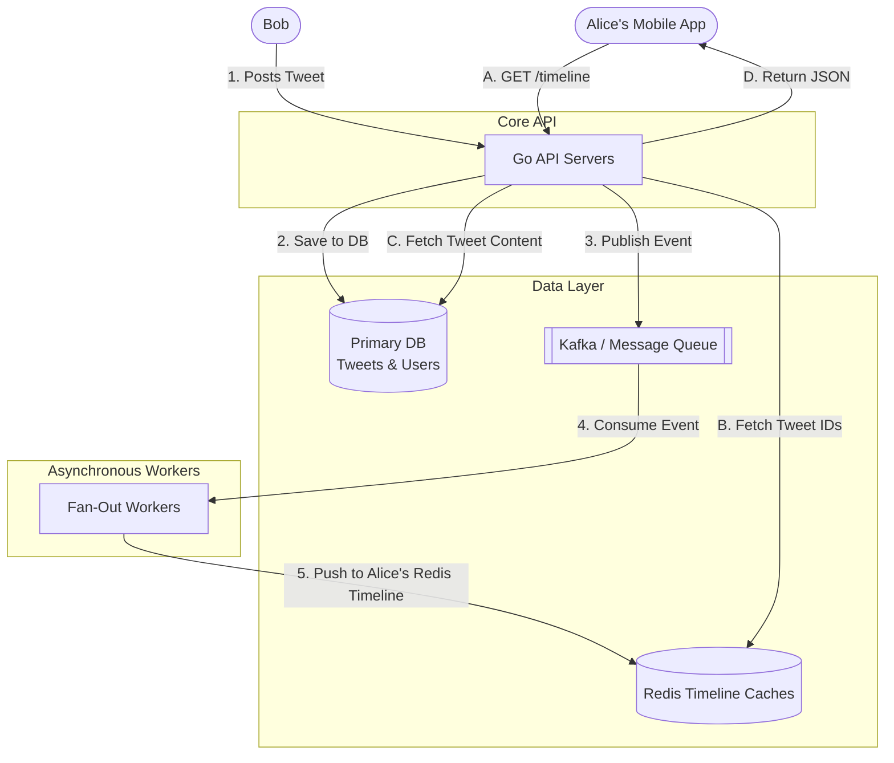

# System Design Interview: Design Twitter (News Feed)

---

# Table of Contents

* Introduction
* Learning Objectives
* Prerequisites
* System Requirements
* Back-of-the-Envelope Estimation
* High-Level Design
* Deep Dive: Fan-out on Write (Push) vs Fan-out on Read (Pull)
* Deep Dive: Handling Celebrity Users (The Hybrid Approach)
* Code Examples & Good Principles
* Architecture Diagram
* Real-World Analogy
* Interview Questions
* Quiz
* Exercises
* Summary
* Key Takeaways
* Further Reading
* Next Chapter

---

# Introduction

Designing Twitter (or any News Feed system like Instagram or Facebook) is one of the most common and complex System Design interview questions. The challenge isn't storing a tweet; the challenge is delivering that tweet to the millions of people following the author, in real-time, without melting your databases. This chapter focuses specifically on the **News Feed Generation** architecture.

---

# Learning Objectives

After completing this chapter you will be able to:

* Understand the complexities of highly connected social graphs.
* Compare and contrast the "Push" (Fan-out on Write) and "Pull" (Fan-out on Read) models for news feeds.
* Design a hybrid architecture capable of handling viral celebrity accounts (e.g., Elon Musk or Taylor Swift).
* Optimize Redis caches to serve pre-computed feeds in milliseconds.

---

# Prerequisites

* Caching (`06-Caching.md`)
* Databases (`07-Databases.md`)
* Message Queues (`08-Message-Queues.md`)

---

# System Requirements

### Functional Requirements
1. **Post a Tweet**: A user can publish a text-based post.
2. **Home Timeline (News Feed)**: A user can view a chronological stream of tweets from the people they follow.
3. **Follow**: A user can follow other users.

### Non-Functional Requirements
1. **High Read-to-Write Ratio**: Reading the feed is vastly more common than posting a tweet (Assume 100:1 to 1000:1 ratio).
2. **Low Latency**: Generating and loading the timeline must happen in under 200ms.
3. **High Availability**: The system must survive node failures. Eventual consistency for new tweets appearing in a feed is acceptable (it's okay if a user sees a tweet 2 seconds late).

---

# Back-of-the-Envelope Estimation

* **Daily Active Users (DAU)**: 300 Million.
* **Writes (Tweets)**: Assume each user posts 0.1 tweets per day -> `30 Million tweets/day`.
* **Reads (Timeline)**: Assume each user checks their feed 5 times a day -> `1.5 Billion reads/day`.
* **Peak Traffic**: 
  * `1.5 Billion / 86400 = ~17,000 Reads Per Second (Average)`. 
  * Peak traffic could easily hit 50,000+ Reads Per Second.
* **Storage**: 30 Million tweets * 500 Bytes = `15 GB / day` (Relatively trivial, can easily be sharded across a standard RDBMS).

**The Real Bottleneck**: The fan-out process. If a user with 50 million followers tweets, delivering that tweet to 50 million individual timelines instantly is a massive computing challenge.

---

# High-Level Design

The core system consists of two distinct workflows: 

### 1. The Write Path (Posting a Tweet)
1. User posts a tweet.
2. The Go API Server saves the tweet in the relational Database.
3. The API Server pushes an event (`TweetCreated`) to a Message Queue (Kafka/RabbitMQ).
4. Asynchronous worker services consume this event and distribute the tweet to the timelines of the author's followers.

### 2. The Read Path (Loading the Feed)
1. User opens the app.
2. The App requests the timeline from the API.
3. The API checks a fast, in-memory cache (Redis) for a pre-computed list of Tweet IDs.
4. If found, the API fetches the full tweet data (text, author info) for those IDs, and returns the JSON to the client.

---

# Deep Dive: Fan-out on Write vs Fan-out on Read

How do we actually build the timeline in Redis?

### Approach 1: Fan-out on Write (The "Push" Model)
When Bob posts a tweet, the system immediately looks up all of Bob's followers (e.g., Alice, Charlie, Dave). The system then "pushes" Bob's new Tweet ID into the Redis timeline cache for Alice, Charlie, and Dave.
* **Pros**: Reading the feed is incredibly fast `O(1)`. When Alice opens her app, her timeline is already fully computed and waiting for her in Redis.
* **Cons**: The "Thundering Herd" problem. If Elon Musk (150 Million followers) tweets, the system must perform 150 Million writes to Redis. This takes time, creates massive spikes in queue processing, and wastes memory (what if half those followers are inactive and never check their feed?).

### Approach 2: Fan-out on Read (The "Pull" Model)
When Bob posts a tweet, it is only saved in the database. When Alice opens her app, the API server looks up who Alice follows, queries the database for their recent tweets, sorts them chronologically in memory, and returns them.
* **Pros**: No wasted processing. Celebrities don't crash the system when they tweet.
* **Cons**: Generating the feed is slow `O(N)`. If Alice follows 1,000 active people, querying and sorting their recent tweets takes too long. User experience suffers (high latency).

---

# Deep Dive: Handling Celebrity Users (The Hybrid Approach)

Neither approach works perfectly at Twitter scale. The industry standard is a **Hybrid Architecture**.

1. **For Normal Users (Push)**: We use Fan-out on Write. If a user has a normal amount of followers (e.g., < 100,000), we instantly push their tweets into their followers' Redis timelines.
2. **For Celebrities (Pull)**: We designate users with > 100,000 followers as "Celebrities". When a celebrity tweets, we DO NOT push it. We only save it to the database (and perhaps a special Celebrity Cache).
3. **The Assembly**: When Alice opens her app, the API grabs her pre-computed timeline from Redis (which contains all her normal friends). The API *also* checks the Celebrity Cache for recent tweets from the specific celebrities Alice follows. The API merges the two lists, sorts them, and returns the final feed.

This hybrid model ensures lightning-fast reads while completely eliminating the 150-million write spike when a celebrity posts.

---

# Code Examples & Good Principles

### Principle: Storing a Timeline in Redis (Go Example)

Redis `Sorted Sets` (ZSET) are the perfect data structure for a timeline. The score is the Tweet Timestamp, and the member is the Tweet ID.

```go
package main

import (
	"context"
	"fmt"
	"time"

	"github.com/go-redis/redis/v8"
)

var ctx = context.Background()

func main() {
	// Connect to Redis
	rdb := redis.NewClient(&redis.Options{
		Addr: "localhost:6379",
	})

	aliceUserID := "user:1001"
	timelineKey := fmt.Sprintf("timeline:%s", aliceUserID)

	// --- 1. Fan-Out on Write (Push) ---
	// Bob (who Alice follows) posts a tweet. The asynchronous worker adds it to Alice's timeline.
	tweetID := "tweet:98765"
	timestamp := time.Now().UnixNano()

	err := rdb.ZAdd(ctx, timelineKey, &redis.Z{
		Score:  float64(timestamp),
		Member: tweetID,
	}).Err()
	if err != nil {
		panic(err)
	}

	// Principle: Limit timeline size to save memory. 
	// We only keep the 800 most recent tweets in cache.
	rdb.ZRemRangeByRank(ctx, timelineKey, 0, -801)

	// --- 2. The Read Path (Pull) ---
	// Alice opens her app. We fetch her 20 most recent tweets.
	// ZRevRange gets the highest scores (newest timestamps) first.
	tweets, err := rdb.ZRevRange(ctx, timelineKey, 0, 19).Result()
	if err != nil {
		panic(err)
	}

	fmt.Printf("Alice's Timeline Tweet IDs: %v\n", tweets)
	// Output: [tweet:98765]
	// Next step: The API queries the Database to get the actual text for these IDs.
}
```

---

# Architecture Diagram



---

# Real-World Analogy

* **Fan-out on Read (Pull)**: You want to know what your 10 favorite newspapers are saying. Every morning, you walk to 10 different newsstands, buy the papers, bring them home, lay them out on your table, and read the front pages. It takes a lot of your time (high read latency).
* **Fan-out on Write (Push)**: You subscribe to the 10 newspapers. Every time they print a paper, they hire a delivery boy to throw it on your porch. When you wake up, your customized pile of news is already sitting there. It's fast for you (low read latency), but expensive for the newspapers (high write cost).
* **Hybrid**: You subscribe to 9 normal newspapers (delivered to your porch). But for the massive global newspaper (The Celebrity), they don't deliver. You just check their website instantly on your phone while picking up your local papers from the porch.

---

# Interview Questions

## Beginner
**Q**: Why do we store only Tweet IDs in the Redis timeline, and not the full text of the tweet?
*Answer*: Memory efficiency. If a viral tweet is pushed to 1 million timelines, storing the full 280-character text 1 million times wastes massive amounts of expensive Redis RAM. By storing just the ID, we use minimal RAM, and we can fetch the actual text once from a separate caching layer when rendering the feed.

## Intermediate
**Q**: How would you handle inactive users (e.g., people who haven't logged in for 6 months)?
*Answer*: We should not compute feeds for inactive users. If a user hasn't logged in within the last 14 days, we evict their timeline from Redis. If they unexpectedly log in on day 15, we fall back to the slower Database "Pull" method to generate their timeline on-the-fly, and then push it back into Redis.

## Advanced
**Q**: If the Fan-Out worker fails halfway through delivering a tweet to 50,000 followers, how do you prevent delivering duplicates to the first 25,000 followers when the worker retries?
*Answer*: The worker operations must be idempotent. Because we use Redis `ZSET` (Sorted Sets), calling `ZADD` with the same Tweet ID and Timestamp multiple times simply overwrites the existing entry. It is inherently safe to retry.

---

# Quiz

## Multiple Choice Questions
**1. Which Redis data structure is most appropriate for storing a chronological timeline of Tweet IDs?**
A) Lists
B) Hashes
C) Sorted Sets (ZSET)
*Answer*: C. Sorted Sets automatically order elements by their score (which we set to the timestamp), making it `O(log(N))` to insert and `O(1)` to fetch the newest items.

## True or False
**The "Fan-out on Write" model is the best approach for users with millions of followers.**
*Answer*: False. Pushing a tweet to millions of followers instantly creates a massive, unnecessary write spike. High-follower accounts should use the "Pull" model.

---

# Exercises

## Beginner
Write a SQL schema for the `users`, `tweets`, and `follows` tables needed to support this system.

## Intermediate
Using the Go `go-redis` library, write a function that performs the "Hybrid Assembly". It should fetch a user's normal timeline from Redis, fetch a hardcoded list of "Celebrity Tweets", merge the two slices of Tweet IDs, and sort them descending by timestamp.

---

# Summary

Designing a News Feed requires managing the tension between read latency and write amplification. While Fan-out on Write provides the snappy read performance users expect, it crumbles under the weight of celebrity accounts. By implementing a Hybrid architecture, capping timeline sizes, and heavily utilizing Redis Sorted Sets, we can build a system that scales to billions of daily views.

---

# Key Takeaways

* ✔ The News Feed is an extremely read-heavy system. Optimize for read latency.
* ✔ **Fan-out on Write (Push)**: Pre-computes timelines. Fast reads, slow writes. Great for normal users.
* ✔ **Fan-out on Read (Pull)**: Computes timelines on the fly. Fast writes, slow reads. Great for celebrities.
* ✔ A **Hybrid Architecture** is required to handle the extremes of a social graph.
* ✔ Redis Sorted Sets (ZSETs) are the ideal data structure for timelines.

---

# Further Reading
* [Twitter Engineering Blog: How we scale our timeline](https://blog.twitter.com/engineering/en_us/topics/infrastructure/2017/the-infrastructure-behind-twitter-scale)
* [System Design Primer: News Feed](https://github.com/donnemartin/system-design-primer)

---

# Next Chapter
➡️ **Next:** `16-Design-WhatsApp.md`
