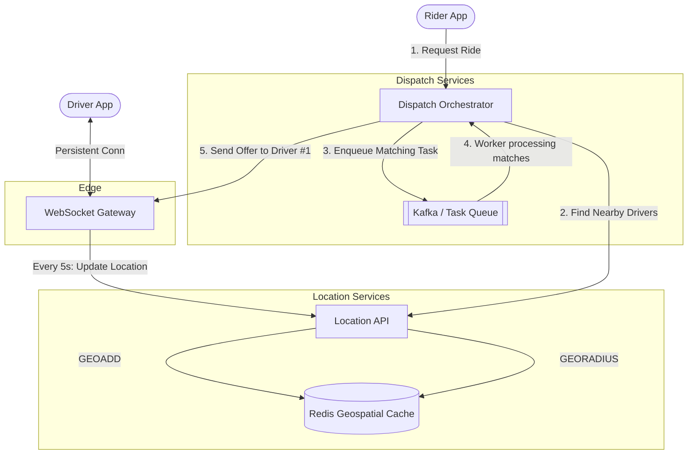

# System Design Interview: Design Uber (Location-Based Service)

---

# Table of Contents

* Introduction
* Learning Objectives
* Prerequisites
* System Requirements
* Back-of-the-Envelope Estimation
* High-Level Design
* Deep Dive: Geospatial Indexing (Geohash & Quadtree)
* Deep Dive: The Dispatching System
* Code Examples & Good Principles
* Architecture Diagram
* Real-World Analogy
* Interview Questions
* Quiz
* Exercises
* Summary
* Key Takeaways
* Further Reading
* Curriculum Conclusion

---

# Introduction

Designing a ride-hailing app like Uber or Lyft introduces a completely new dimension to System Design: **Geospatial Data**. In a standard application, you query a database by ID or Name. In Uber, you query a database by physical coordinates (Latitude and Longitude) asking questions like: *"Find all active drivers within a 3-mile radius of this user."* 

Doing this rapidly while tracking the live movement of millions of cars requires specialized indexing and a highly stateful dispatch system.

---

# Learning Objectives

After completing this chapter you will be able to:

* Understand the challenges of querying geospatial data using traditional databases.
* Explain how spatial indexing algorithms like Geohashing and Quadtrees work.
* Design a system that handles high-throughput location updates from moving vehicles.
* Architect a dispatching service that matches riders with drivers using websockets and message queues.

---

# Prerequisites

* WebSockets & Real-time communication (`16-Design-WhatsApp.md`)
* Microservices (`10-Microservices.md`)
* Message Queues (`08-Message-Queues.md`)

---

# System Requirements

### Functional Requirements
1. **Location Tracking**: Drivers continuously broadcast their current GPS location to the server.
2. **Nearby Drivers**: Riders can see nearby cars on a map in real-time.
3. **Ride Matching**: A rider can request a ride, and the system matches them with the optimal nearby driver.

### Non-Functional Requirements
1. **Low Latency**: Location updates and driver-matching must happen in near real-time (under a few seconds).
2. **High Throughput**: The system must handle millions of drivers sending GPS pings every 5 seconds.
3. **High Availability**: The dispatch system cannot go offline.

---

# Back-of-the-Envelope Estimation

* **Active Drivers**: 1 Million online globally at any given time.
* **Location Pings**: Drivers send their location every 5 seconds.
  * `1,000,000 / 5 = 200,000 Writes Per Second`.
* **Ride Requests (Matches)**: 50 Million rides per day.
  * `50M / 86400 = ~580 Matches Per Second (Average)`.
* **The Bottleneck**: 200,000 Writes Per Second is massive. A traditional SQL database will melt under this sustained write load, especially if it also has to run complex geospatial mathematical queries on every read. We need a specialized high-throughput, in-memory datastore (like Redis) for live location data.

---

# High-Level Design

The architecture is divided into two primary loops:

### 1. The Location Update Loop (Driver)
1. Driver's app establishes a persistent WebSocket connection to the **Location Service**.
2. Every 5 seconds, the app sends `[DriverID, Lat, Long]`.
3. The Location Service saves this live data into an in-memory Geospatial Index (e.g., Redis Geospatial).

### 2. The Matching Loop (Rider)
1. Rider requests a ride. The request hits the **Dispatch Service**.
2. The Dispatch Service queries the **Location Service** to find the 10 closest drivers.
3. The Dispatch Service ranks the drivers (accounting for traffic, direction, and ETA).
4. The Dispatch Service sends a ride offer to Driver #1 (via WebSocket).
5. If Driver #1 rejects or times out (10s), the offer goes to Driver #2.
6. Once accepted, the system establishes a temporary link between the Rider and Driver apps.

---

# Deep Dive: Geospatial Indexing

If you have a SQL table with millions of drivers `(id, lat, long)`, how do you find drivers within a 3-mile radius of the rider? 

A naive SQL query:
`SELECT * FROM drivers WHERE lat BETWEEN x AND y AND long BETWEEN a AND b`
This requires scanning millions of rows and calculating mathematical distances on the fly. It is `O(N)` and incredibly slow. We must index the map.

### Option 1: Geohashing
Geohashing divides the world into a grid of rectangles. Each rectangle is assigned a string (e.g., `9q8yy`).
* If you divide that rectangle into smaller rectangles, you append a character (e.g., `9q8yy1`).
* **The Magic**: Two locations with the exact same Geohash prefix (e.g., `9q8yy`) are physically close to each other.
* **Database Implementation**: You store drivers in a database indexed by their Geohash string. Finding nearby drivers simply becomes a `SELECT * WHERE geohash LIKE '9q8yy%'`.

### Option 2: Quadtrees
A Quadtree is an in-memory data structure. You start with a square covering the whole world. If the square has too many drivers (e.g., > 100), you split it into 4 smaller squares. You recursively split squares until every square has < 100 drivers.
* **Pros**: Highly optimized for varying densities (Manhattan has tiny squares, rural Wyoming has massive squares).
* **Cons**: Requires keeping the entire tree in memory and updating it constantly as drivers move across square boundaries.

*Industry Standard*: Redis provides native Geospatial commands (using a variation of Geohashing) that make this trivial.

---

# Deep Dive: The Dispatching System

The Dispatch Service is an orchestrator. It is a highly stateful, long-running process (often called a Saga or a State Machine).

When a ride is requested, the Dispatch Service must:
1. Lock the request so two servers don't process it simultaneously.
2. Maintain the state of the request ("Finding Driver", "Waiting for Driver #1 Response").
3. Handle timeouts. If Driver #1 doesn't respond in 15 seconds, the Dispatcher must cleanly transition state and offer it to Driver #2.

Because this logic takes time (potentially minutes), it cannot be a synchronous HTTP request. It must be managed by asynchronous workers and message queues.

---

# Code Examples & Good Principles

### Principle: Using Redis Geospatial Indexes in Go

Redis handles the heavy lifting of Geohashing for us using commands like `GEOADD` and `GEORADIUS`.

```go
package main

import (
	"context"
	"fmt"

	"github.com/go-redis/redis/v8"
)

var ctx = context.Background()

func main() {
	rdb := redis.NewClient(&redis.Options{
		Addr: "localhost:6379",
	})

	// 1. Location Update Loop (200,000 RPS)
	// Driver 1 in San Francisco
	rdb.GeoAdd(ctx, "drivers", &redis.GeoLocation{
		Name:      "driver:1",
		Longitude: -122.4194, 
		Latitude:  37.7749,
	})
	
	// Driver 2 nearby
	rdb.GeoAdd(ctx, "drivers", &redis.GeoLocation{
		Name:      "driver:2",
		Longitude: -122.4100, 
		Latitude:  37.7800,
	})

	// 2. Matching Loop (Rider requests a ride in SF)
	riderLon := -122.4200
	riderLat := 37.7750

	// Principle: Query Redis for all drivers within a 3km radius of the rider
	nearbyDrivers, err := rdb.GeoRadius(ctx, "drivers", riderLon, riderLat, &redis.GeoRadiusQuery{
		Radius:      3,
		Unit:        "km",
		WithDist:    true, // Return the distance from the rider
		WithCoord:   true,
		Sort:        "ASC", // Sort by closest first
	}).Result()

	if err != nil {
		panic(err)
	}

	fmt.Println("Nearby Drivers found:")
	for _, driver := range nearbyDrivers {
		fmt.Printf(" - %s is %f km away.\n", driver.Name, driver.Dist)
	}
	
	// Output: 
	// - driver:1 is 0.05 km away.
	// - driver:2 is 1.03 km away.
}
```

---

# Architecture Diagram



---

# Real-World Analogy

* **The Problem (Naive SQL)**: Looking for a specific book by walking down every single aisle of a massive library, reading the cover of every single book until you find it.
* **Geohashing**: The library is divided into sections (e.g., Section A, Section B). Section A is divided into rows (A1, A2). If you need a book in A2, you instantly walk to A2 and ignore the rest of the library. If the book isn't in A2, you check the physically adjacent row (A1 or A3).
* **The Dispatcher**: An air traffic controller. They don't fly the planes (drive the cars), but they maintain a massive map in their head, talk to everyone over the radio (websockets), and assign specific runways (riders) to specific planes.

---

# Interview Questions

## Beginner
**Q**: Why do drivers use WebSockets to update their location instead of just sending an HTTP POST request every 5 seconds?
*Answer*: Establishing a new HTTP connection requires a TCP handshake (and SSL handshake) every single time. Doing this every 5 seconds drains the mobile phone battery and increases server load. A persistent WebSocket keeps the connection open, making the 5-second pings incredibly lightweight.

## Intermediate
**Q**: If a driver loses cell service for 30 seconds, how does the system know they are offline and prevent them from being offered rides?
*Answer*: The Location Service expects a ping every 5 seconds. We use Redis Keys with a Time-To-Live (TTL). When a driver pings, we update their location and set the TTL to 15 seconds. If they don't ping for 15 seconds, the key automatically expires and they disappear from the Geospatial index.

## Advanced
**Q**: How do you calculate the true ETA (Estimated Time of Arrival)? The straight-line distance (from Geohashing) is useless if there is a river between the driver and the rider.
*Answer*: Geohashing is only Step 1 (Filtering). Step 1 returns the 50 physically closest drivers. Step 2 (Ranking) takes those 50 drivers and makes an API call to a Routing Engine (like Google Maps API or an internal service using OpenStreetMap data and traffic models). The Routing engine calculates the true road-distance ETA. We then offer the ride to the driver with the lowest true ETA.

---

# Quiz

## Multiple Choice Questions
**1. Which Redis command is used to find all members within a certain distance of a specific latitude and longitude?**
A) GEODIST
B) GEORADIUS
C) GEOSEARCH
*Answer*: B (or C in newer Redis versions).

## True or False
**The Dispatch service should be a stateless, synchronous HTTP endpoint that waits until a driver accepts a ride before returning a response to the Rider.**
*Answer*: False. Finding a driver can take over a minute if multiple drivers reject the offer. A synchronous HTTP request would time out. The Dispatch service must be asynchronous, maintaining the state of the ride in a database and pushing updates to the rider via WebSockets.

---

# Exercises

## Beginner
Using the Go code provided, add a third driver located 10km away. Verify that the `GEORADIUS` query with a 3km radius does NOT return this new driver.

## Intermediate
Write down a schema for the `rides` database table. It needs to track the lifecycle of a ride (e.g., `REQUESTED`, `OFFERED_TO_DRIVER_1`, `ACCEPTED`, `IN_PROGRESS`, `COMPLETED`).

---

# Summary

Designing Uber requires mastering high-throughput writes and complex, stateful workflows. By utilizing Geospatial indexing algorithms (like Geohash) and in-memory caches (like Redis), we can turn an impossibly slow database scan into a lightning-fast radius query. Coupling this with WebSockets for real-time communication provides the seamless, magical experience of watching your ride arrive on a map.

---

# Key Takeaways

* ✔ Geospatial data requires specialized indexing; never use traditional SQL math for radius queries.
* ✔ Geohashing converts 2D coordinates into a 1D string, allowing fast proximity lookups.
* ✔ Redis provides out-of-the-box, highly optimized Geospatial commands.
* ✔ The Dispatch system must be asynchronous and stateful to handle rejections, timeouts, and concurrent offers.

---

# Further Reading
* [Uber Engineering Blog: Geospatial Indexing](https://www.uber.com/en-IN/blog/engineering/)
* [Redis Documentation: Geospatial](https://redis.io/commands/?group=geo)

---

# 🎓 Conclusion of System Design Modules

Congratulations! You have completed the 17-part GoVerse System Design curriculum. 

You have moved beyond writing single Go functions and now understand the architectural blueprints that power the world's largest tech companies. You know how to scale horizontally, cache effectively, isolate failures with circuit breakers, and design complex distributed systems from URL Shorteners to Real-time Chat and Geospatial Dispatchers.

**You are now prepared to tackle Senior Backend Engineering roles and ace System Design Interviews.**
